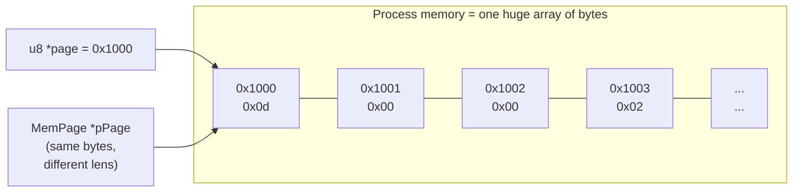
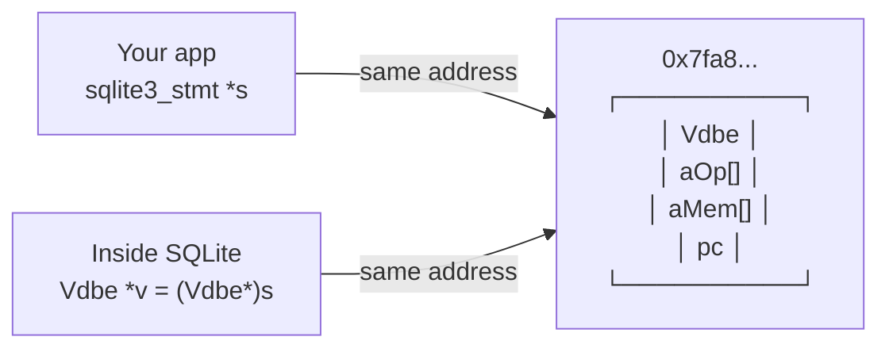
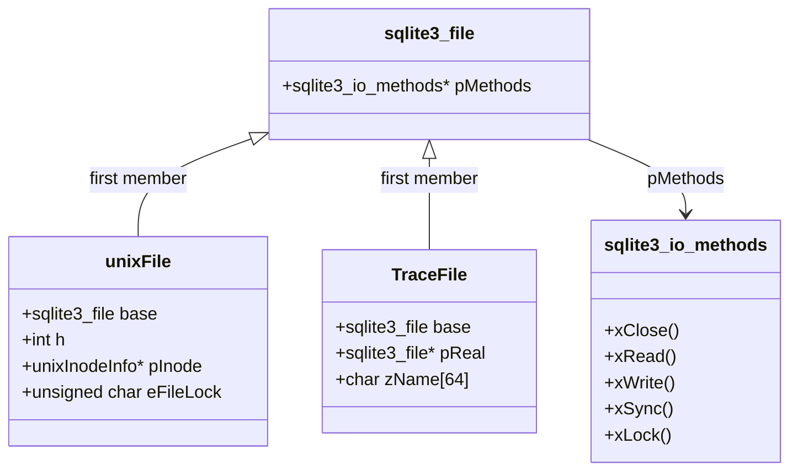
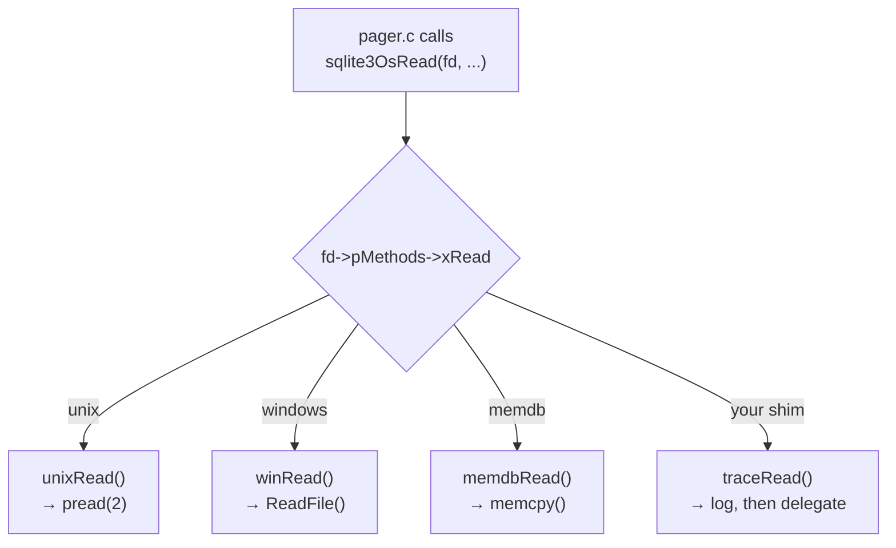
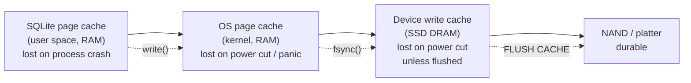

# The C You Need to Read SQLite

You do not need to be a C expert. You need **fourteen specific techniques**, because those
are the ones SQLite uses on every page. This document teaches each one: the syntax, what
the machine actually does, a memory picture, and where it appears in SQLite.

Everything here is demonstrated by a runnable program: **`labs/c-primer/cdemo.c`**.
Build and run it before reading, and keep its output next to you.

```sh
cd ~/Desktop/sqllite/labs/c-primer
cc -Wall -O0 -g -o cdemo cdemo.c && ./cdemo
```

All output shown below is **real output from that program on this machine** (arm64 macOS).

---

## 0. The one idea underneath all of it: memory is a byte array

Every C concept below is a way of *interpreting* a flat array of bytes.



A **pointer is just an address** — an integer naming a byte. A **type** is a rule for
interpreting the bytes starting at that address. Casting changes the rule, not the bytes.

That is why SQLite can hand the same 4096 bytes to the pager (as "a page"), to the b-tree
(as "a `MemPage`"), and to your hex editor (as "bytes on disk") with no conversion at all.

**Sizes on this machine** (verified):

```
u8=1  u16=2  u32=4  i64=8   void*=8   double=8
```

---

## 1. Sized integer types — why SQLite never writes `int`

```c
typedef uint8_t  u8;    /*  8-bit unsigned:  0 .. 255            */
typedef uint16_t u16;   /* 16-bit unsigned:  0 .. 65,535         */
typedef uint32_t u32;   /* 32-bit unsigned:  0 .. 4,294,967,295  */
typedef int64_t  i64;   /* 64-bit signed:   ±9.2 × 10^18         */
typedef uint64_t u64;
```

**Why:** plain `int` is 16, 32, or 64 bits depending on the compiler. A database file
format cannot depend on that. So SQLite defines exact-width types in `sqliteInt.h` and uses
them everywhere a size or an on-disk value is involved.

**Where you see it:**
```c
u16 nCell;          /* number of cells on a page — can never exceed 65535 */
u32 pageSize;       /* 512 .. 65536 */
i64 nKey;           /* a rowid: 64-bit signed, exactly the SQL INTEGER range */
```

**The trap — integer promotion.** In C, `u8 + u8` is computed as `int`:

```c
u8 a = 200, b = 100;
u8 c = a + b;        /* 300 doesn't fit: c == 44 (300 mod 256) */
int d = a + b;       /* 300 — the addition itself happened in int */
```

SQLite guards against this by casting explicitly at every assignment:
`pPage->nFree = (u16)(pBt->usableSize - first);`. When you see a cast like that, it is not
decoration — it is the author stating "I know this narrows, and I have checked it fits."

---

## 2. Structs, padding, and why field order matters

```c
struct BadLayout  { u8 a; u32 b; u8 c; u32 d; };   /* 16 bytes */
struct GoodLayout { u32 b; u32 d; u8 a; u8 c; };   /* 12 bytes */
```

Verified output:
```
BadLayout  {u8,u32,u8,u32} = 16 bytes
GoodLayout {u32,u32,u8,u8} = 12 bytes  <- same data, fewer bytes
offsetof(BadLayout,b)=4    offsetof(GoodLayout,a)=8
```

**Why the difference:** a CPU reads a 4-byte value fastest when its address is a multiple
of 4. The compiler inserts **padding** to keep every field aligned.

```
BadLayout in memory (16 bytes):
 offset:  0    1    2    3    4    5    6    7    8    9   10   11   12  13  14  15
        [ a ][ PAD PAD PAD ][      b      ][ c ][ PAD PAD PAD ][      d      ]
          ^^^^^ 3 bytes wasted           ^^^^^ 3 more wasted

GoodLayout in memory (12 bytes):
 offset:  0    1    2    3    4    5    6    7    8    9   10   11
        [      b      ][      d      ][ a ][ c ][ PAD PAD ]
                                                   ^^ only 2 wasted (tail padding)
```

**Where it matters in SQLite:** `MemPage`, `BtCursor`, and `Mem` are allocated millions of
times. Look at the real `struct MemPage` and notice every `u8` field is grouped together at
the top. That is deliberate. `sizeof(Mem)` in our demo is **24 bytes** — 8 for the union, 2
for flags, 4 for `n`, 8 for the pointer, plus padding.

**Tool:** `offsetof(struct X, field)` from `<stddef.h>` tells you the exact byte offset.
Use it in a debugger when a struct's layout surprises you.

---

## 3. Pointers, and pointer arithmetic on bytes

```c
u8 *page  = <start of a 4096-byte buffer>;
u8 *hdr   = page;        /* the page header */
u8 *cells = page + 8;    /* the cell pointer array starts after the 8-byte header */
```

Verified:
```
page=0x16f369c77  hdr=0x16f369c77  cellIdx=0x16f369c7f  cellIdx-page=8
```

**The rule:** `p + i` advances by `i * sizeof(*p)` bytes. For `u8*` that is exactly `i`
bytes, which is why SQLite does all page manipulation through `u8*`.

```
u8 *p:      p+1 moves 1 byte     ← page/byte work
u32 *p:     p+1 moves 4 bytes
MemPage *p: p+1 moves sizeof(MemPage) bytes
```

`p[i]` is defined as `*(p + i)`. They are the same thing; SQLite uses `p[i]` when reading a
byte at a known offset and `*p++` when scanning.

**Where you see it:** every line of `btree.c` that touches the format.
```c
data[hdr] = (char)flags;                 /* byte 0 of the page header */
put2byte(&data[hdr+5], pBt->usableSize); /* bytes 5-6 */
pIter = pCell;  ...  pIter++;            /* walking a cell */
```

---

## 4. Casting and opaque types — `(Vdbe*)pStmt`

```c
sqlite3_stmt *pStmt;              /* public: an opaque, incomplete type */
Vdbe *v = (Vdbe*)pStmt;           /* internal: the real struct */
```

**Why:** the public header declares `typedef struct sqlite3_stmt sqlite3_stmt;` and never
defines the struct. Your application can hold the pointer but cannot look inside. Inside
the library, one cast reveals the real type.

That is C's entire mechanism for information hiding, and it costs zero instructions — the
cast generates no code at all, because the address is the same.



---

## 5. ⭐ Subclassing by first member — the single most important pattern

This is how the VFS, virtual tables, and cursors all work. If you learn one thing from this
document, learn this.

```c
struct File {                      /* the "base class" */
  const FileMethods *pMethods;
};

struct RealFile {
  File base;            /* MUST be the first member */
  FILE *fp;
  char zName[64];
  long nRead, nWritten;
};
```

Verified output:
```
&rf = 0x16f369d58   (File*)&rf = 0x16f369d58   <- IDENTICAL addresses
wrote/read through the generic pointer: "hello sqlite"
private state still reachable after downcast: name=demo.bin nRead=12 nWritten=12
```

**Why it works:** the C standard guarantees that a struct's first member sits at offset 0.
So the address of a `RealFile` *is* the address of its `File`. Casting either way is free
and legal.

```
address 0x1000  ┌──────────────────────────┐  ← &rf  AND  (File*)&rf
                │ File base                │     both point HERE
                │   pMethods ──────────────┼──→ vtable
                ├──────────────────────────┤
                │ FILE *fp                 │  ← only RealFile code knows about
                │ char zName[64]           │     these fields
                │ long nRead, nWritten     │
                └──────────────────────────┘
```



**The rule you must never break:** if `base` is not first, the cast silently reads the
wrong bytes. There is no compiler error. Your VFS from Phase 2 works only because
`sqlite3_file base;` is the first line of `struct TraceFile`.

**Same pattern elsewhere in SQLite:**
| Base | Subclass |
|---|---|
| `sqlite3_file` | `unixFile`, `winFile`, your `TraceFile` |
| `sqlite3_vtab` | every virtual table's private struct |
| `sqlite3_vtab_cursor` | every virtual table's cursor |
| `sqlite3_pcache_page` | `PgHdr1` in `pcache1.c` |

---

## 6. Function pointers — the vtable

```c
struct FileMethods {
  int (*xRead)(File*, void*, int, i64);      /* pointer to a function */
  int (*xWrite)(File*, const void*, int, i64);
  int (*xClose)(File*);
};
```

**How to read the syntax:** work outward from the name.
```
int (*xRead)(File*, void*, int, i64);
     ^^^^^^   xRead is...
    (*     )  ...a pointer to...
           (File*, void*, int, i64)  ...a function taking these...
int                                  ...returning int.
```
Without the parentheses, `int *xRead(...)` would be *a function returning `int*`* — a
completely different thing. The parentheses are load-bearing.

**Calling:** `p->pMethods->xRead(p, buf, n, off)` — or the older-style
`(*p->pMethods->xRead)(...)`, which is identical.

**Why SQLite uses them:**
1. **Polymorphism.** One `pager.c` works with unix files, Windows files, in-memory files,
   and your encrypting VFS.
2. **Per-object specialization.** `decodeFlags()` installs `pPage->xParseCell` once per
   page, so the four cell formats cost no branch per cell.
3. **Extensibility without recompiling.** `sqlite3_create_function`, `sqlite3_vfs_register`,
   and `sqlite3_create_module` all just store function pointers.



---

## 7. Unions — one slot, several interpretations

```c
struct Mem {
  union MemValue { double r; i64 i; int nZero; } u;   /* 8 bytes total */
  u16 flags;      /* says WHICH member is valid */
  int n;
  char *z;
};
```

Verified:
```
as int : 42  (sizeof union = 8, sizeof Mem = 24)
as real: 3.5   <- same 8 bytes, flags say how to read them
```

**Why:** a SQL value is *either* an integer *or* a real *or* a string — never several at
once. A struct with separate fields would waste 16 bytes per value; a union uses 8. With
millions of registers allocated per second, that matters.

```
union MemValue (8 bytes, one storage location):
   ┌─────────────────────────────────┐
   │ 8 bytes                         │
   └─────────────────────────────────┘
     ↑ read as double r   → 3.5
     ↑ read as i64 i      → 4615063718147915776  (the same bits!)
```

**The rule:** a union has no idea which member you stored. The `flags` field is the tag.
Reading the wrong member is a bug C will not catch — which is why every access in
`vdbemem.c` is guarded by a `flags` test.

**Where else:** `Expr.u` (token vs int value), `Expr.x` (list vs subquery),
`VdbeCursor.uc` (btree vs sorter vs vtab cursor), `VdbeOp.p4`.

---

## 8. Bit flags — packing many booleans into one word

```c
#define MEM_Null  0x0001     /* 0000 0000 0000 0001 */
#define MEM_Str   0x0002     /* 0000 0000 0000 0010 */
#define MEM_Int   0x0004     /* 0000 0000 0000 0100 */
#define MEM_Real  0x0008     /* 0000 0000 0000 1000 */
```

The four operations, verified:
```
flags=0x0004  isInt=1 isStr=0
after |= MEM_Str: 0x0006  isInt=1 isStr=1
after &= ~MEM_Int: 0x0002  isInt=0 isStr=1
```

| Operation | Syntax | Meaning |
|---|---|---|
| test | `if( flags & MEM_Int )` | is the bit set? |
| set | `flags \|= MEM_Str;` | turn the bit on |
| clear | `flags &= ~MEM_Int;` | turn the bit off (`~` inverts all bits) |
| test several | `if( flags & (MEM_Int\|MEM_Real) )` | is *any* of them set? |

**Why:** 16 booleans in 2 bytes instead of 16, and a multi-flag test is one instruction.

**The `!!` idiom:** `!!(flags & MEM_Int)` converts any non-zero to exactly `1`. `flags &
MEM_Int` yields `4`, not `1` — usually fine in an `if`, but not when you want a canonical
boolean.

**A real subtlety you can now understand:** a `Mem` can have **both** `MEM_Int` and
`MEM_Str` set. That means "this value is the integer 42, and we have already computed its
text form '42', so `sqlite3_column_text()` is free." Flags are a cache, not just a type tag.

**Bitmasks for sets:** `Bitmask` is a `u64` used as a *set of tables*:
```c
Bitmask m = 0;
m |= MASKBIT(3);                 /* table with cursor 3 is in the set */
if( (pLoop->prereq & ~pFrom->maskLoop)==0 ){ /* all prereqs already satisfied */ }
```
64 bits = 64 tables = SQLite's join limit. Now you know *why* the limit is 64.

---

## 9. Flexible array members — one allocation for header + items

```c
struct ExprList {
  int nExpr;
  struct ExprItem { int id; char name[8]; } a[1];   /* declared 1, allocated N */
};

size_t sz = sizeof(ExprList) + (n-1) * sizeof(struct ExprItem);
ExprList *p = realloc(p, sz);
p->a[5].id = 42;      /* legal: the memory is really there */
```

Verified:
```
nExpr=3  alloc=40 bytes  items: (10,age) (11,name) (12,city)
header and items are ONE allocation, contiguous in memory
```

```
one malloc:
 ┌────────┬──────────┬──────────┬──────────┐
 │ nExpr=3│ a[0]     │ a[1]     │ a[2]     │
 └────────┴──────────┴──────────┴──────────┘
  header    ← the "1-element" array actually extends this far →
```

**Why:** one allocation instead of two, one pointer dereference instead of two, and the
items are contiguous so the CPU prefetcher works. `ExprList`, `SrcList`, and `IdList` in
SQLite all do this.

**The related trick — trailing space:** in your Phase 2 VFS shim,
```c
p->pReal = (sqlite3_file*)&p[1];   /* the wrapped file lives right after us */
```
`&p[1]` is "the address one whole struct past the start" — i.e. the byte just after our
struct. SQLite allocated `sizeof(TraceFile) + pRoot->szOsFile` bytes, so that space is ours.
`VdbeCursor.aType[1]` uses the same pattern for its column cache.

---

## 10. Endianness — and why the file format is big-endian

Verified on this machine:
```
0x12345678 stored as bytes: 12 34 56 78  (same on every CPU)
the SAME value in NATIVE memory order here: 78 56 34 12 (little-endian CPU)
```

```
Big-endian ("most significant byte first" — how humans write numbers):
   0x12345678  →  [12][34][56][78]

Little-endian (x86, arm64 in practice):
   0x12345678  →  [78][56][34][12]
```

**Why SQLite writes big-endian by hand:**

```c
static void put4be(u8 *p, u32 v){
  p[0] = (u8)(v>>24); p[1] = (u8)(v>>16); p[2] = (u8)(v>>8); p[3] = (u8)v;
}
static u32 get4be(const u8 *p){
  return ((u32)p[0]<<24) | ((u32)p[1]<<16) | ((u32)p[2]<<8) | p[3];
}
```

This code produces the same bytes on **every** CPU, because it never lets the compiler
decide the order. That is what makes a SQLite file byte-identical across architectures —
you can copy a database from an ARM phone to an x86 server and it just works.

The alternative (`memcpy(&v, p, 4)`) would be faster but architecture-dependent.
`sqlite3Get4byte()` actually does both: it uses `memcpy` + `__builtin_bswap32` when it
knows the platform, and falls back to the shift version otherwise. Same result, chosen at
compile time.

**Exception worth remembering:** the WAL's *checksums* are computed in native order (the
magic number's low bit records which), while the database file is always big-endian. That
inconsistency is exactly what broke the first version of your `walparse.c`.

---

## 11. Sign extension — reading a 3-byte signed integer

SQLite's serial type 3 is a 24-bit signed integer. C has no 24-bit type.

```c
static i64 get3be_signed(const u8 *p){
  i64 v = (p[0] & 0x80) ? -1 : 0;   /* seed: all ones if negative, all zeros if not */
  v = (v<<8) | p[0];
  v = (v<<8) | p[1];
  v = (v<<8) | p[2];
  return v;
}
```

Verified:
```
00 00 7b -> 123
ff ff 85 -> -123   <- seeded v with -1 so the top bits are ones
```

**Why the seed:** in two's complement, −123 as 24 bits is `ff ff 85`. If you build the
value starting from `0`, you get `0x00ffff85` = 16,777,093 — a large positive number.
Starting from `-1` (all bits set) keeps the upper 40 bits as ones, which is exactly what
sign extension means.

```
two's complement, 8-bit:
   0000 0000 =  0
   0111 1111 =  127
   1000 0000 = -128     ← top bit set means negative
   1111 1111 = -1

sign-extending ff ff 85 from 24 to 64 bits:
   seed:  1111...1111 1111 1111 1111 1111   (-1)
   <<8|ff 1111...1111 1111 1111 1111 1111
   <<8|ff 1111...1111 1111 1111 1111 1111
   <<8|85 1111...1111 1111 1111 1000 0101   = -123  ✓
```

The real code uses macros (`ONE_BYTE_INT`, `THREE_BYTE_INT`) that do the same thing.

---

## 12. Shifting and masking — varints

```c
x = (x<<7) | (p[i] & 0x7f);   /* make room for 7 more bits, add them */
if( (p[i] & 0x80)==0 ) break; /* high bit clear = last byte */
```

| Operation | Meaning |
|---|---|
| `x << 7` | multiply by 128; shift bits left, zeros in from the right |
| `x >> 7` | divide by 128 (for unsigned) |
| `b & 0x7f` | keep the low 7 bits, discard the high one |
| `b & 0x80` | isolate the high bit |
| `b \| 0x80` | force the high bit on |

Verified round-trip of the real encoding:
```
0                    -> 1 bytes: 00
127                  -> 1 bytes: 7f
128                  -> 2 bytes: 81 00
200                  -> 2 bytes: 81 48
16383                -> 2 bytes: ff 7f
16384                -> 3 bytes: 81 80 00
18446744073709551615 -> 9 bytes: ff ff ff ff ff ff ff ff ff
```

Decode `81 48` by hand:
```
byte 0: 1000 0001 → high bit set: continue; payload 000 0001
byte 1: 0100 1000 → high bit clear: stop;   payload 100 1000
value = 0000001 1001000 = 0xC8 = 200  ✓
```

**Why variable-length integers at all:** most rowids and payload sizes are small. Storing
every one as 8 bytes would bloat every cell. Varints make the common case 1 byte and the
rare case 9.

---

## 13. `memcpy` vs `memmove` — and why the difference bites in `insertCell`

```c
memmove(buf+2, buf, 6);   /* regions OVERLAP — only memmove is defined here */
```
Verified: `0 1 0 1 2 3 4 5 8 9`

| Function | Overlap allowed? | Speed |
|---|---|---|
| `memcpy(dst, src, n)` | **No** — undefined behaviour | fastest |
| `memmove(dst, src, n)` | Yes — behaves as if via a temp buffer | slightly slower |

**Where it matters:** inserting a cell shifts the cell pointer array right by 2 bytes:

```c
memmove(a + (i+1)*2, a + i*2, (nc-i)*2);   /* source and destination OVERLAP */
```

Using `memcpy` here would work on some compilers, corrupt data on others, and pass your
tests either way. SQLite is careful to use `memmove` exactly where overlap is possible and
`memcpy` where it is not.

---

## 14. `goto` cleanup, and error handling without exceptions

```c
static int doWork(int failAt){
  char *a = 0, *b = 0;
  int rc = 0;
  a = malloc(16); if( !a ){ rc = 7; goto done; }
  if( failAt==1 ){ rc = 1; goto done; }
  b = malloc(16); if( !b ){ rc = 7; goto done; }
  if( failAt==2 ){ rc = 2; goto done; }
done:
  free(b);        /* free(NULL) is legal and does nothing */
  free(a);
  return rc;
}
```
Verified: `doWork(0)=0 doWork(1)=1 doWork(2)=2  (no leaks in any path)`

**Why `goto` here is good style:** C has no destructors and no `finally`. Without the
single exit label you would duplicate the cleanup at every error return — and eventually
forget one. This is the standard idiom in every serious C codebase (Linux, SQLite, curl).

**The three rules that make it safe:**
1. Initialize every resource pointer to `0` at declaration.
2. Jump only *forward*, to a single label at the end.
3. Make cleanup idempotent (`free(NULL)` is a no-op, so unconditional `free` is fine).

**SQLite's variants:** `goto abort_due_to_error`, `goto no_mem`, `goto vdbe_return` in
`vdbe.c`; `goto rollback_abort` in `pager.c`. Every error path converges.

**Error propagation** is by return code, checked at every call:
```c
rc = sqlite3BtreeNext(pCur, 0);
if( rc!=SQLITE_OK ) goto abort_due_to_error;
```
`SQLITE_OK` is 0, so `if( rc )` means "if something went wrong" — you will see both spellings.

---

## 15. `const`, `static`, `volatile`

| Keyword | Meaning | In SQLite |
|---|---|---|
| `const char *z` | the *pointed-to data* is read-only | `sqlite3_bind_text(..., const char*, ...)` — "I will not modify your string" |
| `char * const z` | the *pointer* is read-only | rare |
| `static` at file scope | visible only in this file | `SQLITE_PRIVATE` expands to `static` in the amalgamation — that is why you must `#include "sqlite3.c"` to reach internals |
| `static` inside a function | one instance, persists across calls | lookup tables: `static const unsigned char aiClass[]` |
| `volatile` | may change outside this thread's control; never cache in a register | `volatile u32 **apWiData` — the WAL index lives in **shared memory** that another *process* writes |

`volatile` in `wal.c` is the real thing, not a decoration: without it the compiler could
hoist a read of `aReadMark[i]` out of a loop and never see another process's update.

---

## 16. Macros — and the `do{...}while(0)` trick

```c
#define getVarint32(A,B)  \
  (u8)((*(A)<(u8)0x80)?((B)=(u32)*(A)),1:sqlite3GetVarint32((A),(u32 *)&(B)))
```

**Why macros here:** the one-byte varint case is so hot that even a function call is too
expensive. The macro inlines the test and only calls the function for longer varints.

**Why the parentheses everywhere:** `#define SQ(x) x*x` breaks on `SQ(1+2)` → `1+2*1+2` =
5. Always `#define SQ(x) ((x)*(x))`.

**The `do{...}while(0)` idiom:**
```c
#define SWAP(A,B)  do{ int t=(A); (A)=(B); (B)=t; }while(0)
```
It makes a multi-statement macro behave like a single statement, so
`if( x ) SWAP(a,b); else ...` still compiles. You will see it throughout SQLite.

**Conditional compilation:**
```c
#ifdef SQLITE_DEBUG
  ... asserts and tracing ...
#endif
#ifndef SQLITE_OMIT_WAL
  ... the entire WAL implementation ...
#endif
```
This is how one source tree produces a 700 KB full build and a 250 KB embedded build.
When reading, **skip `SQLITE_OMIT_*` blocks entirely** on a first pass.

---

## 17. `assert()` — read it as specification

```c
assert( pPage->intKeyLeaf );
assert( CORRUPT_DB || pPage->nFree>=0 );
```

`assert()` compiles to **nothing** when `NDEBUG` is defined (release builds). So it is not
error handling — it is a machine-checked comment.

Two SQLite-specific conventions:
- `assert( CORRUPT_DB || X )` — "X holds unless the database file is corrupt." These
  asserts *are* the file-format specification.
- `NEVER(x)` / `ALWAYS(x)` — branches believed unreachable, marked so coverage tooling can
  account for them. Not safety checks.

**How to use them while reading:** when a function confuses you, read its asserts first.
They tell you the preconditions the author assumed, which is usually the context you were
missing.

---

## 18. How a byte actually gets to the disk

You asked how data really reaches storage. Here is the full path, with the layer that owns
each step.

```mermaid
sequenceDiagram
    participant App as Your code
    participant V as VDBE (vdbe.c)
    participant B as B-tree (btree.c)
    participant PC as Page cache (pcache1.c)
    participant P as Pager (pager.c)
    participant O as VFS (os_unix.c)
    participant K as OS kernel
    participant D as Disk / SSD

    App->>V: sqlite3_step()
    V->>B: sqlite3BtreeInsert(cursor, payload)
    B->>PC: sqlite3PagerGet(pgno=7)
    alt page already cached
        PC-->>B: PgHdr* (RAM hit, ~100 ns)
    else cache miss
        PC->>P: allocate PgHdr, need page 7
        P->>O: xRead(fd, buf, 4096, offset=24576)
        O->>K: pread(2) syscall
        K->>D: read 4 KiB block (if not in OS page cache)
        D-->>K: bytes
        K-->>O: bytes
        O-->>P: SQLITE_OK
        P-->>PC: page filled
        PC-->>B: PgHdr*
    end
    B->>P: sqlite3PagerWrite(pPg)  "I am about to modify this"
    P->>O: xWrite(journal, original page)   %% undo record
    P->>O: xSync(journal)                    %% BARRIER 1
    O->>K: fsync(2)
    K->>D: FLUSH CACHE — wait for platters/flash
    B->>B: memcpy the new cell into the page buffer (RAM only)
    Note over B,PC: page is DIRTY in RAM; disk still has the OLD content
    App->>V: COMMIT
    P->>O: xWrite(db, page 7)
    P->>O: xSync(db)                         %% BARRIER 2
    P->>O: xDelete(journal)                  %% THE COMMIT POINT
```

**The parts people get wrong:**

1. **`write()` does not reach the disk.** It copies your bytes into the kernel's page cache
   and returns. The data is in RAM, owned by the OS. A process crash is survivable; a power
   cut is not.
2. **`fsync()` is the only durability primitive.** It tells the kernel to push its cached
   pages to the device *and* asks the device to flush its own write cache. It is slow
   (0.1–10 ms) because it waits for physical media. That single call is why one transaction
   per row is ~1000× slower than one transaction per 1000 rows.
3. **There are three caches in series**, and each can lose data independently:



4. **Disks read and write in blocks**, typically 4 KiB (a "sector" or "page" at the device
   level). Reading 1 byte costs the same as reading 4096. That is *why* SQLite's unit of
   everything is a page, and why the default page size is 4096 — it matches the hardware.
5. **A torn write is real.** If power fails mid-write, a 4 KiB write may land partially.
   SQLite assumes only *sector-sized* writes are atomic, which is why `xSectorSize()` exists
   and why `pagerWriteLargeSector()` journals a whole sector's worth of pages together.

**Random vs sequential, the number that drives b-tree design:**

| Device | Sequential read | Random 4 KiB read |
|---|---|---|
| Spinning disk | ~150 MB/s | ~100 ops/s (seek + rotate ≈ 10 ms) |
| SATA SSD | ~500 MB/s | ~50,000 ops/s |
| NVMe SSD | ~3,000 MB/s | ~500,000 ops/s |
| RAM | ~20,000 MB/s | ~100,000,000 ops/s |

A b-tree exists to turn "find one row among 100 million" into **3 or 4 random reads**
instead of a full scan. Every design choice in Phase 3 — huge fan-out on interior pages, no
sibling pointers, `balance_quick` for appends — is about minimizing that number, or making
writes sequential.

---

## 19. The five C traps that produce SQLite-style bugs

1. **Uninitialized variables.** C does not zero locals. `Mem m;` contains garbage.
   SQLite's answer: `memset(&x, 0, sizeof(x))` or `sqlite3DbMallocZero()`.
2. **Off-by-one on buffers.** `char buf[8]; strcpy(buf, "12345678");` writes 9 bytes.
   SQLite never uses `strcpy`/`sprintf`; it uses `sqlite3_snprintf` and explicit lengths.
3. **Use after free.** `sqlite3BtreePayloadFetch()` returns a pointer into a page buffer
   that the next b-tree call may invalidate. That is a documented lifetime rule, not a bug —
   but ignoring it is.
4. **Signed overflow is undefined behaviour** (unsigned wraps predictably; signed does not).
   SQLite checks before adding: `if( a > LARGEST_INT64 - b ) return overflow;`
5. **Strict aliasing.** Reading the same memory through two incompatible pointer types is
   UB. `char*`/`u8*` is exempt, which is another reason all page manipulation goes through
   `u8*`.

---

## 20. Your reading checklist

Before Phase 1, you should be able to answer these without looking:

- [ ] What does `(Vdbe*)pStmt` cost at runtime? *(nothing — same address)*
- [ ] Why must `sqlite3_file base;` be the first member of your VFS struct?
- [ ] What does `flags &= ~MEM_Int;` do?
- [ ] Why does `u8 *p; p+1` advance exactly one byte, but `u32 *q; q+1` advances four?
- [ ] How do you sign-extend a 3-byte value to 64 bits?
- [ ] When must you use `memmove` instead of `memcpy`?
- [ ] What is `a[1]` at the end of a struct for?
- [ ] Why does SQLite write big-endian by hand instead of using `memcpy`?
- [ ] What does `assert( CORRUPT_DB || X )` tell you as a reader?
- [ ] What does `fsync()` do that `write()` does not?

If any answer is shaky, re-run `cdemo` and read that section again. Twenty minutes here
saves days in Phase 3.
