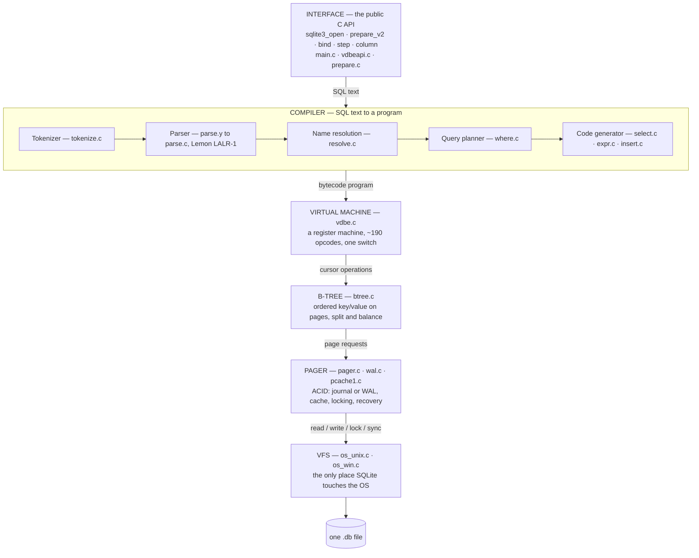

# SQLite Internals — A Contributor's Curriculum

Goal: take you from "I use `SELECT`" to "I can read `btree.c`, explain why a page split
happened, and write a patch that survives the SQLite test suite."

Everything here is organized as **phases**. Each phase directory contains six documents:

| File | Purpose |
|---|---|
| `1.knowledge.md` | **The layer explained in depth** — the problem it solves, HLD, LLD, mermaid diagrams, the *why* behind every design decision, disk-level reality, and the misconceptions to unlearn. |
| `2.code_walkthrough.md` | **Real SQLite C, annotated line by line**, plus the mental model for reading that layer. Large functions are explained by mechanism with a source link instead of being pasted. |
| `3.implementation.md` | Hands-on labs. Real C, real hexdumps, real experiments. |
| `4.internals_important.md` | The dense reference: files, structs, functions, constants, invariants, gotchas. |
| `5.mcq.md` | ~25 multiple-choice questions with explained answers. |
| `6.assessment.md` | Build-something tasks + rubric. You are not done until these pass. |

Read them in number order.

Two root documents come before Phase 0:

| File | Purpose |
|---|---|
| **[`C-FOR-SQLITE.md`](C-FOR-SQLITE.md)** | The fourteen C techniques SQLite actually uses — first-member subclassing, function-pointer vtables, unions, bit flags, flexible arrays, big-endian by hand, sign extension, `memmove` vs `memcpy`, `goto` cleanup — each with a memory diagram and a runnable demo (`labs/c-primer/cdemo.c`). Ends with how a byte physically reaches the disk. |
| **[`READING-THE-CODE.md`](READING-THE-CODE.md)** | The three-pass reading method, naming conventions, the four landmark design comments hidden in the source, how to trace a query with lldb, and an explicit list of what to skip. |

Every `2.code_walkthrough.md` applies that method to one layer.

---

## The 30,000-foot picture

SQLite is not a server. It is a **C library** that turns SQL text into bytes on one file.
The entire stack is a pipeline, and every layer has a single job:



Two sentences worth memorizing:

1. **Everything above the b-tree is "make this query fast and correct"; everything below
   the b-tree is "do not lose data when the power dies."**
2. **The b-tree layer knows nothing about SQL, and the parser knows nothing about disk.**

---

## Phase roadmap

| Phase | Directory | You will understand |
|---|---|---|
| 0 | `phase-00-foundations` | Build SQLite from source, navigate the tree, run the test suite, wire up a debugger |
| 1 | `phase-01-file-format` | The on-disk format byte-for-byte: header, pages, cells, varints, records, freelist, overflow |
| 2 | `phase-02-pager-vfs` | Pager, page cache, VFS, locking, rollback journal, crash recovery |
| 3 | `phase-03-btree` | `btree.c`: cursors, search, insert, delete, balance, defragment, ptrmap |
| 4 | `phase-04-tokenizer-parser-schema` | Tokenizer, Lemon grammar, `Expr`/`Select` trees, schema bootstrap, name resolution |
| 5 | `phase-05-vdbe-codegen` | Bytecode generation and the VDBE interpreter, register model, `EXPLAIN` |
| 6 | `phase-06-query-planner` | NGQP, `WhereLoop`/`WherePath`, cost model (LogEst), indexes, stat1/stat4, joins, flattening |
| 7 | `phase-07-transactions-wal` | Transactions, isolation, WAL format, wal-index, checkpointing, savepoints, recovery proofs |
| 8 | `phase-08-extensions-testing-contributing` | Virtual tables, FTS5/R-Tree, the real test infrastructure, how a patch actually lands |

Expected pace for a working engineer: **1–2 weeks per phase**, ~10 h/week. Phases 1–3 and 5
are the load-bearing ones; do not skip their labs.

---

## Environment (macOS, verified for this machine)

```sh
# tools you already have
clang --version
tclsh <<< 'puts $tcl_version'     # TCL is REQUIRED to build from the canonical source tree
sqlite3 --version                 # system sqlite (Apple build) — fine for comparisons
```

Get the source (two options, use both eventually):

```sh
cd ~/Desktop/sqllite
# 1) the amalgamation (single 250k-line sqlite3.c) — best for first reading & profiling
curl -O https://sqlite.org/2025/sqlite-amalgamation-3510000.zip && unzip -q sqlite-amalgamation-*.zip

# 2) the canonical tree (many .c files, plus the code generators) — required for real work
git clone --depth=1 https://github.com/sqlite/sqlite.git sqlite-src
# (the true home is Fossil at https://sqlite.org/src ; GitHub is an official mirror)
```

Debug build you will use for the whole course:

```sh
cd ~/Desktop/sqllite/sqlite-src
mkdir -p build && cd build
../configure --enable-debug --enable-all
make -j8 sqlite3 sqlite3.c          # shell + amalgamation
make -j8 testfixture                # the TCL test harness (needs tclsh)
```

Useful flags to compile with while learning:
`-DSQLITE_DEBUG -DSQLITE_ENABLE_EXPLAIN_COMMENTS -DSQLITE_ENABLE_SELECTTRACE
-DSQLITE_ENABLE_WHERETRACE -DSQLITE_ENABLE_DBSTAT_VTAB -DSQLITE_ENABLE_STMT_SCANSTATUS`

---

## How to study (do not skip this)

0. Read `C-FOR-SQLITE.md` and run `labs/c-primer/cdemo`. Then `READING-THE-CODE.md`.
1. Read `1.knowledge.md` properly — it carries the architecture, the diagrams, and the
   reasoning. Do not skim it; the later documents assume it.
2. Read `2.code_walkthrough.md` with the real source open in another window.
3. Do every lab in `3.implementation.md`. **Typing the hexdump out by hand is the point.**
4. Keep `4.internals_important.md` open while reading real source.
5. Take `5.mcq.md` cold. Below 80% ⇒ reread.
6. Ship `6.assessment.md`. Put your artifacts in `labs/phaseNN/`.

A rule that will save you months: **when confused, dump bytes.** SQLite has no hidden state.
Everything is in the file, the WAL, or the bytecode — and all three are printable.

---

## What is already built for you

`labs/` contains six working, verified C programs referenced by the phase labs —
a database-file parser, a VFS tracer, a miniature B+tree, a token/tree dumper, a WAL
verifier, and a virtual table. See `labs/README.md` for build lines and a smoke test.
The SQLite amalgamation (3.50.4) is already unpacked at `sqlite-amalgamation-3500400/`.

## Progress tracker

| Phase | knowledge | walkthrough | implementation | internals | mcq | assessment | done |
|---|---|---|---|---|---|---|---|
| 0 Foundations | ☐ | ☐ | ☐ | ☐ | ☐ | ☐ | ☐ |
| 1 File format | ☐ | ☐ | ☐ | ☐ | ☐ | ☐ | ☐ |
| 2 Pager & VFS | ☐ | ☐ | ☐ | ☐ | ☐ | ☐ | ☐ |
| 3 B-tree | ☐ | ☐ | ☐ | ☐ | ☐ | ☐ | ☐ |
| 4 Front end | ☐ | ☐ | ☐ | ☐ | ☐ | ☐ | ☐ |
| 5 VDBE | ☐ | ☐ | ☐ | ☐ | ☐ | ☐ | ☐ |
| 6 Planner | ☐ | ☐ | ☐ | ☐ | ☐ | ☐ | ☐ |
| 7 Transactions & WAL | ☐ | ☐ | ☐ | ☐ | ☐ | ☐ | ☐ |
| 8 Extensions & testing | ☐ | ☐ | ☐ | ☐ | ☐ | ☐ | ☐ |

## The five hardest things in this course (in order)

1. `balance_nonroot()` in `btree.c` — Phase 3
2. The WAL reader/writer/checkpointer protocol — Phase 7
3. `wherePathSolver()` and the LogEst cost model — Phase 6
4. The overflow spill formulas and record encoding — Phase 1
5. `flattenSubquery()`'s legality conditions — Phase 6

If you can explain all five to another engineer, you know SQLite.
