# Phase 0 — What SQLite Is, and the Architecture of the Whole Thing

Prerequisites: read **[`../C-FOR-SQLITE.md`](../C-FOR-SQLITE.md)** and
**[`../READING-THE-CODE.md`](../READING-THE-CODE.md)** first. This document assumes you
know what a pointer, a struct, and a function pointer are.

---

## Part 1 — The problem SQLite solves

### 1.1 What a database engine must actually do

Strip away SQL, and a database engine has exactly four jobs:

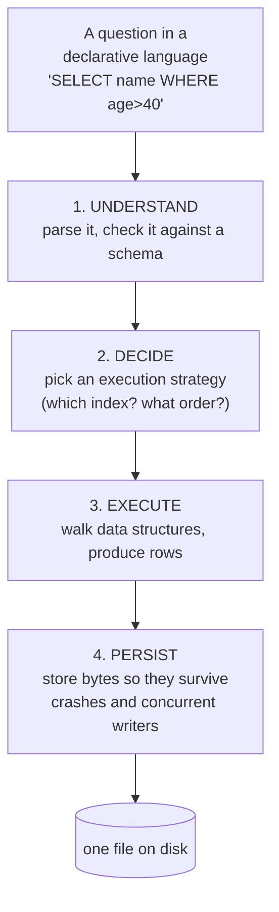

Job 4 is the hard one. Jobs 1–3 are compilers and data structures — well-understood
computer science. Job 4 is a fight against physics: disks lose power mid-write, operating
systems lie about when data is durable, and several processes want the file at once.

**Roughly 60% of SQLite's difficulty lives in job 4.** That is why this course spends
three phases (2, 3, 7) there.

### 1.2 The decision that defines SQLite: no server

Almost every other SQL database is a **server**: a long-running process that owns the data
files, and clients talk to it over a socket.

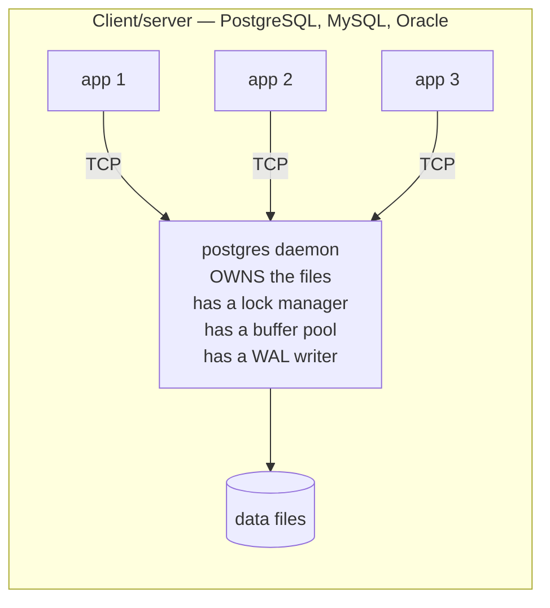

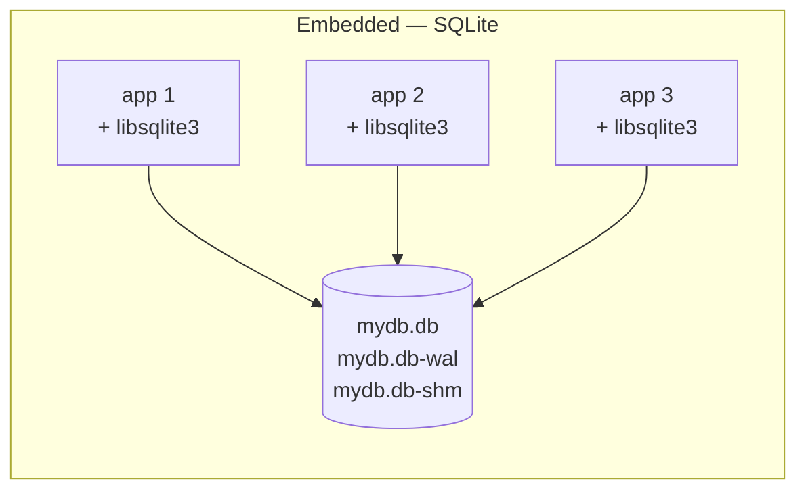

In SQLite there is **no coordinator**. Every process runs the complete engine in its own
address space and they cooperate only through the file system.

**Why would anyone design it that way?** Because the target was "a database for
applications that have no DBA and no server": phones, browsers, aircraft, thermostats,
`.sqlite` files shipped with an app. Zero configuration, zero administration, one file you
can copy with `cp`.

### 1.3 Everything else follows from that one decision

This is the table to internalize. Each row is a constraint you will meet again later, and
its cause is always "no server."

| Because there is no server... | ...this had to happen | You will meet it in |
|---|---|---|
| there is no lock manager process | concurrency uses **file locks** on a byte range that holds no data | Phase 2 |
| file locks are coarse (whole-file) | **one writer at a time**, no row-level locking | Phase 2, 7 |
| no daemon survives a crash | **recovery is done by whoever opens the file next** | Phase 2, 7 |
| the file may be written by a 2004 binary and read by a 2026 one | the **file format is frozen forever**, big-endian, self-describing | Phase 1 |
| there is no shared buffer pool | each process has its **own page cache**, and WAL needs an extra `-shm` file to share state | Phase 2, 7 |
| the library may run on a microcontroller | **~700 KB of code, no dependencies**, works with a fixed memory budget | everywhere |
| there is no worker-thread pool | query execution is a **single-threaded interpreter loop** | Phase 5 |
| the app links the engine | the **C API is the product**, and it can never break | Phase 0 |

> **Mental model:** SQLite is not "a small database." It is *a file format, plus a library
> that manipulates that format correctly under concurrency and crashes.* The SQL is almost
> a convenience layer on top.

### 1.4 The numbers, for scale

| Thing | Size |
|---|---|
| Core source (`src/*.c`, `*.h`) | ~155,000 lines |
| Shipped as one file (`sqlite3.c`, the amalgamation) | ~263,000 lines including comments |
| Compiled library | ~700 KB (full), ~250 KB (trimmed) |
| Test code | ~600× the size of the library |
| Test cases run per release | tens of millions |
| Branch coverage claimed | 100% (MC/DC under TH3) |
| File format changes since 2004 | zero breaking changes |

---

## Part 2 — High-Level Design (HLD)

### 2.1 The layer cake

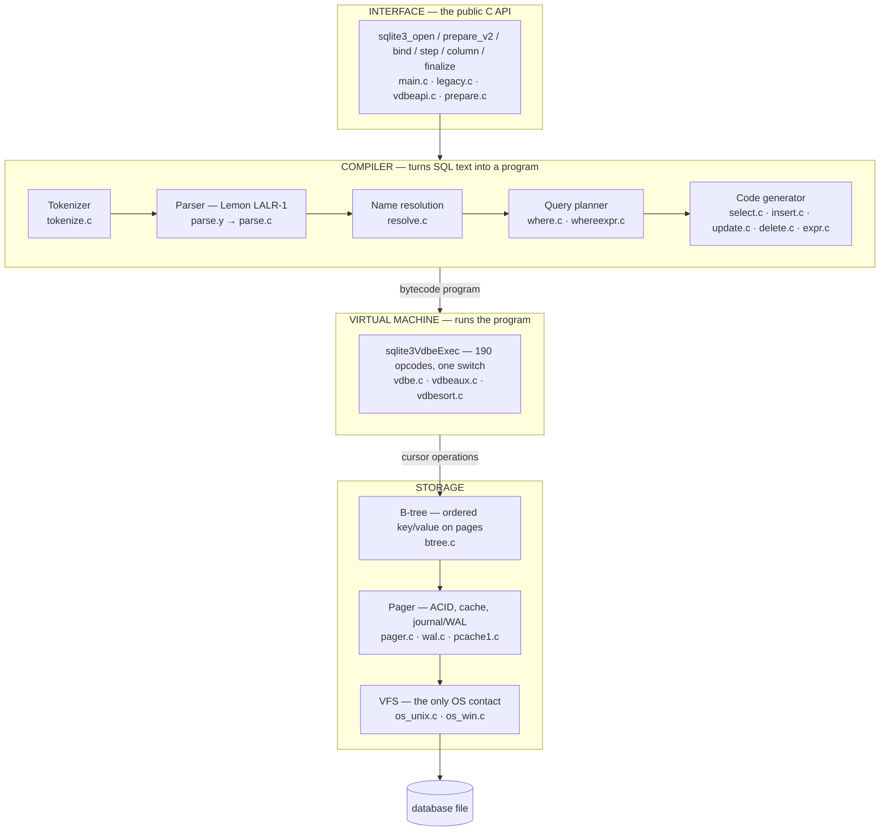

**Why these boundaries and not others?** Each boundary is placed where the *vocabulary*
changes:

| Boundary | Above it, the vocabulary is | Below it, the vocabulary is |
|---|---|---|
| API / compiler | strings, result codes | tokens, trees |
| compiler / VDBE | tables, columns, expressions | registers, cursors, opcodes |
| VDBE / b-tree | rows, records, indexes | keys, payloads, cursor positions |
| b-tree / pager | pages, cells, trees | page numbers, dirty flags |
| pager / VFS | transactions, durability | bytes, offsets, locks |

**The b-tree layer knows nothing about SQL. The parser knows nothing about disk.** That is
the whole architecture in one sentence, and it is why you can study one phase at a time.

### 2.2 The two halves

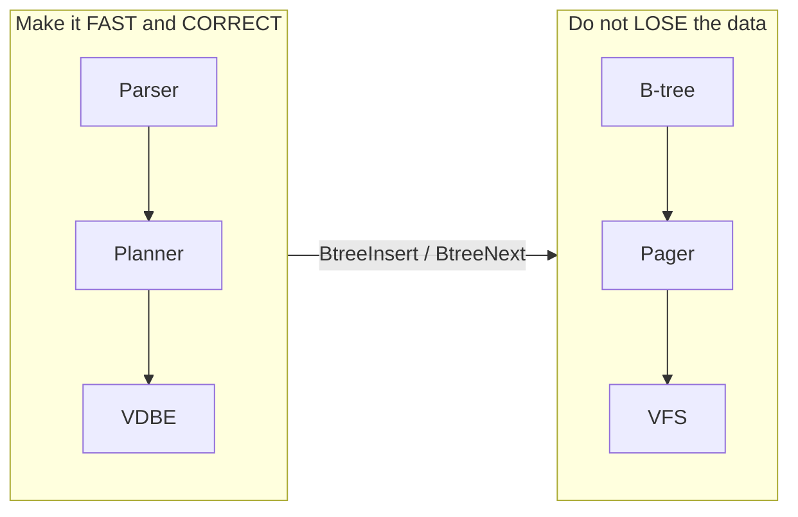

Above the b-tree, a bug makes a query slow or returns the wrong answer — bad, but
recoverable. Below the b-tree, a bug destroys the user's data permanently. That asymmetry
explains why `pager.c` and `wal.c` are written so differently from `select.c`: more asserts,
more comments, more paranoia, fewer clever optimizations.

### 2.3 Read path vs write path

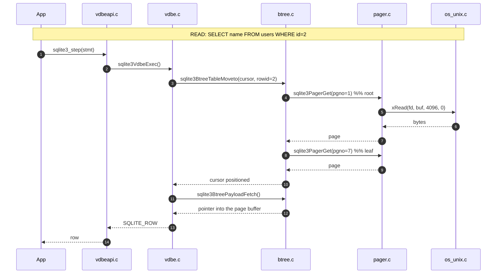

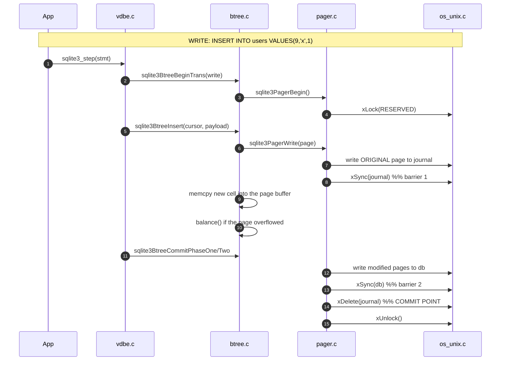

Notice the asymmetry: the read path touches four layers and does one kind of I/O. The write
path touches the same four layers but performs a **six-step protocol** with two
synchronization barriers. Durability is expensive, and knowing exactly *why* is Phase 2.

---

## Part 3 — Low-Level Design (LLD)

### 3.1 The five objects that appear in every stack trace

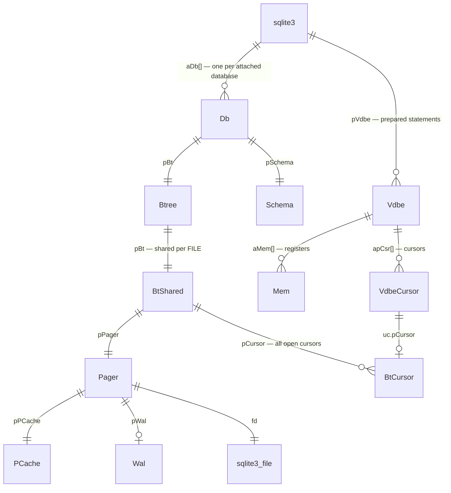

| Object | Lives in | One per | Holds |
|---|---|---|---|
| `sqlite3` | `sqliteInt.h` | **connection** | `aDb[]`, mutex, function table, lookaside allocator |
| `Btree` | `btreeInt.h` | connection × file | transaction state for this connection |
| `BtShared` | `btreeInt.h` | **open file, per process** | pager, page 1, all cursors, page-size constants |
| `Pager` | `pager.c` | open file | cache, journal/WAL state, lock state, `eState` |
| `Vdbe` | `vdbeInt.h` | **prepared statement** | `aOp[]` program, `aMem[]` registers, `apCsr[]` cursors |

**Why `Btree` and `BtShared` are separate:** two connections in one process opening the same
file must share the page cache and lock state (otherwise they would corrupt each other) but
must have *independent transactions*. So per-connection state goes in `Btree`, per-file
state in `BtShared`.

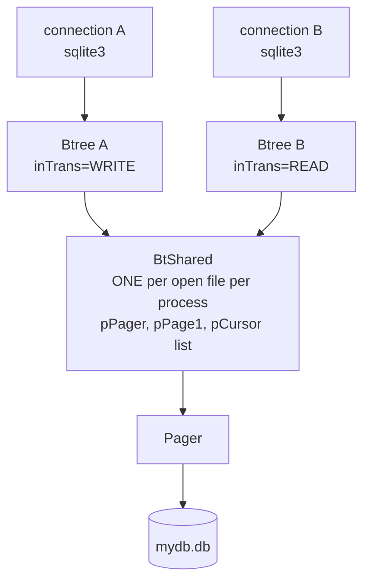

### 3.2 The compile pipeline in detail

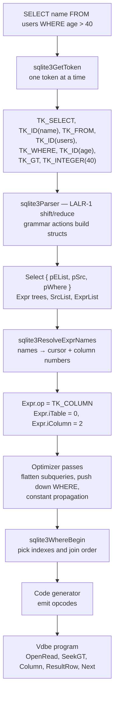

**Why compile to bytecode at all, instead of interpreting the tree?**

| | Tree walking | Bytecode |
|---|---|---|
| Per-row cost | pointer chasing, virtual dispatch, deep recursion | flat array, one `switch`, no recursion |
| Debuggability | need a debugger | `EXPLAIN` prints the whole plan |
| Statement reuse | re-walk the tree each time | compile once, `step()` many times |
| Memory | tree stays alive | tree is freed after codegen |

The decisive one is **`EXPLAIN`**. Because the plan is data, you can inspect it, diff it,
and store it. That property drives how you will debug everything in Phases 5 and 6.

### 3.3 The storage stack in detail

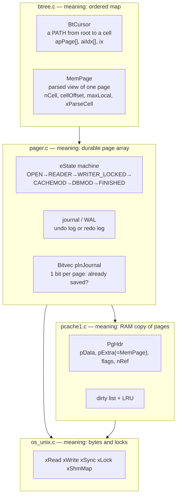

**One allocation trick worth seeing now:** a cached page and its parsed b-tree header are
the *same* allocation. `PgHdr.pExtra` points at the `MemPage`, which the pager reserved
space for when it created the cache entry.

```
one malloc from pcache1:
┌──────────────┬───────────────────┬──────────────────────────────┐
│ PgHdr        │ MemPage (pExtra)  │ 4096 bytes of page data      │
│ pgno, flags  │ nCell, cellOffset │ ← the literal disk bytes     │
│ pData ───────┼───────────────────┼─→                            │
└──────────────┴───────────────────┴──────────────────────────────┘
```

This is the "trailing space" C technique from `C-FOR-SQLITE.md` §9, applied at scale.

---

## Part 4 — How a file becomes a database

### 4.1 The file is an array of fixed-size pages

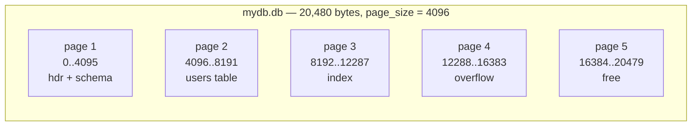

**Why fixed-size pages?**
1. Page number → file offset is one multiplication: `offset = (pgno-1) * pageSize`. No
   allocation table, no indirection.
2. It matches the hardware — disks transfer fixed blocks anyway.
3. It makes caching trivial: every cache slot is the same size, so no fragmentation.
4. It makes the journal simple: an undo record is always exactly one page.

**Why page 1 is special:** it holds the 100-byte database header *and* the root of the
schema table. Bootstrapping needs a known starting point, and "byte 0 of the file" is the
only thing you can know before reading anything.

### 4.2 What actually gets stored

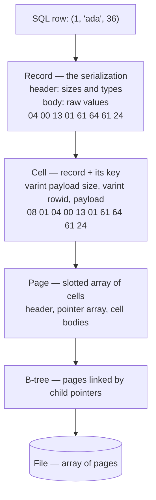

Five levels of nesting, each with a clear owner:

| Level | Defined by | Owned by |
|---|---|---|
| value | serial type codes | `vdbemem.c` |
| record | header + body | `vdbe.c` (`OP_MakeRecord`, `OP_Column`) |
| cell | payload + key + overflow pointer | `btree.c` |
| page | slotted page layout | `btree.c` |
| file | page array + header | `btree.c` + `pager.c` |

You will decode all five, by hand and in C, in Phase 1.

### 4.3 Why a B-tree and not something else

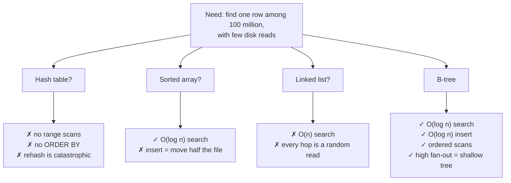

The decisive property is **fan-out**. With 4 KiB pages and ~6 bytes per interior entry, one
interior page points at ~650 children:

```
depth 1:            650 rows
depth 2:        422,500 rows
depth 3:    274,625,000 rows      ← 3 random reads for any row
depth 4: 178,506,250,000 rows
```

A binary tree with 274 million rows would be 28 levels deep — 28 random reads, or ~280 ms
on a spinning disk versus ~0.06 ms at depth 3. **Fan-out is the entire reason b-trees won.**

---

## Part 5 — Concurrency and durability, at the concept level

(Phases 2 and 7 are the detail; this is the shape you need now.)

### 5.1 The locking ladder

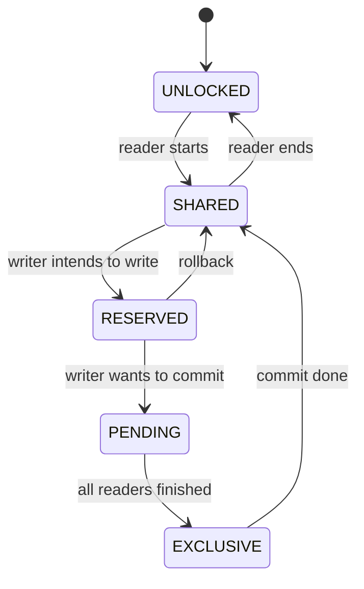

| State | Who may hold it | What it permits |
|---|---|---|
| SHARED | many | reading |
| RESERVED | one | "I will write"; readers continue |
| PENDING | one | no *new* readers may start (anti-starvation) |
| EXCLUSIVE | one | writing the database file |

**Why PENDING exists:** without it, a writer waiting for readers to drain could wait
forever as new readers keep arriving. PENDING closes the door while letting current readers
finish.

### 5.2 The two durability engines

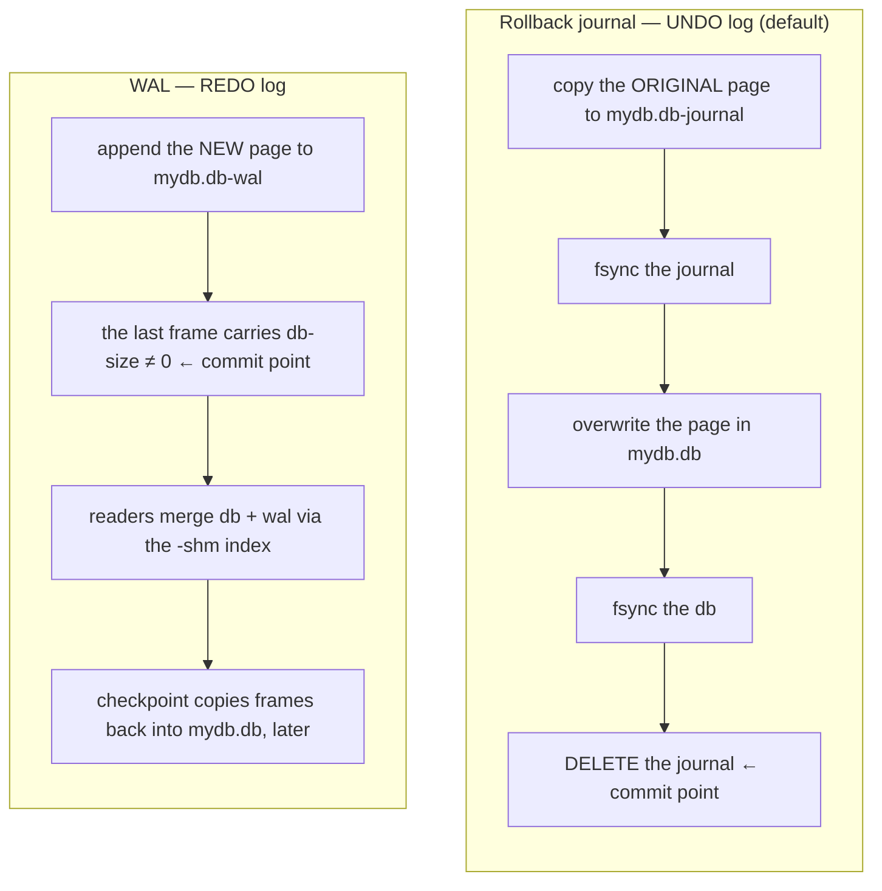

| | Rollback journal | WAL |
|---|---|---|
| What is logged | the **old** content | the **new** content |
| Commit point | deleting the journal | writing a commit frame |
| Readers during a write | blocked at commit time | **never blocked** |
| Writers | one | one |
| Extra files | `-journal` | `-wal` and `-shm` |
| Works on NFS | badly | no |
| Best for | single-process, simple | concurrent readers |

**The insight that makes both work:** a commit must be **one atomic filesystem operation**.
Deleting a file is atomic. Writing one small frame is atomic enough (checksums detect a
torn one). Everything before the commit point is undoable; everything after is durable.

### 5.3 Where the fsync cost comes from

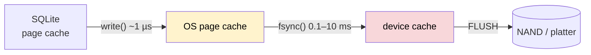

A `write()` returns as soon as the kernel copies your bytes. Only `fsync()` waits for the
physical device. One transaction = at least one `fsync()`. Therefore:

```
1000 rows, each in its own transaction   ≈ 1000 fsyncs ≈ 1–10 seconds
1000 rows in ONE transaction             ≈ 1–2 fsyncs  ≈ 0.01 seconds
```

This single fact is the most valuable performance knowledge in this course, and you will
measure it yourself in Phase 2.

---

## Part 6 — The build: what is hand-written and what is generated

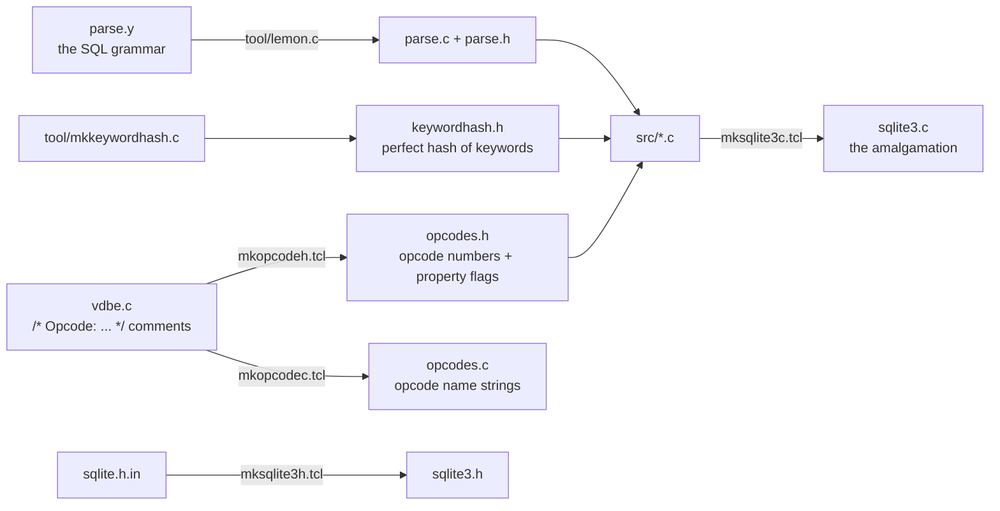

**Why generate code at all?**
- `parse.c` — an LALR(1) table by hand is impossible; a grammar file is readable.
- `keywordhash.h` — a perfect hash with no collisions must be *computed*.
- `opcodes.h` — opcode numbers are assigned by a script that groups hot opcodes for better
  jump-table locality, and the property flags (`OPFLG_IN1`, `OPFLG_OUT2`) are parsed out of
  the `/* Opcode: */` **comments**. In SQLite, some comments are compiled.

**Consequences for you:**
1. Building from the source tree **requires TCL**. Building the amalgamation does not.
2. Never patch `sqlite3.c`, `parse.c`, `opcodes.h`, or `keywordhash.h` — they are outputs.
3. Opcode *numbers* change between versions; opcode *names* are stable.

---

## Part 7 — Why the code looks the way it does

### 7.1 Design principles you will see everywhere

| Principle | How it shows up | Example |
|---|---|---|
| **Decide once, dispatch cheaply** | function pointers installed per object | `pPage->xParseCell` set by `decodeFlags()` |
| **Fast path inline, slow path in a function** | hand-unrolled hot loops | `getVarint32()` macro → function only for >1 byte |
| **Precompute per-object constants** | derived fields cached in structs | `maxLocal`/`minLocal` computed once per file |
| **Asserts as specification** | `assert( CORRUPT_DB \|\| X )` | `btree.c`, everywhere |
| **Corruption is expected input** | bounds-checked, returns `SQLITE_CORRUPT` | `btreeParseCellPtr` |
| **One exit label** | `goto abort_due_to_error` | `vdbe.c` |
| **No exceptions, no destructors** | `int rc` returns, `goto` cleanup | all of it |
| **Never trust the OS** | own page cache, own allocator, own varint | `pcache1.c`, `malloc.c` |

### 7.2 Naming, once more, because it doubles your reading speed

```
p  pointer     n  count       i  index/int    z  zero-terminated string
a  array       e  enum        b  boolean      u  unsigned/union
mx maximum     sz size        Xxx() internal  sqlite3_xxx() PUBLIC forever
```

`int sqlite3BtreeInsert(BtCursor *pCur, const BtreePayload *pX, int flags, int seekResult)`
— before reading one line of the body you know: internal function, b-tree layer, takes a
cursor and a payload, has option flags, and receives a previous seek result.

---

## Part 8 — What "contributing" realistically means

Be clear-eyed; it shapes where you spend effort.

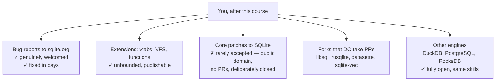

SQLite is public domain and deliberately does not accept outside code — that is how it
stays public domain. Development is in **Fossil** at `sqlite.org/src`; GitHub is a read-only
mirror. What *is* welcomed: reproducible bug reports, especially fuzzer-found corruption or
wrong-answer bugs.

The real return on this course is that **storage-engine literacy transfers**. Phases 1–3
are the same concepts in InnoDB, LMDB, and BoltDB. Phase 7 is the same as PostgreSQL's WAL.
Phases 5–6 are every query engine ever built.

---

## Part 9 — Vocabulary (fix these now)

| Term | Precise meaning in SQLite |
|---|---|
| page | fixed block, 512…65536 bytes, power of two; unit of I/O and caching |
| usable size | page size − reserved bytes (header byte 20); **all format math uses this** |
| rowid | 64-bit signed integer key of a table b-tree |
| record | serialized row: header of serial types + body of values |
| cell | one entry on a page: key + payload (+ child pointer on interior pages) |
| cursor | a position in a b-tree — really the path from the root |
| varint | 1–9 byte big-endian base-128 integer |
| affinity | a column's type preference, applied on store and on compare |
| LogEst | 10·log₂(x); the planner's fixed-point unit for costs and row counts |
| hot journal | a rollback journal left by a crash; the next opener must replay it |
| checkpoint | copying WAL frames back into the main database file |
| frame | one page image in the WAL, with a 24-byte header |
| schema cookie | counter in the header; bumped by DDL, invalidates prepared statements |

---

## Part 10 — What to do next

1. Build both forms of SQLite (`3.implementation.md` Labs 0.1–0.3).
2. Set a breakpoint in `unixRead` and capture the backtrace (Lab 0.5). **That one stack
   trace is this entire document, verified on your machine.**
3. Read `2.code_walkthrough.md` to see how thin the public API really is.
4. Take `5.mcq.md` cold.

Exit test for this phase: from memory, draw the six layers, name one file per layer, and
state what vocabulary changes at each boundary.
