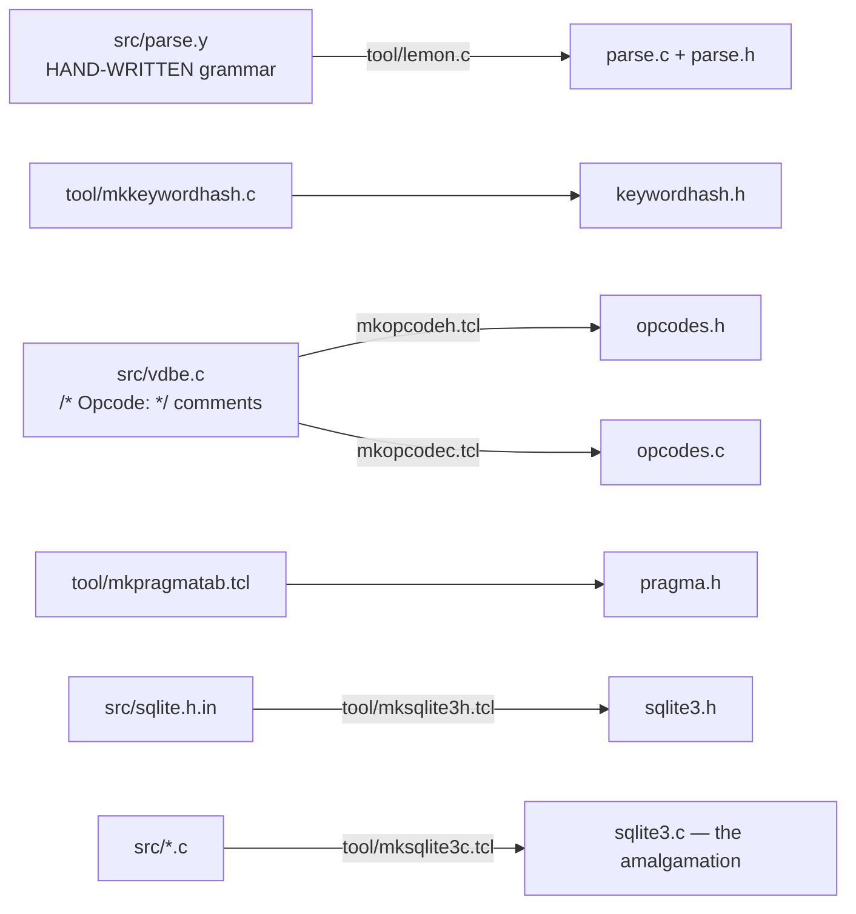
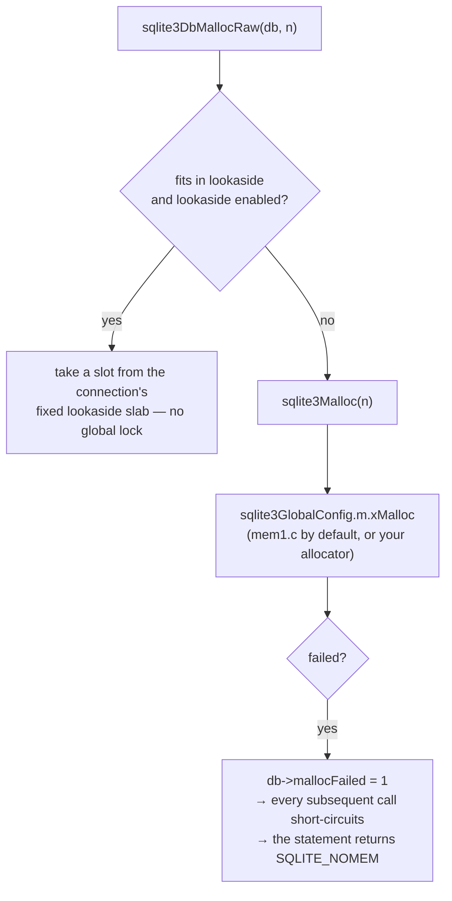
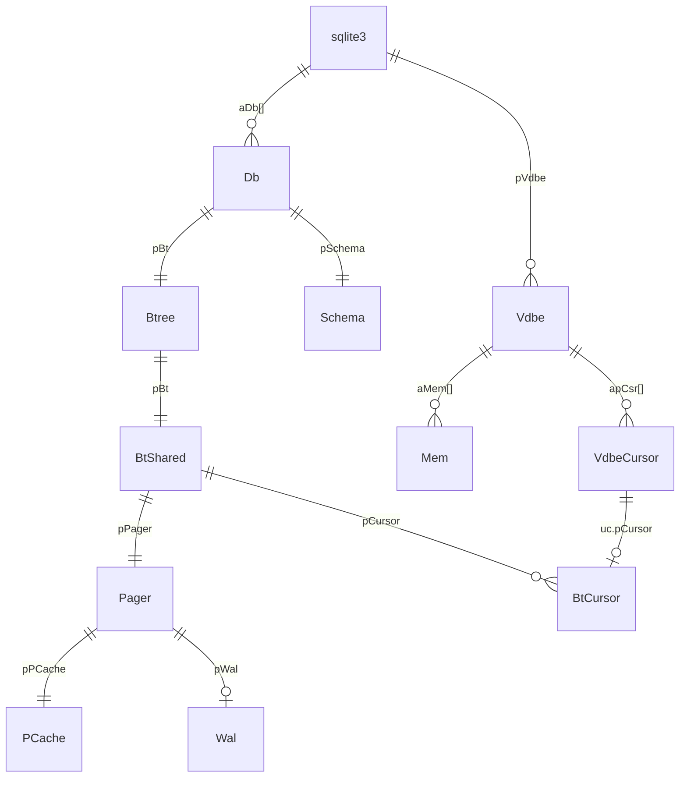

# Phase 0 — Reference: Source Map, Build System, Conventions

The lookup document. Keep it open while reading real source.
Line counts below are **measured from the 3.50.4 amalgamation** using its own
`Begin file` / `End of` markers, so they are exact for that release.

---

## 1. The source tree, by size and by job

### 1.1 The twelve files that are 80% of the engine

| Lines | File | Job | Phase |
|---|---|---|---|
| 11,512 | `btree.c` | b-tree, cursors, page format, balancing | 1, 3 |
| 9,238 | `vdbe.c` | the bytecode interpreter | 5 |
| 8,822 | `select.c` | SELECT codegen, subquery flattening, aggregates | 5, 6 |
| 8,286 | `os_unix.c` | the unix VFS | 2 |
| 7,821 | `pager.c` | ACID state machine, journal, cache glue | 2 |
| 7,685 | `where.c` | the query planner | 6 |
| 7,422 | `expr.c` | `Expr` construction **and** expression codegen | 4, 5 |
| 5,793 | `build.c` | CREATE/DROP, affinity, schema objects | 4 |
| 5,598 | `parse.c` | **generated** LALR(1) parser | 4 |
| 5,564 | `vdbeaux.c` | program assembly, commit logic, EXPLAIN | 5 |
| 5,141 | `main.c` | connection lifecycle, public API | 0 |
| 4,618 | `wal.c` | write-ahead log | 7 |

### 1.2 The rest, grouped

**Front end**
| Lines | File | Contents |
|---|---|---|
| 902 | `tokenize.c` | `sqlite3GetToken`, `sqlite3RunParser`, `keywordCode`, `aiClass[]` |
| — | `parse.y` | the Lemon grammar (source of `parse.c`) |
| — | `keywordhash.h` | **generated** perfect hash of SQL keywords |
| 2,310 | `resolve.c` | `lookupName`, `sqlite3ResolveExprNames`, `NameContext` |
| 263 | `walker.c` | `sqlite3WalkExpr/WalkSelect` — generic traversal |
| 1,320 | `treeview.c` | `sqlite3TreeViewExpr/Select` — debug tree printing |
| 2,331 | `alter.c` | ALTER TABLE, including rewriting stored SQL text |
| 624 | `attach.c` | ATTACH/DETACH |
| 3,079 | `pragma.c` | all pragmas (`pragma.h` is **generated**) |
| 1,092 | `prepare.c` | `sqlite3InitOne`, schema bootstrap, `SQLITE_SCHEMA` retry |
| 548 | `callback.c` | function and collation lookup |

**Planner and codegen**
| Lines | File | Contents |
|---|---|---|
| 2,943 | `wherecode.c` | emits bytecode for one `WhereLoop` |
| 1,924 | `whereexpr.c` | WHERE analysis, derived terms, LIKE→range |
| 3,392 | `insert.c` | INSERT codegen, `sqlite3GenerateConstraintChecks` |
| 1,364 | `update.c` | UPDATE codegen |
| 1,032 | `delete.c` | DELETE codegen, truncate optimization |
| 1,571 | `trigger.c` | `SubProgram` generation |
| 1,486 | `fkey.c` | foreign keys, deferred FK counters |
| 331 | `upsert.c` | ON CONFLICT DO UPDATE |
| 3,110 | `window.c` | window functions |
| 1,354 | `analyze.c` | ANALYZE, `sqlite_stat1`/`stat4` loading |

**Execution**
| Lines | File | Contents |
|---|---|---|
| 2,595 | `vdbeapi.c` | `sqlite3_step/bind/column/reset/finalize` |
| 2,058 | `vdbemem.c` | `Mem` manipulation, serial types |
| 2,778 | `vdbesort.c` | external merge sort |
| — | `vdbeblob.c` | incremental BLOB I/O |
| — | `vdbetrace.c` | `sqlite3_expanded_sql` |

**Storage and OS**
| Lines | File | Contents |
|---|---|---|
| 1,280 | `pcache1.c` | the default page cache (hash + LRU) |
| — | `pcache.c` | the page-cache interface |
| 442 | `memjournal.c` | in-memory journal / statement journal |
| 415 | `bitvec.c` | sparse page-number set |
| 6,683 | `os_win.c` | the Windows VFS |
| — | `os.c` | VFS dispatch wrappers (`sqlite3OsRead` etc.) |
| — | `backup.c` | the online backup API |

**Infrastructure**
| Lines | File | Contents |
|---|---|---|
| 1,865 | `util.c` | varints, `sqlite3LogEst`, `sqlite3Atoi64`, error helpers |
| 922 | `malloc.c` | `sqlite3Malloc`, lookaside, OOM simulation hooks |
| — | `mem1.c`…`mem5.c` | allocator back ends |
| — | `mutex_unix.c`, `mutex_noop.c` | mutex back ends |
| — | `hash.c` | the generic hash table used by `Schema` |
| — | `printf.c` | `sqlite3_mprintf` and friends |
| — | `random.c`, `status.c`, `global.c`, `ctime.c`, `loadext.c`, `table.c`, `rowset.c`, `threads.c`, `date.c`, `legacy.c` | small support files |

**Extensions (`ext/`, in the amalgamation when enabled)**
| Lines | File |
|---|---|
| 27,794 | `fts5.c` (the whole FTS5, concatenated) |
| 6,615 | `sqlite3session.c` |
| 6,210 | `fts3.c` + `fts3_write.c` 5,836 |
| 5,608 | `json.c` |
| 5,451 | `sqlite3rbu.c` |
| 4,483 | `rtree.c` |

### 1.3 Headers to read once, early

| Header | Why |
|---|---|
| `sqliteInt.h` | ~5,000 lines. Defines `sqlite3`, `Parse`, `Expr`, `Select`, `Table`, `Index`, `SrcList`, `FuncDef`, and every flag in the front end |
| `btreeInt.h` | `MemPage`, `BtShared`, `BtCursor`, `CellInfo`, format constants |
| `vdbeInt.h` | `Vdbe`, `Op`, `Mem`, `VdbeCursor`, `VdbeFrame` |
| `whereInt.h` | `WhereInfo`, `WhereLoop`, `WherePath`, `WhereTerm`, `WhereClause` |
| `sqlite3.h` | the public API — **the stability contract** |
| top of `pager.c` | the pager state machine, as prose |
| top of `wal.c` | ~400 lines: the complete WAL design document |
| top of `btree.c` | the file format, as prose |
| top of `where.c` | the planner's cost model |

---

## 2. Generated files — never edit these



| Generated | From | Consequence |
|---|---|---|
| `parse.c`, `parse.h` | `parse.y` via Lemon | edit the grammar, not the tables |
| `keywordhash.h` | `mkkeywordhash.c` | adding a keyword means editing the generator |
| `opcodes.h`, `opcodes.c` | `/* Opcode: */` comments in `vdbe.c` | **doc comments are compiled input** |
| `pragma.h` | `mkpragmatab.tcl` | adding a pragma means editing the TCL table |
| `sqlite3.h` | `sqlite.h.in` | |
| `sqlite3.c` | all of `src/` | never patch the amalgamation |

**Therefore TCL is a build dependency of the source tree** (not of the amalgamation).

---

## 3. Building

```sh
# canonical tree
git clone --depth=1 https://github.com/sqlite/sqlite.git sqlite-src
cd sqlite-src && mkdir build && cd build
../configure --enable-debug --enable-all \
  CFLAGS="-g -O0 -DSQLITE_DEBUG=1 -DSQLITE_ENABLE_EXPLAIN_COMMENTS \
          -DSQLITE_ENABLE_TREETRACE -DSQLITE_ENABLE_WHERETRACE \
          -DSQLITE_ENABLE_DBSTAT_VTAB -DSQLITE_ENABLE_STMT_SCANSTATUS \
          -DSQLITE_ENABLE_STAT4 -DSQLITE_ENABLE_BYTECODE_VTAB"
make -j8 sqlite3
```

### 3.1 Make targets

| Target | Produces |
|---|---|
| `sqlite3` | the CLI shell |
| `sqlite3.c` | the amalgamation |
| `testfixture` | the TCL test harness — `./testfixture ../test/x.test` |
| `fuzzcheck` | the corpus fuzz runner |
| `sqlite3_analyzer` | space-usage analyzer |
| `showdb` | `tool/showdb.c` — page-level dumper (**Phase 1**) |
| `showwal` | WAL dumper (**Phase 7**) |
| `showjournal` | rollback-journal dumper (**Phase 2**) |
| `dbtotxt` | database → text, for bug reports (**Phase 8**) |
| `mptest` | multi-process concurrency tests |

Most `tool/*.c` programs are standalone: `cc -I. -Isrc -o showdb tool/showdb.c`.

### 3.2 Compile-time switches you will actually use

| Macro | Effect |
|---|---|
| `SQLITE_DEBUG` | enables `assert()`, `NEVER`/`ALWAYS`, `PRAGMA vdbe_trace`, internal checks |
| `SQLITE_ENABLE_EXPLAIN_COMMENTS` | the comment column in `EXPLAIN` output |
| `SQLITE_ENABLE_TREETRACE` | `.treetrace 0xffff` — parse-tree dumps |
| `SQLITE_ENABLE_WHERETRACE` | `.wheretrace 0xfff` — planner internals |
| `SQLITE_ENABLE_STAT4` | value-sampled statistics (**off by default**) |
| `SQLITE_ENABLE_DBSTAT_VTAB` | the `dbstat` virtual table |
| `SQLITE_ENABLE_BYTECODE_VTAB` | the `bytecode()` / `tables_used()` table-valued functions |
| `SQLITE_ENABLE_STMT_SCANSTATUS` | per-loop row counts, `.scanstats on` |
| `SQLITE_ENABLE_PREUPDATE_HOOK` | required by the session extension |
| `SQLITE_TEST` | test-only APIs used by `testfixture` |
| `SQLITE_THREADSAFE=0\|1\|2` | mutex strategy |
| `SQLITE_DEFAULT_PAGE_SIZE` | default 4096 |
| `SQLITE_MAX_PAGE_COUNT` | default 1,073,741,823 pages |
| `SQLITE_DQS=0` | disable the double-quoted-string misfeature |
| `SQLITE_OMIT_*` | ~60 feature-removal switches |
| `SQLITE_DIRECT_OVERFLOW_READ` | read overflow pages without going through the cache |

Check what a build actually has:
```sql
SELECT * FROM pragma_compile_options;
```

---

## 4. Debugging toolkit

### 4.1 Shell (debug builds)

```
.treetrace 0xffff        parse tree at each transformation      (Phase 4)
.wheretrace 0xfff        every WhereLoop candidate and its cost (Phase 6)
.eqp full                EXPLAIN QUERY PLAN with detail
.scanstats on            per-loop estimated vs actual rows
.testctrl <op> ...       reach sqlite3_test_control from SQL
PRAGMA vdbe_listing=ON;  print the program before running
PRAGMA vdbe_trace=ON;    print every instruction as it executes
PRAGMA vdbe_addoptrace=ON;
PRAGMA parser_trace=ON;  Lemon shift/reduce trace
```

### 4.2 No special build required

```sql
EXPLAIN SELECT ...;                       -- the bytecode program
EXPLAIN QUERY PLAN SELECT ...;            -- the loop summary
SELECT * FROM bytecode('SELECT ...');     -- the program as queryable rows
SELECT * FROM tables_used('SELECT ...');
SELECT * FROM dbstat;                     -- per-page space usage
PRAGMA integrity_check;  PRAGMA quick_check;
PRAGMA compile_options;
```

### 4.3 From the debugger

```
(lldb) b sqlite3VdbeExec
(lldb) b sqlite3BtreeInsert
(lldb) b unixRead
(lldb) bt                                     # the whole layer cake
(lldb) call (void)sqlite3TreeViewSelect(0, p, 0)
(lldb) call (void)sqlite3TreeViewExpr(0, pExpr, 0)
(lldb) call (void)sqlite3VdbePrintOp(0, 0, pOp)
(lldb) p pPager->eState
(lldb) p pCur->pPage->nCell
```

Conditional breakpoints are how you survive a hot function:
```
(lldb) b vdbe.c:<line of case OP_Column>
(lldb) breakpoint modify -c "pOp->p2 == 7"
```

### 4.4 Reaching internals from your own C

Internal functions are `SQLITE_PRIVATE` (i.e. `static`) in the amalgamation. To call them:
```c
#include "sqlite3.c"        /* include the .c file into your own translation unit */
...
sqlite3GetToken(...);       /* now visible */
sqlite3TreeTrace = 0xffffffff;
```
That is the trick `labs/phase04/tokdump.c` uses.

---

## 5. Naming conventions

### 5.1 Variable prefixes (used with total discipline)

| Prefix | Meaning | Example |
|---|---|---|
| `p` | pointer | `pPage`, `pCur`, `pParse` |
| `a` | array | `aOp`, `aMem`, `aCell` |
| `n` | count / number of | `nCell`, `nByte`, `nRow` |
| `i` | index or small integer | `iDb`, `iCol`, `iOffset` |
| `z` | zero-terminated string | `zName`, `zSql`, `zErrMsg` |
| `e` | enum / state | `eState`, `eLock`, `eDest` |
| `b` | boolean | `bRev`, `bSeenOne` |
| `u` | union or unsigned | `u.zToken`, `u32` |
| `x` | function pointer (as a member) | `xRead`, `xParseCell`, `xBestIndex` |
| `mx` | maximum | `mxFrame`, `mxChoice` |
| `sz` | size in bytes | `szPage`, `szCell` |
| `r` | LogEst cost | `rRun`, `rSetup`, `rCost` |

### 5.2 Function prefixes

```
sqlite3_xxx()    PUBLIC API — frozen forever, documented on sqlite.org
sqlite3Xxx()     internal, visible across files (SQLITE_PRIVATE in the amalgamation)
xxxYyy()         file-static helper
sqlite3XxxInit() module initialization
```

### 5.3 Source markers

| Marker | Meaning |
|---|---|
| `SQLITE_PRIVATE` | `static` in the amalgamation; **not** static in `src/*.c` |
| `SQLITE_API` | exported public symbol |
| `UNUSED_PARAMETER(x)` | portable "intentionally unused" |
| `testcase( x );` | coverage marker — TH3 proves both outcomes occur |
| `VVA_ONLY(x)` | code that exists only to support asserts |
| `NEVER(x)` / `ALWAYS(x)` | branch believed unreachable / always taken; for coverage, **not** safety |
| `/* EVIDENCE-OF: R-nnnnn-nnnnn ... */` | this line implements that numbered documented requirement |
| `/* OPTIMIZATION-IF-TRUE */` | a branch that affects only speed |
| `/* TUNING: ... */` | a hand-chosen constant, usually with its rationale |
| `assert( CORRUPT_DB \|\| X )` | X is guaranteed **unless the file is corrupt** — i.e. X is spec |

---

## 6. Error handling

### 6.1 The convention

```c
int rc = SQLITE_OK;
...
rc = sqlite3SomeCall(...);
if( rc!=SQLITE_OK ) goto abort_due_to_error;   /* single exit label */
...
abort_due_to_error:
  ...cleanup...
  return rc;
```

No exceptions, no destructors, no early `return` past an allocated resource.
`SQLITE_OK` is `0`, so both `if( rc )` and `if( rc!=SQLITE_OK )` appear.

### 6.2 Primary result codes

| Code | Value | Meaning |
|---|---|---|
| `SQLITE_OK` | 0 | success |
| `SQLITE_ERROR` | 1 | generic error (see `sqlite3_errmsg`) |
| `SQLITE_INTERNAL` | 2 | internal malfunction |
| `SQLITE_PERM` | 3 | access permission denied |
| `SQLITE_ABORT` | 4 | callback requested abort |
| `SQLITE_BUSY` | 5 | the database file is locked |
| `SQLITE_LOCKED` | 6 | a table in the database is locked (shared cache) |
| `SQLITE_NOMEM` | 7 | out of memory |
| `SQLITE_READONLY` | 8 | attempt to write a readonly database |
| `SQLITE_INTERRUPT` | 9 | `sqlite3_interrupt()` |
| `SQLITE_IOERR` | 10 | disk I/O error |
| `SQLITE_CORRUPT` | 11 | the database is malformed |
| `SQLITE_FULL` | 13 | the database or disk is full |
| `SQLITE_CANTOPEN` | 14 | cannot open the file |
| `SQLITE_PROTOCOL` | 15 | locking-protocol error |
| `SQLITE_SCHEMA` | 17 | the schema changed; re-prepare |
| `SQLITE_TOOBIG` | 18 | a string or blob exceeds a limit |
| `SQLITE_CONSTRAINT` | 19 | a constraint violation |
| `SQLITE_MISMATCH` | 20 | datatype mismatch |
| `SQLITE_MISUSE` | 21 | the API was used incorrectly |
| `SQLITE_NOTADB` | 26 | the file is not a database |
| `SQLITE_ROW` | 100 | `step()` produced a row |
| `SQLITE_DONE` | 101 | `step()` finished |

### 6.3 Extended codes — always read these

`sqlite3_extended_result_codes(db, 1)` turns on codes where the low byte is the primary
code and the high bits identify the cause. The ones that change what you should *do*:

| Extended code | Means |
|---|---|
| `SQLITE_BUSY_SNAPSHOT` | your WAL read snapshot is stale — **restart the transaction**; the busy handler is not called |
| `SQLITE_BUSY_RECOVERY` | another process is running WAL recovery |
| `SQLITE_BUSY_TIMEOUT` | the blocking-lock timeout expired |
| `SQLITE_CONSTRAINT_PRIMARYKEY` / `_UNIQUE` / `_FOREIGNKEY` / `_NOTNULL` / `_CHECK` | which constraint |
| `SQLITE_IOERR_SHORT_READ` | read past EOF — often benign |
| `SQLITE_IOERR_FSYNC` / `_WRITE` / `_DELETE` | which I/O operation failed |
| `SQLITE_READONLY_ROLLBACK` | a hot journal exists but the file is read-only |
| `SQLITE_READONLY_RECOVERY` | WAL recovery needed but the file is read-only |
| `SQLITE_CORRUPT_VTAB` | corruption detected by a virtual table |
| `SQLITE_CANTOPEN_NOTEMPDIR` | no writable temp directory |

---

## 7. Memory management



| Function | Use |
|---|---|
| `sqlite3Malloc(n)` / `sqlite3Free(p)` | global allocation |
| `sqlite3DbMalloc(db,n)` / `sqlite3DbFree(db,p)` | connection allocation, **lookaside-eligible** |
| `sqlite3DbMallocZero` | zeroed |
| `sqlite3DbMallocRaw` | uninitialized, faster |
| `sqlite3DbStrDup/NDup` | duplicate a string into connection memory |
| `sqlite3_mprintf` / `sqlite3_free` | for anything handed to the application |
| `sqlite3PageMalloc` | page-sized scratch |
| `sqlite3BeginBenignMalloc()` / `EndBenignMalloc()` | an OOM in here is not fatal — used around optimizations |

**Rules:**
1. Never call `malloc`/`free` directly in SQLite code.
2. `pVtab->zErrMsg` must come from `sqlite3_mprintf`.
3. OOM is tracked as a *flag* on the connection, not propagated at every call site — that
   is why you see `if( db->mallocFailed ) goto no_mem;` at strategic points rather than
   after every allocation.

---

## 8. The five objects, and where each is defined



| Object | Header | One per |
|---|---|---|
| `sqlite3` | `sqliteInt.h` | connection |
| `Db` | `sqliteInt.h` | attached database (slot 0 = `main`, 1 = `temp`) |
| `Btree` | `btreeInt.h` | connection × file |
| `BtShared` | `btreeInt.h` | open file, per process |
| `Pager` | `pager.c` | open file |
| `PgHdr` | `sqliteInt.h` | cached page |
| `Vdbe` | `vdbeInt.h` | prepared statement |
| `Mem` | `vdbeInt.h` | register / bound value / result column |
| `Parse` | `sqliteInt.h` | statement being compiled |

```c
struct Db {
  char *zDbSName;      /* "main", "temp", or the ATTACH name */
  Btree *pBt;          /* the b-tree handle for this file */
  u8 safety_level;     /* PRAGMA synchronous: 1=OFF 2=NORMAL 3=FULL 4=EXTRA */
  u8 bSyncSet;
  Schema *pSchema;     /* in-memory schema for this database */
};
```

`iDb` — which you will see constantly (`OP_Transaction P1`, `Parse.iDb`,
`sqlite3SchemaGet(db,iDb)`) — is an index into `db->aDb[]`.

---

## 9. Limits (compile-time defaults; runtime-adjustable via `sqlite3_limit`)

| Limit | Default |
|---|---|
| `SQLITE_MAX_LENGTH` | 1,000,000,000 |
| `SQLITE_MAX_SQL_LENGTH` | 1,000,000,000 |
| `SQLITE_MAX_COLUMN` | 2,000 |
| `SQLITE_MAX_EXPR_DEPTH` | 1,000 |
| `SQLITE_MAX_COMPOUND_SELECT` | 500 |
| `SQLITE_MAX_VDBE_OP` | 250,000,000 |
| `SQLITE_MAX_FUNCTION_ARG` | 127 |
| `SQLITE_MAX_ATTACHED` | 10 (max 125) |
| `SQLITE_MAX_VARIABLE_NUMBER` | 32,766 |
| `SQLITE_MAX_TRIGGER_DEPTH` | 1,000 |
| `SQLITE_MAX_PAGE_COUNT` | 1,073,741,823 |
| `BMS` (`sizeof(Bitmask)*8`) | 64 — **the practical join-table limit** |
| `BTCURSOR_MAX_DEPTH` | 20 |

---

## 10. Testing infrastructure (detail in Phase 8)

| Harness | Nature |
|---|---|
| TCL suite (`test/*.test`) | public, tens of thousands of cases |
| TH3 | proprietary; 100% MC/DC branch coverage |
| SQL Logic Test | cross-checks answers against other SQL engines |
| `fuzzcheck` / `dbsqlfuzz` | mutates SQL **and** database files |
| OSS-Fuzz | continuous |
| crash/OOM/I/O-error injection | every call site can be made to fail |

```sh
make test          # quick
make fulltest      # hours
make releasetest   # the full build matrix
./testfixture ../test/select1.test
```

---

## 11. Gotchas that already matter

1. **Never edit** `sqlite3.c`, `parse.c`, `opcodes.h`, `keywordhash.h`, `pragma.h` — generated.
2. **Opcode numbers change between versions.** Use names.
3. `assert()` is compiled out in release builds. Read asserts as *specification*.
4. `NEVER(x)`/`ALWAYS(x)` are coverage markers, not runtime guards.
5. The **public API can never break** — that is why it is so conservative.
6. `SQLITE_PRIVATE` means `static` **only in the amalgamation**. The same function is
   externally visible when building from `src/`.
7. `sqlite3_close()` fails with `SQLITE_BUSY` if statements are unfinalized; use
   `sqlite3_close_v2()` for zombie-safe close.
8. A statement holds a **read transaction** between `step()` calls. Unfinalized statements
   are the number-one cause of `SQLITE_BUSY` and of unbounded WAL growth.
9. Never carry a connection across `fork()`.
10. Apple's system `/usr/bin/sqlite3` is built **without** `.load` and **without** STAT4,
    and it sets `reserved bytes = 12` per page. Build your own for this course.

---

## 12. Canonical documentation

| Page | Topic |
|---|---|
| `sqlite.org/arch.html` | architecture overview |
| `sqlite.org/fileformat2.html` | the file format (Phase 1) |
| `sqlite.org/atomiccommit.html` | commit protocol (Phase 2) |
| `sqlite.org/lockingv3.html` | locking (Phase 2) |
| `sqlite.org/opcode.html` | every opcode (Phase 5) |
| `sqlite.org/optoverview.html` | every optimization (Phase 6) |
| `sqlite.org/queryplanner-ng.html` | the NGQP design paper (Phase 6) |
| `sqlite.org/wal.html`, `walformat.html` | WAL (Phase 7) |
| `sqlite.org/vtab.html` | virtual tables (Phase 8) |
| `sqlite.org/testing.html` | how it is tested |
| `sqlite.org/howtocorrupt.html` | every known corruption cause — read twice |
| `sqlite.org/src/timeline` | the Fossil history; tickets referenced in comments |
