# Phase 1 — The On-Disk File Format

C you need first: `C-FOR-SQLITE.md` §1 (sized types), §3 (pointer arithmetic),
§10 (endianness), §11 (sign extension), §12 (shifting and masking).

---

## Part 1 — Why a file format is a *design*, not a detail

### 1.1 The constraints

SQLite's format had to satisfy four requirements that fight each other:

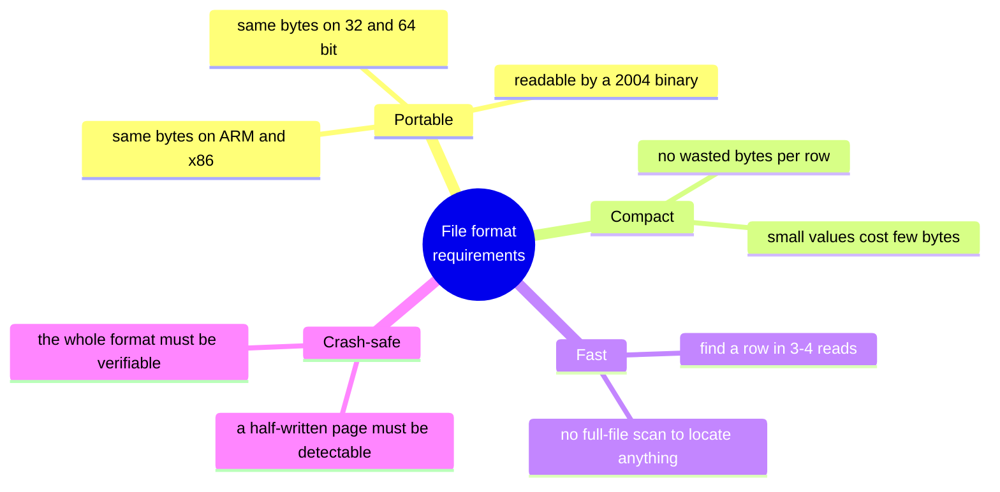

Each requirement forces a specific decision, and if you know the requirement, the decision
stops looking arbitrary:

| Requirement | Decision | Alternative rejected, and why |
|---|---|---|
| portable | **big-endian** integers on disk | native-endian would be faster but produce different files per CPU |
| portable | **text SQL** in `sqlite_schema` | a binary catalog would need its own versioned format |
| compact | **varints** for sizes and rowids | fixed 8-byte ints would add ~14 bytes per row |
| compact | **serial types**: per-value width | fixed-width columns would pad every small integer to 8 bytes |
| fast | **fixed-size pages** | variable-size records would need an offset table per file |
| fast | **b-tree**, huge fan-out | hash has no ranges; sorted array has no cheap insert |
| crash-safe | every page **self-describing** | a separate metadata region would be a second thing to keep consistent |

### 1.2 The one rule that governs everything

> **All multi-byte integers on disk are BIG-ENDIAN.**

```c
/* SQLite never does this on disk data: */
u32 v;  memcpy(&v, p, 4);          /* result depends on the CPU */

/* It does this: */
u32 v = ((u32)p[0]<<24) | ((u32)p[1]<<16) | ((u32)p[2]<<8) | p[3];
```

**Why:** the bytes must be identical whether written by an iPhone or an x86 server, because
a `.db` file is routinely copied between them. Big-endian was chosen because it is the
"network byte order" convention and because it reads naturally in a hex dump: `00 00 10 00`
is obviously 4096.

> **C sidebar — why the shift version is portable.** `p[0]<<24` is arithmetic on *values*,
> not memory layout. The compiler emits whatever instructions its CPU needs to produce the
> mathematical result. `memcpy` copies *bytes*, so it inherits the CPU's layout. This is the
> difference between "compute a number" and "reinterpret memory", and it is the whole reason
> the format is portable. See `C-FOR-SQLITE.md` §10.

---

## Part 2 — HLD: the file as a whole

### 2.1 Structure

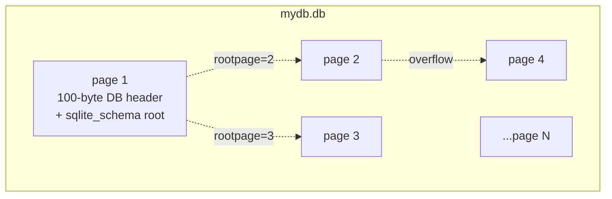

- Pages are numbered from **1**. Page number `0` is used throughout the format as a NULL
  pointer, which is why there is no page 0.
- File size is always an exact multiple of the page size.
- `offset = (pgno - 1) * pageSize` — the only address translation in the entire system.

### 2.2 The six kinds of page

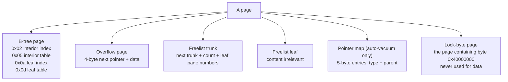

**Why the lock-byte page exists:** file locks must be taken on a byte range. SQLite locks
bytes near offset 1 GiB. If that region held data, locking would conflict with I/O. So the
page containing it is permanently skipped — a 4 KiB hole at the 1 GiB mark in every
database larger than 1 GiB.

### 2.3 Usable size — the constant everyone gets wrong

```
usable size U = page size − reserved bytes (database header byte 20)
```

Reserved bytes are trailing bytes of every page that SQLite must not touch. They exist for
VFS shims that need per-page space: encryption nonces, checksums.

**Verified on this machine:** a database created by Apple's system `sqlite3` reports
`page_size = 4096` but reserves **12 bytes**, so `U = 4084`.

**Every formula in this document uses `U`, never page size.** Hard-coding 4096 will
mis-locate overflow pointers on exactly this machine — which is how you find out.

---

## Part 3 — LLD: the 100-byte database header

Only page 1 has it, at offset 0.

```
off  size  field                                    why it exists
────────────────────────────────────────────────────────────────────────────────────
  0    16  "SQLite format 3\0"                      file type identification
 16     2  page size (power of 2; 1 means 65536)    needed before anything else can be read
 18     1  write version  1=journal 2=WAL           a WAL db must not be written by an
 19     1  read version   1=journal 2=WAL           library that does not understand WAL
 20     1  reserved bytes per page                  VFS shim space
 21     1  max embedded payload fraction  = 64      fossil; asserted constant
 22     1  min embedded payload fraction  = 32      fossil
 23     1  leaf payload fraction          = 32      fossil
 24     4  file change counter                      lets a reader detect "someone wrote"
 28     4  database size in pages                   avoids a stat() call
 32     4  first freelist trunk page                free-space management
 36     4  total freelist pages
 40     4  schema cookie                            bumped by DDL → invalidates plans
 44     4  schema format number (1..4)              feature gating for old libraries
 48     4  default page cache size                  a stored PRAGMA
 52     4  largest root b-tree page                 non-zero ⇒ auto-vacuum
 56     4  text encoding 1=UTF8 2=UTF16le 3=UTF16be
 60     4  user version                             free for the application
 64     4  incremental-vacuum flag
 68     4  application id                           lets `file(1)` identify your format
 72    20  reserved, must be zero
 92     4  version-valid-for number                 guards byte 28 (see below)
 96     4  SQLITE_VERSION_NUMBER of last writer     forensics
```

### 3.1 Reading it from a real dump

```
00000000  53 51 4c 69 74 65 20 66  6f 72 6d 61 74 20 33 00  |SQLite format 3.|
00000010  10 00 01 01 00 40 20 20  00 00 00 03 00 00 00 03  |.....@  ........|
          └─┬─┘ │  │  │  └┬┘ └┬┘ └┬┘└────┬────┘ └────┬────┘
            │   │  │  │   │   │   │      │           └─ 28: db size = 3 pages
            │   │  │  │   │   │   │      └───────────── 24: change counter = 3
            │   │  │  │   │   │   └──────────────────── 23: leaf frac = 32
            │   │  │  │   │   └──────────────────────── 22: min frac  = 32
            │   │  │  │   └──────────────────────────── 21: max frac  = 64
            │   │  │  └──────────────────────────────── 20: reserved  = 0
            │   │  └─────────────────────────────────── 19: read ver  = 1
            │   └────────────────────────────────────── 18: write ver = 1
            └────────────────────────────────────────── 16: page size = 0x1000 = 4096
```

### 3.2 The three fields with non-obvious semantics

**Page size (16–17).** Two bytes cannot hold 65536, so the value `1` is a special encoding
meaning 65536. Everything else is the literal size.

**Change counter (24) + version-valid-for (92).** A reader that has pages cached needs to
know whether another process modified the file. It compares the change counter. But old
libraries did not maintain byte 28 (db size in pages), so byte 28 is trusted **only if**
bytes 92–95 equal bytes 24–27, i.e. "the size field was written by the same transaction
that last bumped the counter." Otherwise SQLite falls back to `stat()`.

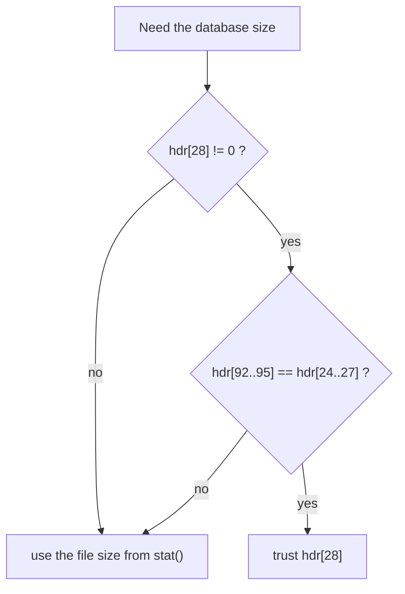

**Schema format (44).** Gates features so an old library refuses a file it would
misinterpret:

| Value | Added | Meaning |
|---|---|---|
| 1 | 2004 | original |
| 2 | 3.1.3 | `ALTER TABLE ADD COLUMN` used |
| 3 | 3.1.4 | added columns may have non-NULL defaults |
| 4 | 3.3.0 | descending indexes; serial types 8 and 9 allowed |

**Why this matters:** SQLite's compatibility promise is bidirectional. A new library reads
old files; an old library must *refuse* a new file rather than corrupt it. Feature gating
by a version number in the header is how that is enforced without breaking the format.

---

## Part 4 — LLD: the slotted page

### 4.1 The layout, and the idea behind it

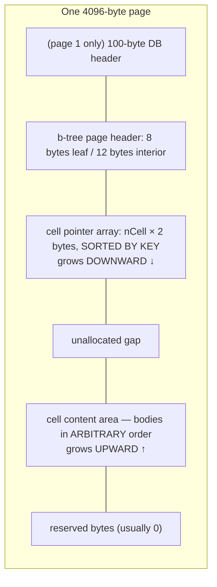

This is a **slotted page**, the standard layout in every disk-based database.

**The problem it solves:** cells are variable length, and inserting one must not require
moving the others. If cells were packed in key order, inserting the smallest key would
memmove the entire page.

**The solution:** separate *order* from *placement*.
- The **pointer array** holds order. It is 2 bytes per cell and *is* kept sorted, so a
  binary search is possible.
- The **content area** holds bytes. Placement is arbitrary and never needs to be sorted.

Inserting a cell = append the body anywhere there is room + `memmove` 2 bytes per following
pointer. For 100 cells that is ~200 bytes moved instead of ~4000.

```
insert a cell with key 25 between 20 and 30:

before:  hdr [p10][p20][p30][p40]  ....gap....  [c40][c30][c20][c10]
                        ↑ insert here
after:   hdr [p10][p20][p25][p30][p40] ..gap..  [c25][c40][c30][c20][c10]
                        └── 2-byte pointers shifted right ──┘
                                                 └─ new body placed in the gap
```

> **C sidebar — `memmove`, not `memcpy`.** Shifting the pointer array is
> `memmove(a+(i+1)*2, a+i*2, (nc-i)*2)`. Source and destination overlap, so only `memmove`
> is defined. Using `memcpy` here would work on some compilers and silently corrupt on
> others. See `C-FOR-SQLITE.md` §13.

### 4.2 The page header, byte by byte

```
off size  meaning                                   notes
────────────────────────────────────────────────────────────────────────────
 0    1   page type                                 0x02/0x05/0x0a/0x0d
 1    2   offset of the first freeblock, 0 = none   a hole list inside the content area
 3    2   number of cells (nCell)
 5    2   start of the cell content area            0 MEANS 65536
 7    1   number of fragmented free bytes           holes of 1..3 bytes
 8    4   right-most child page  (INTERIOR ONLY)
```

**The `cellTop == 0` trap.** With a 64 KiB page, an empty page's content area starts at
65536, which does not fit in two bytes. Zero is the escape code. A parser that does not
handle it reads "content starts at offset 0" and walks into the header.

**Page type encoding:**
```
0x02 = 0000 0010   interior index
0x05 = 0000 0101   interior table
0x0a = 0000 1010   leaf index      ← bit 0x08 = leaf
0x0d = 0000 1101   leaf table      ← bit 0x08 = leaf
                ^ bit 0x04 = table (integer key)
              ^   bit 0x02 = index (record key)
```

### 4.3 Three kinds of free space — and why there are three

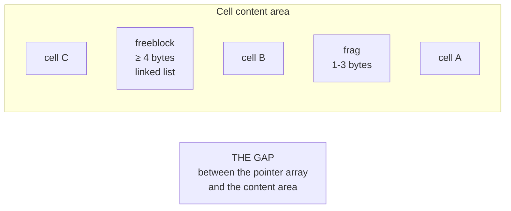

| Kind | Size | Tracked by | Why it is separate |
|---|---|---|---|
| **gap** | any | `cellTop − (hdr + nCell*2)` | the cheap place to allocate from |
| **freeblock** | ≥ 4 bytes | a linked list: 2-byte next + 2-byte size | reusable; needs 4 bytes to store its own header |
| **fragment** | 1–3 bytes | a single counter, header byte 7 | too small to hold a link, so it can only be counted |

**Why 4 bytes is the threshold:** a freeblock must store *next* and *size*, each 2 bytes.
A 3-byte hole cannot describe itself, so it is abandoned and counted. When fragments exceed
**60 bytes**, `defragmentPage()` rewrites the page to reclaim everything at once.

This is a miniature memory allocator, and it has the same trade-offs as `malloc`:
free-list reuse, fragmentation, and periodic compaction.

---

## Part 5 — LLD: cells, the four formats

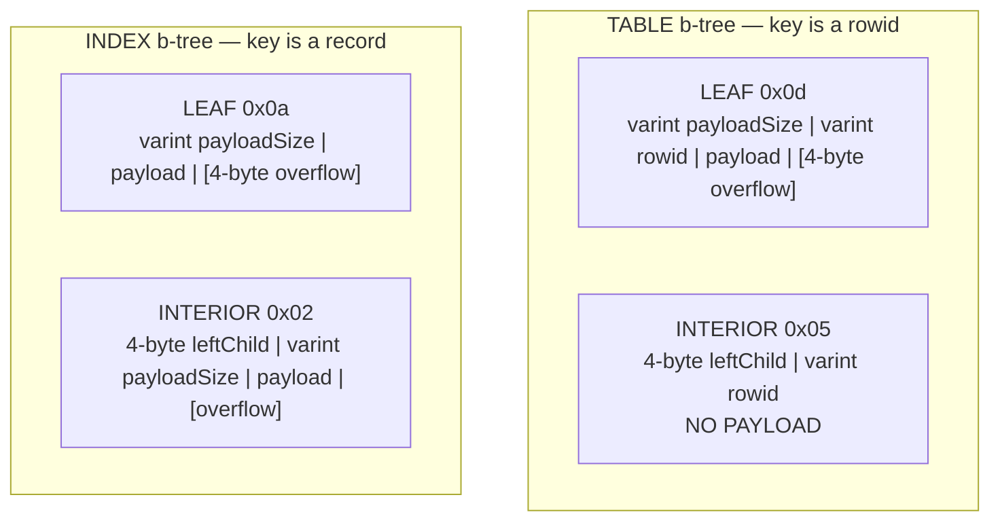

### 5.1 The asymmetry that makes table b-trees shallow

**Interior table pages carry no payload** — only a child pointer and a separator rowid.

```
interior table cell = 4 bytes (child) + 1..9 bytes (rowid varint) ≈ 6 bytes typical

fan-out with U = 4084:
    (4084 − 12 header) / (6 + 2 pointer) ≈ 509 children per page

depth 1:         509 rows
depth 2:     259,081 rows
depth 3: 131,872,229 rows        ← any row in 3 page reads
```

Index interior pages *do* carry the key, so if a key is 40 bytes the fan-out drops to ~90
and the tree is deeper. **That is why an index lookup is intrinsically more expensive than a
rowid lookup**, before you even count the extra table fetch.

### 5.2 Navigation semantics

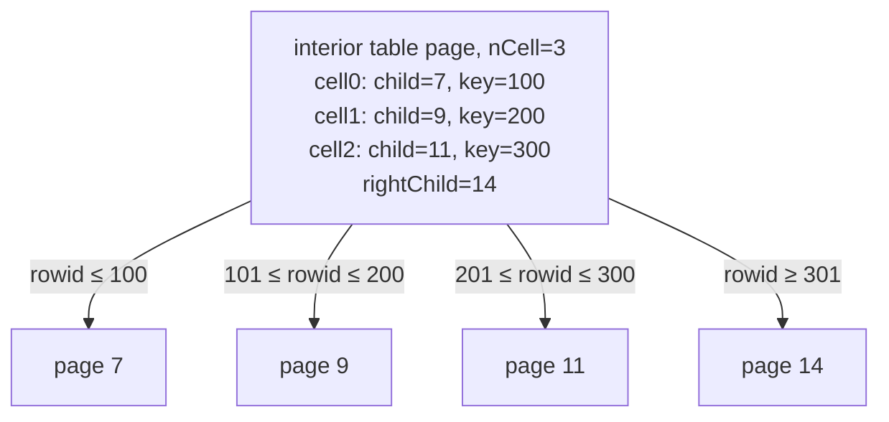

Rule: **cell *i*'s child holds keys ≤ cell *i*'s key**; the right-most pointer holds keys
greater than the last cell's key.

**Note what is absent: sibling pointers.** Leaves are not linked to each other. `BtreeNext`
walks *up* to the parent and back down. Why? Because a split would have to update the
neighbour's back-pointer — an extra page write on every split, on a page that may not even
be in cache. SQLite pays a rare parent hop (almost always a cache hit) instead of a
guaranteed extra write.

---

## Part 6 — LLD: varints

### 6.1 The encoding

Big-endian base-128. Each byte gives 7 bits; the high bit means "more follows". **Exception:**
if you reach a 9th byte, all 8 of its bits are used (7×8 + 8 = 64).

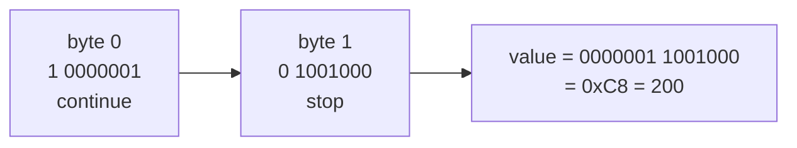

Verified round-trips (from `labs/c-primer/cdemo`):
```
0      -> 00
127    -> 7f
128    -> 81 00
200    -> 81 48
16383  -> ff 7f
16384  -> 81 80 00
2^64-1 -> ff ff ff ff ff ff ff ff ff   (9 bytes)
```

### 6.2 Why 7 bits, and why 9 bytes

**Why 7:** one bit must signal continuation, and a byte is the unit of addressing.

**Why a special 9th byte:** with 7 bits per byte, 64 bits would need ⌈64/7⌉ = 10 bytes. By
giving the last byte all 8 bits, the maximum is 9. That saves one byte on every large
rowid — and "one byte per row" is enormous over a billion rows.

**Why big-endian here too:** a decoder can stop as soon as it sees a clear high bit,
without knowing the length in advance.

### 6.3 A reference decoder

```c
static int getVarint(const unsigned char *p, sqlite3_uint64 *v){
  sqlite3_uint64 x = 0;
  int i;
  for(i=0; i<8; i++){
    x = (x << 7) | (p[i] & 0x7f);      /* make room, add 7 bits */
    if( (p[i] & 0x80)==0 ){ *v = x; return i+1; }   /* high bit clear = last */
  }
  x = (x << 8) | p[8];                 /* 9th byte contributes all 8 bits */
  *v = x;
  return 9;
}
```

The real one is hand-unrolled for 1, 2, and 3 bytes because this is one of the hottest
loops in the library — Phase 1's `2.code_walkthrough.md` reads it.

**Cost model to remember:** a 1-byte varint is essentially free; a 9-byte varint costs 8
extra bytes *per cell*. That is why rowids are assigned sequentially from 1 rather than
randomly: `rowid=5` is one byte, `rowid=8070450532247928832` is nine.

---

## Part 7 — LLD: the record format

### 7.1 Structure

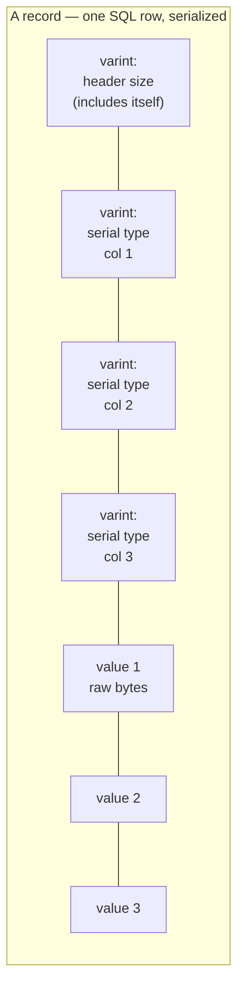

**Why types come first, all together:** so a reader can skip to column N by summing sizes
from the header, without touching the body. `OP_Column` reading column 2 of a 40-column row
parses 3 varints and jumps — it never looks at columns 3–40. If types were interleaved with
values, every column read would scan the whole row.

### 7.2 Serial type codes

| Code | Body size | Meaning | Why it exists |
|---|---|---|---|
| 0 | 0 | NULL | NULL costs nothing but the type varint |
| 1 | 1 | int8 | small integers are the common case |
| 2 | 2 | int16 | |
| 3 | 3 | int24 | a real 3-byte integer — no C type, hand-assembled |
| 4 | 4 | int32 | |
| 5 | 6 | int48 | covers timestamps in ms without paying 8 bytes |
| 6 | 8 | int64 | |
| 7 | 8 | IEEE-754 double, big-endian | |
| 8 | **0** | the integer `0` | booleans and flags cost zero body bytes |
| 9 | **0** | the integer `1` | |
| 10, 11 | — | reserved / internal | seeing these on disk is corruption |
| N≥12, even | (N−12)/2 | BLOB of that length | |
| N≥13, odd | (N−13)/2 | TEXT of that length | not NUL-terminated |

**The even/odd trick:** one varint encodes both "which kind" and "how long". Even ⇒ blob,
odd ⇒ text, and the length is recovered by arithmetic. One field instead of two.

**Why per-value widths, not per-column:** SQLite is dynamically typed. A column declared
`INT` may hold 5 in one row and 2⁴⁰ in another. Storing each at its natural width means a
table of small integers costs 1 byte per value, while still supporting the full 64-bit
range where needed. A fixed-width design would pay 8 bytes always.

### 7.3 The worked example — and the thing that surprises everyone

```sql
CREATE TABLE users(id INTEGER PRIMARY KEY, name TEXT, age INT);
INSERT INTO users VALUES (1, 'ada', 36);
```

Stored cell:
```
08 01 04 00 13 01 61 64 61 24
│  │  │  │  │  │  └──┬──┘ └┬┘
│  │  │  │  │  │     │     └── 0x24 = 36            (serial type 1: 1-byte int)
│  │  │  │  │  │     └──────── 'a' 'd' 'a'          (serial type 19: TEXT len 3)
│  │  │  │  │  └────────────── serial type 1        → age
│  │  │  │  └───────────────── serial type 0x13=19  → (19-13)/2 = 3 bytes of text
│  │  │  └──────────────────── serial type 0        → NULL  ← the id column!
│  │  └─────────────────────── header size = 4 bytes
│  └────────────────────────── rowid = 1            (the cell key)
└───────────────────────────── payload size = 8
```

**`id` is stored as NULL.** `INTEGER PRIMARY KEY` is an *alias for the rowid*, and the rowid
is already the cell's key. Storing it again would waste bytes on every row. `OP_Column`
special-cases that column and returns the rowid instead.

**Why this is a good design and not a hack:** it makes the primary key free. In most
engines a PK index is a separate structure; here the table *is* the PK index.

### 7.4 Index records

An index entry's payload is **the indexed columns followed by the rowid**:

```sql
CREATE INDEX i_age ON users(age);
-- entry for (age=36, rowid=1):
--   header: [1][1]      two 1-byte ints
--   body:   24 01       36, then rowid 1
```

**Why append the rowid:** it makes every key unique, even in a non-unique index. That means
the b-tree never needs duplicate-key handling — one less code path, and deletes can target
an exact entry.

For `WITHOUT ROWID` tables the table *is* an index b-tree keyed by the PK, with the
remaining columns stored after the key columns in the same record.

---

## Part 8 — LLD: overflow pages

### 8.1 The chain

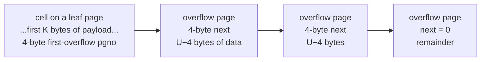

### 8.2 The spill formulas, and why they look like that

```
U = usable page size
X = maximum payload kept locally
      table leaf : X = U − 35
      index pages: X = ((U − 12) * 64 / 255) − 23
M = minimum payload kept locally = ((U − 12) * 32 / 255) − 23
K = M + ((P − M) mod (U − 4))

if      P ≤ X   → store all P bytes locally
else if K ≤ X   → store K bytes locally, rest overflows
else            → store M bytes locally, rest overflows
```

Three questions, three answers:

**Why keep a minimum `M` locally at all, instead of overflowing everything?**
Because a cell that is nothing but a pointer would let a page hold thousands of cells, and
the b-tree would degenerate: every row access would need an extra page read. `M ≈ U/8`
guarantees a page holds at most ~8 large cells, keeping the tree shape sane.

**Why the strange `64/255` and `32/255` fractions?**
They are header bytes 21 and 22 — `64/255 ≈ 25%` and `32/255 ≈ 12.5%` of the usable page.
They were parameters in the original design and are now frozen constants (the code asserts
them), which is why they survive as division by 255.

**Why the modulo in `K`?**
To avoid a nearly-empty last overflow page. `(P − M) mod (U − 4)` is exactly the remainder
that would be left over after filling whole overflow pages; keeping that remainder locally
makes every overflow page **completely full**.

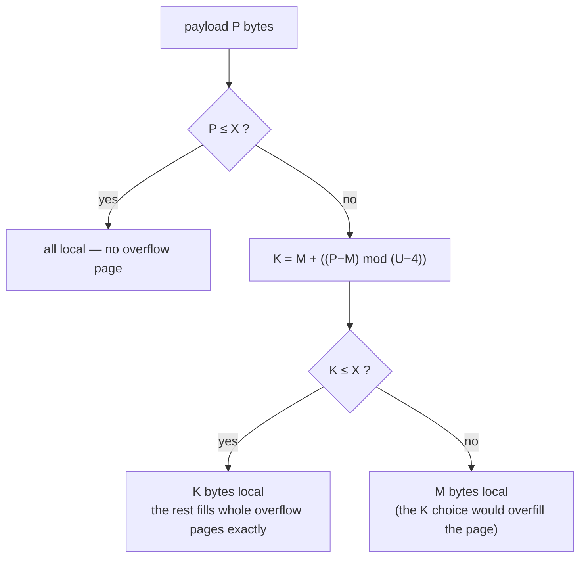

**Worked example, U = 4096, table leaf:**
```
X = 4096 − 35 = 4061
M = (4084 * 32 / 255) − 23 = 512 − 23 = 489

P = 5000:  K = 489 + ((5000−489) mod 4092) = 489 + 419 = 908
           908 ≤ 4061  →  908 bytes local, 4092 bytes in ONE full overflow page
```

Check the arithmetic: 908 + 4092 = 5000 exactly, and the overflow page is 100% full. That
is the modulo doing its job.

---

## Part 9 — LLD: the freelist

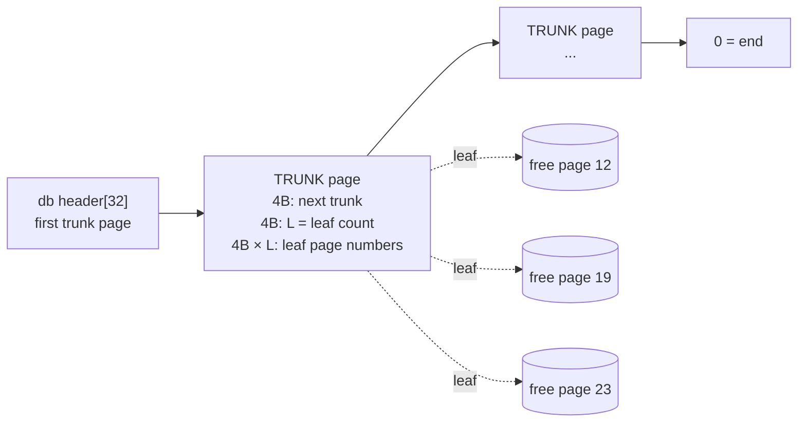

- `header[32]` = first trunk page, `header[36]` = total free pages.
- Allocation prefers a leaf from the first trunk; if the list is empty, the file grows.

**Why a trunk/leaf structure instead of a simple linked list?** A plain linked list would
need one page *write* per freed page to store the next pointer. A trunk page holds up to
`(U/4) − 2` leaf numbers — about 1000 with 4 KiB pages — so freeing 1000 pages dirties one
page instead of 1000.

**Why `DELETE` does not shrink the file:** freed pages go on this list and are reused.
Shrinking would require moving live pages down (that is what `VACUUM` does) or leaving
holes. Reuse is free; shrinking is expensive.

**Forensics consequence:** freed pages keep their old bytes. `PRAGMA secure_delete=ON`
zeroes them; it is OFF by default because zeroing costs a page write. Lab 1.8 recovers a
deleted "secret" from a `.db` file in three commands.

---

## Part 10 — LLD: pointer map pages (auto-vacuum)

### 10.1 The problem

To shrink a file you must move a page from the end into a free slot near the front. But
something points at that page — a parent b-tree page, a previous overflow page, or
`sqlite_schema.rootpage`. Finding the pointer by scanning is O(database size).

### 10.2 The solution: a reverse index

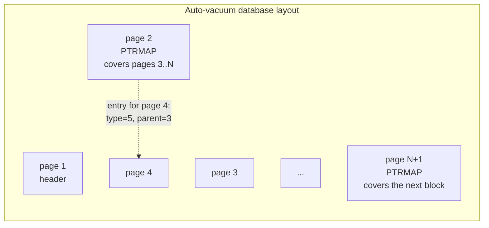

Each ptrmap entry is **5 bytes**: a 1-byte type + a 4-byte parent page number.

| Type | Meaning | Parent field |
|---|---|---|
| 1 | b-tree root page | 0 (no parent) |
| 2 | freelist page | 0 |
| 3 | first page of an overflow chain | the page holding the cell |
| 4 | later overflow page | the previous overflow page |
| 5 | non-root b-tree page | its b-tree parent |

One ptrmap page covers `U/5` data pages — about 816 with 4 KiB pages — so ptrmap overhead
is ~0.12% of the file.

**The trade:** every page allocation, free, and move must now also write a ptrmap entry.
That is an extra dirty page per operation. **Auto-vacuum's cost is write amplification, not
space.** Turn it on when file size matters more than write throughput.

---

## Part 11 — The schema table, and bootstrapping

```sql
CREATE TABLE sqlite_schema(
  type     text,     -- 'table' | 'index' | 'view' | 'trigger'
  name     text,
  tbl_name text,
  rootpage integer,  -- the b-tree root; 0 for views and triggers
  sql      text      -- the ORIGINAL CREATE statement, as text
);
```

Its root page is **always page 1**.

### 11.1 The bootstrap problem, and its solution

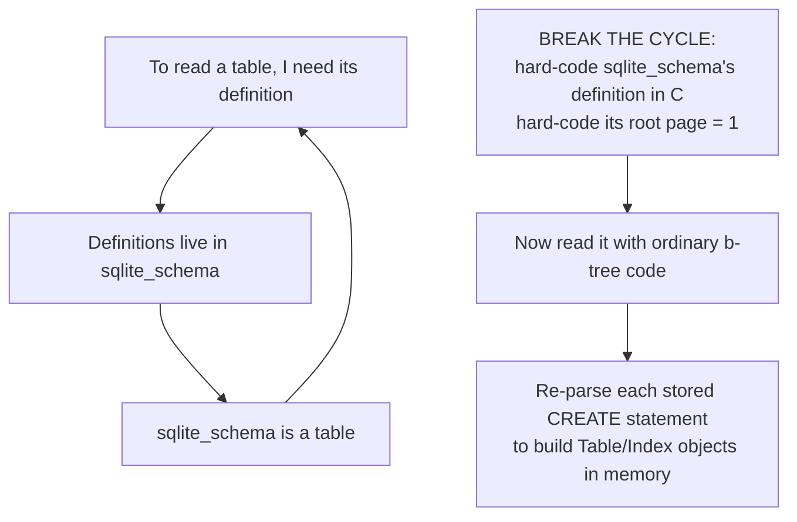

`sqlite3InitOne()` in `prepare.c` literally runs
`SELECT name, rootpage, sql FROM sqlite_schema` and feeds each `sql` string back through
the parser with `db->init.busy = 1`, which tells `CREATE TABLE` handling to *install* the
object rather than *create* it.

### 11.2 Why store SQL text rather than a binary catalog

| | Text SQL | Binary catalog |
|---|---|---|
| Format stability | the parser already exists and is versioned | a second format to freeze forever |
| New features | a new clause needs no catalog change | every feature needs a catalog version bump |
| Repairability | `PRAGMA writable_schema` + an UPDATE | needs a special tool |
| Cost | re-parse on every connection open | fast load |

SQLite chose "one format, one parser". The cost is real — opening a database with 500
tables re-parses 500 statements — and it is why the schema is cached per connection and why
`SQLITE_SCHEMA` exists.

**Consequences you can now derive yourself:**
- A corrupt `sql` column makes the database unopenable (the re-parse fails).
- `ALTER TABLE RENAME` must rewrite the *text* of dependent views and triggers.
- DDL bumps the schema cookie, invalidating every other connection's prepared statements.

Internal tables you will meet: `sqlite_sequence` (AUTOINCREMENT), `sqlite_stat1`/`stat4`
(ANALYZE), `sqlite_autoindex_<table>_<N>` (implicit UNIQUE indexes).

---

## Part 12 — A complete small database

```sql
PRAGMA page_size=4096;
CREATE TABLE users(id INTEGER PRIMARY KEY, name TEXT, age INT);
CREATE INDEX i_age ON users(age);
INSERT INTO users VALUES (1,'ada',36),(2,'linus',54),(3,'grace',45);
```

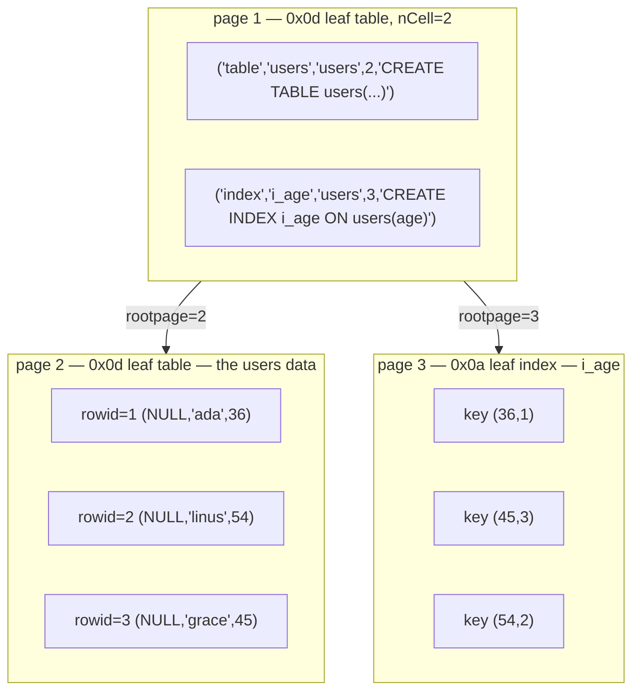

Real output from `labs/phase01/dbparse` on exactly this database:
```
page 1: leaf table  nCell=2 cellTop=3941 frag=0
  cell[0] off=3997 P=85 rowid=1 ('table','users','users',2,'CREATE TABLE users(...)')
  cell[1] off=3941 P=54 rowid=2 ('index','i_age','users',3,'CREATE INDEX i_age ON users(age)')
page 2: leaf table  nCell=3 cellTop=4050 frag=0
  cell[0] off=4074 P=8  rowid=1 (NULL, 'ada',   36)
  cell[1] off=4062 P=10 rowid=2 (NULL, 'linus', 54)
  cell[2] off=4050 P=10 rowid=3 (NULL, 'grace', 45)
page 3: leaf index  nCell=3 cellTop=4067 frag=0
  cell[0] off=4079 P=4 key=(36, 1)
  cell[1] off=4073 P=5 key=(45, 3)
  cell[2] off=4067 P=5 key=(54, 2)
```

Three things to read out of it:
1. The index is sorted by `age` — `(36,1) (45,3) (54,2)` — not by rowid. That ordering *is*
   the index.
2. Cell offsets *decrease* (4074, 4062, 4050): bodies grow downward from the end.
3. The `id` column really is NULL in every record.

---

## Part 13 — How this reaches the disk

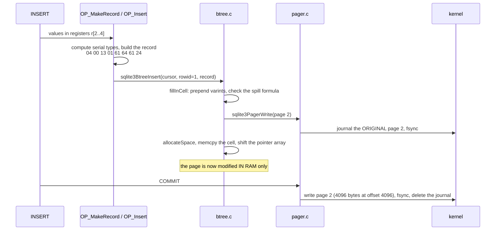

**The physical reality:**
- Changing one 10-byte cell rewrites the **whole 4096-byte page**. Disks write in blocks;
  there is no "write 10 bytes at offset 4062".
- That page is also copied to the journal first, so a 10-byte logical change costs ~8 KiB of
  I/O. This is **write amplification**, and batching rows into one transaction is how you
  amortize it.
- A page write is only atomic up to the device's sector size (512 B or 4 KiB). Larger pages
  can tear, which is why `xSectorSize()` exists and why the journal must be synced before
  the database is touched.

---

## Part 14 — Design decisions, collected

| Decision | Alternative | Why SQLite chose this |
|---|---|---|
| big-endian on disk | native-endian | files must be byte-identical across CPUs |
| fixed-size pages | variable-length records | O(1) address computation; matches hardware blocks |
| slotted page | sorted packed array | insert costs 2 bytes moved per cell, not the whole page |
| varints | fixed 8-byte ints | ~7 bytes saved per row, twice per cell |
| serial types per value | fixed column widths | dynamic typing, and small values stay small |
| types grouped in a header | interleaved type+value | skip to column N without reading the body |
| INTEGER PRIMARY KEY = rowid alias | separate PK index | the PK costs nothing; one b-tree instead of two |
| rowid appended to index keys | duplicate-key handling | every key unique ⇒ no special code path |
| no sibling pointers in leaves | linked leaves | splits stay cheap; scans pay a rare parent hop |
| overflow keeps `M` bytes local | overflow everything | preserves fan-out and tree shape |
| the `K` modulo | fill local first | the last overflow page is exactly full |
| freelist trunk/leaf | plain linked list | freeing 1000 pages dirties one page |
| schema as SQL text | binary catalog | one format, one parser, repairable by hand |
| reserved bytes per page | fixed layout | lets encryption/checksum VFS shims exist |

---

## Part 15 — Misconceptions to unlearn

| Belief | Reality |
|---|---|
| "VARCHAR(10) limits the length" | declared types only set *affinity*; the length is ignored |
| "an INT column always takes 4 bytes" | it takes 0–8 bytes per row depending on the value |
| "DELETE frees disk space" | pages move to the freelist; the file stays the same size |
| "deleted data is gone" | the bytes remain until reused, unless `secure_delete` is on |
| "page size = 4096 means usable = 4096" | subtract reserved bytes; Apple's build reserves 12 |
| "the row is stored in column order with separators" | header of types, then a packed body, no separators |
| "the PK is stored twice" | `INTEGER PRIMARY KEY` is stored once, as the cell key |
| "an empty cell content area starts at 0" | `cellTop == 0` means 65536 |

---

## Part 16 — Where each piece lives in the code

| Concern | Function | File |
|---|---|---|
| database header | `lockBtree()`, `sqlite3BtreeUpdateMeta()` | `btree.c` |
| page header write | `zeroPage()` | `btree.c` |
| page header parse | `btreeInitPage()`, `decodeFlags()` | `btree.c` |
| spill constants | computed once in `sqlite3BtreeSetPageSize()` | `btree.c` |
| cell parse | `btreeParseCellPtr()` + 3 variants | `btree.c` |
| cell size | `cellSizePtr()` + variants | `btree.c` |
| payload / overflow | `accessPayload()`, `fillInCell()` | `btree.c` |
| varints | `sqlite3GetVarint()`, `sqlite3PutVarint()`, `sqlite3GetVarint32()` | `util.c` |
| record build | `OP_MakeRecord`, `sqlite3VdbeSerialType/Put` | `vdbe.c`, `vdbemem.c` |
| record read | `OP_Column`, `sqlite3VdbeSerialGet` | `vdbe.c`, `vdbemem.c` |
| freelist | `allocateBtreePage()`, `freePage2()` | `btree.c` |
| ptrmap | `ptrmapPut/Get/Pageno()` | `btree.c` |
| schema load | `sqlite3InitOne()`, `sqlite3InitCallback()` | `prepare.c` |
| the whole spec, executable | `sqlite3BtreeIntegrityCheck()` | `btree.c` |

Next: `2.code_walkthrough.md` reads five of these line by line, then
`3.implementation.md` has you write a parser that decodes all of it.
