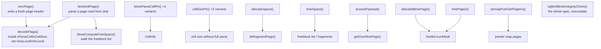

# Phase 1 — Reference: The File Format

Every constant, struct, and formula, with the function that implements it.
Struct bodies are quoted from the 3.50.4 amalgamation.

---

## 1. Constants

```
Magic               "SQLite format 3\000"   (16 bytes, offset 0)
Page size           512 … 65536, power of 2  (hdr[16..17]; the value 1 means 65536)
Usable size U       pageSize − hdr[20]       ← ALL formulas use U, never pageSize
Page numbering      1-based; page number 0 is the NULL pointer
File size           always an exact multiple of pageSize
Endianness          BIG-endian for every multi-byte integer on disk
Schema root page    always 1
Lock-byte page      the page containing byte 0x40000000; never holds data
Max b-tree depth    BTCURSOR_MAX_DEPTH = 20
```

### 1.1 Page type byte (offset 0 of the b-tree header)

```
PTF_INTKEY    0x01
PTF_ZERODATA  0x02
PTF_LEAFDATA  0x04
PTF_LEAF      0x08

0x02 = ZERODATA                     interior index
0x05 = INTKEY|LEAFDATA              interior table
0x0a = ZERODATA|LEAF                leaf index
0x0d = INTKEY|LEAFDATA|LEAF         leaf table
```
Any other value ⇒ `SQLITE_CORRUPT_PAGE` from `decodeFlags()`.

### 1.2 B-tree page header

| Offset | Size | Field | Notes |
|---|---|---|---|
| 0 | 1 | page type | see above |
| 1 | 2 | first freeblock offset | 0 = none |
| 3 | 2 | nCell | |
| 5 | 2 | cell content area start | **0 means 65536** |
| 7 | 1 | fragmented free bytes | holes of 1–3 bytes |
| 8 | 4 | right-most child | **interior pages only** |

Header size: **8** bytes leaf, **12** bytes interior.
On page 1 the header starts at offset **100**, but cell pointers are still measured from
offset 0 of the page.

### 1.3 Free-space rules

```
gap        = cellTop − (hdrOffset + hdrSize + nCell*2)
freeblock  = a hole ≥ 4 bytes: 2-byte next offset + 2-byte size, singly linked
fragment   = a hole of 1..3 bytes — cannot describe itself, only counted in hdr[7]
defragment triggered when fragmented bytes > 60
minimum cell size = 4 bytes (so that a freed cell can become a freeblock)
```

### 1.4 Spill formulas — computed once per file in `BtShared`

```c
pBt->maxLocal = (u16)((pBt->usableSize-12)*64/255 - 23);   /* index pages   (X) */
pBt->minLocal = (u16)((pBt->usableSize-12)*32/255 - 23);   /* index pages   (M) */
pBt->maxLeaf  = (u16)(pBt->usableSize - 35);               /* table leaves  (X) */
pBt->minLeaf  = (u16)((pBt->usableSize-12)*32/255 - 23);   /* table leaves  (M) */
```

Decision procedure for payload of size P:
```
if      P ≤ X              → all P bytes local
else if K ≤ X              → K bytes local, where K = M + ((P − M) mod (U − 4))
else                       → M bytes local
```

Worked, U = 4096, table leaf: `X = 4061`, `M = 489`.
`P = 5000` ⇒ `K = 489 + ((5000−489) mod 4092) = 908` ⇒ 908 local + one **full** 4092-byte
overflow page.

### 1.5 Serial types

| Code | Body bytes | Meaning |
|---|---|---|
| 0 | 0 | NULL |
| 1 | 1 | int8 |
| 2 | 2 | int16 |
| 3 | 3 | int24 |
| 4 | 4 | int32 |
| 5 | 6 | int48 |
| 6 | 8 | int64 |
| 7 | 8 | IEEE-754 double, big-endian |
| 8 | 0 | the integer **0** (schema format ≥ 4) |
| 9 | 0 | the integer **1** (schema format ≥ 4) |
| 10, 11 | — | reserved/internal — **on disk this is corruption** |
| N ≥ 12, even | (N−12)/2 | BLOB |
| N ≥ 13, odd | (N−13)/2 | TEXT, in the database encoding, **not NUL-terminated** |

### 1.6 Varints

```
1..9 bytes, big-endian base-128
each byte contributes 7 bits; the high bit means "more follows"
the 9th byte, if reached, contributes all 8 bits (7×8 + 8 = 64)
127 → 7f | 128 → 81 00 | 200 → 81 48 | 16383 → ff 7f | 2^64-1 → ff×9
```

### 1.7 Freelist

```
hdr[32] = first trunk page (0 = none)
hdr[36] = total free pages (trunks + leaves)

trunk page: 4B next trunk | 4B L = leaf count | 4B × L leaf page numbers
capacity per trunk ≈ (U/4) − 2  ≈ 1022 leaves at U = 4096
```

### 1.8 Pointer map (auto-vacuum only)

```
entry size          5 bytes: 1-byte type + 4-byte parent page number
pages per ptrmap    U/5   (≈ 816 at U = 4096)
first ptrmap page   page 2
PTRMAP_PTROFFSET(pgptrmap, pgno) = 5*(pgno − pgptrmap − 1)
PTRMAP_ISPAGE(pBt,pgno)          = PTRMAP_PAGENO(pBt,pgno)==pgno
```

| Type | Constant | Meaning | Parent field |
|---|---|---|---|
| 1 | `PTRMAP_ROOTPAGE` | b-tree root | 0 |
| 2 | `PTRMAP_FREEPAGE` | freelist page | 0 |
| 3 | `PTRMAP_OVERFLOW1` | first overflow page of a chain | the page holding the cell |
| 4 | `PTRMAP_OVERFLOW2` | a later overflow page | the previous overflow page |
| 5 | `PTRMAP_BTREE` | non-root b-tree page | its b-tree parent |

---

## 2. The 100-byte database header

| Off | Size | Field | Trusted when | Written by |
|---|---|---|---|---|
| 0 | 16 | magic `"SQLite format 3\0"` | always | `sqlite3BtreeSetPageSize`/first write |
| 16 | 2 | page size | always | |
| 18 | 1 | write version 1=journal 2=WAL | always | `sqlite3PagerSetJournalMode` |
| 19 | 1 | read version | always | |
| 20 | 1 | reserved bytes per page | always | `SQLITE_FCNTL_RESERVE_BYTES` |
| 21 | 1 | max embedded payload fraction = **64** | constant | asserted |
| 22 | 1 | min embedded payload fraction = **32** | constant | asserted |
| 23 | 1 | leaf payload fraction = **32** | constant | asserted |
| 24 | 4 | file change counter | always | `pager_write_changecounter` |
| 28 | 4 | database size in pages | **only if non-zero AND hdr[92..95]==hdr[24..27]** | |
| 32 | 4 | first freelist trunk page | always | |
| 36 | 4 | total freelist pages | always | |
| 40 | 4 | schema cookie | always | bumped by every DDL |
| 44 | 4 | schema format 1..4 | always | |
| 48 | 4 | default page cache size | always | `PRAGMA default_cache_size` |
| 52 | 4 | largest root b-tree page | non-zero ⇒ auto-vacuum | |
| 56 | 4 | text encoding 1=UTF8 2=UTF16le 3=UTF16be | always | |
| 60 | 4 | user version | always | `PRAGMA user_version` |
| 64 | 4 | incremental-vacuum flag | always | |
| 68 | 4 | application id | always | `PRAGMA application_id` |
| 72 | 20 | reserved, must be zero | | |
| 92 | 4 | version-valid-for number | always | |
| 96 | 4 | `SQLITE_VERSION_NUMBER` of the last writer | always | |

### 2.1 Schema format numbers

| Value | Since | Enables |
|---|---|---|
| 1 | 2004 | original |
| 2 | 3.1.3 | `ALTER TABLE ADD COLUMN` was used |
| 3 | 3.1.4 | added columns may have non-NULL defaults |
| 4 | 3.3.0 | descending indexes; serial types 8 and 9 |

---

## 3. Structures

### 3.1 `MemPage` — the parsed view of one page (`btreeInt.h`, verbatim)

```c
struct MemPage {
  u8 isInit;           /* True if previously initialized. MUST BE FIRST! */
  u8 intKey;           /* True if table b-trees.  False for index b-trees */
  u8 intKeyLeaf;       /* True if the leaf of an intKey table */
  Pgno pgno;           /* Page number for this page */
  /* Only the first 8 bytes (above) are zeroed by pager.c when a new page
  ** is allocated. All fields that follow must be initialized before use */
  u8 leaf;             /* True if a leaf page */
  u8 hdrOffset;        /* 100 for page 1.  0 otherwise */
  u8 childPtrSize;     /* 0 if leaf==1.  4 if leaf==0 */
  u8 max1bytePayload;  /* min(maxLocal,127) */
  u8 nOverflow;        /* Number of overflow cell bodies in aCell[] */
  u16 maxLocal;        /* Copy of BtShared.maxLocal or BtShared.maxLeaf */
  u16 minLocal;        /* Copy of BtShared.minLocal or BtShared.minLeaf */
  u16 cellOffset;      /* Index in aData of first cell pointer */
  int nFree;           /* Number of free bytes on the page. -1 for unknown */
  u16 nCell;           /* Number of cells on this page, local and ovfl */
  u16 maskPage;        /* Mask for page offset */
  u16 aiOvfl[4];       /* Insert the i-th overflow cell before the aiOvfl-th
                       ** non-overflow cell */
  u8 *apOvfl[4];       /* Pointers to the body of overflow cells */
  BtShared *pBt;       /* Pointer to BtShared that this page is part of */
  u8 *aData;           /* Pointer to disk image of the page data */
  u8 *aDataEnd;        /* One byte past the end of the entire page - not just
                       ** the usable space, the entire page.  Used to prevent
                       ** corruption-induced buffer overflow. */
  u8 *aCellIdx;        /* The cell index area */
  u8 *aDataOfst;       /* Same as aData for leaves.  aData+4 for interior */
  DbPage *pDbPage;     /* Pager page handle */
  u16 (*xCellSize)(MemPage*,u8*);             /* cellSizePtr method */
  void (*xParseCell)(MemPage*,u8*,CellInfo*); /* btreeParseCell method */
};
```

Field notes that matter while reading code:

| Field | Why it exists |
|---|---|
| `isInit` **must be first** | `pager.c` zeroes only the first 8 bytes when allocating; `isInit==0` then means "not parsed" |
| `hdrOffset` | absorbs the page-1 special case everywhere |
| `maxLocal`/`minLocal` | the spill formula, precomputed per page type — no division in the hot path |
| `nFree == -1` | "not computed yet"; call `btreeComputeFreeSpace()` |
| `maskPage` | `pageSize−1`; converts a pointer to a within-page offset with an AND instead of a division |
| `aDataEnd` | the bound used by every corruption check |
| `aDataOfst` | `aData` for leaves, `aData+4` for interior, so cell-offset arithmetic is uniform |
| `xCellSize` / `xParseCell` | installed by `decodeFlags()` per page type — four cell formats, zero per-cell branches |
| `aiOvfl[4]` / `apOvfl[4]` | up to 4 cells may be logically on the page but physically in memory |

### 3.2 `CellInfo` — one parsed cell (verbatim)

```c
struct CellInfo {
  i64 nKey;      /* The key for INTKEY tables, or nPayload otherwise */
  u8 *pPayload;  /* Pointer to the start of payload */
  u32 nPayload;  /* Bytes of payload */
  u16 nLocal;    /* Amount of payload held locally, not on overflow */
  u16 nSize;     /* Size of the cell content on the main b-tree page */
};
```

`nPayload > nLocal` ⇒ the cell has an overflow chain, and the 4-byte first-overflow page
number sits at `pPayload + nLocal`.

### 3.3 Cell layouts

```
TABLE LEAF     0x0d : varint P | varint rowid | payload[nLocal] | [4B overflow]
TABLE INTERIOR 0x05 : 4B leftChild | varint rowid                 (NO PAYLOAD)
INDEX LEAF     0x0a : varint P | payload[nLocal] | [4B overflow]
INDEX INTERIOR 0x02 : 4B leftChild | varint P | payload[nLocal] | [4B overflow]
```

---

## 4. Function reference



| Concern | Function | File |
|---|---|---|
| write a page header | `zeroPage()` | `btree.c` |
| parse a page header | `btreeInitPage()`, `decodeFlags()` | `btree.c` |
| free-space accounting | `btreeComputeFreeSpace()` | `btree.c` |
| parse a cell | `btreeParseCellPtr()`, `btreeParseCellPtrIndex()`, `btreeParseCellPtrNoPayload()`, `btreeParseCell()` | `btree.c` |
| cell size only | `cellSizePtr()`, `cellSizePtrTableLeaf()`, `cellSizePtrIdxLeaf()`, `cellSizePtrNoPayload()` | `btree.c` |
| build a cell | `fillInCell()` | `btree.c` |
| in-page allocator | `allocateSpace()`, `freeSpace()`, `defragmentPage()`, `pageFindSlot()` | `btree.c` |
| payload / overflow | `accessPayload()`, `sqlite3BtreePayloadFetch()`, `getOverflowPage()`, `clearCell()` | `btree.c` |
| freelist | `allocateBtreePage()`, `freePage()`, `freePage2()` | `btree.c` |
| pointer map | `ptrmapPut()`, `ptrmapGet()`, `ptrmapPageno()`, `ptrmapPutOvflPtr()` | `btree.c` |
| varints | `sqlite3GetVarint()`, `sqlite3GetVarint32()`, `sqlite3PutVarint()`, `sqlite3VarintLen()` | `util.c` |
| big-endian ints | `sqlite3Get4byte()`, `sqlite3Put4byte()`, `get2byte()`, `put2byte()` | `util.c`, `btreeInt.h` |
| serial types | `sqlite3VdbeSerialType()`, `SerialTypeLen()`, `SerialPut()`, `SerialGet()` | `vdbemem.c` |
| record build/read | `OP_MakeRecord`, `OP_Column` | `vdbe.c` |
| schema load | `sqlite3InitOne()`, `sqlite3InitCallback()` | `prepare.c` |
| verification | `sqlite3BtreeIntegrityCheck()` | `btree.c` |

---

## 5. Invariants — what `integrity_check` verifies

1. Every page is referenced **exactly once**: as a b-tree page, an overflow page, a
   freelist page, a ptrmap page, page 1, or the lock-byte page.
2. Cell pointers are in increasing **key** order, and each points inside the content area.
3. `header + pointer array + cells + freeblocks + fragments + gap == usable size`, exactly.
4. Cell content start ≥ end of the cell pointer array.
5. Every child page number is ≤ the database size and is not the lock-byte page.
6. Keys in a subtree lie within the bounds implied by the parent's separator keys.
7. An interior page has `nCell ≥ 1`.
8. Overflow chains terminate, do not loop, and have exactly the length implied by
   `nPayload − nLocal`.
9. With auto-vacuum on, every page's ptrmap entry matches its true parent.
10. Index contents match table contents (this is the check `quick_check` **skips**).

`PRAGMA quick_check` runs 2–8 but skips the page-usage bitmap and the index/table
cross-check, so it is much faster and much weaker.

---

## 6. Gotchas

1. **`cellTop == 0` means 65536**, not 0. Only reachable with 64 KiB pages.
2. **Cell pointers are key-sorted; cell bodies are in arbitrary physical order.** Never
   assume offsets increase.
3. Page 1's b-tree header starts at offset 100, but **cell offsets are still measured from
   offset 0**.
4. The 12-byte interior header's right-most child is at offset 8 — do not read it on a leaf.
5. **Text on disk is not NUL-terminated**; the length comes from the serial type only.
6. Serial types **10 and 11 must never appear** in a stored record.
7. `hdr[28]` (db size) is only trustworthy with the `hdr[92..95] == hdr[24..27]` check.
8. **Reserved bytes are not always 0.** Apple's system SQLite reserves 12. Always use
   `usable = pageSize − hdr[20]`.
9. A varint can encode a value far larger than the field it is being read into.
   `sqlite3GetVarint32` **saturates to 0xffffffff** rather than truncating, so downstream
   size checks fail instead of wrapping.
10. `sqlite3BtreePayloadFetch()` returns a pointer **into the page buffer**; it is invalid
    after the next b-tree call.
11. Freed pages keep their old bytes unless `PRAGMA secure_delete=ON` — deleted rows are
    recoverable from the raw file.
12. `DELETE` never shrinks the file; `VACUUM` or auto-vacuum does.
13. Root page numbers do not change, except via auto-vacuum relocation, which then updates
    `sqlite_schema`.
14. The lock-byte page is skipped in page numbering, so databases > 1 GiB have a hole.

---

## 7. Pragmas and tools for this phase

```sql
PRAGMA page_size;            PRAGMA page_count;       PRAGMA freelist_count;
PRAGMA schema_version;       PRAGMA user_version;     PRAGMA application_id;
PRAGMA auto_vacuum;          PRAGMA incremental_vacuum(N);
PRAGMA secure_delete;        PRAGMA encoding;
PRAGMA integrity_check;      PRAGMA quick_check;      PRAGMA cell_size_check;
PRAGMA writable_schema=ON;   -- hand-edit sqlite_schema; used by .recover
SELECT * FROM dbstat;        -- per-page payload/unused stats
SELECT * FROM sqlite_dbpage; -- raw page access (SQLITE_ENABLE_DBPAGE_VTAB)
```

```sh
tool/showdb  mydb.db dbheader     # decode the 100-byte header
tool/showdb  mydb.db 2b           # page 2, with cells decoded
tool/dbtotxt mydb.db              # database as text, for bug reports
sqlite3_analyzer mydb.db          # full space-usage report
labs/phase01/dbparse mydb.db 2    # your own parser
```

---

## 8. The schema table

```sql
CREATE TABLE sqlite_schema(
  type     text,     -- 'table' | 'index' | 'view' | 'trigger'
  name     text,
  tbl_name text,
  rootpage integer,  -- 0 for views and triggers
  sql      text      -- the original CREATE statement
);
```
Root page **1**, always. Legacy name `sqlite_master` still works.

Internal tables you will meet:

| Name | Purpose |
|---|---|
| `sqlite_sequence` | AUTOINCREMENT high-water marks |
| `sqlite_stat1` | ANALYZE: rows per table and per index prefix |
| `sqlite_stat4` | ANALYZE with `SQLITE_ENABLE_STAT4`: sampled histograms |
| `sqlite_autoindex_<table>_<N>` | the implicit index behind a UNIQUE/PK constraint |
| `<vtab>_data`, `<vtab>_idx`, … | shadow tables of FTS5/R-Tree |

---

## 9. Quick byte-decoding recipes

```sh
# header
xxd -l 100 mydb.db

# page N (1-based), first 64 bytes
PS=4096; N=2; xxd -s $(( (N-1)*PS )) -l 64 mydb.db

# a cell whose pointer you read as 0x0FD9 on page 2
xxd -s $(( 4096 + 0x0FD9 )) -l 32 mydb.db

# is it WAL mode?  bytes 18 and 19 == 02
xxd -s 18 -l 2 mydb.db

# how many pages does the file claim vs actually have
xxd -s 28 -l 4 mydb.db ; stat -f%z mydb.db
```
