# Phase 2 — The Pager and the VFS

C you need first: `C-FOR-SQLITE.md` §5 (first-member subclassing), §6 (function pointers),
§8 (bit flags), §14 (goto cleanup), §15 (`volatile`), §18 (how bytes reach the disk).

---

## Part 1 — The problem

### 1.1 What the b-tree asks for, and what it must not know

The b-tree says: *"give me page 7; I am going to modify it; commit everything."*

It must not know about: files, locks, crashes, other processes, fsync, journals, or caches.
If it did, every b-tree algorithm would be tangled with recovery logic.

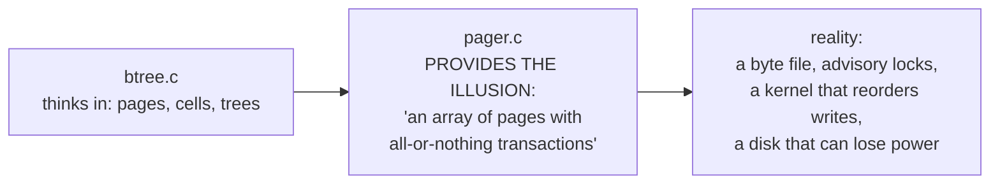

### 1.2 The four hard problems, and why each is hard

```mermaid
mindmap
  root((pager.c))
    Atomicity
      power can fail mid-write
      a 4KB write may TEAR
      file deletes are atomic, writes are not
    Durability
      write() only reaches the OS cache
      fsync is the only real barrier
      devices lie about flushing
    Isolation
      several PROCESSES, no shared memory
      only advisory byte-range locks
      no lock manager exists
    Recovery
      no daemon survives a crash
      the next process to open must repair
      it may be a different binary version
```

**Atomicity is hard because the filesystem gives you almost nothing.** You cannot ask for
"write these 12 pages atomically." You get: single writes (which may tear), `fsync`, and
`unlink` (which is atomic). The entire commit protocol is built out of those three
primitives.

### 1.3 The central idea

> **Never overwrite live data until a recoverable copy is durable somewhere else.**

Two ways to obey that rule, and SQLite implements both:

| | Rollback journal (Phase 2) | WAL (Phase 7) |
|---|---|---|
| Save what? | the **old** page (undo) | the **new** page (redo) |
| Then | overwrite the database in place | leave the database untouched |
| Commit | delete the journal | write a commit frame |
| Recovery | copy old pages back | replay/ignore frames |

---

## Part 2 — HLD: where the pager sits

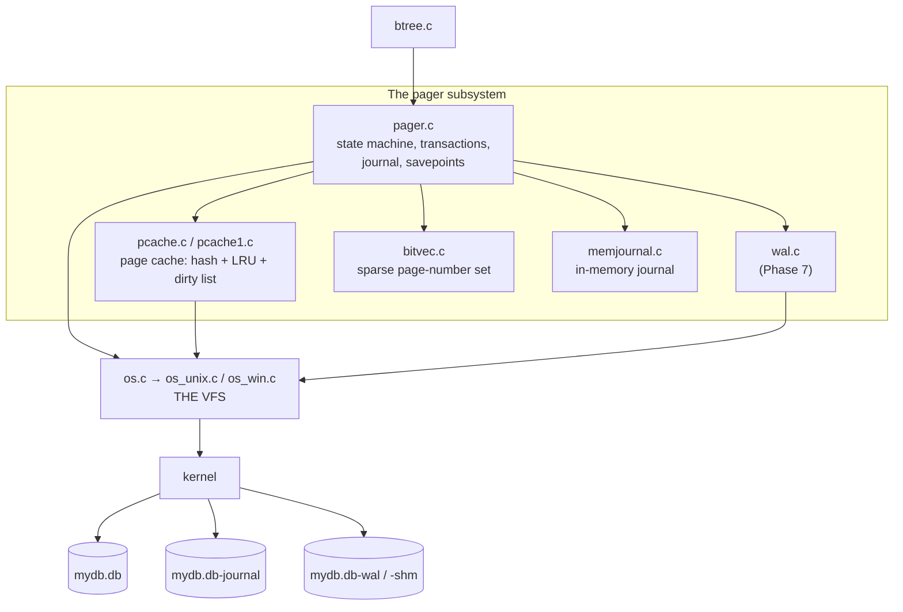

**Why the page cache is a separate module:** it is replaceable. An embedded system can
supply its own via `sqlite3_config(SQLITE_CONFIG_PCACHE2, ...)` — for example, a cache
backed by a fixed static buffer with no `malloc` at all.

**Why the VFS is a separate module:** it is the only OS contact point, so porting SQLite to
a new platform means writing one file. It is also the seam for encryption, compression,
network storage, and fault injection.

---

## Part 3 — LLD: the pager state machine

Everything in `pager.c` is a transition in this machine. `Pager.eState` holds it, and
`assert_pager_state()` encodes the legal combinations.

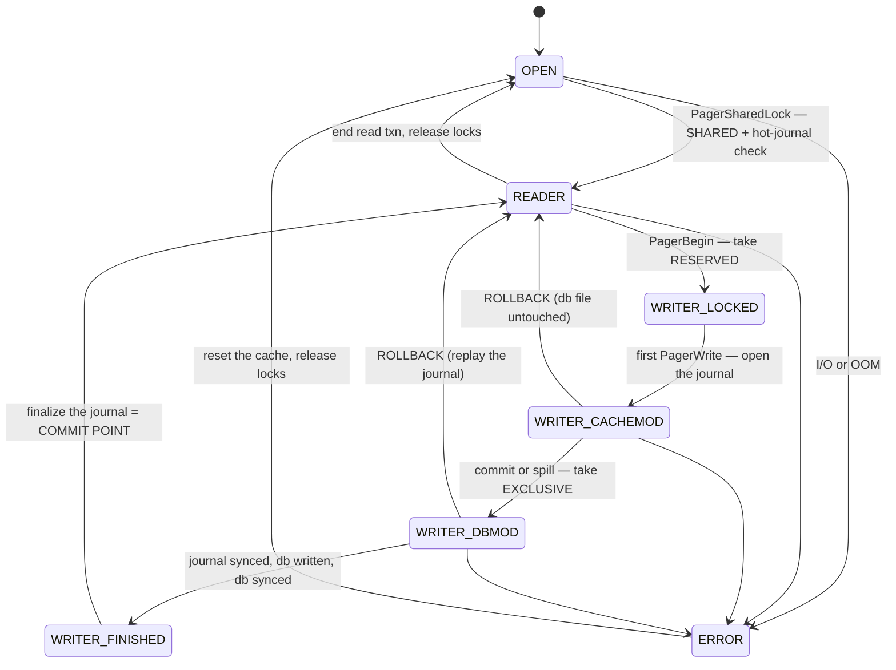

| State | Locks held | Database file contains | Journal |
|---|---|---|---|
| `OPEN` | none | — | may be hot |
| `READER` | SHARED | a consistent snapshot | none |
| `WRITER_LOCKED` | RESERVED | unchanged | not yet created |
| `WRITER_CACHEMOD` | RESERVED | **unchanged** — changes are in RAM | header written |
| `WRITER_DBMOD` | EXCLUSIVE | **uncommitted data!** | contains the originals |
| `WRITER_FINISHED` | EXCLUSIVE | committed data | about to be finalized |
| `ERROR` | any | unknown | unknown |

**Why `CACHEMOD` and `DBMOD` are distinct states — this is the key insight of the phase.**
As long as changes live only in the page cache, a crash needs no recovery at all: the file
on disk is still the pre-transaction state. Only when a dirty page is *written to the
database file* does a crash become dangerous, and only then is journal replay required.

**Why a cache spill is expensive:** if the cache fills mid-transaction, dirty pages must be
evicted, which means writing them to the database file, which forces `CACHEMOD → DBMOD`
early — taking the EXCLUSIVE lock and blocking all readers long before COMMIT. A big
transaction with a small cache blocks readers far longer than you expect.

---

## Part 4 — LLD: the rollback journal

### 4.1 File format

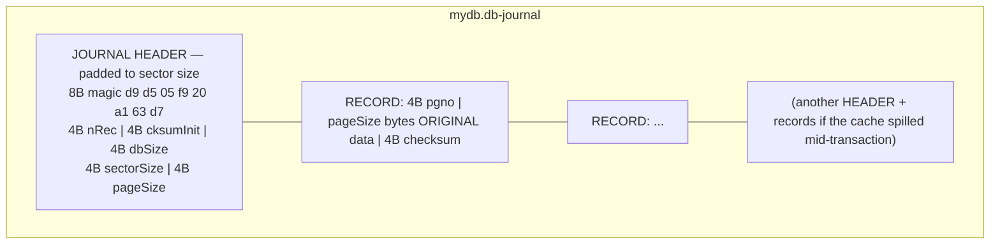

### 4.2 Why each header field exists

| Field | Purpose | What breaks without it |
|---|---|---|
| **magic** | identifies a real journal | random leftover bytes would be replayed |
| **nRec** | how many records to replay | you would have to trust the file size, which a crash can leave wrong |
| **cksumInit** | a random nonce per transaction | stale records from a *previous* journal would checksum-validate and be replayed |
| **dbSize** | page count before the transaction | a rolled-back INSERT that grew the file would leave junk pages |
| **sectorSize** | padding and batching unit | two records could share a sector, so one torn sector could corrupt both |
| **pageSize** | record stride | you could not parse the records at all |

**The nonce is the subtle one.** Consider: transaction A writes a journal, commits, and the
journal is deleted. Transaction B starts, and the filesystem hands back the same disk
blocks. B crashes mid-write. The tail of B's journal may contain A's old bytes, which are
perfectly valid records. A random `cksumInit` per transaction makes A's checksums fail
under B's nonce, so replay stops at the right place.

**Why `nRec` is written twice.** During a transaction, `nRec` is `0xffffffff` ("unknown");
records are appended; then a sync; then `nRec` is patched into the header; then another
sync. So the count can never be larger than the number of records actually on disk.

### 4.3 The commit protocol, step by step

```mermaid
sequenceDiagram
    autonumber
    participant B as btree.c
    participant P as pager.c
    participant O as VFS
    participant D as disk

    B->>P: BeginTrans(write)
    P->>O: xLock(RESERVED)
    Note over P: state: WRITER_LOCKED

    B->>P: PagerWrite(page 7)
    P->>O: xOpen(mydb.db-journal), write header
    Note over P: state: WRITER_CACHEMOD
    P->>O: xWrite(journal, ORIGINAL page 7)
    P->>P: PcacheMakeDirty(page 7); set PGHDR_WRITEABLE
    B->>B: modify page 7 IN RAM

    B->>P: CommitPhaseOne()
    P->>O: xSync(journal)
    O->>D: fsync — BARRIER 1: the originals are durable
    P->>O: xWrite(journal header, nRec)
    P->>O: xSync(journal)
    O->>D: fsync — BARRIER 2: the record count is durable
    P->>O: xLock(PENDING → EXCLUSIVE)
    Note over P: state: WRITER_DBMOD — the db now has uncommitted data
    P->>O: xWrite(db, page 7)
    P->>O: xSync(db)
    O->>D: fsync — BARRIER 3: the new data is durable
    Note over P: state: WRITER_FINISHED

    B->>P: CommitPhaseTwo()
    P->>O: xDelete(mydb.db-journal)
    Note over P,D: ← THE COMMIT POINT (one atomic filesystem operation)
    P->>O: xUnlock(SHARED → NONE)
```

### 4.4 Why the order is exactly this — crash at every step

This table *is* the correctness argument. Read it once carefully and the protocol becomes
obvious rather than arbitrary.

| Crash after step | Journal on disk | Database on disk | What recovery does | Result |
|---|---|---|---|---|
| lock taken | none | original | nothing | transaction never happened ✓ |
| journal header written | header, no records | original | header has nRec=0 ⇒ not hot; delete | never happened ✓ |
| some records written, **no sync** | partial, maybe garbage | original | checksums fail early ⇒ stop; db untouched | never happened ✓ |
| **barrier 1 done** | complete originals | original | replay is a no-op (same bytes) | never happened ✓ |
| db partially written | complete originals | **mixed old+new** | replay restores every original | rolled back ✓ |
| **barrier 3 done** | complete originals | all new | replay restores originals | **rolled back** ✓ (we had not committed) |
| journal deleted | gone | all new | no journal ⇒ nothing to do | **committed** ✓ |

Every row lands on a consistent state. Note the second-to-last row: even with all the new
data safely on disk, a crash *before* deleting the journal rolls the transaction back. That
is correct — the user was never told "committed."

**Now remove a barrier and watch it break:**

| Remove | Failure |
|---|---|
| barrier 1 (sync journal) | the db can be modified while the originals are still in the OS cache. Power loss ⇒ new data in the db, no originals to restore ⇒ **corruption**. |
| barrier 2 (sync nRec) | `nRec` could reach disk before the records ⇒ replay reads garbage as a record ⇒ **corruption**. |
| barrier 3 (sync db) | delete the journal while the new data is still in the OS cache ⇒ power loss ⇒ neither old nor new ⇒ **corruption**. |

### 4.5 Journal modes — different commit points

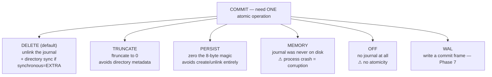

Why three variants of "the same thing": file creation and deletion cost directory metadata
updates, which on some filesystems are the slowest part of a commit. TRUNCATE and PERSIST
trade a little recovery clarity for fewer metadata operations.

### 4.6 `PRAGMA synchronous`

| Level | Rollback mode behaviour | Risk |
|---|---|---|
| `OFF` (0) | no fsync at all | power loss can corrupt |
| `NORMAL` (1) | syncs the journal, not always the db | small corruption risk on some filesystems |
| `FULL` (2, default) | all barriers | safe |
| `EXTRA` (3) | also syncs the directory after unlink | safest |

The same pragma means something **different** in WAL mode (Phase 7): there, `NORMAL` cannot
corrupt, only lose recent transactions. Same name, different guarantee.

---

## Part 5 — LLD: locking

### 5.1 Locks on bytes that hold nothing

```
PENDING_BYTE  = 0x40000000   (1 GiB)
RESERVED_BYTE = PENDING_BYTE + 1
SHARED_FIRST  = PENDING_BYTE + 2
SHARED_SIZE   = 510 bytes
```

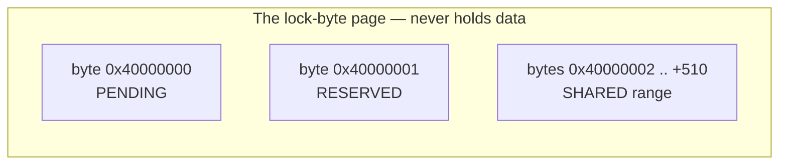

**Why a byte range and not a lock file?** POSIX advisory locks work on ranges of an open
file descriptor, need no extra file, and are released automatically when the process dies —
which is exactly what you want when a process crashes mid-transaction. A lock *file* would
be left behind and would need a liveness protocol.

**Why offset 1 GiB?** It had to be a location that (a) exists in the address space of any
file, and (b) is not data. Choosing 1 GiB means databases under 1 GiB never even allocate
that page; larger ones simply skip it.

### 5.2 The five states

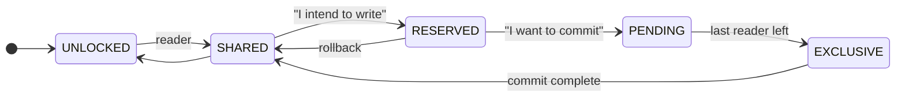

| Lock | How many | Readers allowed? | Writers allowed? |
|---|---|---|---|
| SHARED | many | yes | no |
| RESERVED | **one** | yes | no other writer |
| PENDING | one | existing only — **no new readers** | no |
| EXCLUSIVE | one | no | no |

**Why RESERVED exists:** a writer needs to modify pages in its cache long before it touches
the file. RESERVED says "I am the writer" without blocking readers, so read concurrency is
preserved for the whole (potentially long) modify phase.

**Why PENDING exists — the starvation argument:**

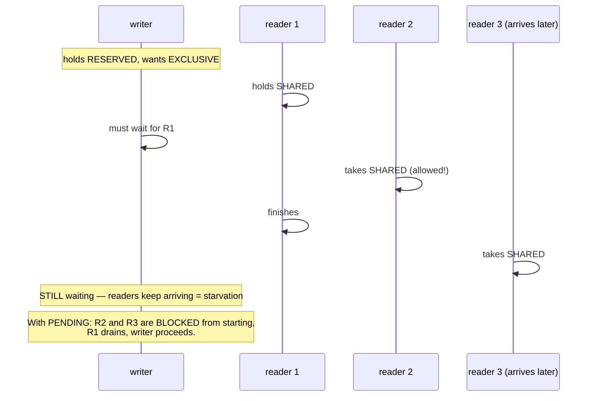

### 5.3 `SQLITE_BUSY` and the deadlock you cannot retry out of

```mermaid
sequenceDiagram
    participant A as connection A
    participant B as connection B
    A->>A: BEGIN (deferred); SELECT → SHARED
    B->>B: BEGIN (deferred); SELECT → SHARED
    A->>A: UPDATE → RESERVED (ok)
    B->>B: UPDATE → needs RESERVED → SQLITE_BUSY
    Note over B: Retrying is futile: B holds SHARED, which blocks A's<br/>upgrade to EXCLUSIVE. Each waits for the other.
    Note over A,B: SQLite returns BUSY immediately rather than deadlocking.<br/>FIX: BEGIN IMMEDIATE on both.
```

**The rule for application code:** if a transaction will write, open it with
`BEGIN IMMEDIATE`. Then the conflict happens at the start, where a busy handler can
usefully retry, instead of in the middle where nothing can help.

---

## Part 6 — LLD: hot journal detection and recovery

### 6.1 The four conditions

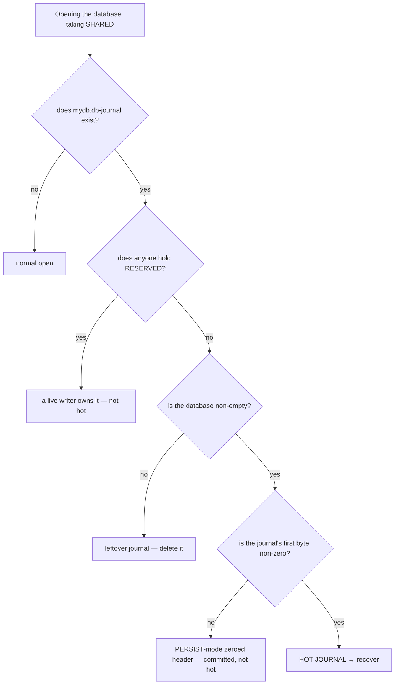

Each condition rules out a specific false positive:
- **RESERVED held** ⇒ another process is *currently* writing; its journal is not abandoned.
- **empty database** ⇒ the journal is a remnant of a file that was deleted, or the very
  first transaction rolling back; nothing to restore.
- **zeroed first byte** ⇒ `journal_mode=PERSIST` marks commit by zeroing the magic instead
  of unlinking.

### 6.2 Replay

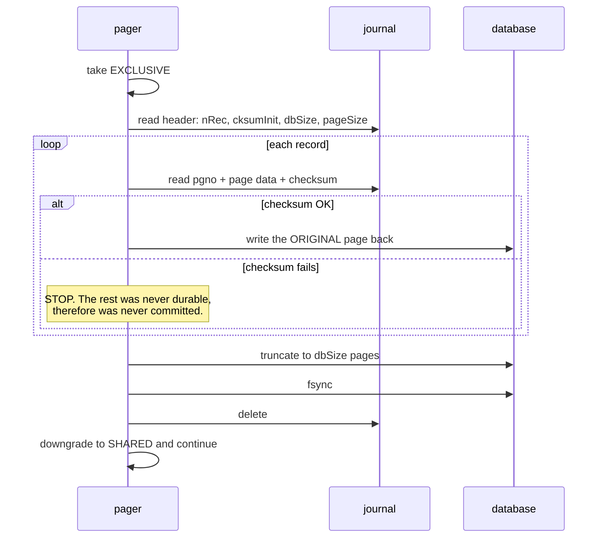

**Why a checksum failure is not an error:** it means the write was torn, which means the
commit point was never reached, which means the transaction must be undone — and stopping
the replay there does exactly that. The correct response to "damaged journal tail" is
"treat it as absent."

**Who recovers:** the next process to open the file. Not a daemon. That is the serverless
design showing through again.

---

## Part 7 — LLD: the page cache

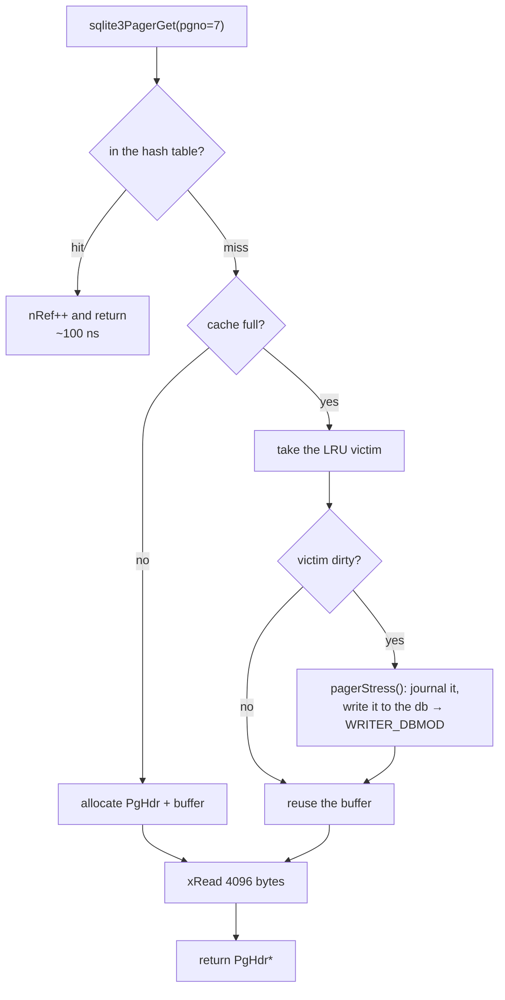

```c
typedef struct PgHdr {
  sqlite3_pcache_page *pPage;
  void *pData;              /* the 4096 raw bytes */
  void *pExtra;             /* the MemPage lives HERE — same allocation */
  PCache *pCache;
  PgHdr *pDirtyNext, *pDirtyPrev;
  Pager *pPager;
  Pgno pgno;
  u16 flags;                /* PGHDR_DIRTY, PGHDR_NEED_SYNC, PGHDR_WRITEABLE, ... */
  i16 nRef;                 /* pin count */
} PgHdr;
```

### 7.1 The flags are the protocol

| Flag | Meaning | Who sets it | Who clears it |
|---|---|---|---|
| `PGHDR_DIRTY` | differs from disk | `PcacheMakeDirty` | after it is written |
| `PGHDR_WRITEABLE` | its original is journalled ⇒ safe to modify | `pager_write` | at transaction end |
| `PGHDR_NEED_SYNC` | its journal record is **not yet synced** ⇒ must not be written to the db | `pager_write` | after the journal sync |
| `PGHDR_DONT_WRITE` | scratch page; discard instead of writing | b-tree | |

**`PGHDR_NEED_SYNC` is the journal-before-database rule, encoded as one bit per page.** The
ordering constraint from §4.4 is not enforced by a scheduler or a transaction manager — it
is one bit, checked before every page write.

### 7.2 Why `pExtra` matters

The b-tree's `MemPage` (parsed header, `nCell`, `cellOffset`, function pointers) is
allocated *inside* the cache entry. One `malloc` produces the cache bookkeeping, the parsed
view, and the raw bytes, contiguously.

```
┌───────────┬─────────────────────┬──────────────────────────┐
│  PgHdr    │ MemPage  (pExtra)   │  4096 bytes  (pData)     │
└───────────┴─────────────────────┴──────────────────────────┘
```

Without this, every page access would cost a second allocation and a second cache miss.

### 7.3 Cache sizing

```
PRAGMA cache_size = 2000;    -- 2000 PAGES
PRAGMA cache_size = -2000;   -- 2000 KiB (negative = kibibytes)
```

A too-small cache does not merely slow reads — it forces mid-transaction spills, which take
the EXCLUSIVE lock early and block every reader. Cache size is a *concurrency* setting as
much as a performance one.

---

## Part 8 — LLD: the VFS

### 8.1 The two structs

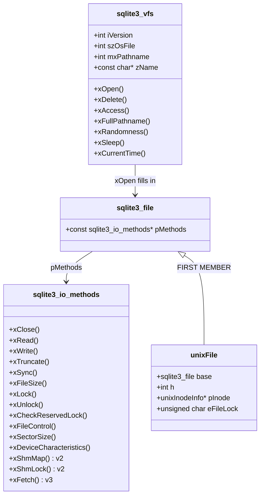

> **C sidebar.** `unixFile` starts with `sqlite3_file base;`, so `(sqlite3_file*)pUnixFile`
> is the same address. That is the entire polymorphism mechanism — see `C-FOR-SQLITE.md` §5
> and the verified demo output showing identical pointers.

### 8.2 `xSectorSize` and device characteristics — physics leaking upward

| Flag from `xDeviceCharacteristics` | What SQLite may skip |
|---|---|
| `SQLITE_IOCAP_ATOMIC512 … ATOMIC64K` | journalling entirely, if a page write of that size is atomic |
| `SQLITE_IOCAP_SAFE_APPEND` | a sync, because appended data lands before the size grows |
| `SQLITE_IOCAP_SEQUENTIAL` | a sync, because writes complete in order |
| `SQLITE_IOCAP_POWERSAFE_OVERWRITE` | journalling neighbours in the same sector |

**Why `xSectorSize` drives journal padding:** if two journal records shared a 4 KiB sector,
one torn sector write could damage both. SQLite pads the journal header to the sector size
and, when `sectorSize > pageSize`, journals every page in a sector together
(`pagerWriteLargeSector`).

This is the layer where hardware reality is admitted into the design, and it is why the
same source runs correctly on a spinning disk, an SSD, and an SD card with a 64 KiB erase
block.

### 8.3 The POSIX locking defect, and `unixInodeInfo`

> **Closing *any* file descriptor for a file releases *all* of that process's advisory
> locks on that file.**

This is a genuine flaw in the POSIX specification. Consider:

```mermaid
sequenceDiagram
    participant P as one process
    participant K as kernel
    P->>K: fd1 = open("db"); lock a range
    P->>K: fd2 = open("db")  (e.g. a second connection)
    P->>K: close(fd2)
    K-->>P: ALL locks held via fd1 are now GONE
    Note over P: another process can now write the database<br/>while this one still believes it holds a lock
```

SQLite's workaround: a global, mutex-protected table of `unixInodeInfo` keyed by
`(device, inode)`.

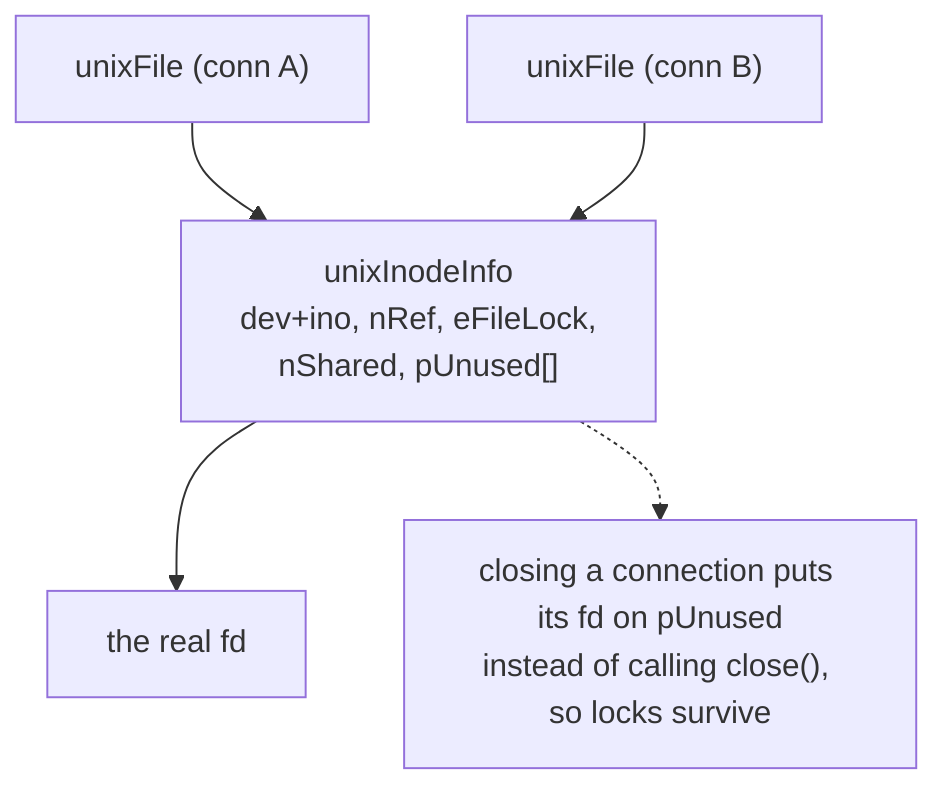

Two consequences you should remember forever:
1. **Never carry a SQLite connection across `fork()`.** The child inherits fds and the lock
   table becomes a lie.
2. **Never put a database on NFS** (use the `unix-dotfile` VFS if you truly must). NFS
   advisory locking is unreliable, and silent corruption follows.

### 8.4 Alternative VFSes

| Name | Locking strategy | Use case |
|---|---|---|
| `unix` | POSIX advisory locks | default |
| `unix-excl` | takes EXCLUSIVE once and keeps it | single process; enables heap-memory WAL index |
| `unix-dotfile` | a lock *file* | NFS and other broken-locking filesystems |
| `unix-none` | no locking | read-only media, or single-threaded certainty |
| `memdb` | none | `sqlite3_deserialize`, in-memory databases |

---

## Part 9 — Multi-database commits: the super-journal

With `ATTACH`, one transaction can span several files. A commit must be atomic across all
of them — classic two-phase commit.

```mermaid
sequenceDiagram
    participant T as transaction
    participant J1 as db1-journal
    participant J2 as db2-journal
    participant SJ as super-journal
    participant D1 as db1
    participant D2 as db2
    T->>J1: write originals, record the super-journal NAME
    T->>J2: write originals, record the super-journal NAME
    T->>SJ: create, listing both journals; fsync
    T->>D1: write + fsync
    T->>D2: write + fsync
    T->>SJ: DELETE  ← the single global commit point
    T->>J1: delete
    T->>J2: delete
```

**The recovery rule that makes it atomic:** a journal that names a super-journal is hot
**only if** that super-journal still exists *and* still lists this database. So after the
super-journal is deleted, every individual journal becomes inert — all databases are
committed simultaneously, by one `unlink`.

---

## Part 10 — Savepoints and statement journals

### 10.1 Why a statement journal must exist

```sql
UPDATE t SET x = x+1;   -- row 500 of 1000 violates a CHECK constraint
```

The default `ON CONFLICT ABORT` must undo **this statement** while keeping the enclosing
transaction alive. The main journal cannot help — it would undo everything.

So SQLite opens a **sub-journal** (often in memory, `memjournal.c`) recording pages changed
by the current statement.

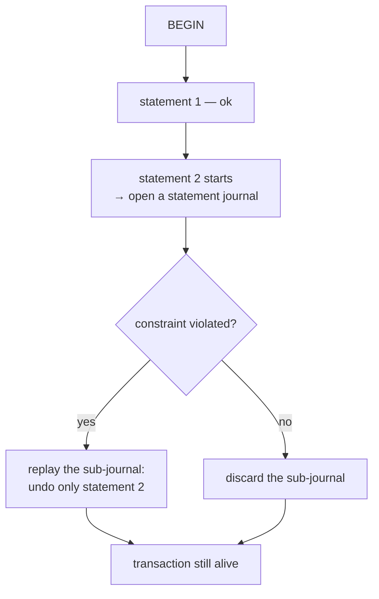

### 10.2 Savepoints generalize it

```c
struct PagerSavepoint {
  i64 iOffset;          /* where this savepoint starts in the main journal */
  Bitvec *pInSavepoint; /* pages written since the savepoint */
  Pgno nOrig;           /* database size at the savepoint */
  Pgno iSubRec;         /* first sub-journal record */
  u32 aWalData[4];      /* WAL frame counts (Phase 7) */
};
```

`ROLLBACK TO s` replays journal records from `iOffset` plus sub-journal records from
`iSubRec`. In WAL mode it just truncates the WAL back to a frame count — much cheaper.

### 10.3 `Bitvec`: the data structure worth stealing

`pInJournal` answers "have I already saved page N's original?" It must be O(1) and must not
allocate proportional to the database size.

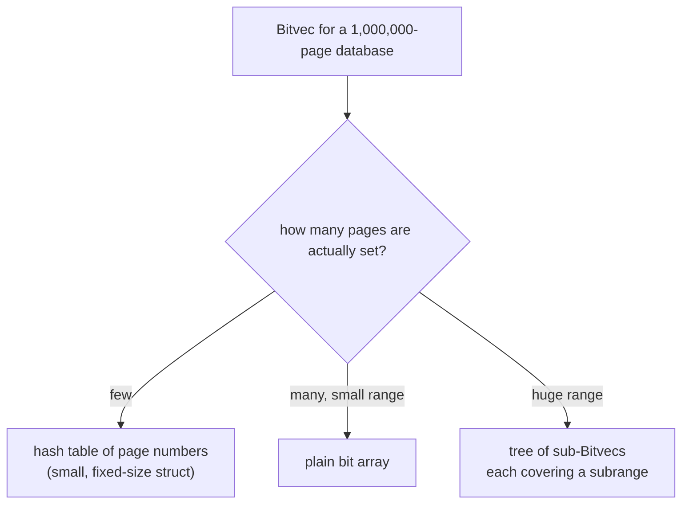

All three representations live in one fixed-size struct with a union. A transaction that
touches page 900,000 of a 1M-page database uses a few hundred bytes, not 125 KB.

---

## Part 11 — Memory-mapped I/O

`PRAGMA mmap_size=N` maps the first N bytes of the database; `xFetch`/`xUnfetch` then hand
the pager pointers directly into the mapping.

| | Normal I/O | mmap |
|---|---|---|
| Read cost | syscall + memcpy into the cache | pointer, no copy |
| Error handling | `xRead` returns a code | **`SIGBUS`** on I/O error — a crash, not an error |
| Writes | still go through `xWrite` | still go through `xWrite` |
| Memory accounting | SQLite's cache_size | the OS page cache |

It is off by default on most platforms because turning an I/O error into a fatal signal is
a poor trade for a database.

---

## Part 12 — Design decisions, collected

| Decision | Alternative | Why |
|---|---|---|
| undo log (journal), not redo, as the default | redo (WAL) | the database file is always "the truth"; recovery is simple and needs no index |
| commit point = an atomic FS operation | a "committed" flag in the db | you cannot atomically update a flag *and* the data |
| a random nonce per journal | a fixed checksum seed | stale records from a recycled journal would validate |
| journal the *originals*, not the *new* pages | redo logging | rollback is the common case for an aborted statement |
| do not journal pages beyond the original file size | journal everything | rollback can just truncate — appends become cheap |
| `PGHDR_NEED_SYNC` per page | a global "journal synced" flag | allows partial flushing during a cache spill |
| 5 lock states, not 2 | reader/writer only | RESERVED preserves read concurrency; PENDING prevents starvation |
| locks on a data-free byte range | a lock file | auto-released on process death; no cleanup protocol |
| the VFS as function pointers | `#ifdef` per platform | one porting surface; enables shims and fault injection |
| `unixInodeInfo` | trust POSIX | POSIX drops locks on any `close()` |
| replaceable page cache | one fixed implementation | embedded systems need fixed-budget, malloc-free caches |
| `Bitvec` hybrid | a plain bitmap | O(1) memory for sparse transactions |

---

## Part 13 — Misconceptions

| Belief | Reality |
|---|---|
| "COMMIT writes my data" | most pages were written earlier; COMMIT is the *journal delete* |
| "`write()` means it is saved" | it reaches the OS cache; only `fsync()` reaches the device |
| "a bigger cache is always better" | a bigger cache is better for reads; spills are what actually hurt |
| "readers block writers in SQLite" | in rollback mode they block only the final EXCLUSIVE step |
| "`SQLITE_BUSY` means retry" | for a deferred-transaction upgrade, retrying is futile — restart with `BEGIN IMMEDIATE` |
| "journal_mode=MEMORY is just faster" | it is *unsafe*: a process crash leaves an unrecoverable file |
| "recovery happens at crash time" | it happens at the next *open* |
| "the journal is a log of statements" | it is a list of page images |

---

## Part 14 — Code map

| Concern | Function | File |
|---|---|---|
| state machine spec | `assert_pager_state()` | `pager.c` |
| open a read transaction | `sqlite3PagerSharedLock()` | `pager.c` |
| hot journal test | `hasHotJournal()` | `pager.c` |
| replay | `pager_playback()`, `pager_playback_one_page()` | `pager.c` |
| begin write | `sqlite3PagerBegin()` | `pager.c` |
| mark page writeable | `sqlite3PagerWrite()`, `pager_write()` | `pager.c` |
| torn-sector handling | `pagerWriteLargeSector()` | `pager.c` |
| cache spill | `pagerStress()` | `pager.c` |
| commit | `sqlite3PagerCommitPhaseOne/Two()` | `pager.c` |
| journal finalization | `pager_end_transaction()` | `pager.c` |
| page cache | `sqlite3PcacheFetch()`, `pcache1Fetch()` | `pcache.c`, `pcache1.c` |
| sparse page set | `sqlite3BitvecSet/Test()` | `bitvec.c` |
| unix locking | `unixLock()`, `unixInodeInfo` | `os_unix.c` |
| in-memory journal | `sqlite3JournalOpen()` | `memjournal.c` |

Next: `2.code_walkthrough.md` reads `sqlite3PagerWrite`, `pager_write`, and
`hasHotJournal` line by line; `3.implementation.md` has you build a VFS that prints every
one of these operations as it happens.
