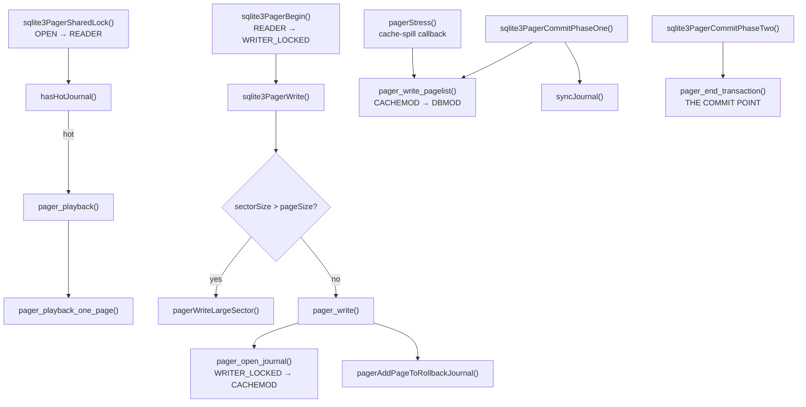

# Phase 2 — Reference: Pager, Locking, VFS

Struct bodies quoted from the 3.50.4 amalgamation; constants copied from the source.

---

## 1. Constants

### 1.1 Pager states (`pager.c`)

```c
#define PAGER_OPEN             0
#define PAGER_READER           1
#define PAGER_WRITER_LOCKED    2
#define PAGER_WRITER_CACHEMOD  3
#define PAGER_WRITER_DBMOD     4
#define PAGER_WRITER_FINISHED  5
#define PAGER_ERROR            6
```

| State | Lock | Database file holds | Journal |
|---|---|---|---|
| `PAGER_OPEN` | NONE/UNKNOWN | — | may be hot |
| `PAGER_READER` | SHARED | a consistent snapshot | none (or PERSIST leftovers) |
| `PAGER_WRITER_LOCKED` | RESERVED | unchanged | not yet created |
| `PAGER_WRITER_CACHEMOD` | RESERVED | **unchanged** | header written |
| `PAGER_WRITER_DBMOD` | EXCLUSIVE | **uncommitted data** | holds the originals |
| `PAGER_WRITER_FINISHED` | EXCLUSIVE | committed data | about to be finalized |
| `PAGER_ERROR` | any | unknown | unknown |

`assert_pager_state()` encodes the full legal transition table. Read that function once;
it is the specification.

### 1.2 Lock levels (`sqlite3.h`, passed to `xLock`/`xUnlock`)

```c
#define SQLITE_LOCK_NONE       0
#define SQLITE_LOCK_SHARED     1
#define SQLITE_LOCK_RESERVED   2
#define SQLITE_LOCK_PENDING    3
#define SQLITE_LOCK_EXCLUSIVE  4
```

### 1.3 Lock byte ranges (`sqliteInt.h`)

```c
#define PENDING_BYTE   0x40000000        /* 1 GiB */
#define RESERVED_BYTE  (PENDING_BYTE+1)
#define SHARED_FIRST   (PENDING_BYTE+2)
#define SHARED_SIZE    510
#define PENDING_BYTE_PAGE(pBt) ((Pgno)((PENDING_BYTE/((pBt)->pageSize))+1))
```

### 1.4 Journal modes

```c
#define PAGER_JOURNALMODE_QUERY     (-1)
#define PAGER_JOURNALMODE_DELETE      0   /* commit by deleting the journal   */
#define PAGER_JOURNALMODE_PERSIST     1   /* commit by zeroing the header     */
#define PAGER_JOURNALMODE_OFF         2   /* no journal                       */
#define PAGER_JOURNALMODE_TRUNCATE    3   /* commit by truncating to 0        */
#define PAGER_JOURNALMODE_MEMORY      4   /* journal in RAM — NOT CRASH SAFE  */
#define PAGER_JOURNALMODE_WAL         5   /* write-ahead log                  */
```

### 1.5 Synchronous levels

```c
#define PAGER_SYNCHRONOUS_OFF     0x01
#define PAGER_SYNCHRONOUS_NORMAL  0x02
#define PAGER_SYNCHRONOUS_FULL    0x03   /* the default */
#define PAGER_SYNCHRONOUS_EXTRA   0x04
#define PAGER_SYNCHRONOUS_MASK    0x07
```

### 1.6 Journal file format

```
JOURNAL HEADER, padded to JOURNAL_HDR_SZ(pPager) == pPager->sectorSize:
   8B magic      d9 d5 05 f9 20 a1 63 d7
   4B nRec       number of page records; 0xffffffff = "unknown, in flight"
   4B cksumInit  random nonce for this transaction
   4B dbSize     database size in pages BEFORE the transaction
   4B sectorSize
   4B pageSize
RECORD:
   4B page number | pageSize bytes of ORIGINAL data | 4B checksum
(a second HEADER + records may follow if the cache spilled mid-transaction)
```

### 1.7 Page-cache flags (`sqliteInt.h`)

```c
#define PGHDR_CLEAN       0x001   /* not on the dirty list */
#define PGHDR_DIRTY       0x002   /* on the dirty list */
#define PGHDR_WRITEABLE   0x004   /* journalled and ready to modify */
#define PGHDR_NEED_SYNC   0x008   /* fsync the journal before writing this page */
#define PGHDR_DONT_WRITE  0x010   /* discard rather than write */
#define PGHDR_MMAP        0x020   /* an mmap page object */
#define PGHDR_WAL_APPEND  0x040   /* appended to the wal file */
```

---

## 2. Structures

### 2.1 `Pager` — the configuration/state split (verbatim, abridged)

```c
struct Pager {
  sqlite3_vfs *pVfs;
  u8 exclusiveMode, journalMode, useJournal;
  u8 noSync, fullSync, extraSync, syncFlags, walSyncFlags;
  u8 tempFile, noLock, readOnly, memDb, memVfs;

  /* ---- members that change during routine operation ---- */
  u8 eState;                  /* OPEN, READER, WRITER_LOCKED, ... */
  u8 eLock;                   /* current lock on the database file */
  u8 changeCountDone;         /* the change counter has been bumped this txn */
  u8 setSuper;                /* the super-journal name is in the journal */
  u8 doNotSpill;              /* non-zero ⇒ the cache may not spill */
  u8 subjInMemory;            /* keep sub-journals in RAM */
  u8 bUseFetch;               /* use xFetch() (mmap) */
  Pgno dbSize;                /* current size in pages */
  Pgno dbOrigSize;            /* size BEFORE this transaction */
  Pgno dbFileSize;            /* size of the file on disk */
  int errCode;                /* sticky error */
  int nRec;                   /* pages journalled since the last header */
  u32 cksumInit;              /* the per-transaction nonce */
  u32 nSubRec;                /* records in the sub-journal */
  Bitvec *pInJournal;         /* ONE BIT PER PAGE: original already saved? */
  sqlite3_file *fd, *jfd, *sjfd;   /* database, journal, sub-journal */
  i64 journalOff, journalHdr;
  PagerSavepoint *aSavepoint; int nSavepoint;
  u32 iDataVersion;
  char dbFileVers[16];
  i64 szMmap; int nMmapOut;
  u16 nExtra;                 /* bytes added to each cached page (the MemPage) */
  i16 nReserve;               /* reserved bytes per page */
  ...
};
```

The comment block inside the struct is worth internalizing: fields are deliberately
partitioned into **configuration** (fixed at open or changed only by a mode switch) and
**state** (changes every transaction). When you patch the pager, knowing which half a field
belongs to tells you when it may be written.

| Field | Why it matters |
|---|---|
| `dbOrigSize` | pages beyond it need no journal record — rollback just truncates |
| `pInJournal` | the O(1) "already saved?" test; a `Bitvec`, so it is sparse |
| `cksumInit` | prevents stale records from a recycled journal validating |
| `errCode` | **sticky**: once set, every operation returns it |
| `doNotSpill` | guards regions where a cache spill would be unsafe |
| `nExtra` | space reserved in each cache entry for the b-tree's `MemPage` |
| `dbFileVers[16]` | bytes 24..39 of page 1; detects another process's write |

### 2.2 `PgHdr` — one cached page (verbatim)

```c
struct PgHdr {
  sqlite3_pcache_page *pPage;    /* Pcache object page handle */
  void *pData;                   /* Page data */
  void *pExtra;                  /* Extra content */
  PCache *pCache;                /* PRIVATE: Cache that owns this page */
  PgHdr *pDirty;                 /* Transient list of dirty sorted by pgno */
  Pager *pPager;
  Pgno pgno;
  u16 flags;                     /* PGHDR_* */
  /* private to pcache.c below this point */
  i64 nRef;                      /* Number of users of this page */
  PgHdr *pDirtyNext, *pDirtyPrev;
};
```

**`pExtra` is the b-tree's `MemPage`.** One allocation holds the cache bookkeeping, the
parsed page view, and the raw page bytes:

```
┌──────────┬───────────────────┬──────────────────────────────┐
│  PgHdr   │ MemPage (pExtra)  │ pageSize bytes (pData)       │
└──────────┴───────────────────┴──────────────────────────────┘
```

### 2.3 `PagerSavepoint`

```c
struct PagerSavepoint {
  i64 iOffset;          /* starting offset in the main journal */
  i64 iHdrOffset;
  Bitvec *pInSavepoint; /* pages written since this savepoint */
  Pgno nOrig;           /* database size at the savepoint */
  Pgno iSubRec;         /* index of the first sub-journal record */
  u32 aWalData[WAL_SAVEPOINT_NDATA];   /* WAL_SAVEPOINT_NDATA == 4 */
};
```

---

## 3. Function reference



| Concern | Function |
|---|---|
| open | `sqlite3PagerOpen()` |
| begin read | `sqlite3PagerSharedLock()` |
| hot-journal test | `hasHotJournal()` |
| recovery | `pager_playback()`, `pager_playback_one_page()`, `pager_delsuper()` |
| begin write | `sqlite3PagerBegin()` |
| make a page writeable | `sqlite3PagerWrite()`, `pager_write()` |
| torn-sector handling | `pagerWriteLargeSector()` |
| journal a page | `pagerAddPageToRollbackJournal()`, `subjournalPage()` |
| journal headers | `writeJournalHdr()`, `readJournalHdr()`, `zeroJournalHdr()` |
| checksum | `pager_cksum()` |
| flush dirty pages | `pager_write_pagelist()` |
| cache spill | `pagerStress()` |
| commit | `sqlite3PagerCommitPhaseOne()`, `sqlite3PagerCommitPhaseTwo()` |
| finalize | `pager_end_transaction()` |
| rollback | `sqlite3PagerRollback()` |
| savepoints | `sqlite3PagerOpenSavepoint()`, `sqlite3PagerSavepoint()` |
| change counter | `pager_write_changecounter()` |
| page cache | `sqlite3PcacheFetch()`, `FetchFinish()`, `MakeDirty()`, `MakeClean()`, `Release()`, `DirtyList()`, `Truncate()` |
| default cache | `pcache1Fetch()`, `pcache1Unpin()` |
| sparse page set | `sqlite3BitvecSet/Test/Clear/Create/Destroy()` |
| unix locking | `unixLock()`, `unixUnlock()`, `unixCheckReservedLock()` |
| unix inode table | `findInodeInfo()`, `releaseInodeInfo()`, `setPendingFd()` |

---

## 4. The commit protocol, as a checklist

```
 1. xLock(RESERVED)                      → WRITER_LOCKED
 2. open the journal, write its header   → WRITER_CACHEMOD
 3. for each page about to change:
      if pgno <= dbOrigSize and not already in pInJournal:
          write the ORIGINAL page to the journal; set PGHDR_NEED_SYNC
      else:
          nothing to journal (the page did not exist before)
      PcacheMakeDirty; set PGHDR_WRITEABLE
 4. xSync(journal)                        ← BARRIER 1: the originals are durable
 5. write nRec into the journal header
 6. xSync(journal)                        ← BARRIER 2: the count is durable
 7. xLock(PENDING) → xLock(EXCLUSIVE)     → WRITER_DBMOD
 8. write the change counter (page 1)
 9. write dirty pages to the database
10. xSync(database)                       ← BARRIER 3: the new data is durable
                                          → WRITER_FINISHED
11. finalize the journal                  ← THE COMMIT POINT
      DELETE   : xDelete(journal)  (+ directory sync if synchronous=EXTRA)
      TRUNCATE : xTruncate(journal, 0)
      PERSIST  : zero the 8-byte magic
12. xUnlock(SHARED) → xUnlock(NONE)       → READER → OPEN
```

**Barrier removal analysis** (the reason each sync exists):

| Remove | Failure |
|---|---|
| barrier 1 | the database may be modified while the originals are still only in the OS cache ⇒ power loss = **unrecoverable corruption** |
| barrier 2 | `nRec` may reach disk before the records ⇒ replay reads garbage as a record ⇒ **corruption** |
| barrier 3 | the journal may be deleted while the new data is only in the OS cache ⇒ power loss leaves **neither old nor new** |

---

## 5. Hot-journal detection — the four conditions

```
1. the file <db>-journal exists                          (xAccess)
2. no process holds a RESERVED lock                      (xCheckReservedLock)
3. the database file is non-empty                        (pagerPagecount)
4. the journal's first byte is non-zero                  (xRead 1 byte at offset 0)
```

Each rules out one false positive: (2) a live writer, (3) a leftover journal for a deleted
database, (4) a PERSIST-mode journal whose header was zeroed at commit.

The source documents a **known benign race** between (1) and (2) — another process could
delete the journal and drop its lock in between, producing a false positive. That costs a
harmless replay. A false *negative* is impossible, which is what matters.

---

## 6. VFS reference

### 6.1 The two method tables

```c
struct sqlite3_vfs {
  int iVersion;              /* 1, 2 or 3 */
  int szOsFile;              /* size of the subclassed sqlite3_file */
  int mxPathname;
  sqlite3_vfs *pNext;
  const char *zName;         /* "unix", "unix-excl", "win32", "memdb", ... */
  void *pAppData;
  int (*xOpen)(sqlite3_vfs*, const char *zName, sqlite3_file*, int flags, int *pOut);
  int (*xDelete)(sqlite3_vfs*, const char *zName, int syncDir);
  int (*xAccess)(sqlite3_vfs*, const char *zName, int flags, int *pResOut);
  int (*xFullPathname)(sqlite3_vfs*, const char *zName, int nOut, char *zOut);
  void *(*xDlOpen)(...); void (*xDlError)(...); void (*xDlSym)(...); void (*xDlClose)(...);
  int (*xRandomness)(sqlite3_vfs*, int nByte, char *zOut);
  int (*xSleep)(sqlite3_vfs*, int microseconds);
  int (*xCurrentTime)(sqlite3_vfs*, double*);
  int (*xGetLastError)(sqlite3_vfs*, int, char *);
  int (*xCurrentTimeInt64)(sqlite3_vfs*, sqlite3_int64*);       /* v2 */
  /* v3: xSetSystemCall, xGetSystemCall, xNextSystemCall */
};

struct sqlite3_io_methods {
  int iVersion;
  int (*xClose)(sqlite3_file*);
  int (*xRead)(sqlite3_file*, void*, int iAmt, sqlite3_int64 iOfst);
  int (*xWrite)(sqlite3_file*, const void*, int iAmt, sqlite3_int64 iOfst);
  int (*xTruncate)(sqlite3_file*, sqlite3_int64 size);
  int (*xSync)(sqlite3_file*, int flags);
  int (*xFileSize)(sqlite3_file*, sqlite3_int64 *pSize);
  int (*xLock)(sqlite3_file*, int);
  int (*xUnlock)(sqlite3_file*, int);
  int (*xCheckReservedLock)(sqlite3_file*, int *pResOut);
  int (*xFileControl)(sqlite3_file*, int op, void *pArg);
  int (*xSectorSize)(sqlite3_file*);
  int (*xDeviceCharacteristics)(sqlite3_file*);
  int (*xShmMap)(sqlite3_file*, int iPg, int pgsz, int, void volatile**);  /* v2 */
  int (*xShmLock)(sqlite3_file*, int offset, int n, int flags);            /* v2 */
  void (*xShmBarrier)(sqlite3_file*);                                      /* v2 */
  int (*xShmUnmap)(sqlite3_file*, int deleteFlag);                         /* v2 */
  int (*xFetch)(sqlite3_file*, sqlite3_int64 iOfst, int iAmt, void **pp);  /* v3 */
  int (*xUnfetch)(sqlite3_file*, sqlite3_int64 iOfst, void *p);            /* v3 */
};
```

### 6.2 Writing a shim — the three rules

```c
typedef struct MyFile MyFile;
struct MyFile {
  sqlite3_file base;      /* 1. MUST be first — SQLite casts to sqlite3_file* */
  sqlite3_file *pReal;
  ...your state...
};

myVfs.szOsFile = sizeof(MyFile) + pRoot->szOsFile;   /* 2. room for both */
myMethods.iVersion = 2;                              /* 3. claim only what you implement */
```

Breaking rule 1 = silent memory corruption. Breaking rule 2 = heap overflow. Breaking
rule 3 = a NULL function pointer call (claim 3 with `xFetch==0` and mmap crashes; claim 1
and WAL silently will not work because `xShmMap` is never called).

### 6.3 Sync flags

```c
#define SQLITE_SYNC_NORMAL    0x00002
#define SQLITE_SYNC_FULL      0x00003
#define SQLITE_SYNC_DATAONLY  0x00010
```

### 6.4 Device characteristics — what each lets SQLite skip

| Flag | Permits |
|---|---|
| `SQLITE_IOCAP_ATOMIC` / `ATOMIC512` … `ATOMIC64K` | skipping the journal when a page write of that size is atomic |
| `SQLITE_IOCAP_SAFE_APPEND` | skipping a sync — appended data lands before the size grows |
| `SQLITE_IOCAP_SEQUENTIAL` | skipping a sync — writes complete in order |
| `SQLITE_IOCAP_POWERSAFE_OVERWRITE` | not journalling neighbours in the same sector |
| `SQLITE_IOCAP_UNDELETABLE_WHEN_OPEN` | affects journal handling (Windows) |
| `SQLITE_IOCAP_IMMUTABLE` | the file cannot change ⇒ no locking |
| `SQLITE_IOCAP_BATCH_ATOMIC` | F2FS batch-atomic writes (`BEGIN/COMMIT_ATOMIC_WRITE`) |

### 6.5 File-control opcodes worth knowing

```
SQLITE_FCNTL_LOCKSTATE        SQLITE_FCNTL_SIZE_HINT       SQLITE_FCNTL_CHUNK_SIZE
SQLITE_FCNTL_SYNC             SQLITE_FCNTL_COMMIT_PHASETWO SQLITE_FCNTL_PERSIST_WAL
SQLITE_FCNTL_POWERSAFE_OVERWRITE  SQLITE_FCNTL_PRAGMA      SQLITE_FCNTL_VFSNAME
SQLITE_FCNTL_BEGIN_ATOMIC_WRITE   SQLITE_FCNTL_COMMIT_ATOMIC_WRITE
SQLITE_FCNTL_DATA_VERSION     SQLITE_FCNTL_RESERVE_BYTES   SQLITE_FCNTL_FILE_POINTER
```
`SQLITE_FCNTL_PRAGMA` is how a VFS can implement its own pragmas — the hook SEE and
SQLCipher use for `PRAGMA key`.

### 6.6 Built-in unix VFSes

| Name | Locking | Use |
|---|---|---|
| `unix` | POSIX advisory byte-range | default |
| `unix-excl` | takes EXCLUSIVE once and keeps it | single process; enables a heap-memory WAL index (no `-shm`) |
| `unix-dotfile` | a lock *file* | NFS and other filesystems with broken locking |
| `unix-flock` | `flock(2)` | |
| `unix-none` | none | read-only media, or provable single access |
| `memdb` | none | `sqlite3_deserialize`, in-memory databases |

### 6.7 The POSIX locking defect

> Closing **any** file descriptor for a file releases **all** of that process's advisory
> locks on that file.

Worked around by a global table of `unixInodeInfo`, keyed by `(device, inode)`:

```c
struct unixInodeInfo {
  struct unixFileId fileId;   /* device and inode */
  int nShared;                /* # of SHARED locks held by THIS PROCESS */
  unsigned char eFileLock;    /* highest lock held by this process */
  int nRef;                   /* # of unixFile pointing here */
  UnixUnusedFd *pUnused;      /* fds deferred from close() */
  ...
};
```

Consequences: never carry a connection across `fork()`; never put a database on NFS
without `unix-dotfile`; intra-process contention is resolved in this table, not by the
kernel.

---

## 7. Invariants

1. `sqlite3PagerWrite()` may only be called when `eState >= PAGER_WRITER_LOCKED`.
2. A page with `PGHDR_NEED_SYNC` set must **never** be written to the database file.
3. `PGHDR_WRITEABLE` is set only **after** the original has been journalled.
4. Pages with `pgno > dbOrigSize` are never journalled (rollback truncates instead).
5. `pInJournal` has a bit set for exactly the pages whose originals are in the journal.
6. Once `errCode` is set, every pager entry point returns it until the pager is reset.
7. In `WRITER_DBMOD` the lock is EXCLUSIVE — no exceptions.
8. The journal is finalized (commit point) **only** in `PAGER_WRITER_FINISHED`.
9. `dbSize`, `dbOrigSize`, and `dbFileSize` are equal outside a write transaction.
10. A hot journal is only replayed while holding EXCLUSIVE.

---

## 8. Gotchas

1. **`journal_mode=WAL` is persistent** (stored in header bytes 18/19); all other journal
   modes are per-connection.
2. **`journal_mode=MEMORY` + a process crash = corruption.** Never in production.
3. A **cache spill** promotes you to EXCLUSIVE early, blocking readers for the rest of the
   transaction. Cache size is a concurrency setting.
4. `SQLITE_BUSY` from a deferred-transaction upgrade is **not retryable** — restart with
   `BEGIN IMMEDIATE`.
5. The busy handler is **not** invoked for a lock upgrade that would deadlock.
6. `synchronous=NORMAL` can corrupt in rollback mode but only loses recent transactions in
   WAL mode. Same pragma, different guarantee.
7. `sqlite3_close()` returns `SQLITE_BUSY` with unfinalized statements; use
   `sqlite3_close_v2()`.
8. Temp files (sorter, sub-journal) go through the VFS with `zName == NULL` — a shim must
   handle that.
9. `mmap_size > 0` turns an I/O error into `SIGBUS`.
10. `PRAGMA locking_mode=EXCLUSIVE` keeps EXCLUSIVE across transactions: a large speedup
    for single-writer apps, and it lets WAL run with no `-shm` file.
11. A VFS shim that forgets to forward `xFileControl` breaks `PRAGMA` handling and
    `SQLITE_FCNTL_SIZE_HINT` performance hints.
12. `xSectorSize()` returning a value larger than the page size forces
    `pagerWriteLargeSector()` — journalling whole sectors. A shim returning a wrong large
    value silently multiplies write amplification.

---

## 9. Pragmas and observability

```sql
PRAGMA journal_mode = DELETE|TRUNCATE|PERSIST|MEMORY|OFF|WAL;
PRAGMA synchronous  = OFF|NORMAL|FULL|EXTRA;
PRAGMA locking_mode = NORMAL|EXCLUSIVE;
PRAGMA cache_size   = 2000;    -- pages;  negative = kibibytes
PRAGMA cache_spill  = ON|OFF|N;
PRAGMA journal_size_limit = N;
PRAGMA mmap_size = N;
PRAGMA busy_timeout = ms;
PRAGMA temp_store = FILE|MEMORY;
PRAGMA secure_delete = ON|OFF|FAST;
PRAGMA data_version;           -- changes when ANOTHER connection commits
```
```c
sqlite3_db_status(db, SQLITE_DBSTATUS_CACHE_USED, ...);
sqlite3_db_status(db, SQLITE_DBSTATUS_CACHE_HIT/_MISS/_WRITE/_SPILL, ...);
sqlite3_status(SQLITE_STATUS_PAGECACHE_USED, ...);
sqlite3_file_control(db, "main", SQLITE_FCNTL_LOCKSTATE, &x);
sqlite3_busy_timeout(db, ms);  sqlite3_busy_handler(db, cb, arg);
```

`SQLITE_DBSTATUS_CACHE_SPILL` is the counter to watch when diagnosing unexpected lock
contention.

---

## 10. Debug recipes

```
(lldb) b sqlite3PagerWrite
(lldb) b pager_write_pagelist
(lldb) b sqlite3PagerCommitPhaseOne
(lldb) b sqlite3PagerCommitPhaseTwo
(lldb) b hasHotJournal
(lldb) p pPager->eState     # 0 OPEN 1 READER 2 WLOCKED 3 CACHEMOD 4 DBMOD 5 FINISHED 6 ERROR
(lldb) p pPager->eLock      # 0 NONE 1 SHARED 2 RESERVED 3 PENDING 4 EXCLUSIVE
(lldb) p pPager->journalMode
(lldb) p pPager->dbSize
(lldb) p pPager->dbOrigSize
(lldb) p/x pPg->flags       # PGHDR_*
```

```sh
# watch every OS call, including the sync barriers
labs/phase02/tracevfs delete
labs/phase02/tracevfs wal

# decode a live journal
tool/showjournal mydb.db-journal
xxd -l 64 mydb.db-journal
```

---

## 11. Canonical documentation

`sqlite.org/atomiccommit.html` — the commit protocol, in the authors' words.
`sqlite.org/lockingv3.html` — the lock state machine.
`sqlite.org/vfs.html`, `sqlite.org/c3ref/vfs.html`, `c3ref/io_methods.html`.
`sqlite.org/howtocorrupt.html` — every known corruption cause.
`sqlite.org/pragma.html` — every pragma.
