# Phase 3 — The B-Tree

C you need first: `C-FOR-SQLITE.md` §3 (pointer arithmetic), §5 (first-member), §6
(function pointers), §13 (`memmove`), §18 (disk costs). This phase is the hardest in the
course; budget two weeks.

---

## Part 1 — Why a B-tree, derived from first principles

### 1.1 The physical constraint

```
RAM random access        ~100,000,000 ops/s     (10 ns)
NVMe SSD random 4 KiB      ~500,000 ops/s        (2 µs)
SATA SSD random 4 KiB       ~50,000 ops/s       (20 µs)
Spinning disk random          ~100 ops/s        (10 ms)
```

Reading 1 byte from disk costs the same as reading 4096 bytes: the device transfers whole
blocks. **So the only quantity that matters is the number of random block reads.**

Every data structure decision below is an answer to: *how few blocks can we touch to find
one row among 100 million?*

### 1.2 Candidate structures

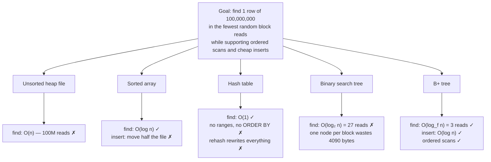

### 1.3 Fan-out is the entire answer

A binary tree makes one decision per block read. A B-tree makes ~500.

```
binary tree over 100M rows:  log₂(10⁸)   ≈ 27 block reads
B-tree,   fan-out 500:       log₅₀₀(10⁸) ≈ 3  block reads
```

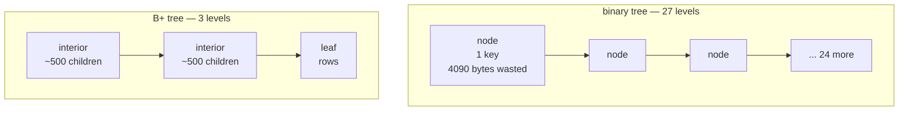

**So: pack as many decisions as possible into one block.** That is the definition of a
B-tree, and everything else in `btree.c` is bookkeeping in service of it.

### 1.4 SQLite's two variants

| | Table b-tree | Index b-tree |
|---|---|---|
| Key | 64-bit rowid | a record (indexed columns + rowid) |
| Data | the row, in the leaves | none — key only |
| Interior pages hold | child pointer + separator rowid, **no payload** | child pointer + **the full key** |
| Comparison | integer compare | `sqlite3VdbeRecordCompare` with a `KeyInfo` |
| Shape | B+tree (data only in leaves) | B-tree-ish; keys appear at all levels |

**Why interior table pages carry no payload:** it maximizes fan-out for the most common
access. An interior table cell is ~6 bytes, so ~500 children fit. An index interior cell
carries a possibly-long key, so fan-out drops and the tree is deeper — which is exactly why
a rowid lookup is cheaper than an index lookup even before the extra table fetch.

---

## Part 2 — HLD: what the b-tree layer provides

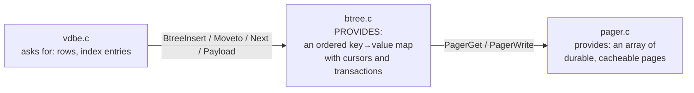

The whole public surface is about 40 functions in five groups:

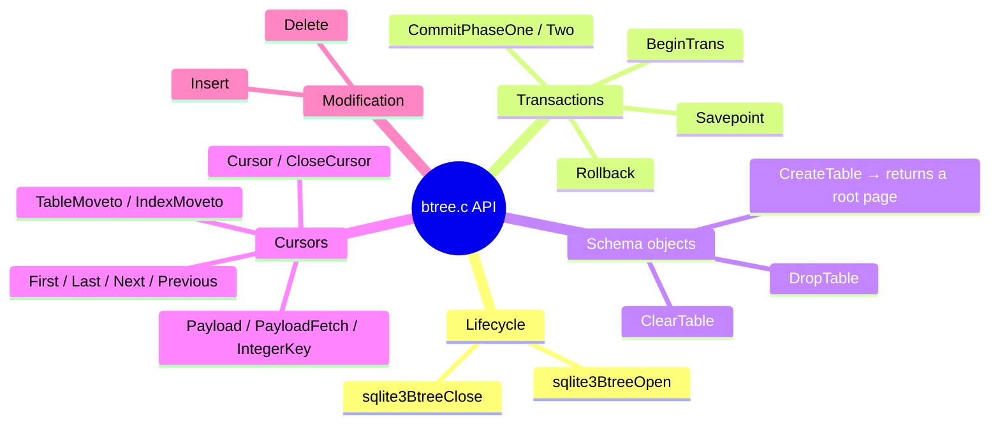

**It knows nothing about SQL.** No columns, no types, no affinity, no collation *policy* —
only a comparison callback. That separation is why you can read this phase without any of
Phases 4–6.

---

## Part 3 — LLD: the objects

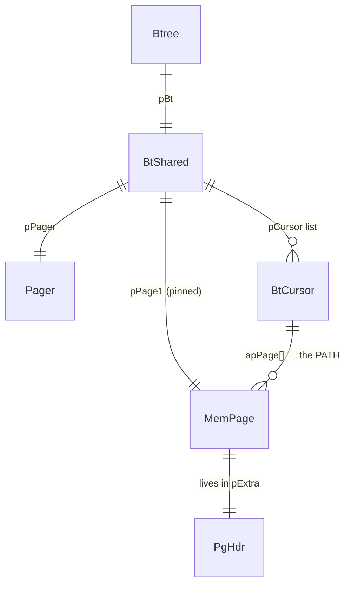

### 3.1 `MemPage` — a parsed view of one page

```c
struct MemPage {
  u8 isInit;            /* has this page been parsed? */
  u8 intKey;            /* table b-tree (integer key) */
  u8 intKeyLeaf;        /* leaf of a table b-tree ⇒ has payload */
  u8 leaf;
  u8 hdrOffset;         /* 100 for page 1, else 0  ← absorbs the page-1 special case */
  u8 childPtrSize;      /* 0 for leaf, 4 for interior */
  u16 maxLocal, minLocal;   /* the SPILL FORMULA, precomputed per page type */
  u16 cellOffset;       /* where the cell pointer array starts */
  int nFree;            /* free bytes; -1 = "not computed yet" */
  u16 nCell;
  u16 maskPage;         /* pageSize-1, for offset masking without division */
  u16 aiOvfl[];  u8 *apOvfl[];  u8 nOverflow;   /* cells that did not fit YET */
  u8 *aData;            /* the raw page bytes */
  u8 *aCellIdx;         /* cached pointer to the pointer array */
  void (*xParseCell)(MemPage*, u8*, CellInfo*);   /* set by decodeFlags */
  u16 (*xCellSize)(MemPage*, u8*);
  DbPage *pDbPage;  BtShared *pBt;  u32 pgno;
};
```

Three design points:

1. **`hdrOffset`** removes an `if (pgno==1)` from every single format access.
2. **`maxLocal`/`minLocal`** are the spill formula from Phase 1, evaluated once per page
   instead of per cell.
3. **`xParseCell`/`xCellSize`** are function pointers installed by `decodeFlags()` based on
   the page type byte. Four cell formats, zero per-cell branches.

> **C sidebar — why function pointers beat a switch here.** A `switch(pageType)` inside
> the cell loop costs a branch per cell and defeats the branch predictor when pages of
> different types interleave. Installing the pointer once per page turns it into an
> indirect call whose target is stable for the whole loop. See `C-FOR-SQLITE.md` §6.

### 3.2 `BtCursor` — the cursor *is* the path

```c
struct BtCursor {
  u8 eState;                          /* VALID / INVALID / SKIPNEXT / REQUIRESEEK / FAULT */
  u8 curFlags;                        /* BTCF_WriteFlag, BTCF_ValidNKey, BTCF_AtLast, ... */
  i64 nKey;                           /* rowid, or the size of pKey */
  Pgno pgnoRoot;
  CellInfo info;                      /* the parsed cell at the current position */
  void *pKey;                         /* SAVED key when eState == REQUIRESEEK */
  KeyInfo *pKeyInfo;                  /* collations; NULL for table cursors */
  i8 iPage;                           /* current depth */
  MemPage *pPage;                     /* == apPage[iPage] */
  MemPage *apPage[BTCURSOR_MAX_DEPTH-1];/* THE PATH from the root */
  u16 aiIdx[BTCURSOR_MAX_DEPTH-1];    /* which cell we descended through at each level */
  u16 ix;                             /* cell index on the current page */
};
```

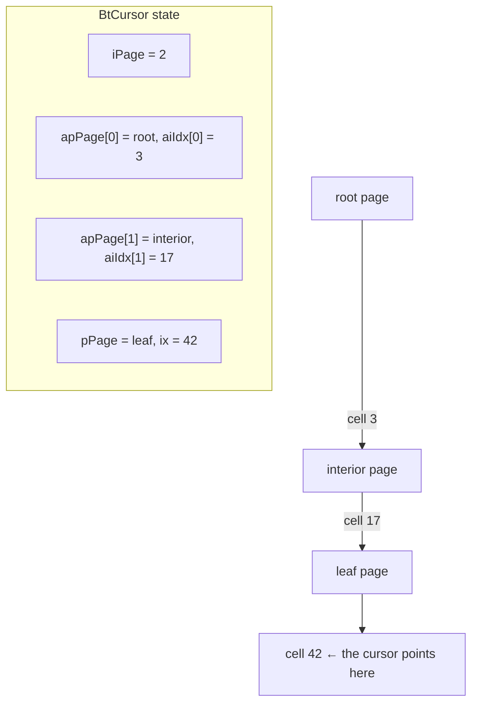

**Why store the whole path rather than just the leaf?** Because leaves have no sibling
pointers. `BtreeNext()` at the end of a leaf must climb to the parent and descend into the
next child — which requires knowing *which* child it came from. `aiIdx[]` is that memory.

`BTCURSOR_MAX_DEPTH` is 20. A file claiming a deeper tree is rejected as corrupt; 20 levels
at fan-out 500 is 500²⁰ entries, far beyond any real database.

### 3.3 Cursor states

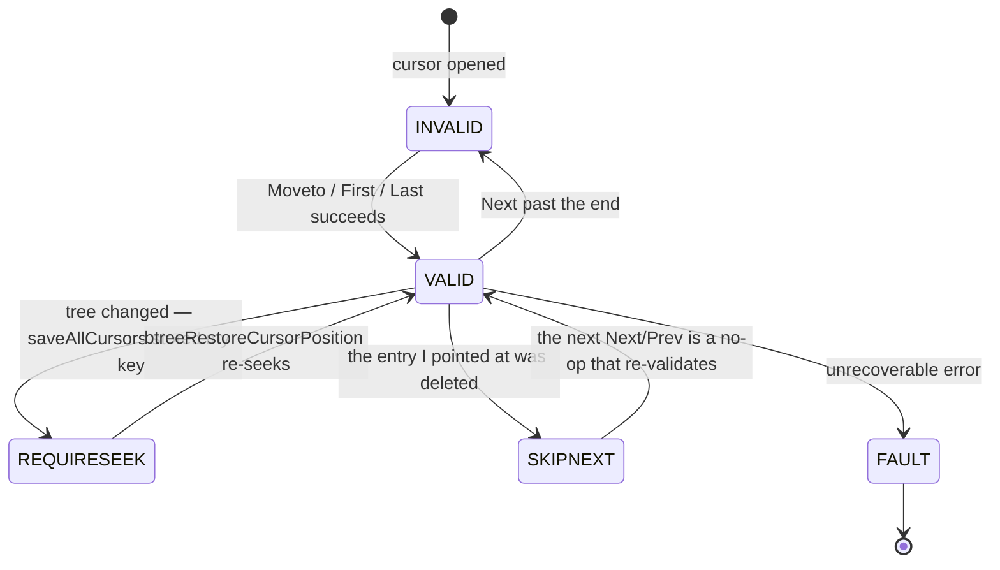

**`CURSOR_REQUIRESEEK` is the mechanism that makes concurrent cursors safe**, and it is
worth understanding deeply because it looks strange at first.

The problem:
```sql
UPDATE t SET b = b+1 WHERE a > 5;
```
One cursor reads; another writes the same b-tree. The writer's `balance()` can move the
reader's page, split it, or free it. The reader is holding a `MemPage*` that may now be
garbage.

Three possible solutions, and why SQLite picked the third:

| Solution | Cost |
|---|---|
| Pin every page a cursor touches | a long scan pins the whole tree; the cache cannot evict |
| Forbid read+write on one tree | breaks ordinary `UPDATE ... WHERE` |
| **Demote other cursors to "I know my key; I will find it again"** | one key copy per affected cursor, re-seek only if it is used again |

```mermaid
sequenceDiagram
    participant W as writer cursor
    participant S as saveAllCursors
    participant R as reader cursor
    W->>S: about to balance() — save everyone else
    S->>R: copy the current key into pKey; eState = REQUIRESEEK; release pages
    W->>W: split pages freely — no one holds stale pointers
    R->>R: next use → btreeRestoreCursorPosition() re-seeks by pKey
    Note over R: correct position even though the tree changed shape
```

---

## Part 4 — LLD: search

### 4.1 The algorithm

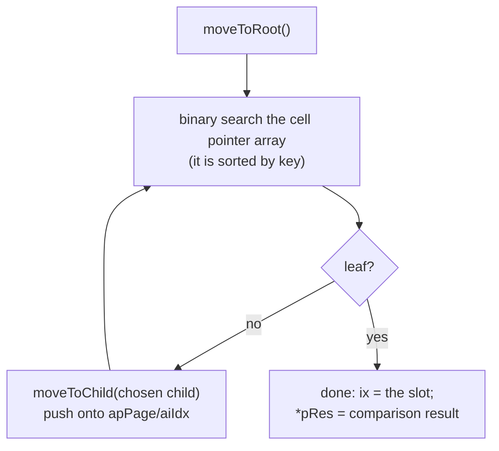

Cost: one page read per level, plus `log₂(nCell)` in-page comparisons per level. With
fan-out 500 and 100M rows: **3 page reads, ~27 comparisons** — and the comparisons are on
pages already in RAM, so they are free relative to the I/O.

### 4.2 Two shortcuts before the search even starts

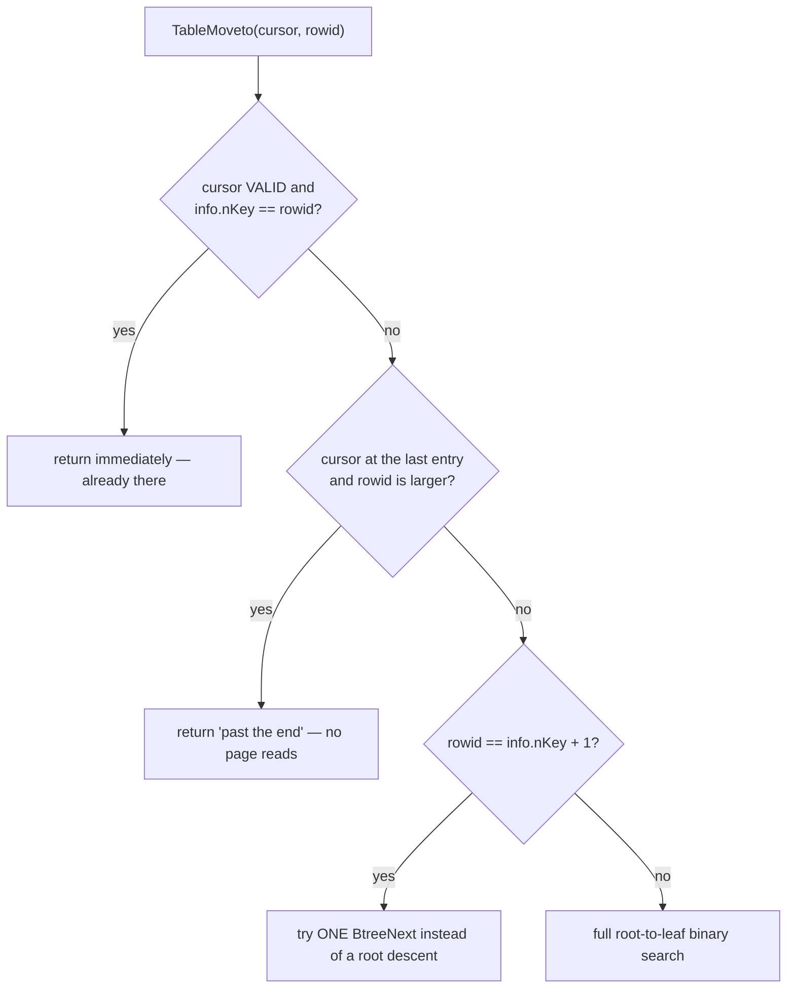

These are not micro-optimizations; they change the complexity class of common workloads:
- **Already there:** `OP_SeekRowid` then `OP_Column` then `OP_Insert` all use the same
  cursor. Without this, each would redescend.
- **Past the end:** appending rows becomes O(1) per row at the cursor level.
- **Key+1:** sequential scans with per-row lookups become O(1) amortized.

The source comment is explicit that these are *only* optimizations — remove them and you
get the same answers, slower. That is the pattern for every optimization in SQLite.

### 4.3 Comparison: two worlds

| | Table b-tree | Index b-tree |
|---|---|---|
| Compare | `nCellKey < intKey` — integer | `sqlite3VdbeRecordCompare(nKey, pKey, pUnpacked)` |
| Needs | nothing | `KeyInfo`: collation per column, DESC flags |
| Specialized variants | the rowid varint is decoded inline | `vdbeRecordCompareInt`, `vdbeRecordCompareString` chosen at prepare time |

Choosing a specialized comparison function at prepare time, based on the first key column's
type, is the same "decide once, dispatch cheaply" pattern as `xParseCell`.

---

## Part 5 — LLD: insert

### 5.1 The flow

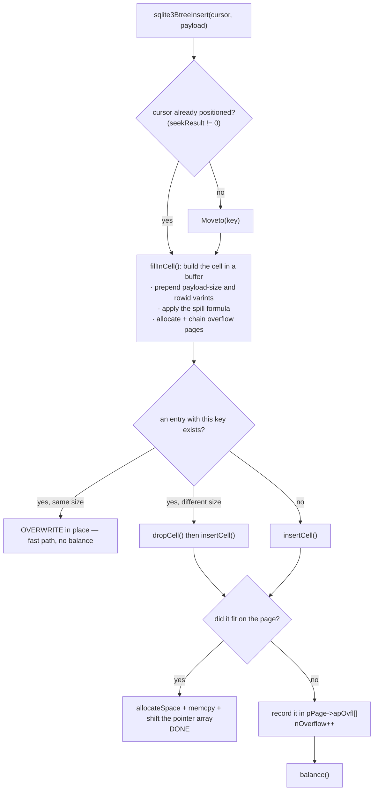

### 5.2 The overflow-cell trick

When a cell does not fit, `insertCell` does **not** split the page. It stores the cell in a
small in-memory array on the `MemPage` and returns.

**Why:** splitting is complicated and needs the parent, siblings, and possibly a new tree
level. Mixing that into `insertCell` would make both functions unreadable. Instead:

```
insertCell's contract:  "the cell is now logically on this page"
                        (physically it may be in apOvfl[])
balance()'s contract:   "make every page physically valid"
```

A page in the `nOverflow > 0` state is **temporarily illegal** and must be repaired before
anything else touches it. `balance()` is called immediately after.

### 5.3 `allocateSpace` — the in-page allocator

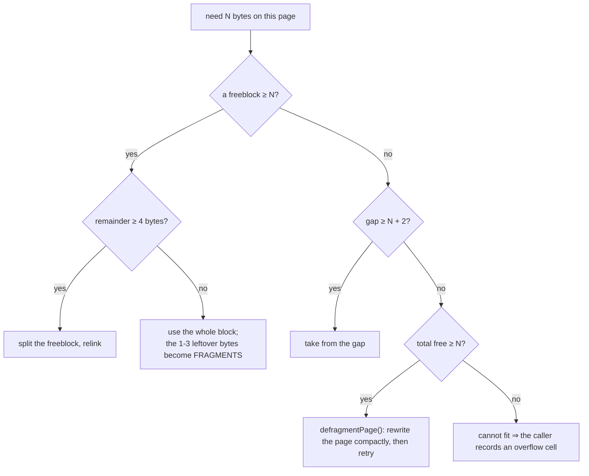

This is `malloc` on 4 KiB. The same trade-offs apply: free-list reuse, fragmentation, and
compaction when fragments exceed 60 bytes.

---

## Part 6 — LLD: `balance()`, the heart of the module

### 6.1 The dispatcher

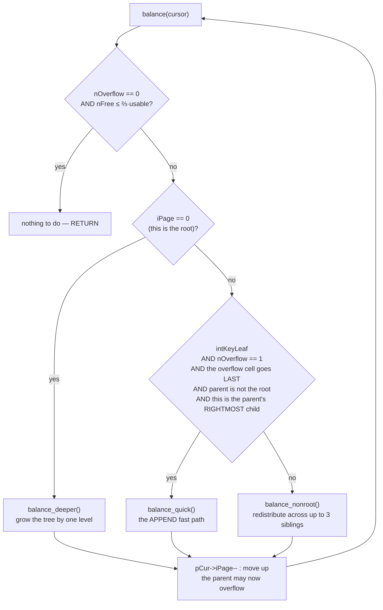

### 6.2 The fill policy, stated exactly

```c
if( pPage->nOverflow==0 && pPage->nFree*3 <= (int)pCur->pBt->usableSize*2 ) break;
```

Rearranged: **do nothing unless there is an overflow cell, or the page is less than about
one-third full.**

**Why not the textbook 50% minimum?**

| Strict 50% invariant | SQLite's lazy policy |
|---|---|
| every delete may trigger a merge | most deletes touch one page |
| more structural writes ⇒ more journal I/O | fewer writes |
| tighter packing | looser packing, reclaimed by `VACUUM` |

SQLite trades space for write amplification, because writes cost fsyncs and space is cheap.

### 6.3 `balance_quick` — why sequential inserts are ~100% dense

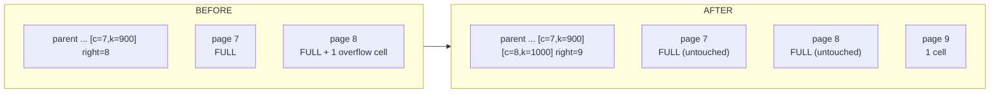

The five conditions decoded as prose: *"one new cell, larger than every existing key, on
the rightmost leaf of a rowid table."* That is `INSERT` with an auto-assigned rowid — the
most common write in any application.

Instead of splitting 50/50, allocate a fresh page for the single new cell and leave the
full page alone.

**The measured consequence.** Your `labs/phase03/minibtree.c` uses a naive midpoint split
and produces, verified:

```
mode=sequential inserted=50000 | leaves=6099 | avg leaf fill=45.5%  splits=6648
mode=random     inserted=50000 | leaves=3803 | avg leaf fill=67.8%  splits=4033
```

**Sequential inserts are *worse* than random** with a midpoint split, because every split
leaves a permanently half-empty page behind and never revisits it. Real SQLite is the
opposite way round precisely because of `balance_quick`. Lab 3.1a has you implement it and
watch the number jump.

**Design lesson:** the common case deserves its own code path. A generic algorithm that is
"correct for everything" was pessimal for the single most frequent operation.

### 6.4 `balance_deeper` — growing the tree without moving the root

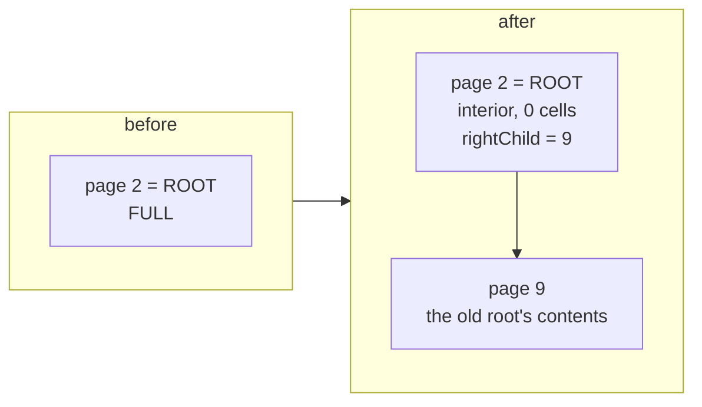

**Why copy down instead of promoting a new page?** Because `sqlite_schema.rootpage` records
the root page number, and so do all cached `Table`/`Index` objects and every open cursor.
Changing it would require updating the schema inside the same transaction. Copying the
*contents* down keeps the root page number stable forever.

### 6.5 `balance_nonroot` — the real algorithm

Not a 50/50 split: a **redistribution across up to 3 siblings into up to 5 pages**.

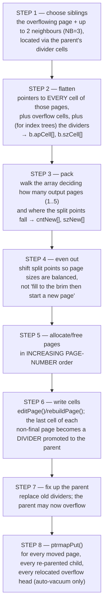

**Why 3 siblings and not 2?**

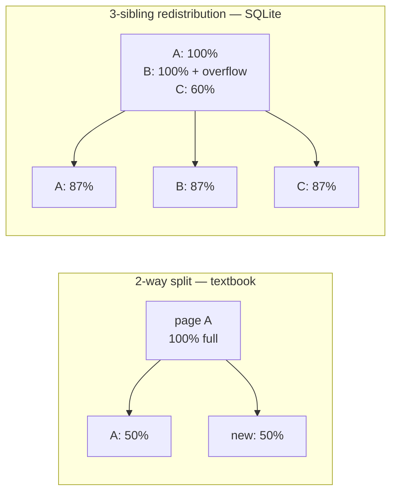

With three siblings, an overfull page often just *shifts a few cells to a neighbour* and no
split happens at all. Fewer splits means fewer new pages, fewer parent updates, and higher
average fill (~70–90% for random inserts instead of ~50%).

**Why allocate pages in increasing page-number order (step 5)?** Two reasons: sibling pages
stay roughly ordered on disk, so a range scan reads mostly forward; and auto-vacuum's
ptrmap updates become sequential rather than scattered.

**Why table-b-tree dividers are regenerated rather than copied down (step 2):** a table
interior cell has no payload, so pulling it "down" into a leaf is meaningless. The code
branches on `leafData` for exactly this.

---

## Part 7 — LLD: delete

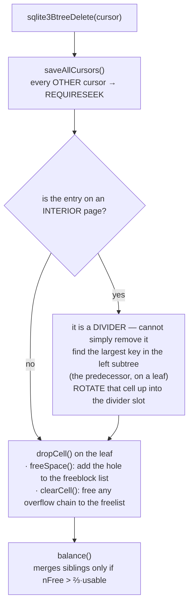

**Why an interior entry cannot simply be removed:** the divider key defines the boundary
between two subtrees. Deleting it would leave two child pointers with no separator. The
standard fix is to replace it with the immediately smaller key, which by definition
separates the same two subtrees.

**The truncate optimization:** `DELETE FROM t` with no WHERE clause calls
`sqlite3BtreeClearTable()`, which frees every page of the tree to the freelist without
parsing a single cell. Consequence: no per-row triggers fire on that path, which is why
SQLite disables the optimization when triggers or `changes()` semantics require row counts.

---

## Part 8 — LLD: cursor movement and payload access

### 8.1 `Next` walking off the end of a leaf

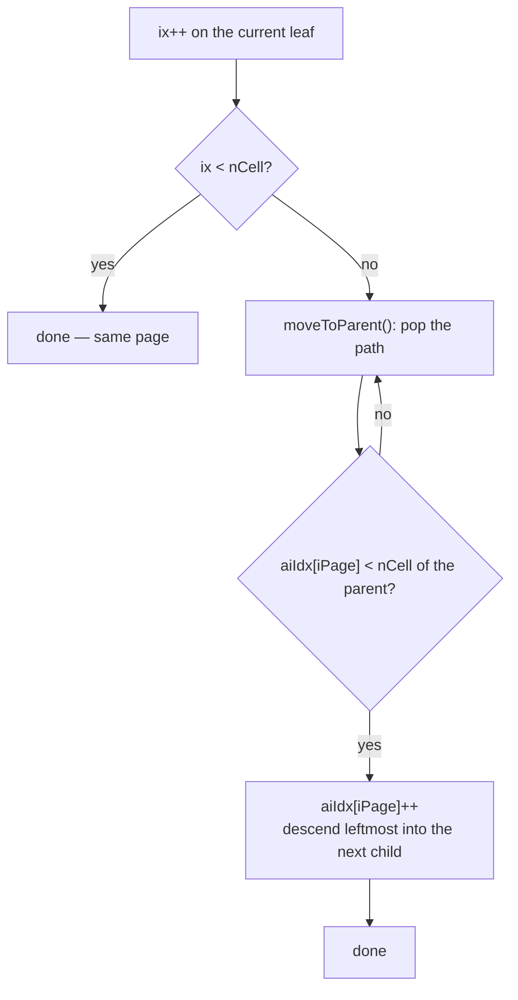

Cost: usually zero extra I/O — the parent is almost certainly in cache, since we just came
through it.

### 8.2 Zero-copy payload

```c
const void *sqlite3BtreePayloadFetch(BtCursor*, u32 *pAmt);
```

Returns a **pointer directly into the page buffer** when the whole payload is local. No
copy at all.

**The lifetime rule:** that pointer is valid only until the next b-tree call. Anything that
must outlive the cursor position must copy. `OP_Column` obeys this by marking the resulting
value `MEM_Ephem`, and any code that stores it calls `sqlite3VdbeMemMakeWriteable()`.

> **C sidebar.** This is the classic C ownership question: who owns the bytes, and how long
> do they live? C cannot express it in the type system, so SQLite expresses it in comments
> and flags. `MEM_Ephem` *is* a hand-rolled borrow checker.

---

## Part 9 — Transactions at this layer

```c
sqlite3BtreeBeginTrans(p, wrflag, &schemaVersion)
   wrflag 0 → read transaction  (pager SHARED, pin page 1)
   wrflag 1 → write transaction (pager RESERVED)
   wrflag 2 → also take EXCLUSIVE immediately (BEGIN EXCLUSIVE)
```

`BeginTrans` also reads the **schema cookie** and compares it to the cached schema. If
another connection ran DDL, your prepared statements are stale → `SQLITE_SCHEMA` →
`prepare_v2` silently re-prepares. That is where Phase 4's schema-cookie story meets this
layer.

Creating and dropping tables are b-tree operations too:
`sqlite3BtreeCreateTable()` allocates a root page and returns its number — which the code
generator then writes into `sqlite_schema.rootpage`.

---

## Part 10 — Auto-vacuum and page relocation

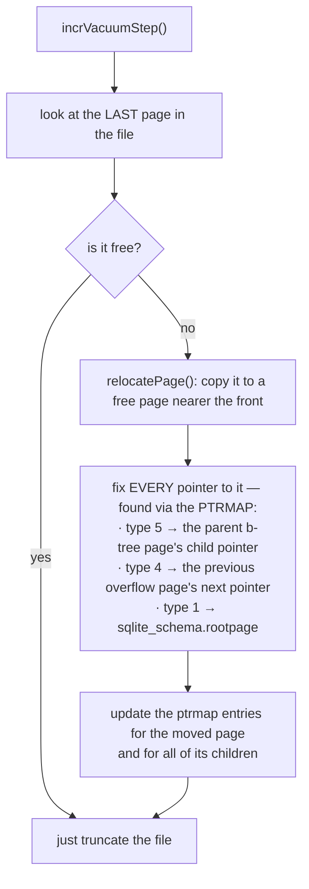

Without the pointer map, "find who points at page N" would be a full scan. With it, it is
one 5-byte read. **That is the entire justification for ptrmap pages**, and the cost is an
extra dirty page on every allocation and free.

---

## Part 11 — Defensive programming against corruption

Every function that reads a cell can be handed a hostile file — a fuzzer, a truncated
download, a bad disk.

```c
#define SQLITE_CORRUPT_BKPT   sqlite3CorruptError(__LINE__)
if( iCellOfst > pPage->pBt->usableSize ) return SQLITE_CORRUPT_PAGE(pPage);
assert( CORRUPT_DB || <invariant that must hold on a VALID file> );
```

Two distinct mechanisms, and confusing them is a common mistake:

| Construct | Compiled in release? | Meaning |
|---|---|---|
| `if(...) return SQLITE_CORRUPT_PAGE(...)` | **yes** | untrusted input; must be handled at runtime |
| `assert( CORRUPT_DB \|\| X )` | no | "X is guaranteed by the format unless the file is corrupt" |

The second is a specification statement. When you read `btree.c`, treat every
`assert( CORRUPT_DB || ... )` as a line of the file-format spec written in C.

`PRAGMA cell_size_check=ON` adds extra validation at insert time; fuzzers run with it on so
corruption is caught at the moment of creation rather than three operations later.

---

## Part 12 — The performance model you should carry

| Operation | Page reads | Page writes | Notes |
|---|---|---|---|
| rowid point lookup | depth (3–4) | 0 | all cached after warmup |
| covering-index lookup | index depth | 0 | table never touched |
| non-covering index lookup | index depth + table depth | 0 | ~2× the covering case |
| full table scan | all table pages, sequential | 0 | fast per row, slow per query |
| index scan + row fetch | index pages + **one random read per row** | 0 | the reason the planner sometimes prefers a scan |
| insert, sequential rowid | depth | ~1 | `balance_quick`, ~100% fill |
| insert, random key | depth | depth (splits propagate) | ~65–75% fill |
| delete | depth | 1–3 | plus freelist maintenance |

### 12.1 The five schema-design levers this implies

1. **Monotonic primary keys.** Sequential rowids hit `balance_quick`; random UUID text keys
   split pages everywhere. This is the single biggest lever in SQLite schema design.
2. **Covering indexes.** Adding the selected column to the index removes one whole b-tree
   descent *and* the random row fetch.
3. **`WITHOUT ROWID` for narrow PK-accessed tables.** Saves one b-tree lookup — but the PK
   is then repeated in every secondary index, so a wide PK makes it worse.
4. **Column order in wide tables.** `OP_Column` walks the record header, so frequently-read
   columns belong early.
5. **Page size.** Bigger pages ⇒ higher fan-out ⇒ shallower tree, at the cost of more write
   amplification per change.

---

## Part 13 — Design decisions, collected

| Decision | Alternative | Why |
|---|---|---|
| B+tree for tables | B-tree with data in interior nodes | keeps interior fan-out enormous |
| no sibling pointers | linked leaves | splits stay cheap; scans pay a rare cached parent hop |
| cursor stores the whole path | store only the leaf | makes `Next` possible without sibling pointers |
| overflow cells in memory (`apOvfl`) | split inside `insertCell` | separates "insert" from "repair"; both stay readable |
| `balance()` is a loop, not recursion | recursive balance | bounded stack; the cursor path *is* the stack |
| redistribute across 3 siblings | 2-way split | far fewer splits, ~70–90% fill |
| `balance_quick` for appends | always redistribute | ~100% fill and minimal writes for the commonest workload |
| `balance_deeper` copies the root down | promote a new root | `sqlite_schema.rootpage` must never change |
| lazy rebalancing (⅓ threshold) | strict 50% minimum | fewer structural writes; `VACUUM` reclaims later |
| `CURSOR_REQUIRESEEK` | pin pages, or forbid read+write | O(1) memory, no pinning, no restriction on SQL |
| zero-copy `PayloadFetch` | always copy | removes a memcpy from the hottest read path |
| `xParseCell` function pointer | `switch` on page type | no per-cell branch |
| precomputed `maxLocal`/`minLocal` | recompute per cell | removes two divisions from the hot path |
| truncate optimization for bare DELETE | row-by-row | O(pages) instead of O(rows) |

---

## Part 14 — Misconceptions

| Belief | Reality |
|---|---|
| "a page split is 50/50" | `balance_nonroot` redistributes over up to 3 pages; appends do not split at all |
| "b-tree pages are always ≥50% full" | SQLite allows ~⅓; there is no strict minimum |
| "deleting a row shrinks the tree" | usually only the page changes; merges are rare and lazy |
| "the root page moves when the tree grows" | never — `balance_deeper` copies the contents down |
| "leaves are linked, so scans are sequential" | they are not linked; scans climb to the parent |
| "an index makes every query faster" | a non-covering index adds a random read per row; the planner sometimes prefers a scan |
| "UUID primary keys are fine" | they defeat `balance_quick`, cost ~30% more space and far more I/O |
| "the cursor points at a row" | it points at a *path*; the row is wherever that path currently ends |

---

## Part 15 — Code map

| Concern | Functions |
|---|---|
| page parse/format | `zeroPage`, `btreeInitPage`, `decodeFlags`, `btreeComputeFreeSpace` |
| cell parse | `btreeParseCellPtr` (+3 variants), `cellSizePtr` |
| in-page allocator | `allocateSpace`, `freeSpace`, `defragmentPage`, `pageFindSlot` |
| navigation | `moveToRoot`, `moveToChild`, `moveToParent`, `moveToLeftmost/Rightmost` |
| search | `sqlite3BtreeTableMoveto`, `sqlite3BtreeIndexMoveto` |
| modify | `insertCell`, `dropCell`, `fillInCell`, `clearCell` |
| balance | `balance`, `balance_quick`, `balance_deeper`, `balance_nonroot`, `editPage`, `rebuildPage` |
| cursor safety | `saveCursorPosition`, `saveAllCursors`, `btreeRestoreCursorPosition` |
| payload | `accessPayload`, `sqlite3BtreePayloadFetch`, `getOverflowPage` |
| space | `allocateBtreePage`, `freePage2` |
| auto-vacuum | `ptrmapPut/Get/Pageno`, `relocatePage`, `incrVacuumStep` |
| verification | `sqlite3BtreeIntegrityCheck` |

Next: `2.code_walkthrough.md` reads `sqlite3BtreeTableMoveto` and `balance()` line by line;
`3.implementation.md` has you build a working B+tree and then add `balance_quick` yourself
and measure the difference.
