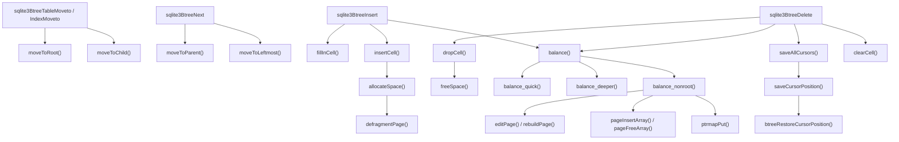

# Phase 3 — Reference: `btree.c`

Struct bodies and constants quoted from the 3.50.4 amalgamation.

---

## 1. Constants

```c
#define BTCURSOR_MAX_DEPTH 20        /* deeper ⇒ treated as corruption */

/* cursor states — BtCursor.eState */
#define CURSOR_VALID       0
#define CURSOR_INVALID     1
#define CURSOR_SKIPNEXT    2
#define CURSOR_REQUIRESEEK 3
#define CURSOR_FAULT       4

/* BtCursor.curFlags */
#define BTCF_WriteFlag  0x01   /* a write cursor */
#define BTCF_ValidNKey  0x02   /* info.nKey is valid */
#define BTCF_ValidOvfl  0x04   /* aOverflow is valid */
#define BTCF_AtLast     0x08   /* positioned at the last entry */
#define BTCF_Incrblob   0x10   /* an incremental BLOB handle */
#define BTCF_Multiple   0x20   /* another cursor may be on the same btree */
#define BTCF_Pinned     0x40   /* busy; cannot be moved */

/* BtShared.btsFlags */
#define BTS_READ_ONLY        0x0001
#define BTS_PAGESIZE_FIXED   0x0002
#define BTS_SECURE_DELETE    0x0004
#define BTS_OVERWRITE        0x0008
#define BTS_FAST_SECURE      0x000c   /* SECURE_DELETE | OVERWRITE */
#define BTS_INITIALLY_EMPTY  0x0010
#define BTS_NO_WAL           0x0020
#define BTS_EXCLUSIVE        0x0040
#define BTS_PENDING          0x0080

/* page allocation strategy */
#define BTALLOC_ANY   0
#define BTALLOC_EXACT 1
#define BTALLOC_LE    2
```

### 1.1 Insert / delete flags (public, `btreeInt.h` and `sqliteInt.h`)

```c
#define BTREE_SAVEPOSITION 0x02  /* leave the cursor pointing at NEXT or PREV */
#define BTREE_AUXDELETE    0x04  /* not the primary delete operation */
#define BTREE_APPEND       0x08  /* HINT: this insert is likely an append */
#define BTREE_PREFORMAT    0x80  /* the payload is a pre-formatted cell */
```

### 1.2 Cursor hints

```
BTREE_BULKLOAD   the cursor is used for a bulk load (affects balancing)
BTREE_SEEK_EQ    the cursor is only used for equality seeks
```

### 1.3 The balance thresholds

```c
/* in balance(): do nothing unless there is an overflow cell
** or the page is less than about one third full */
if( pPage->nOverflow==0 && pPage->nFree*3 <= (int)pCur->pBt->usableSize*2 ) break;

NB = 3          /* max siblings redistributed by balance_nonroot */
output pages    1..5
defragment      when fragmented free bytes > 60
```

---

## 2. Structures

### 2.1 `BtCursor` — the cursor is a path (verbatim)

```c
struct BtCursor {
  u8 eState;                /* One of the CURSOR_XXX constants */
  u8 curFlags;              /* zero or more BTCF_* flags */
  u8 curPagerFlags;         /* Flags to send to sqlite3PagerGet() */
  u8 hints;                 /* As configured by CursorSetHints() */
  int skipNext;    /* Prev() is noop if negative. Next() is noop if positive.
                   ** Error code if eState==CURSOR_FAULT */
  Btree *pBtree;
  Pgno *aOverflow;          /* Cache of overflow page locations */
  void *pKey;               /* Saved key from the cursor's last known position */
  /* All fields above are zeroed when the cursor is allocated. */
#define BTCURSOR_FIRST_UNINIT pBt
  BtShared *pBt;
  BtCursor *pNext;          /* linked list of ALL cursors on this BtShared */
  CellInfo info;            /* a parse of the cell we are pointing at */
  i64 nKey;                 /* size of pKey, or the last integer key */
  Pgno pgnoRoot;
  i8 iPage;                 /* index of the current page in apPage */
  u8 curIntKey;             /* value of apPage[0]->intKey */
  u16 ix;                   /* current index for apPage[iPage] */
  u16 aiIdx[BTCURSOR_MAX_DEPTH-1];     /* current index in apPage[i] */
  struct KeyInfo *pKeyInfo;            /* comparison info; NULL for table cursors */
  MemPage *pPage;                        /* current page */
  MemPage *apPage[BTCURSOR_MAX_DEPTH-1]; /* stack of parents of the current page */
};
```

Note the array sizes: `apPage` and `aiIdx` are `BTCURSOR_MAX_DEPTH-1` entries, because the
**current** page lives in `pPage`, not in `apPage[iPage]`… except that the code also keeps
`apPage[iPage] == pPage` for `iPage < MAX_DEPTH-1`. Read `moveToChild`/`moveToParent` to
see the exact discipline before you index either array in a patch.

| Field | Meaning |
|---|---|
| `skipNext` | dual-purpose: ±1 for `CURSOR_SKIPNEXT`, an error code for `CURSOR_FAULT` |
| `pKey` | the saved key while `CURSOR_REQUIRESEEK` |
| `aOverflow` | cached overflow page numbers, valid only with `BTCF_ValidOvfl` |
| `info` | the parsed current cell; `info.nSize == 0` means "stale, re-parse" |
| `curIntKey` | cached `intKey` of the root, so table/index dispatch needs no page access |

### 2.2 Cursor state machine

| State | Value | `pPage` valid? | Meaning |
|---|---|---|---|
| `CURSOR_VALID` | 0 | yes | points at a real entry |
| `CURSOR_INVALID` | 1 | no | before first / after last / empty tree |
| `CURSOR_SKIPNEXT` | 2 | yes | the entry was deleted; the next `Next`/`Prev` is a no-op |
| `CURSOR_REQUIRESEEK` | 3 | **no** | the tree changed; re-seek using `pKey` |
| `CURSOR_FAULT` | 4 | no | unrecoverable; `skipNext` holds the error code |

### 2.3 `BtShared` — per open file, per process (verbatim, abridged)

```c
struct BtShared {
  Pager *pPager;
  sqlite3 *db;
  BtCursor *pCursor;    /* a list of ALL open cursors */
  MemPage *pPage1;      /* page 1, pinned while a transaction is open */
  u8 openFlags;
  u8 autoVacuum, incrVacuum, bDoTruncate;
  u8 inTransaction;     /* TRANS_NONE / TRANS_READ / TRANS_WRITE */
  u8 max1bytePayload;
  u8 nReserveWanted;
  u16 btsFlags;         /* BTS_* */
  u16 maxLocal, minLocal, maxLeaf, minLeaf;   /* THE SPILL FORMULA, precomputed */
  u32 pageSize, usableSize;
  int nTransaction;     /* number of open transactions (read + write) */
  u32 nPage;
  void *pSchema;        /* the Schema object for this file */
  sqlite3_mutex *mutex;
  Bitvec *pHasContent;  /* pages moved to the freelist this transaction */
  u8 *pTmpSpace;        /* scratch big enough for one cell */
  int nPreformatSize;
  /* shared-cache only: nRef, pNext, pLock, pWriter */
};
```

`pHasContent` exists so that a page freed *this transaction* is not read back from disk
before it is reused — its on-disk content is stale.

### 2.4 `Btree` — per connection

```c
struct Btree {
  sqlite3 *db;
  BtShared *pBt;
  u8 inTrans;           /* TRANS_NONE / TRANS_READ / TRANS_WRITE */
  u8 sharable, locked;
  int wantToLock, nBackup;
  u32 iBDataVersion;
  Btree *pNext, *pPrev;
};
```

### 2.5 `BtreePayload` — the insert argument

```c
struct BtreePayload {
  const void *pKey;       /* index key; NULL for table b-trees */
  sqlite3_int64 nKey;     /* the ROWID for tables; the key size for indexes */
  const void *pData;      /* the record, for table b-trees */
  sqlite3_value *aMem;    /* or: the unpacked key values */
  u16 nMem;
  int nData;
  int nZero;              /* trailing zero bytes (the zeroblob optimization) */
};
```

| | Table b-tree | Index b-tree |
|---|---|---|
| `pKey` | NULL | the encoded key |
| `nKey` | the rowid | length of `pKey` |
| `pData`/`nData` | the record | unused |
| `aMem`/`nMem` | unused | the decomposed key |

---

## 3. The public b-tree API

```c
/* lifecycle */
int  sqlite3BtreeOpen(sqlite3_vfs*, const char *zFile, sqlite3*, Btree**, int, int);
int  sqlite3BtreeClose(Btree*);

/* transactions */
int  sqlite3BtreeBeginTrans(Btree*, int wrflag, int *pSchemaVersion);
int  sqlite3BtreeCommitPhaseOne(Btree*, const char *zSuperJrnl);
int  sqlite3BtreeCommitPhaseTwo(Btree*, int bCleanup);
int  sqlite3BtreeRollback(Btree*, int tripCode, int writeOnly);
int  sqlite3BtreeBeginStmt(Btree*, int iStatement);
int  sqlite3BtreeSavepoint(Btree*, int op, int iSavepoint);

/* schema objects */
int  sqlite3BtreeCreateTable(Btree*, Pgno *piTable, int flags);
int  sqlite3BtreeDropTable(Btree*, int iTable, int *piMoved);
int  sqlite3BtreeClearTable(Btree*, int iTable, i64 *pnChange);
void sqlite3BtreeGetMeta(Btree*, int idx, u32 *pValue);
int  sqlite3BtreeUpdateMeta(Btree*, int idx, u32 iMeta);

/* cursors */
int  sqlite3BtreeCursor(Btree*, Pgno iTable, int wrFlag, KeyInfo*, BtCursor*);
int  sqlite3BtreeCloseCursor(BtCursor*);
int  sqlite3BtreeFirst(BtCursor*, int *pRes);
int  sqlite3BtreeLast(BtCursor*, int *pRes);
int  sqlite3BtreeNext(BtCursor*, int flags);
int  sqlite3BtreePrevious(BtCursor*, int flags);
int  sqlite3BtreeTableMoveto(BtCursor*, i64 intKey, int biasRight, int *pRes);
int  sqlite3BtreeIndexMoveto(BtCursor*, UnpackedRecord*, int *pRes);
i64  sqlite3BtreeIntegerKey(BtCursor*);
u32  sqlite3BtreePayloadSize(BtCursor*);
int  sqlite3BtreePayload(BtCursor*, u32 offset, u32 amt, void *pBuf);
const void *sqlite3BtreePayloadFetch(BtCursor*, u32 *pAmt);   /* ZERO COPY */

/* modification */
int  sqlite3BtreeInsert(BtCursor*, const BtreePayload*, int flags, int seekResult);
int  sqlite3BtreeDelete(BtCursor*, u8 flags);
int  sqlite3BtreeCount(sqlite3*, BtCursor*, i64*);
int  sqlite3BtreeIntegrityCheck(sqlite3*, Btree*, Pgno *aRoot, Mem*, int, int, int*, char**);
```

`sqlite3BtreeBeginTrans` wrflag: `0` = read, `1` = write (RESERVED), `2` = write with an
immediate EXCLUSIVE lock.

---

## 4. Internal function map



| Group | Functions |
|---|---|
| page mechanics | `zeroPage`, `btreeInitPage`, `decodeFlags`, `btreeGetPage`, `getAndInitPage`, `releasePage`, `btreeComputeFreeSpace` |
| in-page allocator | `allocateSpace`, `freeSpace`, `defragmentPage`, `pageFindSlot` |
| cells | `btreeParseCell(Ptr)`, `btreeParseCellPtrIndex`, `btreeParseCellPtrNoPayload`, `cellSizePtr*`, `fillInCell`, `clearCell` |
| payload | `accessPayload`, `sqlite3BtreePayloadFetch`, `getOverflowPage`, `btreeParseCellAdjustSizeForOverflow` |
| navigation | `moveToRoot`, `moveToChild`, `moveToParent`, `moveToLeftmost`, `moveToRightmost`, `btreeNext`, `btreePrevious` |
| cursor safety | `saveCursorPosition`, `saveAllCursors`, `btreeRestoreCursorPosition`, `sqlite3BtreeCursorHasMoved` |
| modification | `insertCell`, `dropCell`, `balance`, `balance_quick`, `balance_deeper`, `balance_nonroot`, `copyNodeContent`, `rebuildPage`, `editPage`, `pageInsertArray`, `pageFreeArray` |
| space | `allocateBtreePage`, `freePage`, `freePage2`, `btreeGetUnusedPage` |
| auto-vacuum | `ptrmapPageno`, `ptrmapPut`, `ptrmapGet`, `ptrmapPutOvflPtr`, `relocatePage`, `incrVacuumStep`, `autoVacuumCommit` |
| shared cache | `querySharedCacheTableLock`, `setSharedCacheTableLock`, `clearAllSharedCacheTableLocks` |
| verification | `sqlite3BtreeIntegrityCheck`, `checkTreePage`, `checkRef` |

---

## 5. `balance()` decision table

```
nOverflow == 0 AND nFree ≤ ⅔·usable                    → do nothing
iPage == 0 (root) AND nOverflow > 0                     → balance_deeper()
intKeyLeaf AND nOverflow == 1
  AND aiOvfl[0] == nCell        (the new cell goes LAST)
  AND pParent->pgno != 1
  AND pParent->nCell == iIdx    (this is the RIGHTMOST child)   → balance_quick()
otherwise                                               → balance_nonroot()
then: pCur->iPage--  and repeat (the parent may now overflow)
```

### 5.1 `balance_nonroot` array glossary

| Name | Holds |
|---|---|
| `pParent`, `iParentIdx` | the parent page and the divider index for the overfull child |
| `nOld`, `apOld[]` | the 1–3 sibling pages taken |
| `apDiv[]` | pointers to the divider cells in the parent that separate them |
| `b.apCell[]`, `b.szCell[]` | the flattened pool of **all** cells (siblings + overflow + dividers) |
| `cntNew[]`, `szNew[]` | cumulative cell count and byte size per output page |
| `nNew`, `apNew[]` | the 1–5 output pages |
| `aSpace1` | scratch for divider cells that must be rebuilt |
| `aPgOrder[]`, `aPgno[]` | used to assign new pages in increasing page-number order |
| `b.ixNx[]` | index boundaries used by `editPage`/`pageInsertArray` |
| `leafData` | true for table b-trees — dividers carry no payload and are regenerated |

Reading order: sibling selection → cell gathering → packing (`cntNew`) → size evening →
page allocation ordering → `editPage` writes → parent fixup → `ptrmapPut` loop.

---

## 6. Invariants

1. `pCur->apPage[pCur->iPage] == pCur->pPage` (within the array bounds discipline).
2. `pPage->nCell*2 + hdrOffset + hdrSize <= cellTop`.
3. An interior page has `nCell >= 1`.
4. `nFree == Σ(freeblocks) + fragments + gap`, recomputed by `btreeComputeFreeSpace()`.
5. Keys strictly increase across the cell pointer array.
6. A `CURSOR_VALID` cursor has `ix < pPage->nCell`.
7. `iPage < BTCURSOR_MAX_DEPTH`.
8. With auto-vacuum on, `ptrmapGet(child) == (PTRMAP_BTREE, parent)` for every child.
9. `saveAllCursors()` has been called before any structural change.
10. `sqlite3PagerWrite()` has been called on a page before it is modified.

---

## 7. Gotchas

1. **`sqlite3BtreePayloadFetch()` returns a pointer into the page buffer.** It is invalid
   after any b-tree call that may move or modify pages.
2. **Root page numbers never change** (except via auto-vacuum relocation, which updates
   `sqlite_schema`). `balance_deeper` copies the root's *contents* down for this reason.
3. `nFree == -1` means "not computed"; call `btreeComputeFreeSpace()`. Forgetting this is a
   classic patch bug.
4. `saveAllCursors()` must run **before** a structural change, not after.
5. `info.nSize == 0` marks the cached `CellInfo` as stale — the cursor code sets it
   deliberately in several places.
6. `BTREE_APPEND` is a **hint**: correctness must never depend on it.
7. `sqlite3BtreeInsert(..., seekResult)` non-zero means "the cursor is already positioned;
   do not seek." Passing a stale value causes silent corruption; the code asserts heavily.
8. `DELETE FROM t` with no WHERE uses `sqlite3BtreeClearTable()` — no per-row work, so
   triggers and row counts need the optimization disabled.
9. `aiOvfl`/`apOvfl` hold at most **4** overflow cells; `balance()` runs immediately, so
   more cannot accumulate.
10. In shared-cache mode every entry point takes `sqlite3BtreeEnter()`; a patch that skips
    it corrupts under concurrency.
11. `pHasContent` prevents reading a page that was freed earlier in the same transaction.
12. `BTCURSOR_MAX_DEPTH` is 20 — a file implying a deeper tree is rejected as corrupt.

---

## 8. Performance model

| Operation | Page reads | Page writes | Typical fill |
|---|---|---|---|
| rowid point lookup | depth (3–4) | 0 | — |
| covering index lookup | index depth | 0 | — |
| non-covering index lookup | index depth + table depth | 0 | — |
| full table scan | all pages, sequential | 0 | — |
| index scan + row fetch | index pages + **1 random read per row** | 0 | — |
| insert, sequential rowid | depth | ~1 | ~100% (`balance_quick`) |
| insert, random key | depth | depth (splits propagate) | ~65–75% |
| delete | depth | 1–3 | — |

Fan-out with `U = 4084`:
```
interior TABLE page   ≈ (4084−12)/(6+2)  ≈ 509 children   ⇒ 3 levels ≈ 1.3×10^8 rows
interior INDEX page   depends on key size; a 40-byte key gives ≈ 90 children
```

### 8.1 Measured, from `labs/phase03/minibtree` (naive midpoint split)

```
sequential 50,000 inserts : leaves=6099  avg leaf fill=45.5%  splits=6648
random     50,000 inserts : leaves=3803  avg leaf fill=67.8%  splits=4033
```
Sequential is **worse** without `balance_quick`. Real SQLite inverts this. That is the
entire justification for the append fast path.

---

## 9. Debug recipes

```
(lldb) b sqlite3BtreeInsert
(lldb) b balance
(lldb) b balance_nonroot
(lldb) b balance_quick
(lldb) b balance_deeper
(lldb) b saveAllCursors
(lldb) p pCur->iPage
(lldb) p pCur->pPage->pgno
(lldb) p pCur->pPage->nCell
(lldb) p pCur->pPage->nFree
(lldb) p pCur->pPage->nOverflow
(lldb) p pCur->eState          # 0 VALID 1 INVALID 2 SKIPNEXT 3 REQUIRESEEK 4 FAULT
(lldb) p/x pCur->curFlags      # BTCF_*
(lldb) p pCur->info
```

```sql
PRAGMA integrity_check;        -- the full invariant list
PRAGMA quick_check;            -- skips page-usage and index/table cross-checks
PRAGMA cell_size_check=ON;     -- validate cell sizes at insert time
SELECT name, pageno, pgsize, payload, unused, ncell FROM dbstat WHERE name='t';
SELECT name, sum(payload)*100.0/sum(pgsize) AS fill_pct FROM dbstat GROUP BY name;
```

```sh
sqlite3_analyzer mydb.db            # depth, fill, overflow stats per table/index
labs/phase01/dbparse mydb.db 2      # walk one tree yourself
```

`SQLITE_TESTCTRL_SEEK_COUNT` counts b-tree seeks, so a test can assert an algorithm did not
regress.

---

## 10. Canonical documentation

`sqlite.org/fileformat2.html` (the format these functions maintain),
`sqlite.org/arch.html`, and the header comment at the top of `src/btree.c` — which is the
file format restated as prose, written by the people who wrote the code.
