# Phase 4 — The Front End: Tokenizer, Parser, Schema

C you need first: `C-FOR-SQLITE.md` §2 (structs), §7 (unions), §8 (bit flags),
§9 (flexible arrays), §16 (macros).

---

## Part 1 — The problem: text is not a plan

```
"SELECT name FROM users WHERE age > 40"
```

is 37 characters. To execute it you need to know:
- that `SELECT` is a keyword and `name` is not,
- that `name` refers to column 1 of the table that cursor 0 will open,
- that `age > 40` compares an INTEGER-affinity column against a literal,
- that the table exists, the columns exist, and the user may read them.

None of that is in the text. The front end's job is to **turn text into a fully annotated
tree**, where every name has been replaced by an integer.

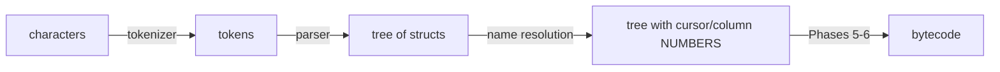

**The output that matters:** `Expr.iTable` (a cursor number) and `Expr.iColumn` (a column
index). Those two integers are the entire handoff to the rest of the engine.

---

## Part 2 — HLD

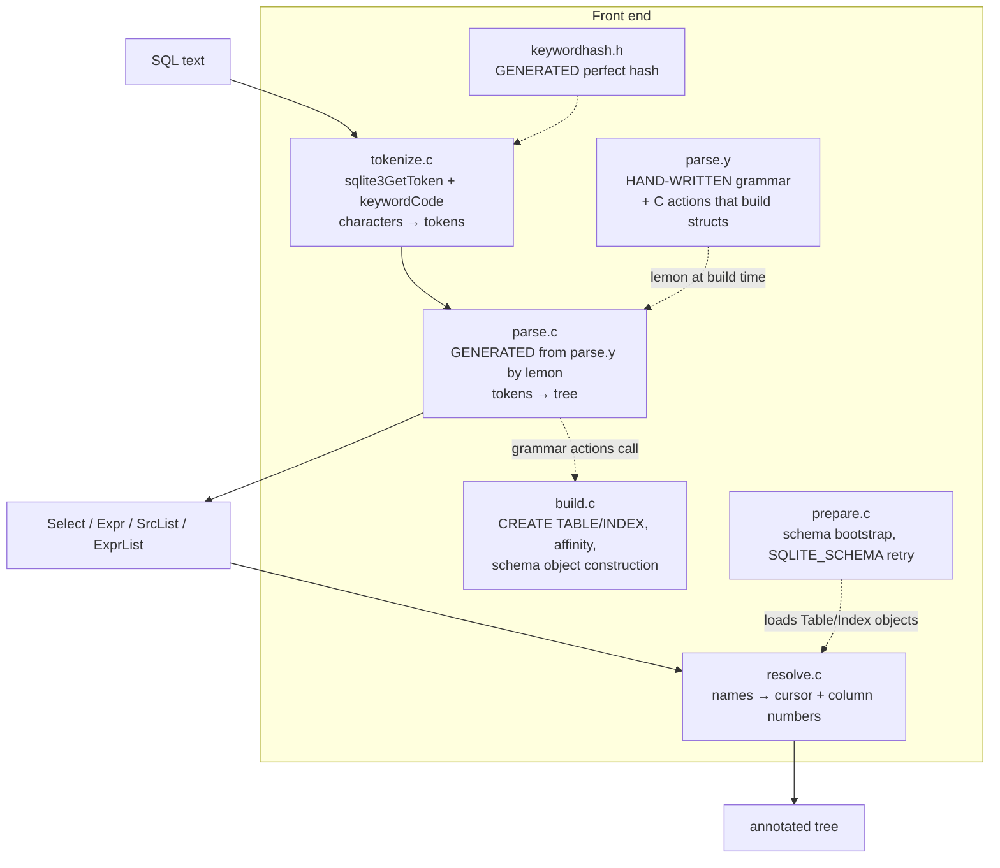

**Why a generated parser?** An LALR(1) table for SQL is thousands of states. Writing it by
hand is impossible; maintaining a grammar file is easy. And a grammar file is
*checkable* — Lemon reports conflicts at build time, and SQLite keeps the grammar
conflict-free.

**Why Lemon and not yacc/bison?**

| Feature | yacc/bison | Lemon |
|---|---|---|
| reentrant | needs options | always |
| global variables | yes (classic yacc) | none |
| cleanup on syntax error | manual | `%destructor` frees partial trees automatically |
| keyword-as-identifier | manual hacks | `%fallback` |
| license | varies | public domain, in-tree |

The `%destructor` feature is the decisive one: SQL parsing allocates tree nodes as it goes,
and a syntax error can strike mid-tree. Lemon frees every partially built non-terminal
automatically, so there is no leak path.

---

## Part 3 — LLD: the tokenizer

### 3.1 Dispatch by character class

```c
static const unsigned char aiClass[] = { /* 256 entries */ };

int sqlite3GetToken(const unsigned char *z, int *tokenType){
  switch( aiClass[*z] ){
    case CC_SPACE: { ... *tokenType = TK_SPACE; return i; }
    case CC_MINUS: { if( z[1]=='-' ){ /* -- comment */ } ... }
    case CC_DIGIT: { /* integer, real, 0x hex */ }
    case CC_QUOTE: { /* '...' "..." [...] `...` */ }
    case CC_ID:    { for(i=1; sqlite3IsIdChar(z[i]); i++){}
                     *tokenType = keywordCode((char*)z, i, tokenType);
                     return i; }
    ...
  }
}
```

**Why a 256-entry table instead of `if (c==' '||c=='\t'||...)`:** one array index replaces a
chain of comparisons, and the compiler turns the `switch` into a jump table. The tokenizer
runs over every byte of every statement; it is worth a 256-byte table.

### 3.2 Keyword recognition is a *generated perfect hash*

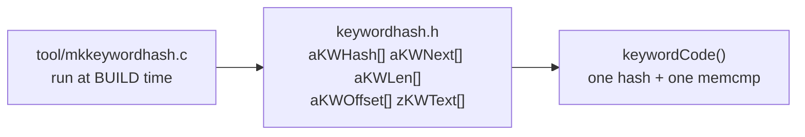

A perfect hash means **no collisions**: every keyword hashes to a distinct slot, so
recognition is O(1) with a single `memcmp` to confirm. `zKWText[]` is one long string with
keywords packed and overlapping where possible, to shrink the binary.

**Why generate it?** A perfect hash function must be *searched for*; you cannot write one
by hand for 150 keywords. So a program finds it at build time and emits C.

### 3.3 Quoting — four syntaxes and one misfeature

| Syntax | Meaning | Origin |
|---|---|---|
| `'abc'` | string literal (`''` escapes a quote) | SQL standard |
| `"abc"` | **identifier** — falls back to a string if it resolves to nothing | standard + a compatibility hack |
| `[abc]` | identifier | MS Access / SQL Server |
| `` `abc` `` | identifier | MySQL |
| `X'53514C'` | blob literal | standard |
| `?`, `?N`, `:n`, `@n`, `$n` | bound parameter | various |

**The double-quoted string misfeature (DQS).** `WHERE name = "nmae"` should be an error —
`"nmae"` is an identifier and there is no such column. Early SQLite accepted it as the
string `'nmae'`, and by the time that was recognized as a mistake, too much software
depended on it.

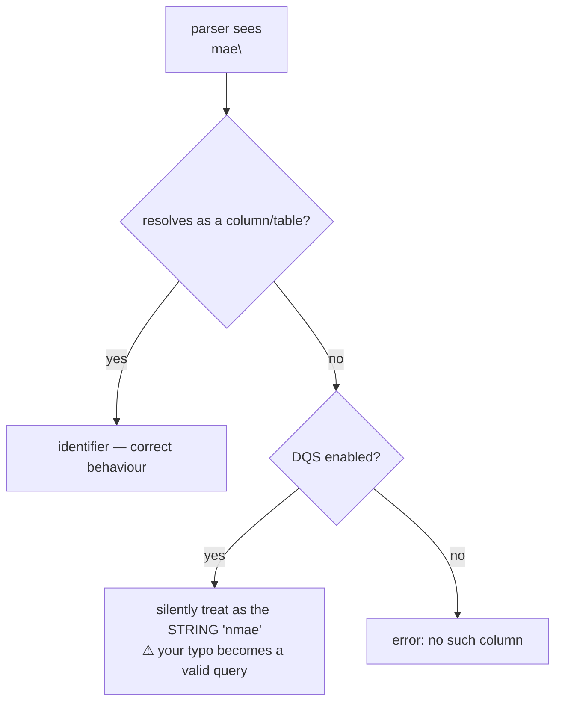

Turn it off in new code: `-DSQLITE_DQS=0` at compile time, or
`sqlite3_db_config(db, SQLITE_DBCONFIG_DQS_DML, 0, 0)`.

### 3.4 The driver: tokens are streamed, not buffered

```c
while( 1 ){
  n = sqlite3GetToken((u8*)zSql, &tokenType);
  if( tokenType>=TK_SPACE ){          /* whitespace, comments, illegal */
    if( tokenType==TK_SPACE ){ zSql += n; continue; }   /* never reaches the parser */
    ...
  }
  sqlite3Parser(pEngine, tokenType, pParse->sLastToken);   /* push ONE token */
  ...
}
```

There is no token array. The tokenizer and parser are coroutines in one loop, so memory use
is O(parse tree), not O(statement length).

**`tokenType >= TK_SPACE` is load-bearing:** Lemon assigns token codes so that all
non-grammar tokens sit above a threshold, making the filter a single comparison.

---

## Part 4 — LLD: the grammar

### 4.1 A rule is a shape plus an action

```
oneselect(A) ::= SELECT distinct(D) selcollist(W) from(X) where_opt(Y)
                 groupby_opt(P) having_opt(Q) orderby_opt(Z) limit_opt(L). {
  A = sqlite3SelectNew(pParse,W,X,Y,P,Q,Z,D,L);
}
```

Read as: *when the parser reduces these nine symbols, run this C and let the result be the
value of `oneselect`.* The letters in parentheses bind symbol values to C variables.

**`parse.y` is therefore half the front end**, not just a syntax description.

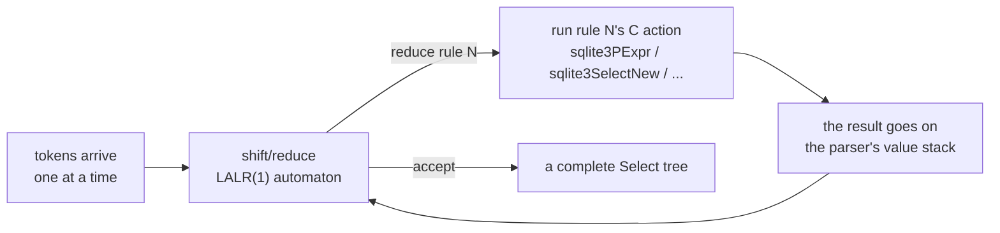

### 4.2 Precedence is declared, not encoded

```
%left OR.
%left AND.
%right NOT.
%left IS MATCH LIKE_KW BETWEEN IN ISNULL NOTNULL NE EQ.
%left GT LE LT GE.
%right ESCAPE.
%left BITAND BITOR LSHIFT RSHIFT.
%left PLUS MINUS.
%left STAR SLASH REM.
%left CONCAT.
%left COLLATE.
%right BITNOT.
```

Lowest precedence first. `a OR b AND c` parses as `a OR (b AND c)` because `AND` is
declared later. This block *is* SQLite's operator precedence table — no other document is
authoritative.

### 4.3 `%fallback` — keywords that are also identifiers

```
%fallback ID  ABORT ACTION AFTER ANALYZE ASC ATTACH BEFORE BEGIN BY CASCADE CAST
              COLUMNKW CONFLICT DATABASE DEFERRED DESC DETACH DO EACH END ...
```

This is why `CREATE TABLE t(key, action, rollback)` works. When the parser is in a state
where an identifier is legal and a keyword is not, the keyword token is silently
reinterpreted as `ID`.

**Why not just make them non-reserved?** Because in *some* positions they must be keywords
(`ROLLBACK;` is a statement). `%fallback` makes the decision context-sensitive, which a
plain token classification cannot do.

### 4.4 Limits as a security boundary

| Limit | Default | Protects against |
|---|---|---|
| `SQLITE_MAX_SQL_LENGTH` | 1,000,000,000 | memory exhaustion via giant statements |
| `SQLITE_MAX_EXPR_DEPTH` | 1000 | stack overflow from `((((...))))` |
| `SQLITE_MAX_COLUMN` | 2000 | quadratic algorithms on column lists |
| `SQLITE_MAX_COMPOUND_SELECT` | 500 | deep `UNION` chains |
| `SQLITE_MAX_FUNCTION_ARG` | 127 | |
| `BMS` (64) | fixed | the join-table bitmask width |

These exist because SQLite routinely parses **untrusted SQL** — in browsers, in phones, in
document formats. The parser is an attack surface, and the limits are the mitigation.

---

## Part 5 — LLD: the parse tree

### 5.1 `Expr` — the universal node

```c
struct Expr {
  u8 op;                 /* TK_PLUS, TK_COLUMN, TK_INTEGER, TK_FUNCTION, ... */
  char affExpr;          /* affinity of this expression */
  u32 flags;             /* EP_xxx */
  union {
    char *zToken;        /* literal text / column name / function name */
    int iValue;          /* the integer value, if EP_IntValue */
  } u;
  Expr *pLeft, *pRight;  /* operands */
  union {
    ExprList *pList;     /* function args, IN(list) */
    Select *pSelect;     /* IN(SELECT...), scalar subquery */
  } x;
  int iTable;            /* ← CURSOR NUMBER after resolution */
  ynVar iColumn;         /* ← COLUMN INDEX after resolution; -1 = rowid */
  AggInfo *pAggInfo; i16 iAgg;
  union { Table *pTab; Window *pWin; int iValue; } y;
};
```

> **C sidebar — three unions in one struct.** `u`, `x`, and `y` are unions because an
> `Expr` is never more than one kind of thing at a time: a literal has a token *or* an int
> value, never both; a function has an argument list, a subquery has a `Select`. Using
> separate fields would make every `Expr` ~24 bytes larger, and a big query allocates
> thousands of them. The `op` and `flags` fields are the tags that say which member is
> live. See `C-FOR-SQLITE.md` §7.

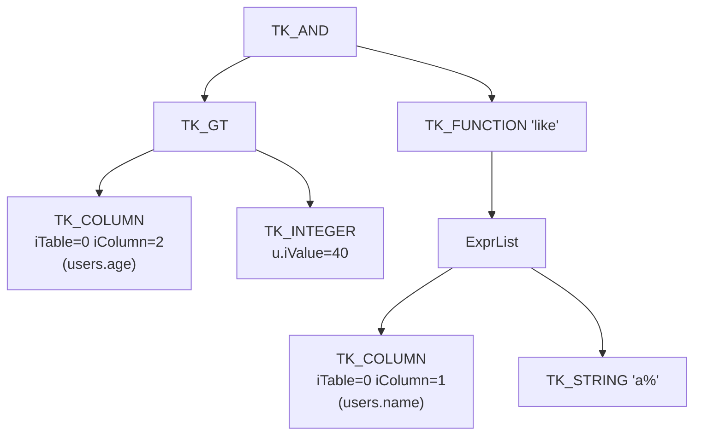
*(`WHERE age > 40 AND name LIKE 'a%'`, after resolution.)*

### 5.2 The `EP_*` flags that cause real bugs

| Flag | Meaning | Why it matters |
|---|---|---|
| `EP_OuterON` | this term came from a LEFT JOIN's `ON` clause | it must **not** be applied to the left table, or you get wrong answers |
| `EP_Agg` | contains an aggregate | decides GROUP BY handling |
| `EP_IntValue` | `u.iValue` is live, not `u.zToken` | reading the wrong union member |
| `EP_Collate` | subtree has an explicit COLLATE | drives collation precedence |
| `EP_ConstFunc` | deterministic function | can be hoisted out of loops |
| `EP_Reduced` / `EP_TokenOnly` | memory-compressed form | some fields are *absent*; schema-resident exprs use this |

`EP_OuterON` is the one to remember. `t1 LEFT JOIN t2 ON t2.x = 5` and
`t1 LEFT JOIN t2 WHERE t2.x = 5` mean different things, and this flag is how the engine
keeps them apart.

### 5.3 `SrcList` — the FROM clause, where cursors are born

```c
struct SrcItem {
  char *zDatabase, *zName, *zAlias;
  Table *pTab;           /* filled in by name resolution */
  Select *pSelect;       /* if this is a subquery */
  u8 fg.jointype;        /* JT_INNER, JT_LEFT, JT_CROSS, JT_RIGHT */
  int iCursor;           /* ← THE CURSOR NUMBER — becomes OP_OpenRead P1 */
  Expr *pOn; IdList *pUsing;
  Bitmask colUsed;       /* which columns are referenced */
  Index *pIBIndex;       /* INDEXED BY */
};
```

Two fields to notice now, because they reappear later:

- **`iCursor`** is assigned here and is the *same integer* that appears as `OP_OpenRead P1`
  in the bytecode and as `Expr.iTable` in every column reference. It is the thread tying
  Phases 4, 5, and 6 together.
- **`colUsed`** is a 64-bit mask of referenced columns. In Phase 6 the planner uses it to
  decide whether an index is *covering*. A column you never select is a column the planner
  can avoid fetching.

### 5.4 `Select`

```c
struct Select {
  ExprList *pEList;      /* the result set */
  u8 op;                 /* TK_SELECT, TK_UNION, TK_ALL, TK_INTERSECT, TK_EXCEPT */
  u32 selFlags;          /* SF_Distinct, SF_Aggregate, SF_Resolved, ... */
  SrcList *pSrc; Expr *pWhere; ExprList *pGroupBy; Expr *pHaving;
  ExprList *pOrderBy; Select *pPrior, *pNext; Expr *pLimit;
  With *pWith; Window *pWin;
  LogEst nSelectRow;     /* estimated output rows */
};
```

`selFlags` is a progress record: watch `SF_Expanded` → `SF_Resolved` → `SF_Aggregate`
appear in `.treetrace` output as the pipeline stages complete.

---

## Part 6 — LLD: name resolution

### 6.1 The scope chain

```c
struct NameContext {
  Parse *pParse;
  SrcList *pSrcList;      /* tables visible at this level */
  NameContext *pNext;     /* ← the OUTER query */
  int nRef;               /* how many names resolved to THIS context */
  int ncFlags;            /* NC_AllowAgg, NC_HasAgg, NC_IsCheck, NC_PartIdx, ... */
};
```

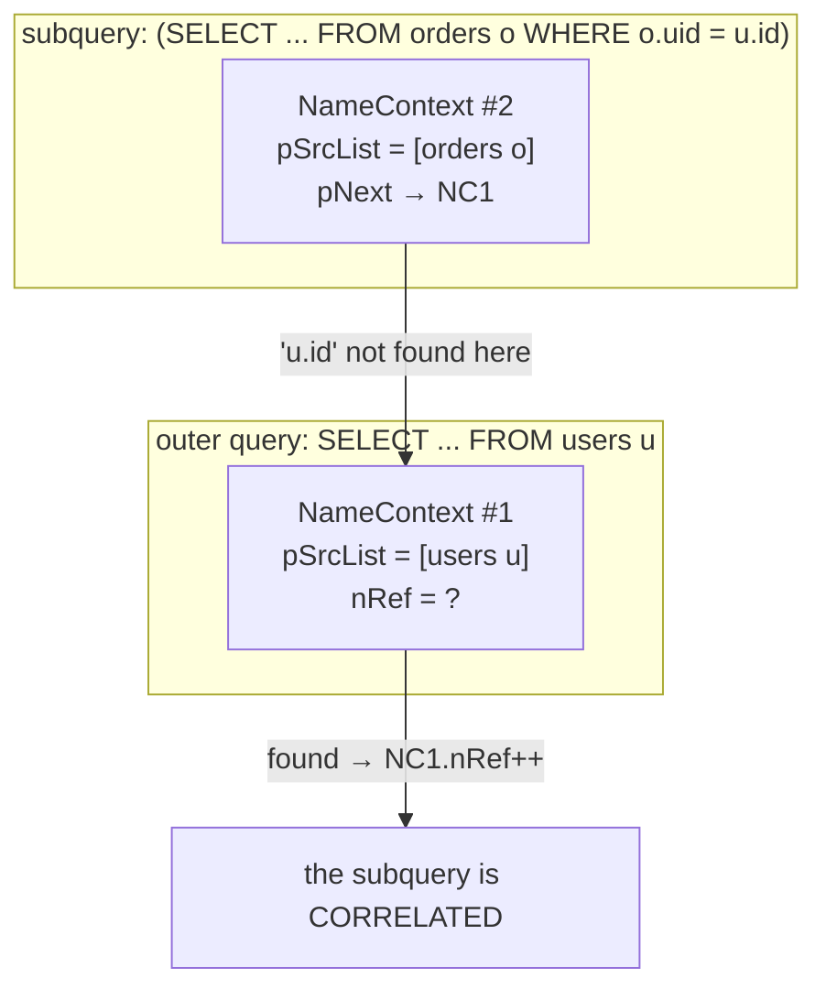

**`nRef` on an outer context is the entire correlation detector.** One counter decides
whether a subquery can be evaluated once and cached, or must be re-run per outer row. That
decision is worth orders of magnitude at runtime.

### 6.2 Resolution order

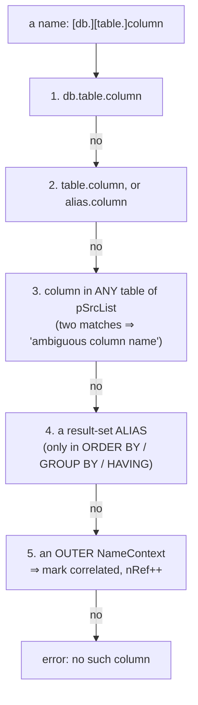

**Why aliases only work in ORDER BY / GROUP BY / HAVING:** those clauses are evaluated
*after* the result set exists. In `WHERE`, the result set has not been computed yet, so
`SELECT a+b AS s FROM t WHERE s>5` is an error — a rule that follows from the execution
order, not from arbitrary syntax.

Special names handled here: `rowid`/`oid`/`_rowid_` (→ `iColumn = -1`), `NEW.`/`OLD.` in
triggers, `excluded.` in upserts, generated columns.

### 6.3 The `Walker` — one traversal, many passes

```c
struct Walker {
  Parse *pParse;
  int (*xExprCallback)(Walker*, Expr*);    /* WRC_Continue / WRC_Prune / WRC_Abort */
  int (*xSelectCallback)(Walker*, Select*);
  void (*xSelectCallback2)(Walker*, Select*);
  union { NameContext *pNC; int n; SrcList *pSrcList; ... } u;
};
```

Generic tree traversal with callbacks. Used by name resolution, constant propagation,
subquery flattening, WHERE push-down, aggregate detection, and more. **Learn it once, and
six optimizer passes become readable.**

> **C sidebar.** This is the visitor pattern without classes: a struct of function pointers
> plus a union for per-pass state. Same technique as the VFS, different purpose.

---

## Part 7 — LLD: type affinity

### 7.1 The five rules, in order

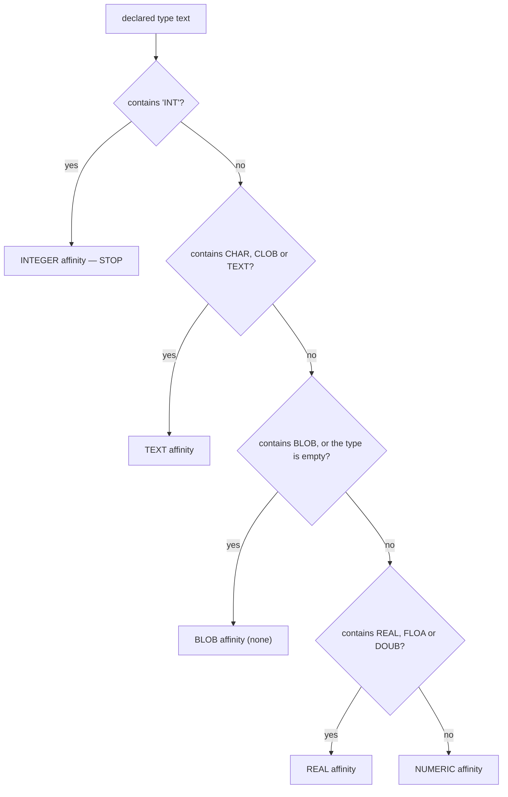

**Verified consequences** (run on this machine):

```sql
CREATE TABLE t(a "FLOATING POINT", b "MY TEXT FIELD", c "BIGBLOB", d VARCHAR(255));
INSERT INTO t VALUES('123','123','123','123');
SELECT typeof(a), typeof(b), typeof(c), typeof(d) FROM t;
-- integer | text | text | text
```

`"FLOATING POINT"` gets **INTEGER** affinity because the scanner finds `int` inside
`POINT`, and the INT rule wins unconditionally. This is not a bug; it is rule 1 applied
literally, and it is documented behaviour.

### 7.2 Why affinity exists at all

SQLite is **dynamically typed**: a value carries its own type, and any column can hold any
type. But users write `age INTEGER` and expect `'42'` inserted from a text-based API to
behave like a number.

Affinity is the compromise: *a preference applied on store and on compare, not a
constraint*.

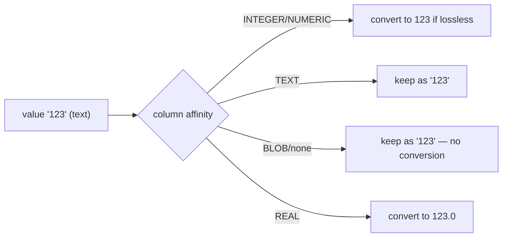

### 7.3 Affinity in comparisons — where the surprises live

```sql
CREATE TABLE t(x INTEGER, y TEXT);
INSERT INTO t VALUES(1,'1');
SELECT x='1', y=1, x=y FROM t;   -- 1 | 1 | 1
SELECT '1'=1;                    -- 0   ← no column, no affinity
```

The rule (`sqlite3CompareAffinity`): if one side has INTEGER/REAL/NUMERIC affinity and the
other is TEXT/BLOB, numeric affinity is applied to the text side before comparing. Two
*literals* have no affinity, so `'1'=1` compares text to integer and is false — text and
numeric values are never equal in SQLite's type ordering.

### 7.4 Collation

Built-in: `BINARY` (memcmp), `NOCASE` (ASCII-only case folding), `RTRIM`.

Precedence for a comparison:
```
1. an explicit COLLATE on the left operand (anywhere in its subtree)
2. an explicit COLLATE on the right operand
3. the left operand's column collation
4. the right operand's column collation
5. BINARY
```

**Practical consequence:** an index on `name` (BINARY) cannot serve
`WHERE name = ? COLLATE NOCASE`. The index is sorted by one ordering and the query asks for
another. Fix: `CREATE INDEX i ON t(name COLLATE NOCASE)`. You will verify this with
`EXPLAIN QUERY PLAN` in the labs.

---

## Part 8 — LLD: the schema in memory

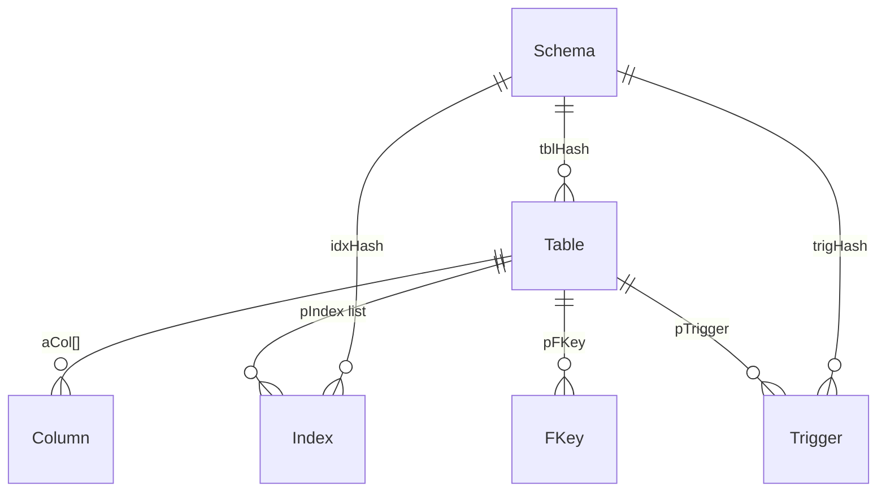

```c
struct Table {
  char *zName;
  Column *aCol; i16 nCol;
  Index *pIndex;         /* linked list of indexes on this table */
  Pgno tnum;             /* ← the ROOT PAGE of the table b-tree */
  LogEst nRowLogEst;     /* estimated rows (from sqlite_stat1) */
  LogEst szTabRow;       /* estimated average row size */
  u32 tabFlags;          /* TF_WithoutRowid, TF_HasPrimaryKey, TF_Autoincrement */
  i16 iPKey;             /* the INTEGER PRIMARY KEY column, or -1 */
};

struct Index {
  char *zName;
  i16 *aiColumn;         /* table columns; -1 = rowid, -2 = an expression */
  LogEst *aiRowLogEst;   /* [0]=rows, [i]=avg rows per distinct i-column prefix */
  Pgno tnum;
  const char **azColl;   /* collation per column */
  Expr *pPartIdxWhere;   /* partial index WHERE clause */
  u8 onError;            /* OE_Abort, OE_Replace, ... for UNIQUE */
};
```

`Table.tnum` is the bridge to Phase 3: it is the b-tree root page number, and it becomes
`OP_OpenRead P2` in the bytecode.

### 8.1 Bootstrapping

```mermaid
sequenceDiagram
    participant C as sqlite3_open / first query
    participant P as prepare.c
    participant B as btree.c
    participant PA as the parser
    C->>P: sqlite3InitOne(db, iDb)
    Note over P: the definition of sqlite_schema is HARD-CODED in C,<br/>and its root page is HARD-CODED to 1
    P->>B: read the 100-byte header: page size, encoding, cookie, format
    P->>B: SELECT name, rootpage, sql FROM sqlite_schema
    loop each row
        P->>P: db->init.busy = 1; db->init.newTnum = rootpage
        P->>PA: RE-PARSE the stored CREATE statement
        PA->>P: build a Table/Index object, install it in the hash,<br/>using newTnum instead of allocating a page
    end
    P->>P: mark DB_SchemaLoaded
```

**`db->init.busy` is the whole trick.** The *same* code that executes `CREATE TABLE` also
loads the schema; the flag switches it from "create a b-tree and emit bytecode" to "install
this object with this existing root page."

### 8.2 Why the schema is text, and what it costs

| | Text SQL (SQLite) | Binary catalog (most engines) |
|---|---|---|
| Formats to freeze | one — the SQL grammar | two — SQL and the catalog |
| New syntax | needs no catalog change | needs a catalog version bump |
| Repair | `PRAGMA writable_schema` + `UPDATE` | a special tool |
| Open cost | re-parse every object | fast load |

**Derivable consequences** (you should be able to explain each):
1. A corrupt `sql` column makes the database unopenable.
2. `ALTER TABLE RENAME` must rewrite the *text* of dependent views/triggers/FKs.
3. Every DDL bumps the schema cookie, invalidating other connections' prepared statements.

### 8.3 `SQLITE_SCHEMA` and automatic re-prepare

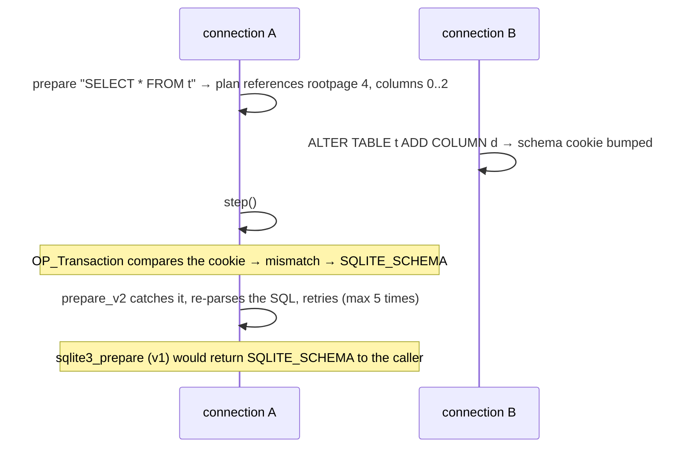

**Why the cookie check is inside `OP_Transaction`:** it must happen after the read lock is
taken, atomically with starting the transaction. Checking earlier would race.

---

## Part 9 — `sqlite3NestedParse` — SQLite writing SQL to itself

```c
sqlite3NestedParse(pParse,
   "UPDATE %Q." LEGACY_SCHEMA_TABLE " SET rootpage=%d WHERE #%d AND rootpage=#%d",
   db->aDb[iDb].zDbSName, iTo, iReg, iFrom);
```

Two syntax extensions available only to internal parses:
- `%Q` — quote an identifier safely,
- `#N` — "the value currently in VDBE register N".

**Why:** DDL must update `sqlite_schema`, which is an ordinary table. Rather than
hand-emitting dozens of opcodes, `build.c` generates SQL and compiles it. The cost is
runtime parsing during DDL; the benefit is that DDL implementation stays short and obviously
correct.

---

## Part 10 — Triggers and views (front-end view)

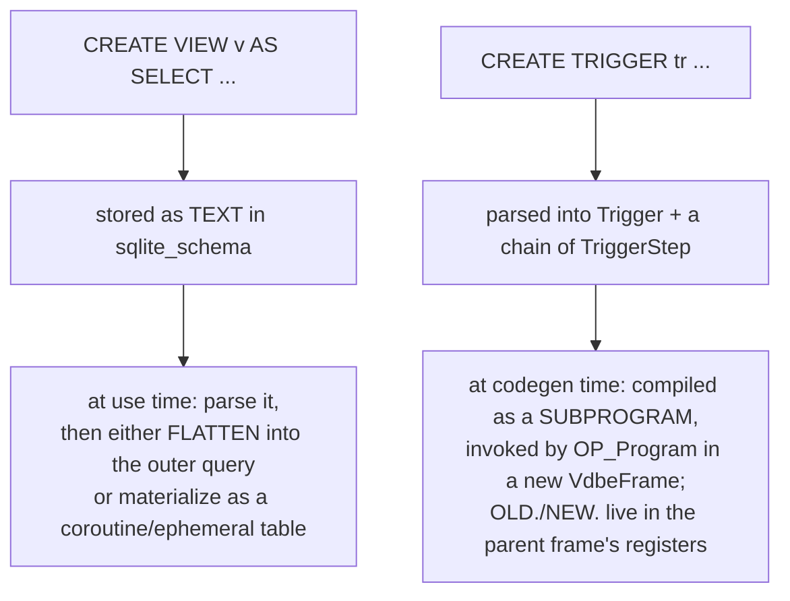

```c
struct TriggerStep {
  u8 op;                 /* TK_UPDATE, TK_INSERT, TK_DELETE, TK_SELECT */
  Select *pSelect; SrcList *pFrom; Expr *pWhere;
  ExprList *pExprList; IdList *pIdList; Upsert *pUpsert;
  char *zTarget; TriggerStep *pNext, *pLast;
};
```

A view's `Select` must be **duplicated** before use — consuming it in place would destroy
the schema for the next statement. That is what `sqlite3SelectDup` is for, and forgetting
it is a classic patch bug.

---

## Part 11 — Debugging the front end

```
sqlite> .treetrace 0xffff      -- dump the Select tree at every transformation
sqlite> .wheretrace 0xfff      -- planner internals (Phase 6)
sqlite> PRAGMA parser_trace=ON;-- Lemon shift/reduce trace (SQLITE_DEBUG builds)
```

Real `.treetrace` output, showing resolution happening:

```
begin processing:
'-- SELECT
    |-- result-set
    |   '-- ID "name"                   ← just a name
    |-- FROM
    |   '-- {-1:*} users                ← no cursor assigned yet
    ...
After result-set wildcard expansion:
    |   '-- {0:*} users tab='users' nCol=3 used=0    ← cursor 0 assigned
after name resolution:
    |-- result-set
    |   '-- {0:1} pTab=... fg.af=800000.n            ← TK_COLUMN: cursor 0, column 1
    |-- WHERE
    |   '-- GT
    |       |-- {0:2} pTab=...                        ← cursor 0, column 2
    |       '-- 40
    '-- ORDERBY
        '-- iOrderByCol=1
```

`{cursor:column}` notation, and `used=6` is the `colUsed` bitmask (columns 1 and 2 ⇒
bits 1|2 = 6). **This is the single best debugging tool in the front end.**

---

## Part 12 — Design decisions, collected

| Decision | Alternative | Why |
|---|---|---|
| Lemon, not bison | bison | reentrant, destructors, `%fallback`, public domain |
| generated perfect hash for keywords | binary search | O(1) with one memcmp; tokenizer runs on every byte |
| stream tokens into the parser | build a token array | O(tree) memory instead of O(text) |
| grammar actions build the tree directly | a separate AST pass | fewer passes, less allocation |
| `%fallback` | reserve all keywords | `CREATE TABLE t(key)` keeps working |
| three unions inside `Expr` | separate fields | a big query allocates thousands of `Expr`s |
| names → integers in a separate pass | resolve during parsing | the FROM clause may appear after the column reference |
| `nRef` counter for correlation | a full dependency analysis | one integer answers the only question that matters |
| affinity, not strict typing | static typing | dynamic typing is the product; affinity is the ergonomic compromise |
| INT rule wins and breaks early | longest-match rules | simplest possible scan; documented quirk accepted |
| schema stored as SQL text | binary catalog | one format, one parser, hand-repairable |
| `db->init.busy` reuses the DDL code path | a separate loader | one implementation of `CREATE TABLE` semantics |
| `sqlite3NestedParse` | hand-emitted opcodes | DDL stays short and obviously correct |
| parse limits | unbounded | the parser is exposed to untrusted SQL |

---

## Part 13 — Misconceptions

| Belief | Reality |
|---|---|
| "`VARCHAR(50)` limits length" | only affinity is derived; the number is used for a *size estimate* |
| "column types are enforced" | affinity is a preference; any column can hold any type (unless STRICT) |
| "`\"x\"` is always a string" | it is an identifier that *falls back* to a string (DQS) |
| "the parser builds an AST, then another pass builds the tree" | the grammar actions build the final structs directly |
| "aliases work in WHERE" | only in ORDER BY / GROUP BY / HAVING — the result set does not exist yet in WHERE |
| "the schema is a binary catalog" | it is the original `CREATE` text, re-parsed on every connection |
| "SQLITE_SCHEMA is an error you must handle" | `prepare_v2` retries automatically |
| "`parse.c` is worth reading" | it is generated; read `parse.y` |

---

## Part 14 — Code map

| Concern | Function / file |
|---|---|
| tokenizer | `sqlite3GetToken`, `aiClass[]`, `keywordCode` — `tokenize.c` |
| keyword hash | `keywordhash.h` — **generated** by `tool/mkkeywordhash.c` |
| parse driver | `sqlite3RunParser` — `tokenize.c` |
| grammar | `parse.y` (hand) → `parse.c` (**generated** by `tool/lemon.c`) |
| expression construction | `sqlite3PExpr`, `sqlite3ExprAlloc`, `sqlite3ExprDup` — `expr.c` |
| name resolution | `sqlite3ResolveExprNames`, `lookupName`, `resolveSelectStep` — `resolve.c` |
| tree traversal | `sqlite3WalkExpr`, `sqlite3WalkSelect` — `walker.c` |
| affinity | `sqlite3AffinityType` — `build.c` |
| collation | `sqlite3ExprCollSeq`, `sqlite3FindCollSeq` — `expr.c`, `callback.c` |
| schema objects | `sqlite3StartTable`, `sqlite3AddColumn`, `sqlite3EndTable`, `sqlite3CreateIndex` — `build.c` |
| nested parse | `sqlite3NestedParse` — `build.c` |
| schema load | `sqlite3InitOne`, `sqlite3InitCallback` — `prepare.c` |
| debug printing | `sqlite3TreeViewExpr/Select/SrcList` — `treeview.c` |

Next: `2.code_walkthrough.md` reads `sqlite3RunParser`, `sqlite3AffinityType`, and
`lookupName`; `3.implementation.md` has you dump tokens and watch `ID "name"` become
`{0:1}`, then add a keyword to the grammar yourself.
