# Phase 5 — Code Generation and the Virtual Machine

C you need first: `C-FOR-SQLITE.md` §4 (casting/opaque types), §7 (unions), §8 (bit flags),
§14 (goto and shared exit labels), §16 (macros).

---

## Part 1 — Why compile SQL to bytecode at all

### 1.1 Three ways to execute a query

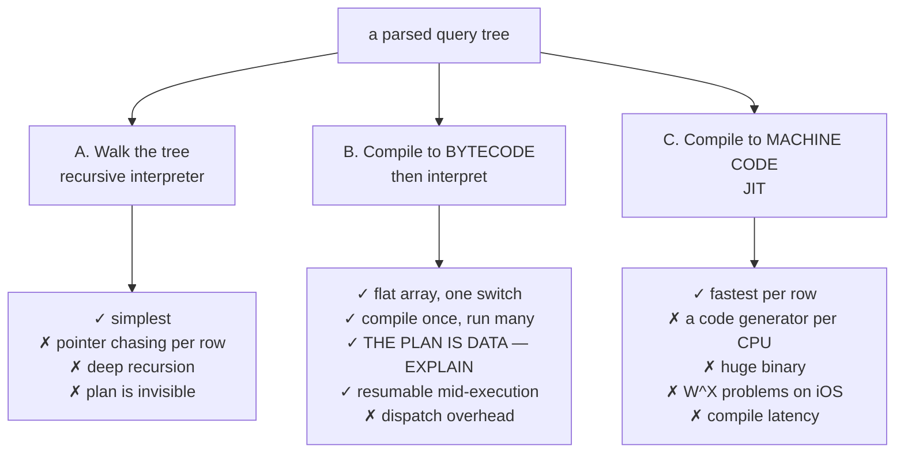

SQLite chose **B**, and the decisive reasons are not speed:

| Reason | Consequence you rely on |
|---|---|
| the plan is **data** | `EXPLAIN` prints it; `bytecode()` queries it; you can diff two plans |
| execution is **resumable** | `sqlite3_step()` returns a row and continues later → streaming a 10 GB result in constant memory |
| no recursion | bounded stack; runs on a microcontroller |
| no code generation per platform | one C file, every CPU, no W^X, no JIT security surface |

**Why not a JIT:** SQLite targets phones, embedded devices, and iOS (where writable-executable
memory is forbidden). A JIT would also make the library many times larger for a benefit
that disappears as soon as a query touches the disk.

### 1.2 Register machine, not stack machine

SQLite was a *stack* machine until 2008. It changed. Why:

```
stack machine:   Column 0,1 ; Column 0,2 ; Add ; Push 40 ; Gt ; JumpIfFalse
register machine: Column 0,1,r1 ; Column 0,2,r2 ; Add r1,r2,r3 ; Gt r3,40 → jump
```

| | Stack | Register |
|---|---|---|
| Instructions for `a+b > 40` | 6 | 3 |
| Extra push/pop traffic | yes | none |
| Reuse a computed value twice | duplicate or re-compute | just name the register again |
| Code generator complexity | simpler | needs register allocation |

Fewer instructions means fewer dispatches, and dispatch is the dominant cost in an
interpreter. The register form also lets the code generator keep a value around and refer to
it by number, which is essential for things like `OP_Once` and constant factoring.

---

## Part 2 — HLD: the machine

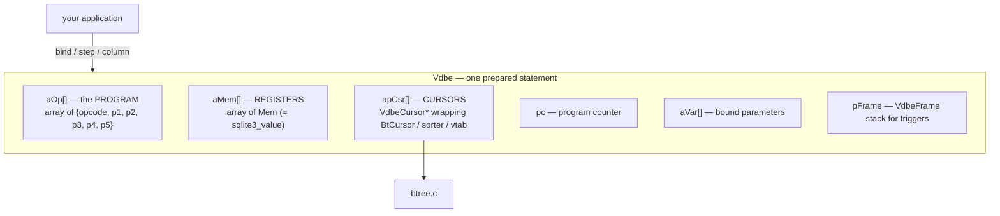

Three numbers define a statement: `nOp` (instructions), `nMem` (registers), `nCursor`
(cursors). All three are known after code generation, so `sqlite3VdbeMakeReady()` allocates
them in **one** block.

### 2.1 The instruction

```c
struct VdbeOp {
  u8 opcode;
  signed char p4type;
  u16 p5;               /* flags */
  int p1, p2, p3;       /* cursor numbers, register numbers, jump targets */
  union p4union {
    int i; void *p; char *z; i64 *pI64; double *pReal;
    FuncDef *pFunc; CollSeq *pColl; Mem *pMem; KeyInfo *pKeyInfo;
    SubProgram *pProgram; Table *pTab; ...
  } p4;
#ifdef SQLITE_ENABLE_EXPLAIN_COMMENTS
  char *zComment;
#endif
};
```

Operand conventions are consistent across all ~190 opcodes — learn them once:

```
P1  usually a CURSOR number, sometimes a register
P2  usually a JUMP TARGET, sometimes a register
P3  usually an OUTPUT register
P4  typed extra data: KeyInfo, collation, function pointer, affinity string, table name
P5  flags (OPFLAG_*)
```

### 2.2 The register

```c
struct sqlite3_value {          /* == Mem */
  union MemValue { double r; i64 i; int nZero; ... } u;
  u16 flags;        /* MEM_Null|MEM_Str|MEM_Int|MEM_Real|MEM_Blob|MEM_Dyn|MEM_Ephem... */
  u8  enc;
  int n;            /* byte length of a string/blob */
  char *z;          /* string/blob bytes */
  char *zMalloc;    /* the allocation backing z, if owned */
  sqlite3 *db;
  void (*xDel)(void*);
};
```

> **C sidebar — flags as a type tag *and* a cache.** A `Mem` can have `MEM_Int|MEM_Str` set
> simultaneously, meaning "this is the integer 42 and we have already rendered '42', so
> `sqlite3_column_text()` is free." The union holds one value; the flags say how to read it
> *and* what has been derived. This is why `sqlite3_column_text()` can invalidate a pointer
> returned by `sqlite3_column_blob()` — it may convert the register in place. See
> `C-FOR-SQLITE.md` §7 and §8.

Memory-ownership flags, which cause most VDBE bugs:

| Flag | Who owns `z` | Rule |
|---|---|---|
| `MEM_Static` | nobody (static storage) | never free |
| `MEM_Dyn` | this `Mem`, freed by `xDel` | free on reset |
| `MEM_Ephem` | **someone else** (e.g. a page buffer) | must be copied to survive |

`MEM_Ephem` is a hand-rolled borrow checker: it marks a value that is only valid until the
cursor moves.

---

## Part 3 — LLD: the universal program shape

Every SQLite program looks like this:

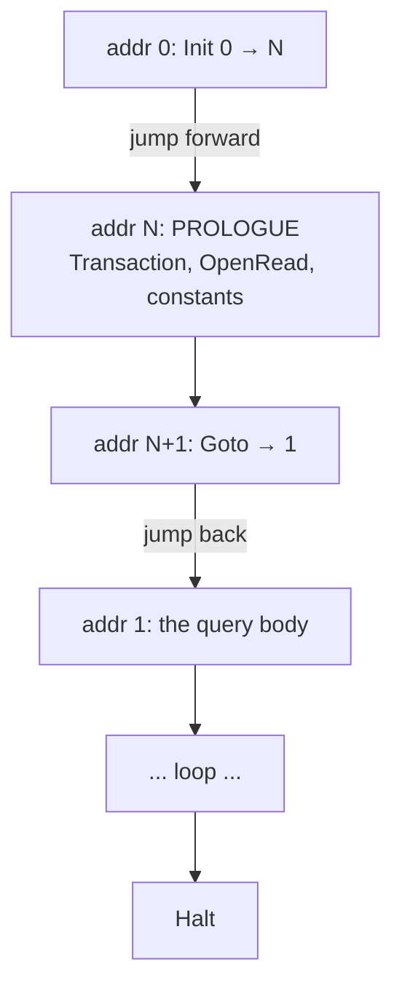

**Why the prologue is at the end.** Code is emitted in one forward pass. Which transactions
to start, which cursors to open, and which constants to hoist are only known *after* the
body is generated. Rather than reserving space or shifting the array, SQLite appends the
prologue and jumps around it.

This is why `EXPLAIN` output always starts with `Init 0 10` and ends with
`Transaction / Goto 0 1`. Once you know, it stops looking strange.

---

## Part 4 — LLD: real programs, decoded

### 4.1 Point lookup — the cheapest possible plan

```sql
SELECT name FROM users WHERE id = 2;
```
```
1   OpenRead     0  2  0  2      users, root page 2
2   Integer      2  1  0         r[1] = 2
3   SeekRowid    0  6  1         position cursor 0 at rowid r[1]; jump to 6 if absent
4   Column       0  1  2         r[2] = column 1 of the current row
5   ResultRow    2  1  0         return r[2]
6   Halt
```

**No loop.** At most one row can match a rowid, so there is no `Next`. One b-tree descent,
one column read, done.

### 4.2 Index scan with a deferred table seek

```sql
SELECT name FROM users WHERE age > 40;    -- with CREATE INDEX i_age ON users(age)
```
```
1   OpenRead      0   2  0  3         users (table)
2   OpenRead      1   3  0  k(2,,)    i_age (index)
3   Integer      40   1  0
4   SeekGT        1   9  1  1         seek the INDEX to the first age > 40
5     DeferredSeek  1  0  0           "move cursor 0 to cursor 1's rowid IF NEEDED"
6     Column        0  1  2           r[2] = users.name  ← this is what forces the seek
7     ResultRow     2  1  0
8   Next          1   5  0            advance the INDEX cursor
9   Halt
```

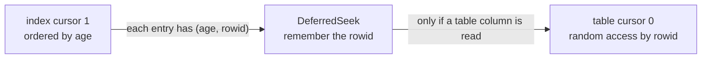

**Why `DeferredSeek` exists:** if the query had only needed `age` or `rowid`, the index
entry already contains them, and the table b-tree would never be touched. Deferring the
seek turns a partially-covering plan into a fully-covering one at runtime, for free.

### 4.3 Covering index — the table is never opened

```sql
SELECT id FROM users WHERE age = 45;
```
```
1   OpenRead     1  3  0  k(2,,)  2    i_age only; P5=2 is the SEEKEQ hint
2   Integer     45  1  0
3   SeekGE       1  8  1  1
4     IdxGT        1  8  1  1           stop as soon as the key exceeds 45
5     IdxRowid     1  2  0              the rowid comes FROM THE INDEX ENTRY
6     ResultRow    2  1  0
7   Next         1  4  1
8   Halt
```

**Cursor 0 does not exist.** The index holds `(age, rowid)`, which is everything the query
needs. That is a covering index, visible in the bytecode.

Note the `SeekGE` + `IdxGT` idiom: equality on an index is *"seek to the first key ≥ X, then
stop when a key > X appears."* One mechanism serves `=`, `>`, `>=`, `BETWEEN`, and prefix
`LIKE`.

### 4.4 A join is a nested loop

```sql
SELECT u.name, o.total FROM users u JOIN orders o ON o.uid=u.id WHERE u.age>40;
```
```
1   OpenRead    1  4  0  3      orders   ← OUTER
2   OpenRead    0  2  0  3      users    ← INNER, reached by rowid
3   Rewind      1 13  0
4     Column      1  1  1       r[1] = o.uid
5     SeekRowid   0 12  1       position users at rowid r[1]
6     Column      0  2  2       r[2] = u.age
7     Le          3 12  2       if r[2] <= r[3] goto 12   (skip this row)
8     Column      0  1  4       r[4] = u.name
9     Column      1  2  5       r[5] = o.total
10    RealAffinity 5 0  0
11    ResultRow   4  2  0
12  Next        1  4  0
13  Halt
14  Transaction ...
15  Integer    40  3  0         ← the constant 40 lives in the PROLOGUE
```

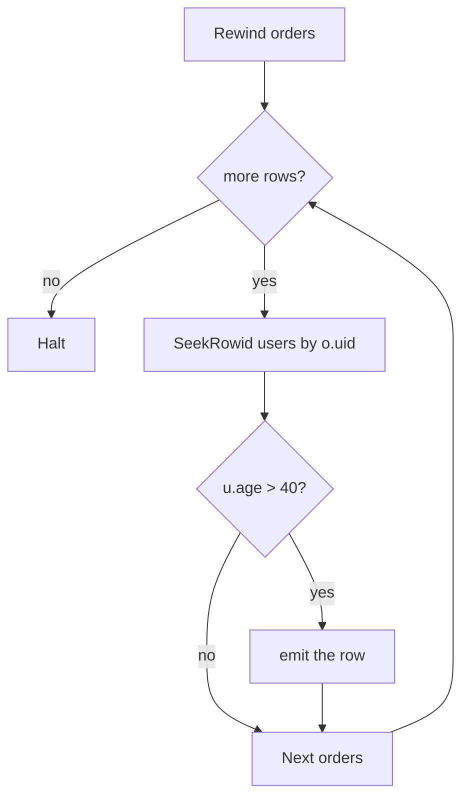

**SQLite has only nested-loop joins.** No hash join, no sort-merge join. The reason is the
same one that shaped the b-tree: with good indexes, a nested loop *is* an index-nested-loop
join, which is optimal for selective queries and needs no memory. Bloom filters were added
in 3.38 (`OP_Filter`) as a pre-filter for large star joins, but the loop structure is
unchanged.

**Constant factoring:** `Integer 40 r[3]` sits in the prologue, not inside the loop
(`sqlite3ExprCodeRunJustOnce`). Loop-invariant code motion, done by the code generator.

### 4.5 GROUP BY — subroutines in generated code

```sql
SELECT age, count(*) FROM users GROUP BY age;
```
Structure of the 33-instruction program:

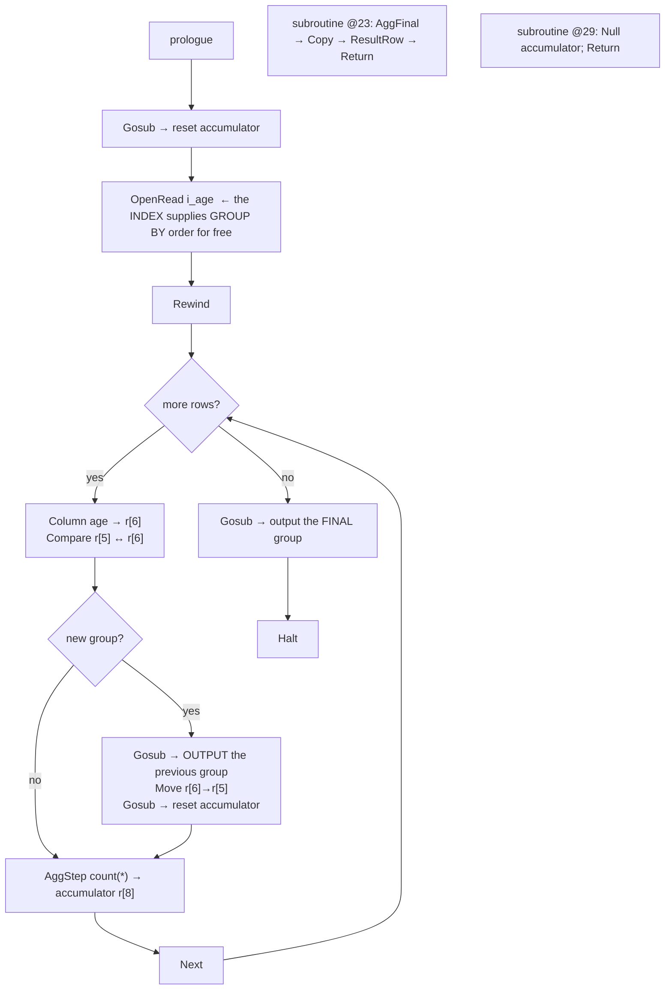

Three things to take away:

1. **`OP_Gosub`/`OP_Return` give the code generator subroutines.** "Flush a group" is needed
   in two places — on a group change and at the end — so it is emitted once and called
   twice.
2. **No sorter appears**, because an index on `age` already delivers rows in group order.
   Without the index you would see `SorterOpen`/`SorterInsert`/`SorterSort`/`SorterData`.
3. **`AggStep` / `AggFinal`** are exactly the `xStep`/`xFinal` interface exposed by
   `sqlite3_create_function`. Built-in and user-defined aggregates use one mechanism.

### 4.6 The write path

```sql
INSERT INTO users VALUES(9,'x',1);
```
```
1   OpenWrite  0  2  0  3        users
2   OpenWrite  1  3  0  k(2,,)   i_age
3   SoftNull   2                 r[2] = NULL   ← the INTEGER PRIMARY KEY column
4   String8    0  3  0  'x'      r[3] = 'x'
5   Integer    1  4  0           r[4] = 1
6   Integer    9  1  0           r[1] = 9      ← the rowid
7   NotNull    1  9  0
8   NewRowid   0  1  0           (only if the rowid was NULL)
9   MustBeInt  1
11  NotExists  0 13  1           does rowid 9 already exist?
12  Halt 1555 2 0 'users.id'     SQLITE_CONSTRAINT_PRIMARYKEY
13  Affinity   2  3  0  'DBD'    apply column affinities to r[2..4]
15  SCopy      4  6              r[6] = age
16  IntCopy    1  7              r[7] = rowid
17  MakeRecord 6  2  5           r[5] = index key (age, rowid)
18  MakeRecord 2  3  8           r[8] = the row record
19  IdxInsert  1  5  6  2   16   insert into i_age
20  Insert     0  8  1  users 49 insert into the table
21  Halt
```

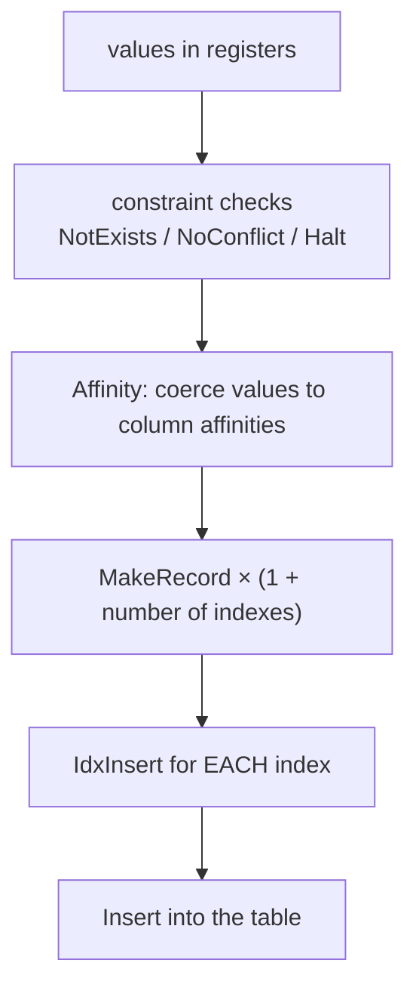

**Read the whole write path out of this:** checks first, then build records, then every
index, then the table. `SoftNull` on the `INTEGER PRIMARY KEY` column is Phase 1's
discovery — the rowid alias is stored as NULL in the record.

**Why indexes are written before the table:** if an index insert fails (a UNIQUE
violation), the table row has not been written yet, so less needs undoing.

---

## Part 5 — LLD: the interpreter

```c
for(pOp=&aOp[p->pc]; 1; pOp++){
  assert( rc==SQLITE_OK );          /* errors must goto, never fall through */
  nVmStep++;                        /* drives the progress handler */
  switch( pOp->opcode ){
    case OP_Integer: {              /* out2 */
      pOut = out2Prerelease(p, pOp);
      pOut->u.i = pOp->p1;
      break;
    }
    case OP_Goto: { pOp = &aOp[pOp->p2 - 1]; break; }   /* the -1 anticipates pOp++ */
    ...
  }
}
```

### 5.1 Why one giant function instead of 190 small ones

| | 190 functions | one `switch` |
|---|---|---|
| shared locals (`aMem`, `aOp`, `db`, `pOut`) | passed or re-loaded each call | live in registers for the whole loop |
| dispatch | indirect call | jump table / computed goto |
| shared error labels | impossible | `goto abort_due_to_error` from anywhere |
| readability | better | worse — mitigated by never reading it linearly |

The function is deliberately monolithic for performance, and the project accepts the
readability cost because **you are never supposed to read it top to bottom** — you read one
`case` at a time, chosen from `EXPLAIN` output.

### 5.2 Comments that are compiled

```c
/* Opcode: OpenRead P1 P2 P3 P4 P5
** Synopsis: root=P2 iDb=P3
** ...
*/
case OP_OpenRead: {      /* ncycle */
```

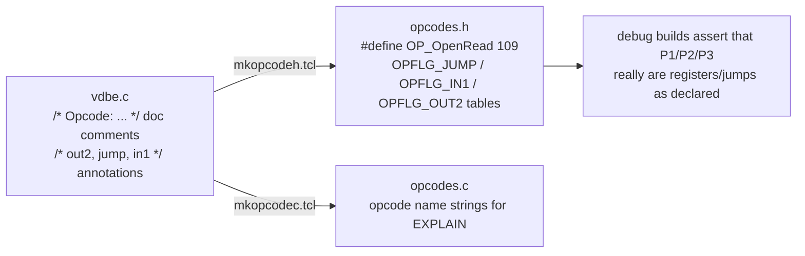

If you add an opcode and mislabel it `/* in1 */` when it is really `/* out2 */`, a
`SQLITE_DEBUG` build stops at an assert the first time it runs. The annotation system is
your safety net in Lab 5.6.

### 5.3 `OP_Column` — the most important opcode

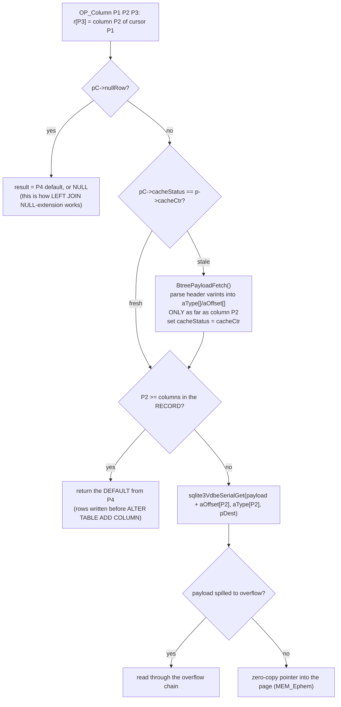

Three consequences you can now derive:

1. **Column position costs.** Reaching column 20 walks 20 header varints. Measurable — Lab
   5.9. Put hot columns early in wide tables.
2. **The header parse is cached per cursor position.** Two `OP_Column`s on the same row share
   one parse. Any cursor movement sets `CACHE_STALE`.
3. **`ALTER TABLE ADD COLUMN` is O(1)** because old rows simply have short records, and
   `OP_Column` returns the default for missing columns. No table rewrite.

### 5.4 `OP_MakeRecord` — the header-size chicken and egg

```
pass 1: for each value, compute its serial type and body size
        accumulate nHdr (bytes of type varints) and nByte (body bytes)
        apply the P4 affinity string first
        --- the puzzle ---
        nVarint = sqlite3VarintLen(nHdr);
        nHdr += nVarint;
        if( nVarint < sqlite3VarintLen(nHdr) ) nHdr++;   /* adding it crossed 127 */
pass 2: write the header-size varint, then the types, then the bodies
```

The record header must begin with **its own total size**, but adding that varint can push
the total past 127 and make the varint one byte longer. The three-line fixup handles it.
This is the writer for the format your Phase 1 parser reads.

### 5.5 `OP_ResultRow` — pausing mid-program

```c
p->pResultRow = &aMem[pOp->p1];     /* NO COPY — a pointer into the register array */
p->pc = (int)(pOp - aOp) + 1;       /* remember where to resume */
rc = SQLITE_ROW;
goto vdbe_return;                   /* return to sqlite3_step's caller */
```

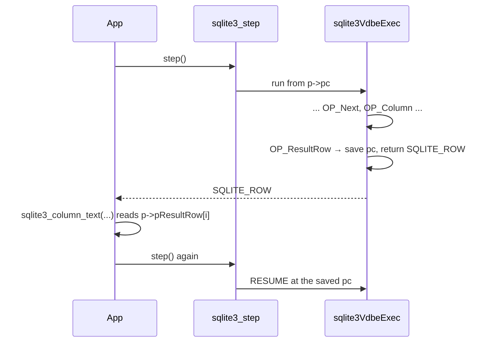

**This is why an open statement holds a read transaction**, and why column pointers are
invalidated by the next `step()`. It is also why a 10 GB result set costs no extra memory.

---

## Part 6 — LLD: code generation

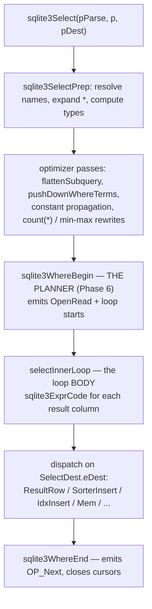

### 6.1 `SelectDest` — one query body, twelve consumers

The same `SELECT` machinery serves a top-level query, a subquery, an `IN (...)` set, a
`CREATE TABLE AS`, and more. The difference is one enum:

| `eDest` | Where rows go |
|---|---|
| `SRT_Output` | `OP_ResultRow` → the application |
| `SRT_Mem` | one register (a scalar subquery) |
| `SRT_Set` | an ephemeral index (for `IN (...)`) |
| `SRT_EphemTab` | an ephemeral table |
| `SRT_Coroutine` | yielded to a consumer, row by row |
| `SRT_Exists` | set a register to 1 and stop |
| `SRT_Union` / `SRT_Except` | compound-select accumulation |
| `SRT_Discard` | thrown away (a `SELECT` inside a trigger) |

Reading `selectInnerLoop()`'s `switch(eDest)` is the fastest way to understand how one
implementation covers all of SQL's query contexts.

### 6.2 Expressions: value mode vs jump mode

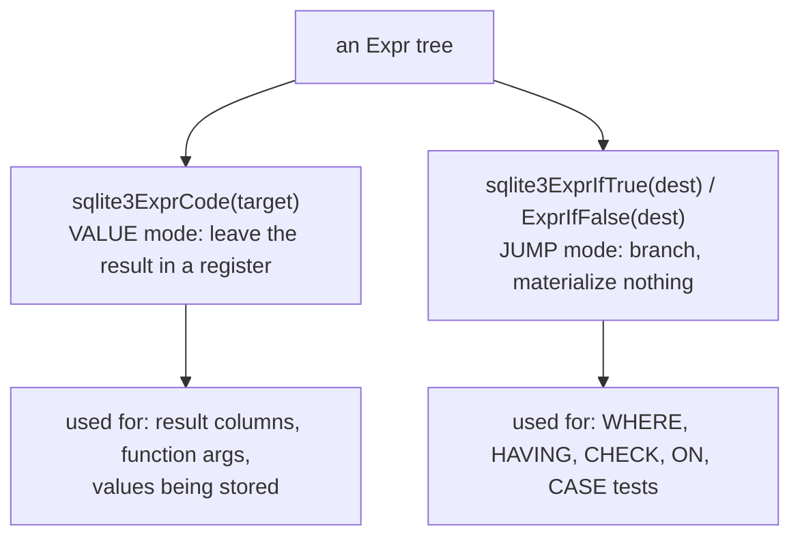

`sqlite3ExprIfTrue` on `TK_AND` emits: *evaluate the left; if false jump past everything;
else evaluate the right.* **Short-circuit evaluation is not an optimization — it is the only
thing the generator knows how to emit for a condition.** The `jumpIfNull` parameter threads
SQL's three-valued logic through the transformation.

### 6.3 Register allocation and labels

```c
int target = ++pParse->nMem;              /* a permanent register */
int reg    = sqlite3GetTempReg(pParse);   /* from an 8-slot temp pool */
sqlite3ReleaseTempReg(pParse, reg);
int base   = sqlite3GetTempRange(pParse, n);   /* n contiguous registers */

int lbl = sqlite3VdbeMakeLabel(pParse);        /* a NEGATIVE pseudo-address */
sqlite3VdbeAddOp2(v, OP_Goto, 0, lbl);
sqlite3VdbeResolveLabel(v, lbl);               /* bind it here */

int a = sqlite3VdbeAddOp2(v, OP_If, reg, 0);   /* or patch by address */
sqlite3VdbeJumpHere(v, a);
```

Labels are negative numbers resolved in a final pass (`resolveP2Values`), which is also
where SQLite computes `readOnly`, `bIsReader`, and whether a statement journal is needed.

---

## Part 7 — Subprograms, coroutines, frames

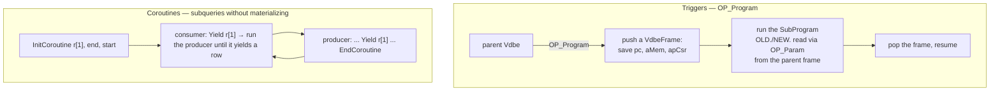

**Why coroutines:** `SELECT * FROM (SELECT ... ORDER BY x) LIMIT 5` should not materialize
the whole subquery. A coroutine produces one row per request, so `LIMIT` stops the producer
early. In `EXPLAIN QUERY PLAN` it appears as `CO-ROUTINE`; the alternative shows as
`MATERIALIZE`.

---

## Part 8 — Statement lifecycle

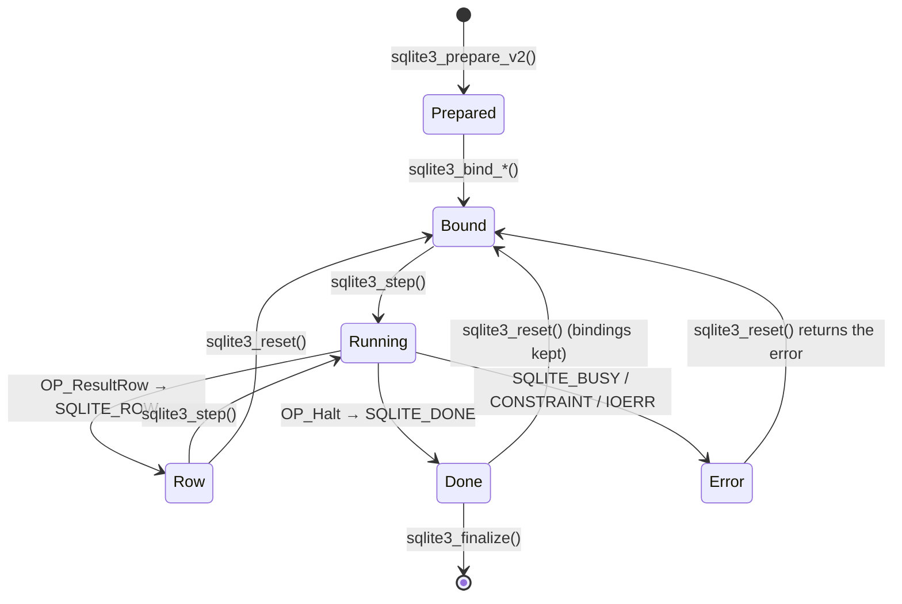

| Call | Cost |
|---|---|
| `prepare_v2` | parse + plan + codegen — **expensive** |
| `bind` | write a register — trivial |
| `step` | run until the next `ResultRow` |
| `reset` | rewind `pc`, close cursors, **keep bindings** |
| `finalize` | free everything |

**The performance rule this implies:** prepare once, bind and step many times. Preparing
inside a loop re-runs the parser and planner for every row.

---

## Part 9 — Optimizations visible in the bytecode

| Optimization | What you see in `EXPLAIN` |
|---|---|
| constant factoring | `Integer`/`String8` in the prologue, not in the loop |
| `count(*)` | `OP_Count` on the smallest index, no scan |
| `min()`/`max()` | `OP_Last`/`OP_Rewind` + one `Column`, no loop |
| covering index | the table cursor is never opened |
| deferred seek | `OP_DeferredSeek` instead of an immediate `SeekRowid` |
| index satisfies ORDER BY | no `Sorter*` opcodes |
| index satisfies DISTINCT | no `OpenEphemeral` dedup table |
| one-time subquery | `OP_Once` guarding the materialization |
| short-circuit conditions | jump chains, no boolean registers |
| automatic index | `OP_OpenAutoindex` — the planner built a transient index |
| Bloom filter (3.38+) | `OP_FilterAdd` / `OP_Filter` on a star join |
| transfer optimization | `INSERT INTO t2 SELECT * FROM t1` copies raw records with `OP_RowData` |

**How to use this table:** run `EXPLAIN`, look for the presence or absence of these
signatures, and you have diagnosed the plan without reading any planner code.

---

## Part 10 — Design decisions, collected

| Decision | Alternative | Why |
|---|---|---|
| bytecode | tree walking / JIT | the plan becomes data (`EXPLAIN`), execution becomes resumable, no per-platform codegen |
| register machine | stack machine | ~half the instructions; values can be named and reused |
| one giant `switch` | 190 functions | shared locals stay in registers; shared error labels |
| doc comments generate `opcodes.h` | a hand-maintained table | the definition and the documentation cannot drift apart |
| prologue emitted last, jumped to | reserve space up front | single-pass codegen with no shifting |
| `pResultRow` points into registers | copy the row out | zero-copy; `sqlite3_column_*` reads directly |
| save `pc` and return on `ResultRow` | produce all rows, then return | constant memory for any result size |
| jump-mode expression codegen | materialize booleans | short-circuit falls out for free |
| `OP_Gosub`/`OP_Return` | inline duplicated code | GROUP BY flush logic emitted once |
| coroutines for FROM subqueries | always materialize | `LIMIT` can stop the producer early |
| `OP_Program` + `VdbeFrame` for triggers | inline expansion | recursion depth is bounded and traceable |
| `SelectDest` enum | separate code paths per context | one `SELECT` implementation serves 12 consumers |
| per-cursor header cache (`aType`/`aOffset`) | parse the header per column | two `Column`s on a row share one parse |

---

## Part 11 — Misconceptions

| Belief | Reality |
|---|---|
| "`EXPLAIN` runs the query" | it only prints the program; neither `EXPLAIN` nor `EQP` executes |
| "opcode numbers are stable" | they are generated and change between versions; names are stable |
| "the VDBE is slow because it is an interpreter" | dispatch is a few ns; a single page read is ~2000× that |
| "registers are typed" | a register is a `Mem`; the type is in `flags` and can change |
| "`sqlite3_column_text` is read-only" | it may convert the register in place, invalidating other pointers |
| "an open statement is free" | it holds a read transaction |
| "reading any column costs the same" | later columns cost more header walking |
| "SQLite can do hash joins" | it cannot; all joins are nested loops (plus Bloom pre-filters) |
| "`ALTER TABLE ADD COLUMN` rewrites the table" | it does not; `OP_Column` supplies defaults for short records |

---

## Part 12 — Code map

| Concern | Function / file |
|---|---|
| the interpreter | `sqlite3VdbeExec` — `vdbe.c` |
| program assembly | `sqlite3VdbeAddOp*`, `MakeLabel`, `ResolveLabel`, `JumpHere` — `vdbeaux.c` |
| final pass | `resolveP2Values`, `sqlite3VdbeMakeReady` — `vdbeaux.c` |
| public API | `sqlite3_step/bind/column/reset/finalize` — `vdbeapi.c` |
| value manipulation | `sqlite3VdbeMemSetStr/MemStringify/MemNumerify` — `vdbemem.c` |
| external sort | `vdbesort.c` |
| SELECT codegen | `sqlite3Select`, `selectInnerLoop`, `generateSortTail` — `select.c` |
| expression codegen | `sqlite3ExprCode*`, `sqlite3ExprIfTrue/False` — `expr.c` |
| DML codegen | `insert.c`, `update.c`, `delete.c`, `sqlite3GenerateConstraintChecks` |
| triggers | `trigger.c` (`SubProgram`, `OP_Program`) |
| opcode tables | `opcodes.h`, `opcodes.c` — **generated** from `vdbe.c` comments |

Next: `2.code_walkthrough.md` reads the interpreter loop, `OP_Next`, and `OP_ResultRow`
line by line; `3.implementation.md` has you decode 20 programs and then add your own
opcode.
