# Phase 6 — The Query Planner (NGQP)

C you need first: `C-FOR-SQLITE.md` §1 (sized types), §8 (bitmasks), §12 (shifting).
Planner code is arithmetic on 16-bit integers; the C is easy, the reasoning is not.

---

## Part 1 — The problem

### 1.1 One query, many plans

```sql
SELECT u.name, o.total
  FROM users u JOIN orders o ON o.uid = u.id
 WHERE u.age > 40 AND o.total > 100
 ORDER BY o.total;
```

Decisions to make:

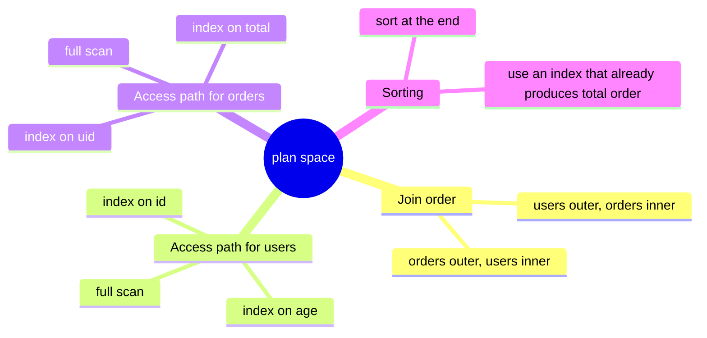

2 orders × 3 paths × 3 paths × 2 sort strategies = 36 plans for a two-table query. With
five tables it is millions. **The runtime difference between the best and worst is
routinely 1000×.**

### 1.2 Why cost-based, and what "cost" means

Rule-based planners ("always use an index if one exists") fail predictably: scanning a
1000-row table beats 1000 random index lookups. You need numbers.

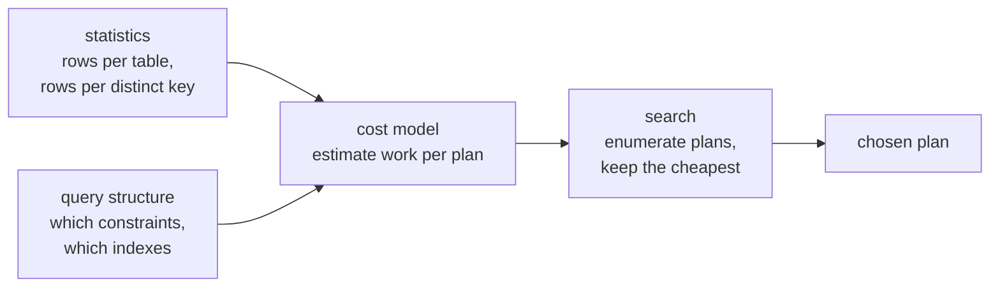

**Cost in SQLite ≈ the number of b-tree page accesses**, in a unit called LogEst. Not
milliseconds — a relative currency that lets two plans be compared.

### 1.3 The three-stage pipeline

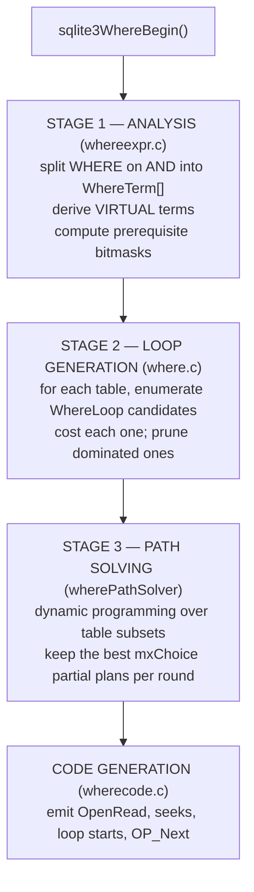

---

## Part 2 — LogEst: the arithmetic

### 2.1 Definition

```
LogEst(x) = round(10 · log₂(x))
```

| x | 1 | 2 | 5 | 10 | 100 | 1,000 | 1,000,000 | 10⁹ |
|---|---|---|---|---|---|---|---|---|
| LogEst | 0 | 10 | 23 | 33 | 66 | 99 | 199 | 299 |

### 2.2 The two rules that make it work

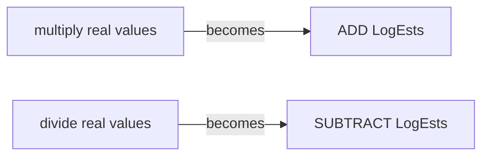

```
100 rows × 10 lookups each  →  66 + 33 = 99   →  2^9.9 ≈ 1000 ✓
1,000,000 rows ÷ 10 per key →  199 − 33 = 166 →  2^16.6 ≈ 100,000 ✓
+10 = ×2        +33 = ×10        −20 = ÷4        −60 = ÷64
```

**Why logarithms at all?**

| | float costs | LogEst |
|---|---|---|
| combining costs | multiply | **add** — one integer instruction |
| storage | 8 bytes | 2 bytes (`i16`) |
| determinism across platforms | FP rounding differs | exact integers |
| dynamic range | huge | 2^±3276, plenty |
| precision | exact | ~7% per step — **good enough** |

That last row is the real insight: the inputs are *estimates* with error bars of 10× or
more. Carrying 15 significant digits through a computation whose input is a guess is
wasted work. LogEst matches the precision of the data.

### 2.3 Adding two costs

Adding LogEsts multiplies. To *add* the underlying values you need
`sqlite3LogEstAdd(a,b) == LogEst(2^(a/10) + 2^(b/10))`, implemented with a 31-entry table
and two early exits:

```c
if( a > b+49 ) return a;      /* b is under 1/32 of a — pure noise */
if( a > b+31 ) return a+1;
return a + x[a-b];            /* table lookup for the rest */
```

Check: `LogEstAdd(x,x) = x + x[0] = x + 10` = "twice as much". ✓

---

## Part 3 — Stage 1: WHERE-clause analysis

### 3.1 Splitting and deriving

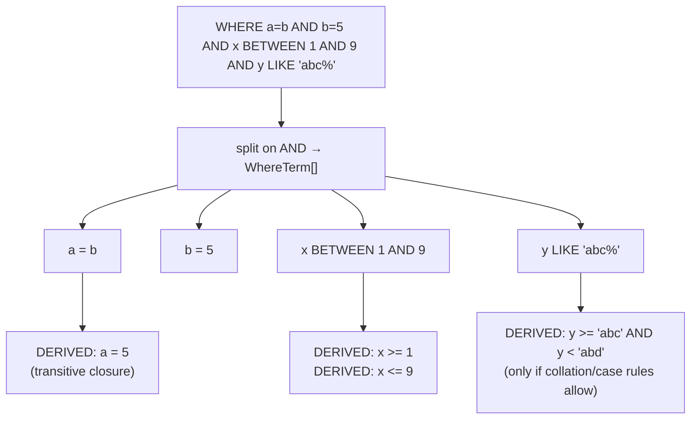

| Input | Derived | Why it matters |
|---|---|---|
| `a BETWEEN 1 AND 9` | `a>=1`, `a<=9` | `BETWEEN` alone is not an indexable operator; two range terms are |
| `x LIKE 'abc%'` | `x>='abc' AND x<'abd'` | turns a full scan into an index range scan |
| `a=b AND b=5` | `a=5` | an index on `a` becomes usable even though the query never mentions `a=5` |
| `a IN (1,2,3)` | a `WO_IN` term | the loop iterates the list, seeking the index each time |
| `(a=1 AND b=2) OR (a=3)` | OR analysis | enables the multi-index OR plan |

Derived terms are marked `TERM_VIRTUAL`: they are used for planning, and the original term
is still evaluated for correctness.

### 3.2 Prerequisite bitmasks — how join legality is computed

```c
pTerm->prereqRight = exprTableUsage(pMaskSet, pExpr->pRight);  /* tables the RHS needs */
pTerm->prereqAll   = exprTableUsage(pMaskSet, pExpr);          /* all tables referenced */
```

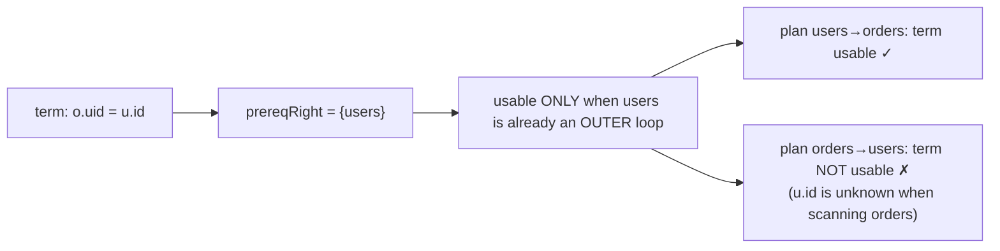

`Bitmask` is a `u64`, and `WhereMaskSet` maps cursor numbers to bit positions. **64 bits =
64 tables = SQLite's join limit.** Now you know exactly where that limit comes from.

> **C sidebar.** `(pLoop->prereq & ~pFrom->maskLoop)==0` reads as: *"take the tables this
> loop needs, remove the ones already in the path; if nothing is left, it is usable."*
> Set operations as bitwise arithmetic — `C-FOR-SQLITE.md` §8.

### 3.3 Selectivity hints

`likelihood(X, 0.05)`, `likely(X)`, `unlikely(X)` set `WhereTerm.truthProb`. This is the
only way to hand the planner information it cannot derive — for example, "this parameter is
almost always NULL in production."

---

## Part 4 — Stage 2: enumerating access paths

### 4.1 What a `WhereLoop` is

```c
struct WhereLoop {
  Bitmask prereq;        /* tables that must be OUTER to this one */
  Bitmask maskSelf;      /* this loop's own table */
  LogEst rSetup;         /* one-time cost (building an automatic index) */
  LogEst rRun;           /* cost per iteration of the outer loops */
  LogEst nOut;           /* rows produced per outer row */
  u32 wsFlags;           /* WHERE_INDEXED, WHERE_IDX_ONLY, WHERE_COLUMN_EQ, ... */
  union { struct { u16 nEq, nBtm, nTop; Index *pIndex; } btree; ... } u;
  WhereTerm **aLTerm;    /* the terms this loop consumes */
};
```

**One `WhereLoop` = one way to scan one table.** Not a plan — a plan is a sequence of them.

### 4.2 Candidate generation

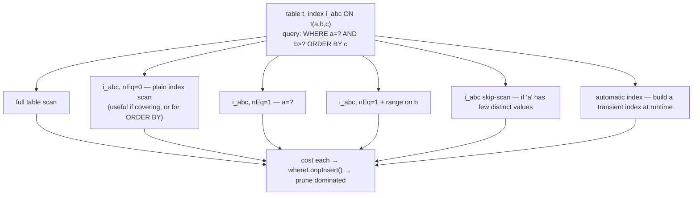

### 4.3 The cost model, with the real constants

**Full table scan:**
```c
pNew->rRun = rSize + 16;     /* +16 LogEst ≈ ×3 */
```
*A full scan costs about 3× the row count.* The multiplier exists because scanning still
touches every page and decodes every row.

With STAT4 compiled in, the penalty drops to `+14` (≈2.75×). The source comment explains
why: with real per-value statistics the planner trusts its index estimates more, so it needs
less bias toward scanning.

**Index scan:**
```c
pNew->rRun = rSize + 1 + (15*pProbe->szIdxRow)/pTab->szTabRow;
if( m!=0 ){                               /* m = needed columns NOT in the index */
    LogEst nLookup = rSize + 16;          /* one table lookup per row, at ~3 each */
    ... credit terms that can be checked from the index alone ...
    pNew->rRun = sqlite3LogEstAdd(pNew->rRun, nLookup);
}
```

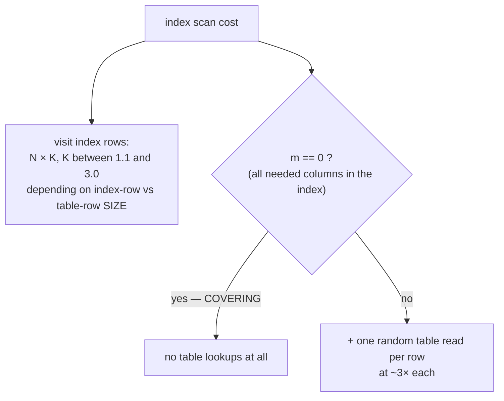

**This single branch is the covering-index effect, quantified.** And `szIdxRow` traces back
to `Column.szEst`, which came from `VARCHAR(255)` in Phase 4 — the declared type really does
reach the planner.

### 4.4 Default estimates when there is no ANALYZE

```
table row count              LogEst 200  ≈ 1,048,576 rows
1st equality on an index     ÷10   (LogEst 33)
2nd, 3rd, ... equalities     ÷~9, ÷~7, ÷~6, ÷~5
all columns of a UNIQUE idx  exactly 1 row (LogEst 0)
one-sided range  (x > ?)     ÷4    (−20)
two-sided range              ÷64   (−60)
full scan                    rows × 3  (+16)
```

These seven numbers explain most "why did it pick that?" surprises on un-analyzed
databases. Memorize them.

### 4.5 Pruning by dominance

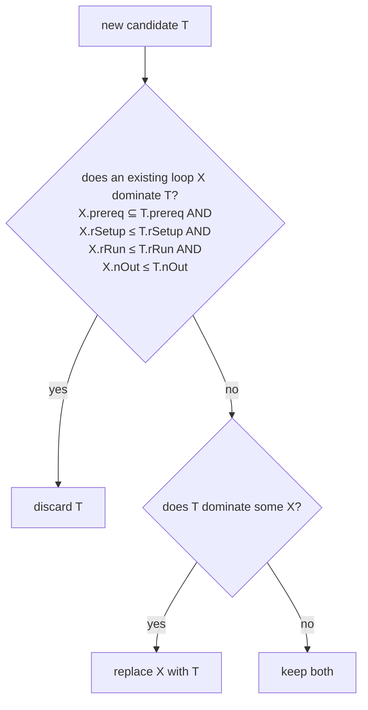

Dominance keeps the candidate list per table small (usually under 10), which is what makes
the next stage affordable.

---

## Part 5 — Stage 3: join ordering

### 5.1 Why not exhaustive search

`n!` orders: 5 tables = 120, 10 tables = 3.6 million, 15 tables = 1.3 trillion. And
planning happens on **every** `prepare()`.

### 5.2 N-nearest-neighbour dynamic programming

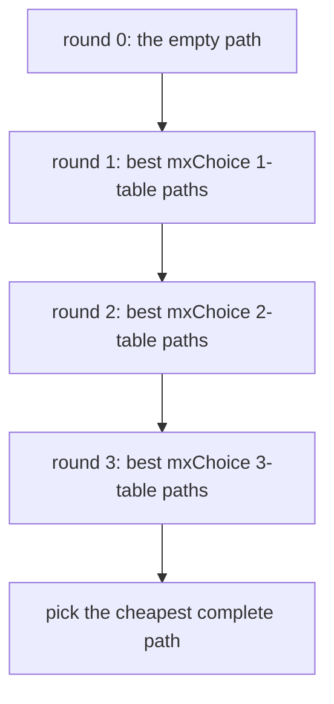

```
for each round:
    for each surviving path p:
        for each loop L not yet in p, whose prereq ⊆ p:
            rUnsorted = p.rUnsorted + L.rRun + (L.rSetup if first use)
            nRow      = p.nRow + L.nOut            /* LogEst add = multiply */
            isOrdered = how many ORDER BY terms are still satisfied
            rCost     = rUnsorted + (sort cost if not ordered)
            keep the best mxChoice paths — ORDERED and UNORDERED tracked SEPARATELY
```

`mxChoice`, from the TUNING comment in `where.c`:

| tables in the join | paths kept per round |
|---|---|
| 1 | 1 |
| 2 | 5 |
| 3 or more | 12 or 18 (`computeMxChoice()`) |

**Complexity:** O(nLoop² × mxChoice × loopsPerTable) instead of O(n!). For 10 tables that
is a few thousand evaluations instead of 3.6 million.

**The trade-off, stated honestly in the documentation:** the search is heuristic and can
miss the optimal plan for pathological joins. SQLite accepts that in exchange for
predictable planning time.

### 5.3 Why ordered and unordered paths are tracked separately

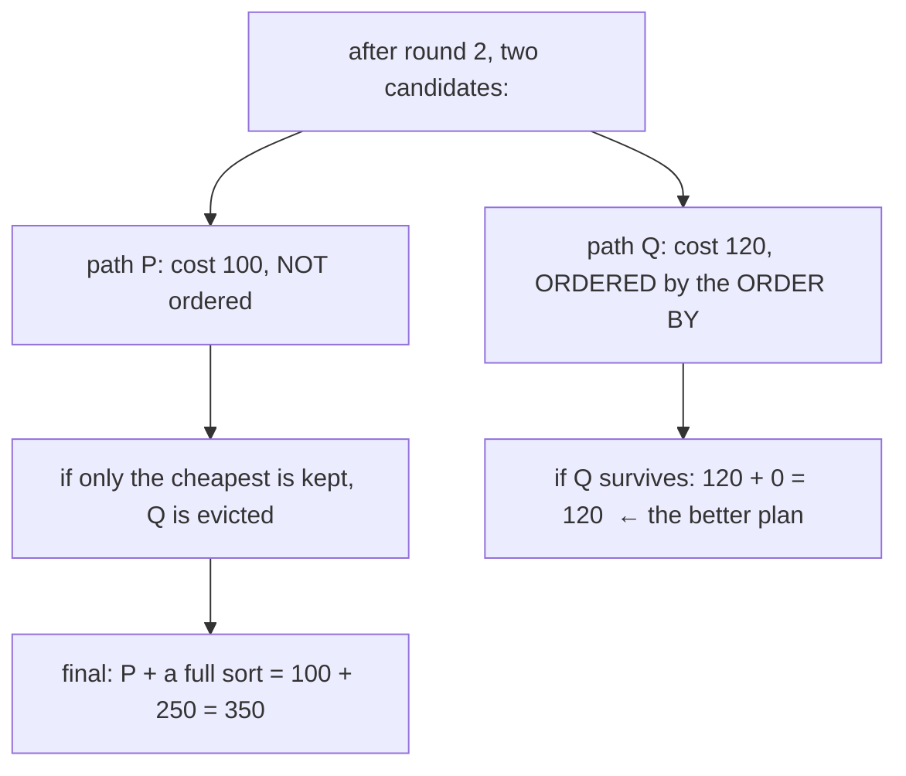

Keeping both families is not a refinement — without it, index-satisfies-ORDER-BY plans
would be discarded before their benefit was visible.

`whereSortingCost()` also accounts for `LIMIT`: sorting to find the top 10 is cheaper than a
full sort, so `ORDER BY ... LIMIT 10` can legitimately prefer scan+sort over an index.

---

## Part 6 — Statistics

### 6.1 `sqlite_stat1`

```sql
CREATE TABLE sqlite_stat1(tbl TEXT, idx TEXT, stat TEXT);
-- stat = "<rows> <avg rows per distinct col1> <... per distinct col1,col2> ..."
```

Verified from a 200k-row table used in the labs:
```
a|ia_status|200000 100000      -- each distinct status matches ~100,000 rows
a|ia_k     |200000 400         -- each distinct k matches ~400 rows
```

Extra tokens: `unordered` (do not use this index for ORDER BY), `sz=N` (average row size),
`noskipscan`.

### 6.2 The averages problem — and the lab that proves it

The `status` column in that table is **skewed**: 199,990 rows are `'done'` and 10 are
`'pending'`. `sqlite_stat1` stores only the average, 100,000.

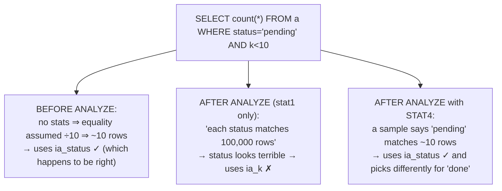

**ANALYZE can make a query slower.** That is not a bug: the planner became *better
informed* about the average and correspondingly worse for the outlier. The fix is better
statistics, not fewer.

### 6.3 `sqlite_stat4`

```sql
CREATE TABLE sqlite_stat4(tbl,idx,neq,nlt,ndlt,sample);
```

Up to ~24 sampled keys per index, each with:
- `neq` — rows equal to the sample, per column prefix
- `nlt` — rows less than the sample
- `ndlt` — distinct values less than the sample

This is a histogram. With it, the planner can estimate **value-specific** selectivity, so
`status='pending'` and `status='done'` get different plans.

**Why it is off by default** (`SQLITE_ENABLE_STAT4`): bigger `ANALYZE` cost, more schema
data to load on every connection, and more planning work per query. For the embedded
targets SQLite is designed around, that is not always the right trade. Apple's system
`sqlite3` does not include it — verified with `PRAGMA compile_options`.

### 6.4 `PRAGMA optimize` — the production pattern

```sql
PRAGMA analysis_limit=400;   -- cap rows examined per index
PRAGMA optimize;             -- ANALYZE only where stats look stale
```

Call it periodically, or before closing a long-lived connection. `analysis_limit` bounds the
work so `ANALYZE` on a huge table cannot stall the application.

---

## Part 7 — The named optimizations

| Optimization | What it does | Signature in EQP / EXPLAIN |
|---|---|---|
| index usage | equality then range on an index prefix | `SEARCH ... USING INDEX x (a=?)` |
| covering index | never touch the table | `USING COVERING INDEX` |
| ORDER BY via index | skip the sorter | no `USE TEMP B-TREE` |
| DISTINCT via index | skip the dedup table | no `OpenEphemeral` |
| `min()`/`max()` | one seek, no loop | a tiny program |
| `count(*)` | `OP_Count` on the smallest b-tree | `USING COVERING INDEX` |
| multi-index OR | one index scan per branch, union the rowids | `MULTI-INDEX OR` |
| automatic index | build a transient index for a repeatedly scanned inner table | `AUTOMATIC COVERING INDEX` |
| skip-scan | use an index whose leading column is unconstrained, by enumerating its few distinct values | `ANY(a) AND b=?` |
| partial index | use `CREATE INDEX ... WHERE cond` when the query implies `cond` | `USING PARTIAL INDEX` |
| query flattening | merge a subquery into the outer query | the subquery vanishes from EQP |
| WHERE push-down | push outer terms into a subquery that cannot be flattened | fewer rows materialized |
| transitive closure | `a=b AND b=5` ⇒ `a=5` | a new index becomes usable |
| LEFT JOIN elimination | drop a join whose columns are unused and which is provably 1:1 | the table vanishes from EQP |
| coroutine subquery | stream instead of materializing | `CO-ROUTINE` |
| Bloom filter (3.38+) | pre-filter a star join's outer loop | `BLOOM FILTER ON x (aid=?)` |
| `OR` → `IN` | `a=1 OR a=2` ⇒ `a IN (1,2)` | one index scan |
| LIKE → range | `x LIKE 'abc%'` ⇒ a range | index range scan |

### 7.1 `flattenSubquery` — the 20+ legality conditions

Flattening `SELECT ... FROM (SELECT ...)` into one query is only sometimes legal.
`select.c` lists the conditions numbered, each with a counterexample in a comment. A few:

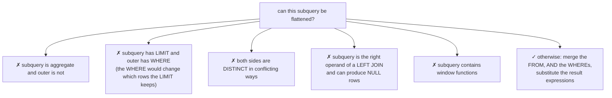

Condition 2 is the one to understand deeply: `SELECT * FROM (SELECT * FROM t LIMIT 5)
WHERE x>10` must take 5 rows *then* filter. Flattening would filter *then* take 5 — a
different answer. **Reading that numbered comment block is one of the best SQL-semantics
lessons available anywhere.**

---

## Part 8 — Reading `EXPLAIN QUERY PLAN`

```
QUERY PLAN
|--SEARCH u USING INDEX i_age (age>?)      ← OUTER loop (first line = outermost)
`--SEARCH o USING INDEX i_orders_uid (uid=?)
```

| EQP text | Internally |
|---|---|
| `SCAN t` | a `WhereLoop` with no constraints — full b-tree walk |
| `SEARCH t USING INDEX x (a=?)` | `WHERE_INDEXED \| WHERE_COLUMN_EQ`, `nEq=1` |
| `SEARCH t USING COVERING INDEX x` | `WHERE_IDX_ONLY` |
| `SEARCH t USING INTEGER PRIMARY KEY (rowid=?)` | `WHERE_IPK` |
| `USE TEMP B-TREE FOR ORDER BY` | `isOrdered < 0` ⇒ `generateSortTail()` added a sorter |
| `MULTI-INDEX OR` | `WHERE_MULTI_OR` — a RowSet union |
| `AUTOMATIC COVERING INDEX` | `WHERE_AUTO_INDEX`, `rSetup > 0` |
| `CO-ROUTINE` / `MATERIALIZE` | subquery streamed vs written to an ephemeral table |
| `BLOOM FILTER ON t (...)` | `WHERE_BLOOMFILTER` |

### 8.1 Red flags, in priority order

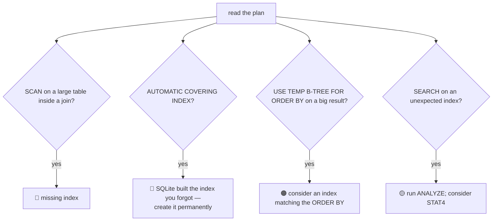

### 8.2 Verified plan examples

```sql
EXPLAIN QUERY PLAN SELECT * FROM a ORDER BY k LIMIT 10;
-- `--SCAN a USING INDEX ia_k         ← an index SCAN chosen purely for ordering

EXPLAIN QUERY PLAN
  SELECT * FROM a JOIN (SELECT aid, sum(amt) s FROM b GROUP BY aid) x
  ON x.aid=a.id WHERE a.k=3;
-- |--CO-ROUTINE x
-- |  `--SCAN b USING INDEX ib_aid
-- |--SEARCH a USING INDEX ia_k (k=?)
-- |--BLOOM FILTER ON x (aid=?)
-- `--SEARCH x USING AUTOMATIC COVERING INDEX (aid=?)
```

That last plan contains three advanced features at once: the subquery is streamed as a
coroutine, a Bloom filter pre-rejects non-matching rows cheaply, and SQLite built a
transient index over the coroutine's output because it is probed repeatedly.

---

## Part 9 — Controlling the planner

| Tool | Effect | When to use |
|---|---|---|
| `ANALYZE` / `PRAGMA optimize` | supply real statistics | **first, 90% of the time** |
| `CREATE INDEX` | give it a better option | second |
| `CROSS JOIN` | **force** join order (left is outer) | you genuinely know better |
| `INDEXED BY x` | **require** an index; error if unusable | testing, not production code |
| `NOT INDEXED` | forbid indexes on that table | diagnosis |
| `+column` | defeat index use on that term | diagnosis |
| `likelihood(expr, p)` | supply selectivity the planner cannot derive | skewed parameters |
| `PRAGMA automatic_index=OFF` | disable transient indexes | to expose a missing index |
| `SQLITE_TESTCTRL_OPTIMIZATIONS` | disable individual optimizations | measurement and testing |

**Why `INDEXED BY` is dangerous in application code:** it is a *constraint*, not a hint.
If someone drops or renames that index, every statement using it starts failing. Use it to
diagnose, then fix the statistics or the schema.

---

## Part 10 — `.wheretrace`: watching the planner think

In a `SQLITE_ENABLE_WHERETRACE` build:

```
sqlite> .wheretrace 0xfff
sqlite> SELECT u.name FROM users u JOIN orders o ON o.uid=u.id WHERE u.age>40;
```
```
WhereLoop 0.1  users (age>?)   rSetup=0 rRun=44 nOut=33
WhereLoop 1.2  orders (uid=?)  rSetup=0 rRun=39 nOut=10
---- after round 1 ----
 0: cost=44 nrow=33 order= {users}
---- after round 2 ----
 0: cost=83 nrow=43 order= {users, orders}
 1: cost=91 nrow=43 order= {orders, users}
---- Solution nRow=43
```

Every number is a LogEst: divide by 10, raise 2 to that power. `cost=83` ≈ 2^8.3 ≈ 315
units of work; `cost=91` ≈ 2^9.1 ≈ 550. The planner chose the cheaper one, and you can
check its arithmetic by hand.

**Learning to read `.wheretrace` is the single most valuable planner skill.** It turns "why
did it do that?" into a readable argument you can verify.

---

## Part 11 — Design decisions, collected

| Decision | Alternative | Why |
|---|---|---|
| cost-based | rule-based | rules fail on small tables and skewed data |
| LogEst (10·log₂) | floating point | integer adds; deterministic; matches input precision |
| costs ≈ page accesses | milliseconds | portable across hardware; no calibration needed |
| N-nearest-neighbour DP | exhaustive search | O(n²·k) instead of O(n!) and planning runs on every prepare |
| separate ordered/unordered paths | keep only the cheapest | otherwise sort-avoiding plans are evicted too early |
| dominance pruning | keep all candidates | keeps the DP input small |
| derived virtual terms | only literal WHERE terms | `BETWEEN`/`LIKE`/transitive constraints become indexable |
| prerequisite bitmasks | a dependency graph | join legality becomes one AND instruction |
| 64-bit `Bitmask` | dynamic sets | one word, no allocation — at the cost of a 64-table limit |
| stat1 = averages only | histograms always | small, cheap, adequate for most schemas |
| STAT4 optional | always on | costs `ANALYZE` time, schema memory, and planning time |
| `+16` full-scan penalty | measured constants | a hand-tuned bias that works across hardware |
| `INDEXED BY` is a constraint | a soft hint | a silent fallback would hide a broken assumption |
| `CROSS JOIN` forces order | a separate hint syntax | reuses standard SQL with no semantic change |

---

## Part 12 — Misconceptions

| Belief | Reality |
|---|---|
| "ANALYZE always helps" | it can pick worse plans for skewed columns; STAT4 is the fix |
| "an index always beats a scan" | a non-covering index adds a random read per row; scans win on small or unselective queries |
| "the planner finds the optimal plan" | it is a bounded heuristic search and can miss it |
| "`INDEXED BY` is a hint" | it is a hard requirement; the statement errors if the index is unusable |
| "index column order does not matter" | `(a,b)` serves `a=? ORDER BY b`, not `b=?` — except via skip-scan |
| "`LIKE '%x'` can use an index" | only a literal *prefix* can become a range |
| "more indexes is better" | each one slows every write and adds planner candidates |
| "AUTOMATIC COVERING INDEX means SQLite optimized it" | it means you forgot an index; creating it is usually 10–100× |
| "costs are milliseconds" | they are LogEst units, roughly log₂ of page accesses |

---

## Part 13 — Code map

| Concern | Function / file |
|---|---|
| entry point | `sqlite3WhereBegin` / `sqlite3WhereEnd` — `where.c` |
| term analysis | `sqlite3WhereSplit`, `exprAnalyze`, `isLikeOrGlob`, `exprAnalyzeOrTerm` — `whereexpr.c` |
| candidate loops | `whereLoopAddAll`, `whereLoopAddBtree`, `whereLoopAddBtreeIndex`, `whereLoopAddVirtual`, `whereLoopAddOr` — `where.c` |
| pruning | `whereLoopInsert`, `whereLoopCheaperProperSubset` — `where.c` |
| join search | `wherePathSolver`, `computeMxChoice`, `whereSortingCost` — `where.c` |
| fast path | `whereShortCut` (single table, unique index — skips the solver) — `where.c` |
| codegen | `sqlite3WhereCodeOneLoopStart` — `wherecode.c` |
| statistics | `sqlite3DefaultRowEst`, `loadStatTbl`, `whereRangeScanEst`, `whereEqualScanEst` — `analyze.c`, `where.c` |
| LogEst | `sqlite3LogEst`, `sqlite3LogEstAdd`, `sqlite3LogEstToInt` — `util.c` |
| flattening | `flattenSubquery`, `pushDownWhereTerms` — `select.c` |

Canonical reading: `optoverview.html`, `queryplanner-ng.html`, `eqp.html`,
`lang_analyze.html`.

Next: `2.code_walkthrough.md` reads `sqlite3LogEst`, the cost assignments, and the solver;
`3.implementation.md` reproduces the ANALYZE flip and has you read `.wheretrace` line by
line.
