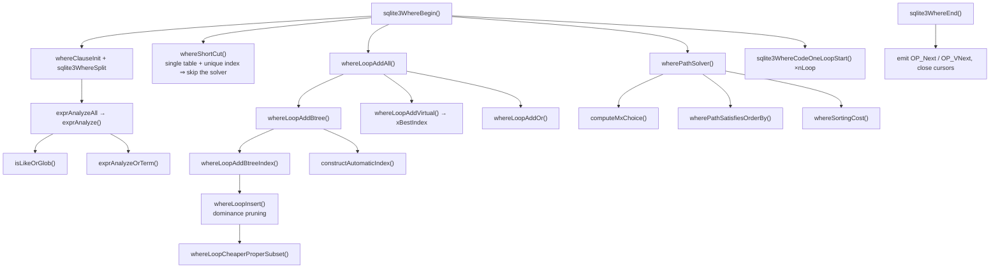

# Phase 6 — Reference: The Query Planner

Flags and constants quoted from the 3.50.4 amalgamation.

---

## 1. File map

| File | Contents |
|---|---|
| `where.c` | `sqlite3WhereBegin/End`, loop generation, costing, `wherePathSolver` |
| `whereexpr.c` | `sqlite3WhereSplit`, `exprAnalyze`, derived terms, `isLikeOrGlob`, OR analysis |
| `wherecode.c` | `sqlite3WhereCodeOneLoopStart` — emits bytecode for one loop |
| `whereInt.h` | `WhereInfo`, `WhereLoop`, `WherePath`, `WhereTerm`, `WhereClause`, `WhereLevel`, `WhereMaskSet` |
| `analyze.c` | `ANALYZE`, `sqlite3DefaultRowEst`, `loadStatTbl`, stat4 sample handling |
| `util.c` | `sqlite3LogEst`, `sqlite3LogEstAdd`, `sqlite3LogEstToInt`, `sqlite3LogEstFromDouble` |
| `select.c` | `flattenSubquery`, `pushDownWhereTerms`, and the other tree-level optimizations |
| `vtab.c` | `xBestIndex` plumbing |

---

## 2. LogEst

```
LogEst(x) = round(10 · log2(x)), stored as i16
```

| x | 1 | 2 | 3 | 4 | 5 | 10 | 20 | 50 | 100 | 1e3 | 1e4 | 1e5 | 1e6 | 1e9 |
|---|---|---|---|---|---|---|---|---|---|---|---|---|---|---|
| LogEst | 0 | 10 | 16 | 20 | 23 | 33 | 43 | 56 | 66 | 99 | 132 | 166 | 199 | 299 |

```
multiply real values  →  ADD LogEsts
divide   real values  →  SUBTRACT LogEsts
+10 = ×2     +16 ≈ ×3     +33 ≈ ×10     −20 = ÷4     −60 = ÷64
```

```c
LogEst sqlite3LogEst(u64 x);          /* value → LogEst */
int    sqlite3LogEstToInt(LogEst x);  /* LogEst → value */
LogEst sqlite3LogEstAdd(LogEst a, LogEst b);   /* LogEst(2^(a/10) + 2^(b/10)) */
LogEst sqlite3LogEstFromDouble(double x);
```

`sqlite3LogEstAdd` adds the **underlying values**; plain `+` multiplies them. Mixing these
up is the most common planner-reading mistake.

---

## 3. Cost-model constants

### 3.1 Defaults with no `ANALYZE` (`sqlite3DefaultRowEst`)

```
table row count                      LogEst 200   ≈ 1,048,576 rows
index aiRowLogEst[0]                 = the table row count
aiRowLogEst[1..]                     33, 32, 30, 28, 26, then 23
        (i.e. the 1st equality divides by ~10, later ones by less)
all columns of a UNIQUE index         LogEst 0    (exactly one row)
```

### 3.2 The cost assignments actually in `whereLoopAddBtree`

```c
/* FULL TABLE SCAN */
#ifdef SQLITE_ENABLE_STAT4
  pNew->rRun = rSize + 16 - 2*((pTab->tabFlags & TF_HasStat4)!=0);   /* ≈ ×2.75 */
#else
  pNew->rRun = rSize + 16;                                          /* ≈ ×3    */
#endif

/* INDEX SCAN */
  pNew->rRun = rSize + 1 + (15*pProbe->szIdxRow)/pTab->szTabRow;   /* N×K, K in 1.1..3.0 */
  if( m!=0 ){                        /* m = needed columns NOT in the index */
      LogEst nLookup = rSize + 16;   /* one table lookup per row, at ~3 each */
      /* credit terms checkable from the index alone: */
      nLookup--;  if( eOperator & (WO_EQ|WO_IS) ) nLookup -= 19;   /* 19 ≈ ÷3.7 */
      pNew->rRun = sqlite3LogEstAdd(pNew->rRun, nLookup);
  }
```

`m == 0` means **covering index** — the whole table-lookup term disappears.

### 3.3 Range adjustments

```
one-sided range  (x > ? or x < ?)     nOut − 20    (÷4)
two-sided range  (x BETWEEN ? AND ?)  nOut − 60    (÷64)
IS NULL                               treated like equality
likelihood(X, p)                      sets WhereTerm.truthProb directly
```

### 3.4 `mxChoice` — how many partial plans survive each round

```c
/* TUNING: mxChoice ...
**     nLoop      mxChoice
**       1            1
**       2            5
**       3+        12 or 18    (see computeMxChoice())
*/
```

---

## 4. Structures

### 4.1 `WhereTerm` — one AND-connected condition

```c
struct WhereTerm {
  Expr *pExpr;               /* the expression */
  int iParent;               /* the parent term, for derived terms */
  int leftCursor;            /* cursor number of the LHS column */
  union { int leftColumn; ... } u;
  u16 eOperator;             /* WO_* */
  u16 wtFlags;               /* TERM_* */
  u8 nChild;
  LogEst truthProb;          /* likelihood this term is true */
  Bitmask prereqRight;       /* tables the RHS depends on */
  Bitmask prereqAll;         /* all tables referenced */
};
```

### 4.2 `WO_*` — usable operators

```c
#define WO_IN     0x0001
#define WO_EQ     0x0002
#define WO_LT     (WO_EQ<<(TK_LT-TK_EQ))
#define WO_LE     (WO_EQ<<(TK_LE-TK_EQ))
#define WO_GT     (WO_EQ<<(TK_GT-TK_EQ))
#define WO_GE     (WO_EQ<<(TK_GE-TK_EQ))
#define WO_AUX    0x0040   /* an operator useful to VIRTUAL TABLES only */
#define WO_IS     0x0080
#define WO_ISNULL 0x0100
#define WO_OR     0x0200   /* two or more OR-connected terms */
#define WO_AND    0x0400
#define WO_EQUIV  0x0800   /* of the form A==B, both columns */
#define WO_NOOP   0x1000   /* does not restrict the search space */
#define WO_ROWVAL 0x2000   /* a row-value term */
#define WO_ALL    0x3fff
#define WO_SINGLE 0x01ff
```

The `WO_LT = WO_EQ<<(TK_LT-TK_EQ)` trick makes the flag derivable from the token code with
a shift, so `exprAnalyze` can map an operator to a flag with arithmetic instead of a switch.

### 4.3 `TERM_*` — term bookkeeping

```c
#define TERM_DYNAMIC    0x0001  /* pExpr is owned here and must be freed */
#define TERM_VIRTUAL    0x0002  /* ADDED BY THE OPTIMIZER — do not code it */
#define TERM_CODED      0x0004  /* already emitted */
#define TERM_COPIED     0x0008  /* has a child term */
#define TERM_ORINFO     0x0010  /* u.pOrInfo must be freed */
#define TERM_ANDINFO    0x0020  /* u.pAndInfo must be freed */
#define TERM_OK         0x0040  /* used during OR-clause processing */
#define TERM_VNULL      0x0080  /* a manufactured x>NULL / x<=NULL term */
#define TERM_LIKEOPT    0x0100  /* a virtual term from the LIKE optimization */
#define TERM_LIKECOND   0x0200  /* this LIKE term applies conditionally */
#define TERM_LIKE       0x0400  /* the original LIKE operator */
#define TERM_IS         0x0800  /* an IS operator */
#define TERM_VARSELECT  0x1000  /* contains a CORRELATED subquery */
#define TERM_HEURTRUTH  0x2000  /* truthProb came from a heuristic */
#define TERM_SLICE      0x8000  /* one slice of a row-value comparison */
```

`TERM_VIRTUAL` is the important one: derived terms (`BETWEEN`→two ranges, `LIKE`→a range,
transitive `a=c`) exist for *planning* and are not emitted as runtime tests; the original
term still is.

### 4.4 `WhereLoop` — one way to scan one table

```c
struct WhereLoop {
  Bitmask prereq;        /* tables that must be OUTER to this loop */
  Bitmask maskSelf;      /* bitmask of this loop's own table */
  LogEst rSetup;         /* one-time setup cost (building an automatic index) */
  LogEst rRun;           /* cost per iteration of the outer loops */
  LogEst nOut;           /* rows produced per outer row */
  u32 wsFlags;           /* WHERE_* */
  u16 nLTerm, nSkip;
  WhereTerm **aLTerm;    /* the terms this loop consumes */
  union {
    struct {             /* b-tree loops */
      u16 nEq;           /* equality constraints used */
      u16 nBtm, nTop;    /* range constraint sizes */
      u16 nDistinctCol;
      Index *pIndex;     /* the index, or NULL for a table scan */
      ExprList *pOrderBy;
    } btree;
    struct {             /* virtual-table loops */
      int idxNum; u32 needFree:1, bOmitOffset:1;
      i8 isOrdered; u16 omitMask; char *idxStr; u32 mHandleIn;
    } vtab;
  } u;
  WhereLoop *pNextLoop;
};
```

### 4.5 `WHERE_*` — `WhereLoop.wsFlags`

```c
#define WHERE_COLUMN_EQ    0x00000001  /* x = EXPR */
#define WHERE_COLUMN_RANGE 0x00000002  /* x < EXPR and/or x > EXPR */
#define WHERE_COLUMN_IN    0x00000004  /* x IN (...) */
#define WHERE_COLUMN_NULL  0x00000008  /* x IS NULL */
#define WHERE_CONSTRAINT   0x0000000f  /* any of the above */
#define WHERE_TOP_LIMIT    0x00000010  /* x < EXPR or x <= EXPR */
#define WHERE_BTM_LIMIT    0x00000020  /* x > EXPR or x >= EXPR */
#define WHERE_BOTH_LIMIT   0x00000030
#define WHERE_IDX_ONLY     0x00000040  /* COVERING INDEX — the table is never read */
#define WHERE_IPK          0x00000100  /* the "index" is the INTEGER PRIMARY KEY */
#define WHERE_INDEXED      0x00000200  /* u.btree.pIndex is valid */
#define WHERE_VIRTUALTABLE 0x00000400  /* u.vtab is valid */
#define WHERE_IN_ABLE      0x00000800
#define WHERE_ONEROW       0x00001000  /* provably selects at most one row */
#define WHERE_MULTI_OR     0x00002000  /* OR handled with several index scans */
#define WHERE_AUTO_INDEX   0x00004000  /* builds an ephemeral index at runtime */
#define WHERE_SKIPSCAN     0x00008000
#define WHERE_UNQ_WANTED   0x00010000
#define WHERE_PARTIALIDX   0x00020000
#define WHERE_IN_EARLYOUT  0x00040000
#define WHERE_BIGNULL_SORT 0x00080000
#define WHERE_IN_SEEKSCAN  0x00100000
#define WHERE_TRANSCONS    0x00200000  /* uses a transitive constraint */
#define WHERE_BLOOMFILTER  0x00400000
#define WHERE_SELFCULL     0x00800000
#define WHERE_OMIT_OFFSET  0x01000000
```

### 4.6 `WherePath` — a candidate join order

```c
struct WherePath {
  Bitmask maskLoop;      /* tables included so far */
  Bitmask revLoop;       /* loops that must run in reverse */
  LogEst nRow;           /* rows produced */
  LogEst rCost;          /* total cost INCLUDING sorting */
  LogEst rUnsorted;      /* total cost EXCLUDING sorting */
  i8 isOrdered;          /* ORDER BY terms already satisfied; -1 = none */
  WhereLoop **aLoop;     /* the loops, in order */
};
```

`rCost` and `rUnsorted` are carried separately so the sort penalty can be recomputed as the
path grows.

### 4.7 `WhereLevel` — the runtime side of one loop

```c
struct WhereLevel {
  int iLeftJoin;         /* register: "did this LEFT JOIN match a row?" */
  int iTabCur, iIdxCur;
  int addrBrk;           /* jump here to BREAK out of the loop */
  int addrNxt;           /* jump here for the next iteration of the outer loop */
  int addrCont;          /* jump here to CONTINUE */
  int addrFirst, addrBody;
  u32 iLikeRepCntr;
  WhereLoop *pWLoop;
  Bitmask notReady;
  union { struct { int nIn; InLoop *aInLoop; } in; Index *pCoveringIdx; } u;
};
```
`addrBrk` / `addrCont` / `addrNxt` are what make `break`/`continue` semantics work across
nested loops — read `sqlite3WhereCodeOneLoopStart` with these in view.

### 4.8 `WhereMaskSet` and `Bitmask`

```c
struct WhereMaskSet {
  int bNested; int n; int ix[BMS];   /* cursor number → bit position */
};
typedef u64 Bitmask;                 /* BMS = sizeof(Bitmask)*8 = 64 */
```
**`BMS = 64` is the join-table limit.** Usability of a term is one instruction:
```c
if( (pLoop->prereq & ~pFrom->maskLoop)==0 ){ /* all prerequisites satisfied */ }
```

### 4.9 `WHERE_*` — `sqlite3WhereBegin` input flags (a different namespace)

```c
#define WHERE_ORDERBY_NORMAL   0x0000
#define WHERE_ORDERBY_MIN      0x0001   /* ORDER BY for min() */
#define WHERE_ORDERBY_MAX      0x0002   /* ORDER BY for max() */
#define WHERE_ONEPASS_DESIRED  0x0004   /* one-pass UPDATE/DELETE wanted */
#define WHERE_ONEPASS_MULTIROW 0x0008
#define WHERE_DUPLICATES_OK    0x0010
#define WHERE_OR_SUBCLAUSE     0x0020
#define WHERE_GROUPBY          0x0040   /* pOrderBy is really a GROUP BY */
#define WHERE_DISTINCTBY       0x0080   /* pOrderBy is really a DISTINCT */
#define WHERE_WANT_DISTINCT    0x0100
#define WHERE_SORTBYGROUP      0x0200
#define WHERE_AGG_DISTINCT     0x0400
#define WHERE_ORDERBY_LIMIT    0x0800
#define WHERE_RIGHT_JOIN       0x1000
#define WHERE_KEEP_ALL_JOINS   0x2000   /* disable the omit-noop-join optimization */
#define WHERE_USE_LIMIT        0x4000   /* use the LIMIT in cost estimates */
```

Distinctness results:
```c
#define WHERE_DISTINCT_NOOP      0   /* DISTINCT not used */
#define WHERE_DISTINCT_UNIQUE    1   /* no duplicates possible */
#define WHERE_DISTINCT_ORDERED   2   /* duplicates are adjacent */
#define WHERE_DISTINCT_UNORDERED 3   /* duplicates are scattered — needs a dedup */
```

---

## 5. Function map



| Concern | Function |
|---|---|
| entry / exit | `sqlite3WhereBegin`, `sqlite3WhereEnd` |
| split the WHERE clause | `sqlite3WhereSplit`, `whereClauseInit`, `whereClauseInsert` |
| analyze one term | `exprAnalyze`, `exprAnalyzeAll` |
| LIKE → range | `isLikeOrGlob` |
| OR analysis | `exprAnalyzeOrTerm` |
| vtab operators | `isAuxiliaryVtabOperator` |
| table usage masks | `exprTableUsage`, `sqlite3WhereGetMask` |
| candidate loops | `whereLoopAddAll`, `whereLoopAddBtree`, `whereLoopAddBtreeIndex`, `whereLoopAddVirtual`, `whereLoopAddOr` |
| automatic index | `constructAutomaticIndex` |
| pruning | `whereLoopInsert`, `whereLoopCheaperProperSubset`, `whereLoopResize` |
| join search | `wherePathSolver`, `computeMxChoice`, `wherePathSatisfiesOrderBy`, `whereSortingCost` |
| fast path | `whereShortCut` |
| codegen | `sqlite3WhereCodeOneLoopStart`, `codeEqualityTerm`, `codeAllEqualityTerms` |
| statistics | `sqlite3DefaultRowEst`, `loadStatTbl`, `loadAnalysis`, `whereRangeScanEst`, `whereEqualScanEst`, `whereKeyStats` |
| tree-level opts | `flattenSubquery`, `pushDownWhereTerms`, `propagateConstants`, `countOfViewOptimization` |

---

## 6. Statistics tables

```sql
CREATE TABLE sqlite_stat1(tbl TEXT, idx TEXT, stat TEXT);
--  stat = "<nRow> <avgEq1> <avgEq1,2> ..."
--  optional trailing tokens:
--     unordered    do not use this index to satisfy ORDER BY
--     sz=NNN       average row size in bytes
--     noskipscan   never skip-scan this index

CREATE TABLE sqlite_stat4(tbl,idx,neq,nlt,ndlt,sample);   -- SQLITE_ENABLE_STAT4
--  up to ~24 samples per index; per sample and per column prefix:
--     neq  rows equal to the sample
--     nlt  rows less than the sample
--     ndlt distinct values less than the sample
```

Loaded into `Index.aiRowLogEst[]` and `Index.aSample[]` by `analyze.c`.

```sql
ANALYZE;                       -- full
ANALYZE tbl;                   -- one table
PRAGMA analysis_limit=400;     -- cap rows examined per index
PRAGMA optimize;               -- ANALYZE only where the statistics look stale
```

**`PRAGMA analysis_limit=400; PRAGMA optimize;` before closing a long-lived connection is
the recommended production pattern.**

---

## 7. The named optimizations, and how to observe each

| Optimization | Signature |
|---|---|
| index usage | `SEARCH t USING INDEX x (a=?)` |
| covering index | `USING COVERING INDEX`; the table cursor is never opened |
| ORDER BY via index | no `USE TEMP B-TREE FOR ORDER BY`, no `Sorter*` opcodes |
| DISTINCT via index | no `OpenEphemeral` |
| min()/max() | a tiny program: `OP_Last`/`OP_Rewind` + one `Column` |
| count(*) | `OP_Count` on the smallest b-tree |
| multi-index OR | `MULTI-INDEX OR` |
| automatic index | `AUTOMATIC COVERING INDEX`, `rSetup > 0` |
| skip-scan | `ANY(a) AND b=?` in the EQP text |
| partial index | `USING PARTIAL INDEX` |
| query flattening | the subquery disappears from EQP |
| WHERE push-down | fewer rows materialized; `SF_PushDown` in `.treetrace` |
| transitive closure | an index becomes usable that the SQL never mentions |
| LEFT JOIN elimination | the table disappears from EQP |
| coroutine subquery | `CO-ROUTINE` vs `MATERIALIZE` |
| Bloom filter | `BLOOM FILTER ON t (...)`, `OP_Filter`/`OP_FilterAdd` |
| OR → IN | one index scan instead of two |
| LIKE → range | an index range scan on a prefix pattern |

---

## 8. Planner control surface

```sql
ANALYZE;  PRAGMA optimize;  PRAGMA analysis_limit=400;
SELECT ... FROM t INDEXED BY idx ...   -- a REQUIREMENT; errors if unusable
SELECT ... FROM t NOT INDEXED ...
WHERE +col = ?                          -- unary + defeats index use on that term
likelihood(expr, 0.001) | likely(expr) | unlikely(expr)
a CROSS JOIN b                          -- forces a to be the OUTER loop
PRAGMA automatic_index = OFF;
PRAGMA case_sensitive_like = ON;        -- affects the LIKE→range optimization
```

```c
sqlite3_test_control(SQLITE_TESTCTRL_OPTIMIZATIONS, db, mask);   /* 1 bit = DISABLE */
```

Optimization mask bits (from `sqliteInt.h`):
```
SQLITE_QueryFlattener  SQLITE_WindowFunc    SQLITE_GroupByOrder   SQLITE_FactorOutConst
SQLITE_DistinctOpt     SQLITE_CoverIdxScan  SQLITE_OrderByIdxJoin SQLITE_Transitive
SQLITE_OmitNoopJoin    SQLITE_CountOfView   SQLITE_CursorHints    SQLITE_Stat4
SQLITE_PushDown        SQLITE_SimplifyJoin  SQLITE_SkipScan       SQLITE_PropagateConst
SQLITE_OnePass         SQLITE_OrderBySubq   SQLITE_BloomFilter    SQLITE_BloomPulldown
SQLITE_BalancedMerge   SQLITE_ReleaseReg    SQLITE_FlttnUnionAll  SQLITE_IndexedExpr
```
Disabling one at a time is how you **measure** what it is worth — and how SQLite's own
tests prove each is individually correct (results must not change).

---

## 9. Reading `EXPLAIN QUERY PLAN`

| EQP text | Internal meaning |
|---|---|
| `SCAN t` | a `WhereLoop` with no constraints |
| `SEARCH t USING INDEX x (a=?)` | `WHERE_INDEXED\|WHERE_COLUMN_EQ`, `nEq=1` |
| `SEARCH t USING COVERING INDEX x` | `WHERE_IDX_ONLY` |
| `SEARCH t USING INTEGER PRIMARY KEY (rowid=?)` | `WHERE_IPK` |
| `SCAN t USING INDEX x` | an index scan chosen for ordering or covering, not filtering |
| `USE TEMP B-TREE FOR ORDER BY` | `isOrdered < 0` ⇒ `generateSortTail()` |
| `MULTI-INDEX OR` | `WHERE_MULTI_OR` |
| `AUTOMATIC COVERING INDEX` | `WHERE_AUTO_INDEX` |
| `CO-ROUTINE` / `MATERIALIZE` | subquery streamed vs written to an ephemeral table |
| `BLOOM FILTER ON t (...)` | `WHERE_BLOOMFILTER` |
| `VIRTUAL TABLE INDEX n:str` | the vtab's own `idxNum`/`idxStr` |

**The first line is the outermost loop.**

---

## 10. Invariants

1. A term may only be used by a loop when `(pLoop->prereq & ~pFrom->maskLoop)==0`.
2. `TERM_VIRTUAL` terms are for planning only and are never emitted as runtime tests.
3. `nOut ≤` the loop's input row estimate; `whereLoopOutputAdjust` only reduces it.
4. A path's `rCost ≥ rUnsorted`.
5. Ordered and unordered paths are kept in separate families.
6. `whereLoopInsert` keeps a loop only if it is not dominated.
7. `WHERE_IDX_ONLY` implies every referenced column is in the index (per `colUsed`).
8. A vtab loop's `rRun` comes from `sqlite3LogEstFromDouble(pIdxInfo->estimatedCost)`.
9. `sqlite3WhereEnd` emits exactly one loop-closing instruction per `WhereLevel`.

---

## 11. Gotchas

1. **`sqlite_stat1` stores averages.** Skewed columns get bad estimates — that is why
   `ANALYZE` can make a specific query slower. STAT4 is the fix.
2. **STAT4 is not compiled in by default**, and not in Apple's system SQLite. Check
   `PRAGMA compile_options`.
3. `INDEXED BY` is a **constraint**, not a hint: the statement errors if the index cannot
   be used. Never use it as a nudge in production code.
4. `CROSS JOIN` changes only loop order, never results.
5. LIKE → range needs: a literal prefix, no leading wildcard, and compatible
   collation/case-sensitivity.
6. An index on `(a,b)` serves `WHERE a=? ORDER BY b` but not `WHERE b=?` — except via
   skip-scan, and only when `a` has few distinct values.
7. `WHERE a=1 OR b=2` can use two indexes; `WHERE a=1 OR b>2` often cannot.
8. Outer-join ON-clause terms (`EP_OuterON`) must not constrain the left table. Getting
   this wrong yields **wrong answers**, not slow ones.
9. `AUTOMATIC COVERING INDEX` in a plan means you forgot an index.
10. The solver is heuristic (`mxChoice` 1/5/12/18) and can miss the optimum on large joins.
11. Plans are cached in prepared statements; new statistics only affect statements prepared
    afterwards (though `ANALYZE` bumps the schema cookie, which forces re-preparation).
12. Costs are LogEst units, **not** milliseconds.
13. `sqlite3LogEstAdd` ≠ `+`. Use `+` to multiply values, `LogEstAdd` to add them.

---

## 12. Debug recipes

```
sqlite> .wheretrace 0xfff
sqlite> .treetrace 0xffff
sqlite> .eqp full
sqlite> .scanstats on
```

Reading `.wheretrace`:
```
WhereLoop 0.1  users (age>?)   rSetup=0 rRun=44 nOut=33
                                    │        │       └ 2^3.3 ≈ 10 rows out
                                    │        └ 2^4.4 ≈ 21 units of work
                                    └ no setup cost
---- after round 2 ----
 0: cost=83 nrow=43 order= {users, orders}     ← 2^8.3 ≈ 315
 1: cost=91 nrow=43 order= {orders, users}     ← 2^9.1 ≈ 550  (loses)
---- Solution nRow=43
```

```
(lldb) b whereLoopAddBtree
(lldb) b wherePathSolver
(lldb) b sqlite3WhereCodeOneLoopStart
(lldb) p pNew->rRun
(lldb) p pNew->nOut
(lldb) p/x pNew->wsFlags        # WHERE_*
(lldb) p pNew->u.btree.nEq
(lldb) p pNew->u.btree.pIndex->zName
(lldb) p/x pTerm->eOperator     # WO_*
(lldb) p/x pTerm->wtFlags       # TERM_*
(lldb) p/x pTerm->prereqRight
```

Plan-regression harness (Lab 6.8): capture `EXPLAIN QUERY PLAN` for a query corpus into a
baseline file and `diff` after every schema or statistics change.

---

## 13. Canonical documentation

`sqlite.org/optoverview.html` — every optimization, with examples.
`sqlite.org/queryplanner.html` and `queryplanner-ng.html` — the design papers.
`sqlite.org/eqp.html` — how to read EQP output.
`sqlite.org/lang_analyze.html` — ANALYZE, stat1 and stat4.
`sqlite.org/np1queryprob.html` — why nested loops are the right default.
