# Phase 7 — Transactions, Isolation, WAL, Recovery

C you need first: `C-FOR-SQLITE.md` §10 (endianness), §15 (`volatile` and shared memory),
§18 (fsync and the three caches).

---

## Part 1 — What a transaction must guarantee, and how each is achieved

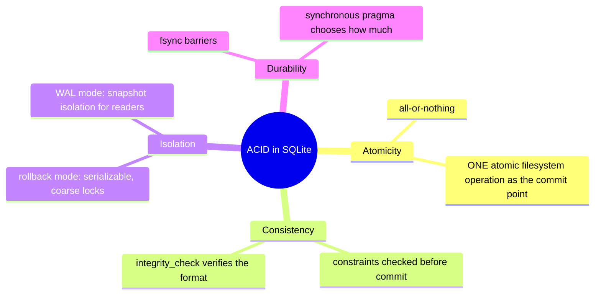

| Property | Mechanism | Phase |
|---|---|---|
| Atomicity | journal (undo) or WAL (redo) + a single atomic commit operation | 2, 7 |
| Consistency | constraint codegen, FK counters, `integrity_check` | 5, 7 |
| Isolation | file locks (rollback) or read marks (WAL) | 2, 7 |
| Durability | `fsync` at specific barriers | 2, 7 |

---

## Part 2 — Transaction semantics at the SQL level

### 2.1 The three BEGIN forms

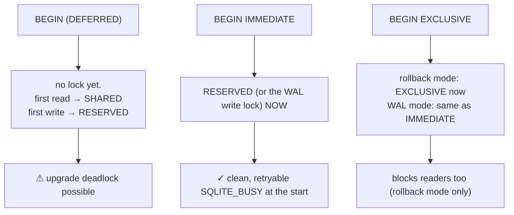

**The single most valuable rule for application code:**

> If a transaction will write, open it with `BEGIN IMMEDIATE`.

Why, precisely:

```mermaid
sequenceDiagram
    participant A as conn A
    participant B as conn B
    Note over A,B: DEFERRED — the bad case
    A->>A: BEGIN; SELECT → SHARED
    B->>B: BEGIN; SELECT → SHARED
    A->>A: UPDATE → RESERVED ✓
    B->>B: UPDATE → needs RESERVED → SQLITE_BUSY
    Note over B: retrying cannot help: B's own SHARED lock<br/>blocks A from reaching EXCLUSIVE.<br/>B must ABORT and restart.
    Note over A,B: IMMEDIATE — the good case
    A->>A: BEGIN IMMEDIATE → RESERVED ✓
    B->>B: BEGIN IMMEDIATE → SQLITE_BUSY immediately
    Note over B: nothing has been read yet, so the busy handler<br/>can simply wait and retry the whole transaction.
```

### 2.2 Isolation levels

| Mode | Readers see | Writers | Notes |
|---|---|---|---|
| rollback | a consistent snapshot; blocked at the writer's commit | one at a time | effectively serializable |
| WAL | a snapshot fixed at read-transaction start | one at a time | **readers never block, and never block the writer** |
| same connection | its own uncommitted changes | — | a statement sees its own transaction's work |

### 2.3 Autocommit

Every statement outside an explicit transaction is wrapped in its own transaction — which
means its own `fsync`.

```
1000 INSERTs, no BEGIN     → ~1000 fsyncs → seconds
1000 INSERTs inside BEGIN  → ~1–2 fsyncs  → milliseconds
```

This is the same fact as Phase 2 §5.3, and it remains the highest-value performance
knowledge in the course.

---

## Part 3 — WAL: the idea

### 3.1 Inverting the log

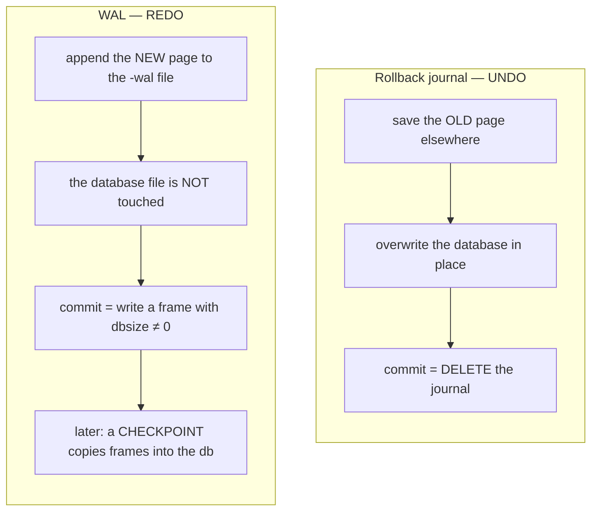

### 3.2 What that buys, and what it costs

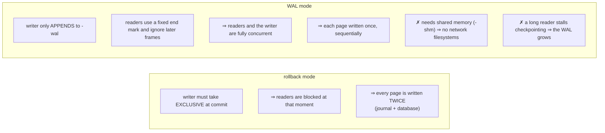

| | Rollback | WAL |
|---|---|---|
| Reader vs writer | blocked at commit | **concurrent** |
| Writes per page per txn | 2 | 1 |
| Write pattern | random (db) + sequential (journal) | **sequential append** |
| Read pattern | direct | db + a hash lookup per page |
| Extra files | `-journal` | `-wal` + `-shm` |
| Network filesystem | poorly | **no** |
| Read-only media | yes | only if fully checkpointed |

---

## Part 4 — LLD: the WAL file format

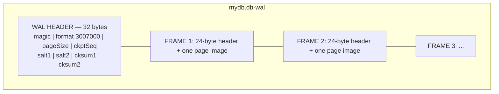

```
WAL header (32 bytes, big-endian fields):
  0  4  magic 0x377f0682 or 0x377f0683   ← the LOW BIT selects checksum byte order
  4  4  file format version = 3007000
  8  4  database page size
 12  4  checkpoint sequence number
 16  4  salt-1   (incremented on every WAL reset)
 20  4  salt-2   (random on every reset)
 24  4  checksum-1 of the first 24 bytes
 28  4  checksum-2

Frame header (24 bytes) before every page image:
  0  4  page number
  4  4  database size in pages AFTER this commit — NON-ZERO ⇒ COMMIT FRAME
  8  4  salt-1 copied from the header
 12  4  salt-2
 16  4  checksum-1  (cumulative, chained from the previous frame)
 20  4  checksum-2
```

### 4.1 Verified bytes from a live database

```
$ xxd -l 56 w7.db-wal
00000000: 377f 0682 002d e218 0000 1000 0000 0000
          ^magic     ^3007000  ^4096      ^ckptSeq=0
00000010: 3fb8 f141 39fe cbbd 16d8 bb52 8c8c 9130
          ^salt-1   ^salt-2   ^cksum-1  ^cksum-2
00000020: 0000 0001 0000 0000 ...            ← FRAME 1: pgno=1, dbsize=0 (not a commit)
```
and from the parser you build in Lab 7.1:
```
frame  offset  pgno  dbsize  salt ok  cksum       status
    1      32     1       0  ok       0xd72e5f77  valid
    2    4152     2       2  ok       0x001a118d  valid   <<< COMMIT
    3    8272     2       2  ok       0x22671eeb  valid   <<< COMMIT
    4   12392     2       2  ok       0x0df251ec  valid   <<< COMMIT
```

Read it: the `CREATE TABLE` wrote two frames (page 1 = schema, page 2 = the new root) and
the second carries `dbsize=2`, marking the commit. Each later `INSERT` added one frame.

### 4.2 Why the commit point is one 4-byte field

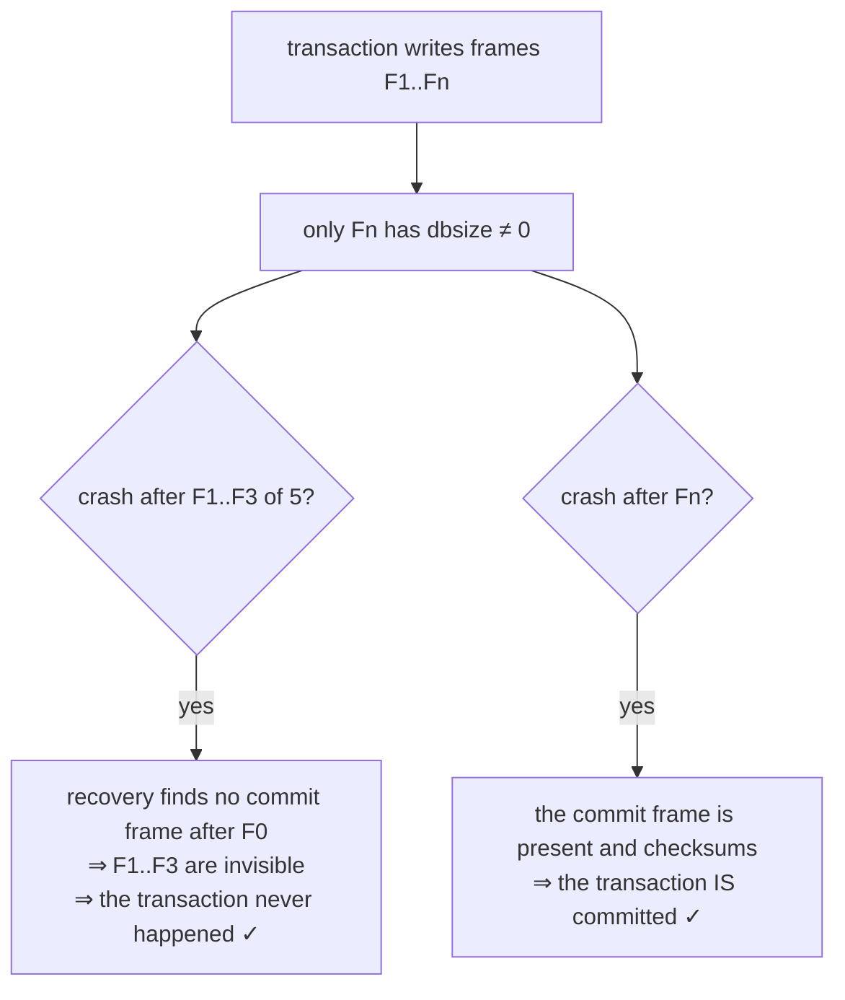

And a torn write cannot fake a commit, because the **chained checksum** would not match.
Atomicity out of one field plus a checksum chain — no locking, no second file.

### 4.3 The checksum

```c
/* s1,s2 carried forward from the previous frame (or the header) */
for(i=0; i<nByte; i+=8){
  s1 += word(a+i)   + s2;
  s2 += word(a+i+4) + s1;
}
```

| Property | Why it is right for this job |
|---|---|
| Fibonacci-weighted | every word affects all later state ⇒ reordering is detected |
| chained across frames | a frame cannot be moved, reused, or replayed out of order |
| two adds per 8 bytes | fast enough to run on every page of every commit |
| not cryptographic | the threat is a torn write, not an adversary |

**The endianness trap you will hit:**

```c
pWal->hdr.bigEndCksum = (u8)(magic & 0x00000001);
walChecksumBytes(pWal->hdr.bigEndCksum==SQLITE_BIGENDIAN, ...);   /* native or swapped */
```

The low bit does **not** name an endianness directly — it says whether the file's convention
matches *this machine*. On a little-endian CPU, magic `0x377f0682` (bit 0 clear) means
"native", i.e. little-endian words. **This is the opposite of the database file, which is
always big-endian.** The first version of the Lab 7.1 parser got this wrong; yours will too
unless you check empirically.

**Salts** complete the safety argument: on a WAL reset the salts change, so frames left over
from an earlier generation can never be mistaken for current ones.

---

## Part 5 — LLD: the wal-index (`-shm`)

### 5.1 Why it must exist

A reader needs "the newest version of page 7 at or before my end mark." Scanning the whole
WAL per page read would be O(WAL size) per page. So all connections share an index.

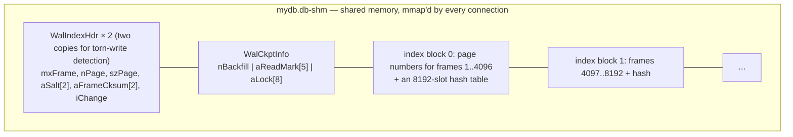

Lookup: hash the page number, probe the **newest block first**, and take the largest frame
number ≤ my read mark. O(1) in practice.

**The `-shm` is pure derived data.** Delete it while no connection is open and it is
rebuilt by recovery. Losing the `-wal`, by contrast, loses committed transactions.

> **C sidebar — `volatile`.** The wal-index is declared
> `volatile u32 **apWiData` because another *process* writes it. Without `volatile`, the
> compiler could hoist a read of `aReadMark[i]` out of a loop and never observe an update.
> `walShmBarrier()` adds the memory barrier. This is real shared-memory concurrency, not
> file I/O. See `C-FOR-SQLITE.md` §15.

### 5.2 The eight lock slots — the whole concurrency protocol

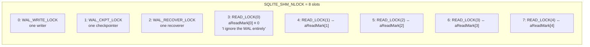

**Why five read marks and not one per reader?** Readers wanting the same snapshot share a
slot, so five slots support thousands of concurrent readers at up to five distinct
snapshots. More slots would cost shm space and checkpoint scanning for no benefit.

---

## Part 6 — LLD: the three roles

### 6.1 Reader

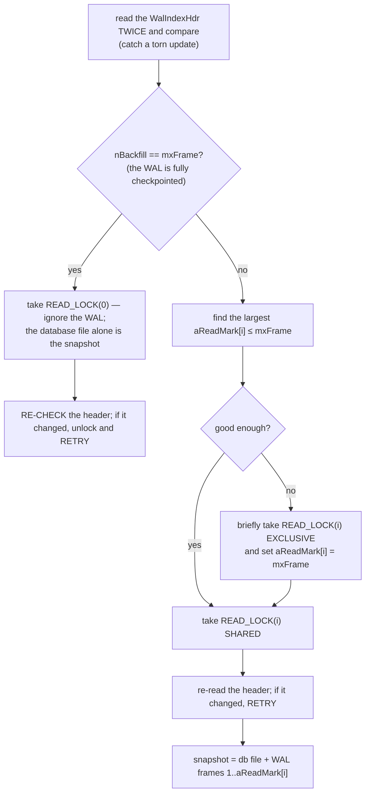

**The pattern repeated everywhere in `wal.c`:** read unlocked → take a lock → memory
barrier → **re-read and compare** → retry if it changed. That is optimistic concurrency
against other processes, with no central coordinator.

**Why the re-check on the `READ_LOCK(0)` path is not paranoia:** the source comment
describes the exact failure — a checkpointer could have begun backfilling appended frames
and crashed, leaving a partially updated database file. Holding `READ_LOCK(0)` prevents
*future* backfilling, but says nothing about what happened in the window before the lock
was taken.

### 6.2 Writer

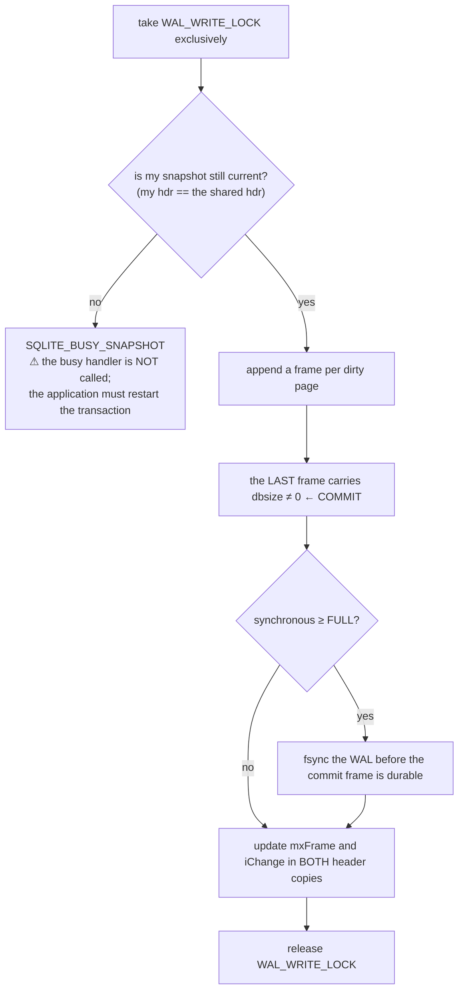

### 6.3 Checkpointer

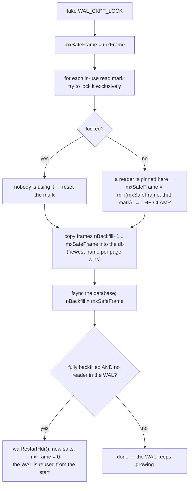

**Step "THE CLAMP" is the WAL-growth pathology, in one line.** A long-running read
transaction pins a read mark, so nothing beyond it may be copied, so the WAL cannot be
reset and grows without bound.

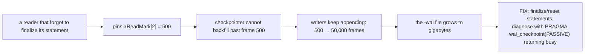

---

## Part 7 — Checkpoint modes

| Mode | Behaviour | Blocks? |
|---|---|---|
| `PASSIVE` (default, automatic) | copy whatever is safe; never wait | no |
| `FULL` | wait for readers so **all** frames can be backfilled | yes, for readers |
| `RESTART` | FULL, then wait until no reader is in the WAL, so the next writer restarts at frame 1 | yes |
| `TRUNCATE` | RESTART, then `ftruncate` the WAL to zero | yes |

```sql
PRAGMA wal_autocheckpoint = 1000;   -- pages; 0 disables; default ≈ 4 MB at 4 KiB
PRAGMA wal_checkpoint(TRUNCATE);    -- returns (busy, nLog, nCheckpointed)
PRAGMA journal_size_limit = N;      -- shrink the WAL back to N bytes after a checkpoint
```

**Why automatic checkpointing is `PASSIVE`:** a background maintenance task must never
block a user query. The consequence is that under continuous read load the WAL may never be
fully checkpointed — which is why `sqlite3_wal_hook()` exists, so an application can apply
its own policy at a quiet moment.

---

## Part 8 — `PRAGMA synchronous` means something different here

| Level | WAL-mode behaviour | Worst case on power loss |
|---|---|---|
| `OFF` | no syncs | corruption possible |
| `NORMAL` | sync the WAL only at checkpoints | **recent commits lost; NO corruption** |
| `FULL` | sync the WAL at every commit | nothing lost |
| `EXTRA` | as FULL, plus directory syncs | nothing lost |

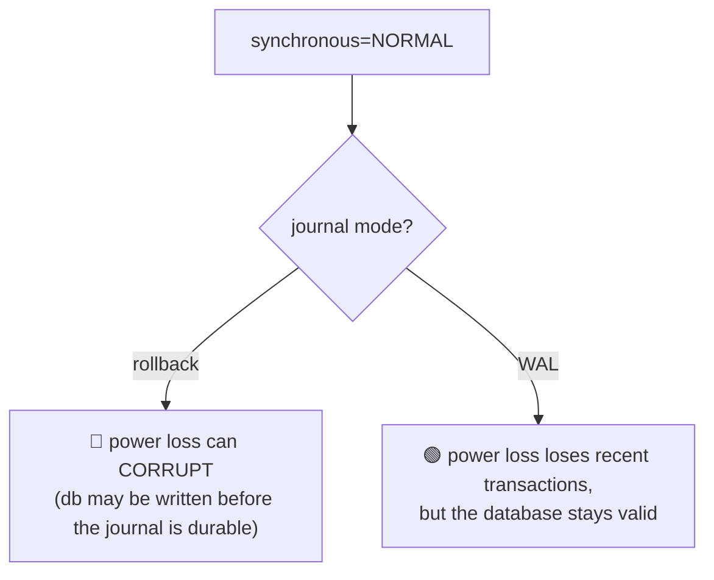

**Why the difference:** in WAL mode the database file is never modified during a
transaction, so a lost WAL tail simply means those transactions are not in the WAL — which
recovery already treats as "never committed." In rollback mode the database file *is*
modified, so the undo information must be durable first.

`journal_mode=WAL` + `synchronous=NORMAL` is the standard high-throughput production
setting, and it is safe against process crashes and OS panics.

---

## Part 9 — Recovery

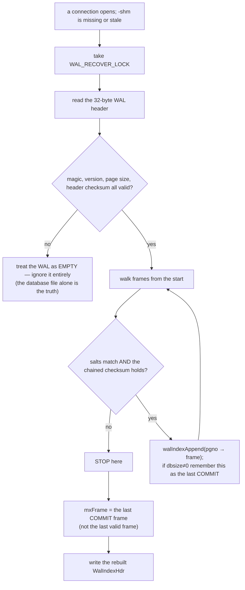

Three properties worth stating explicitly:

1. **Recovery never writes to the database file.** It only rebuilds an index. That makes it
   fast, idempotent, and safe to run from a nearly-read-only context.
2. **A bad WAL header means "no WAL", not "corrupt database."** A stray `-wal` from an
   unrelated crash is simply ignored.
3. **Recovery stops at the last commit frame**, so half-written transactions are invisible
   — exactly what your `walparse.c` reports as *"Recovery would STOP here."*

---

## Part 10 — Savepoints and nested transactions

```sql
BEGIN;
  INSERT ...;
  SAVEPOINT a;
     UPDATE ...;
     SAVEPOINT b;
        DELETE ...;
     ROLLBACK TO b;     -- undo the DELETE; b is still open
  RELEASE a;            -- merge a's changes into the outer transaction
COMMIT;
```

```c
struct PagerSavepoint {
  i64 iOffset;          /* start offset in the main journal */
  Bitvec *pInSavepoint; /* pages written since this savepoint */
  Pgno nOrig;           /* database size at the savepoint */
  Pgno iSubRec;         /* first sub-journal record */
  u32 aWalData[4];      /* WAL frame count + checksum state */
};
```

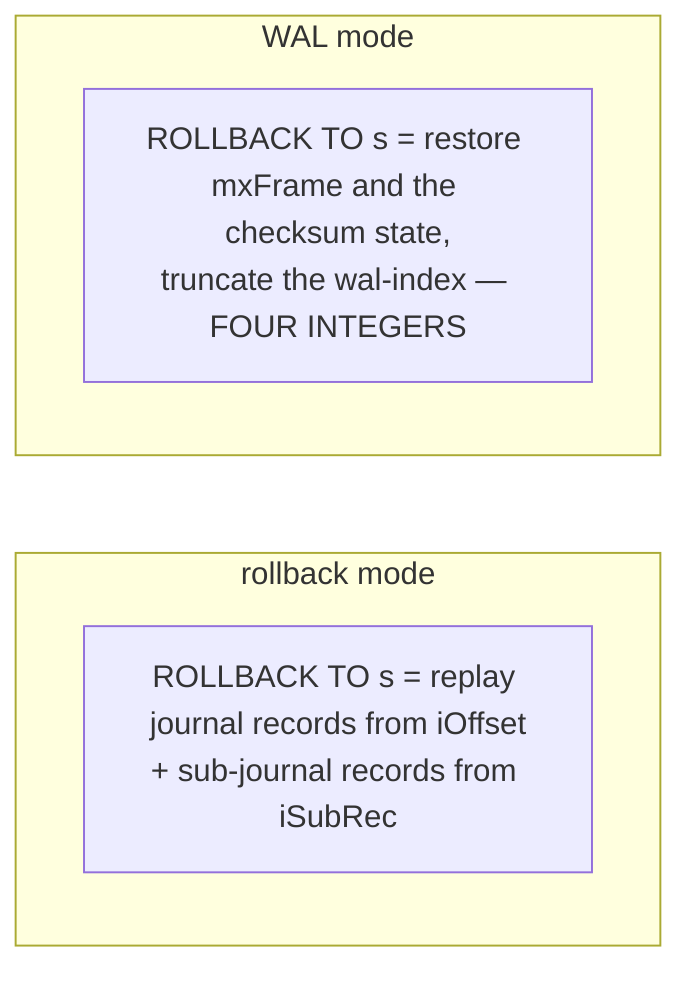

WAL savepoints are almost free because the frames are already append-only: making them
unreachable is enough, and the next write overwrites them.

**Statement journals** are the implicit case: every statement that can abort partway (the
default `ON CONFLICT ABORT`) opens one so the statement can be undone without killing the
transaction.

---

## Part 11 — Conflict resolution

| Mode | On a constraint violation |
|---|---|
| `ROLLBACK` | abort the statement **and** roll back the whole transaction |
| `ABORT` (default) | undo this statement only — needs the statement journal |
| `FAIL` | stop where it is; **prior changes in this statement REMAIN** |
| `IGNORE` | skip the offending row, continue |
| `REPLACE` | delete the conflicting rows, then insert |

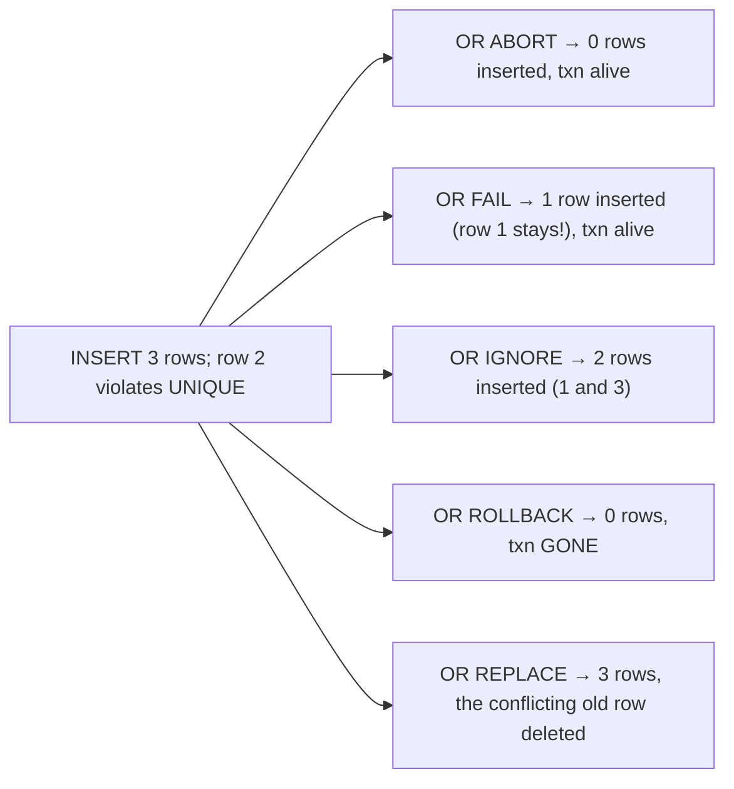

`FAIL` is the surprising one — it is the only mode that leaves a statement half-applied, and
it exists precisely to avoid the cost of a statement journal.

---

## Part 12 — Foreign keys

```sql
PRAGMA foreign_keys = ON;     -- ⚠ OFF by default, for backwards compatibility
... REFERENCES parent(id) DEFERRABLE INITIALLY DEFERRED
```

| Kind | Checked | Implemented by |
|---|---|---|
| immediate | per statement | generated lookup code |
| deferred | at COMMIT | `OP_FkCounter` increments/decrements a register; `OP_FkIfZero` checks it at commit |

A deferred violation at COMMIT returns `SQLITE_CONSTRAINT_FOREIGNKEY` and **leaves the
transaction open**, so the application can fix it and retry.

`PRAGMA foreign_keys` cannot be changed inside a transaction — the generated code depends
on it.

---

## Part 13 — Snapshots and BEGIN CONCURRENT

```c
sqlite3_snapshot_get(db, "main", &pSnap);   /* capture the current WAL snapshot */
sqlite3_snapshot_open(db, "main", pSnap);   /* start a read txn at exactly that point */
sqlite3_snapshot_cmp(p1, p2);
```

This exposes WAL snapshot isolation directly — useful for a reporting reader that must see
exactly the state another connection saw.

**`BEGIN CONCURRENT`** exists on an official branch (and underlies libSQL/hctree work) and
allows several write transactions to proceed optimistically, conflict-checking page sets at
commit. It is not in mainline releases. Know why it is hard: conflicts are detected at
**page** granularity, so two writers touching different rows of the same page falsely
conflict.

---

## Part 14 — Choosing a configuration

| Situation | Settings |
|---|---|
| server-ish app, many readers, one writer | `journal_mode=WAL`, `synchronous=NORMAL`, `busy_timeout=5000`, `BEGIN IMMEDIATE` for writes |
| embedded, must survive power loss | WAL + `synchronous=FULL` |
| read-only shipped dataset | rollback mode, `PRAGMA query_only`, or the `immutable=1` URI |
| network filesystem | don't. If forced: rollback mode + the `unix-dotfile` VFS |
| bulk load | one transaction, `synchronous=OFF`, `journal_mode=OFF`, then rebuild indexes and restore durability |
| many tiny writes | batch them — one fsync per transaction dominates everything |

---

## Part 15 — How databases actually get corrupted

From `sqlite.org/howtocorrupt.html`, in rough frequency order:

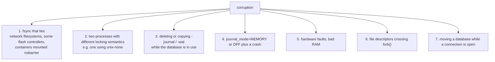

**The safety checklist:** WAL + `synchronous` ≥ NORMAL, never move the sidecar files, use
`VACUUM INTO` or the backup API to copy, keep databases off NFS, and run
`PRAGMA integrity_check` in your test suite.

### 15.1 Backups — the only three correct methods

| Method | Safe with concurrent writers | Notes |
|---|---|---|
| `VACUUM INTO 'copy.db'` | yes | also defragments |
| `.backup` / `sqlite3_backup_*` | yes | incremental, restartable |
| copy `db` + `-wal` **together, with no writer active** | fragile | easy to get wrong |
| `cp db backup.db` alone | **no** | misses the WAL entirely |

---

## Part 16 — Design decisions, collected

| Decision | Alternative | Why |
|---|---|---|
| WAL is optional, not the default | WAL always | WAL needs shared memory; that breaks network filesystems and read-only media |
| commit = one 4-byte field in a frame | a separate commit record | a torn write cannot fake it, thanks to the checksum chain |
| chained Fibonacci checksums | CRC32 | cheap, order-sensitive, sufficient for torn-write detection |
| salts change on WAL reset | rely on file truncation | stale frames from an earlier generation can never validate |
| checksum byte order follows the machine | always big-endian | the WAL is never copied between machines, so native order is free speed |
| a shared-memory index | scan the WAL per read | O(1) page lookup instead of O(WAL) |
| exactly 5 read marks | one per reader | readers share snapshots; five covers real workloads |
| `aReadMark[0] ≡ 0` | no special case | lets a reader ignore the WAL entirely when it is fully checkpointed |
| checkpointing is opportunistic (PASSIVE) | block readers to finish | maintenance must never stall user queries |
| recovery rebuilds only the index | replay into the database | fast, idempotent, no write permission needed |
| `SQLITE_BUSY_SNAPSHOT` is not retried by the busy handler | retry transparently | the application must restart the transaction; a silent retry would hide a lost read snapshot |
| WAL savepoints store 4 integers | replay page images | frames are append-only, so truncation suffices |

---

## Part 17 — Misconceptions

| Belief | Reality |
|---|---|
| "WAL makes writes concurrent" | no — **one writer** still. It makes *readers* concurrent with the writer |
| "the -wal file is a log of statements" | it is a list of page images |
| "deleting -wal is safe" | it discards committed transactions |
| "deleting -shm is dangerous" | it is derived data; it is rebuilt |
| "a checkpoint happens at COMMIT" | it happens when the WAL exceeds `wal_autocheckpoint`, opportunistically |
| "synchronous=NORMAL is unsafe" | in WAL mode it cannot corrupt; it can only lose recent commits |
| "`cp` is a valid backup" | it misses the WAL; use `VACUUM INTO` or the backup API |
| "a `-wal` file after a clean close means trouble" | the last connection to close checkpoints and removes it; seeing one means a crash or an open connection |
| "SQLITE_BUSY always means 'retry'" | `SQLITE_BUSY_SNAPSHOT` means "restart the transaction" |
| "WAL works everywhere" | it requires shared memory — no NFS, no SMB |

---

## Part 18 — Code map

| Concern | Function / file |
|---|---|
| the design document | the 400-line header comment at the top of `wal.c` |
| checksum | `walChecksumBytes` |
| frame encode/decode | `walEncodeFrame`, `walDecodeFrame` |
| recovery | `walIndexRecover` |
| reader | `walTryBeginRead`, `sqlite3WalBeginReadTransaction` |
| page lookup | `sqlite3WalFindFrame`, `walHash`, `walIndexAppend` |
| writer | `sqlite3WalBeginWriteTransaction`, `sqlite3WalFrames` |
| checkpoint | `sqlite3WalCheckpoint`, `walCheckpoint`, `walIteratorInit`, `walRestartHdr` |
| savepoints | `sqlite3WalSavepoint`, `sqlite3WalSavepointUndo` |
| snapshots | `sqlite3WalSnapshotGet/Open/Cmp` |
| shared memory | `unixShmMap`, `unixShmLock` — `os_unix.c` |
| multi-db commit | `vdbeCommit` — `vdbeaux.c` |
| foreign keys | `fkey.c` (`OP_FkCounter`, `OP_FkIfZero`) |

Canonical reading: `wal.html`, `walformat.html`, `atomiccommit.html`, `isolation.html`,
`howtocorrupt.html`.

Next: `2.code_walkthrough.md` reads the checksum, the frame encoder, and the reader
protocol; `3.implementation.md` has you write a WAL verifier and then corrupt a WAL and
predict what recovery keeps.
