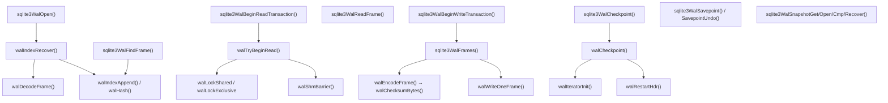

# Phase 7 — Reference: Transactions, WAL, Recovery

Constants and struct bodies quoted from the 3.50.4 amalgamation.

---

## 1. Constants

### 1.1 WAL file format

```c
#define WAL_MAGIC        0x377f0682   /* low bit selects checksum byte order */
#define WAL_MAX_VERSION  3007000
#define WAL_HDRSIZE      32
#define WAL_FRAME_HDRSIZE 24
```

```
WAL header, 32 bytes (fields big-endian):
  0  4  magic 0x377f0682 (LSB 0) or 0x377f0683 (LSB 1)
  4  4  file format version = 3007000
  8  4  database page size
 12  4  checkpoint sequence number
 16  4  salt-1   (incremented on every WAL reset)
 20  4  salt-2   (random on every reset)
 24  4  checksum-1 over the first 24 bytes
 28  4  checksum-2

Frame header, 24 bytes, before every page image:
  0  4  page number
  4  4  database size in pages AFTER this commit — NON-ZERO ⇒ COMMIT FRAME
  8  4  salt-1 copied from the header
 12  4  salt-2
 16  4  checksum-1  (chained from the previous frame)
 20  4  checksum-2

file size = 32 + nFrame*(24 + pageSize)
```

**The magic's low bit does not name an endianness directly.** It is compared against the
machine:
```c
pWal->hdr.bigEndCksum = (u8)(magic & 0x00000001);
walChecksumBytes(pWal->hdr.bigEndCksum==SQLITE_BIGENDIAN, ...);   /* native or swapped */
```
On a little-endian CPU, `0x377f0682` means **native (little-endian) word reads**. This is
the opposite convention from the database file, which is always big-endian.

### 1.2 Shared-memory locks

```c
#define SQLITE_SHM_NLOCK    8
#define WAL_WRITE_LOCK      0
#define WAL_ALL_BUT_WRITE   1
#define WAL_CKPT_LOCK       1
#define WAL_RECOVER_LOCK    2
#define WAL_READ_LOCK(I)   (3+(I))
#define WAL_NREADER        (SQLITE_SHM_NLOCK-3)    /* == 5 */
#define READMARK_NOT_USED  0xffffffff

#define SQLITE_SHM_UNLOCK     1
#define SQLITE_SHM_LOCK       2
#define SQLITE_SHM_SHARED     4
#define SQLITE_SHM_EXCLUSIVE  8
```

| Slot | Name | Purpose |
|---|---|---|
| 0 | `WAL_WRITE_LOCK` | one writer |
| 1 | `WAL_CKPT_LOCK` | one checkpointer |
| 2 | `WAL_RECOVER_LOCK` | one recoverer |
| 3 | `WAL_READ_LOCK(0)` | readers using the database file only (`aReadMark[0] ≡ 0`) |
| 4–7 | `WAL_READ_LOCK(1..4)` | paired with `aReadMark[1..4]` |

### 1.3 wal-index hash tables

```c
#define HASHTABLE_NPAGE     4096        /* frames covered per index block; power of 2 */
#define HASHTABLE_HASH_1     383        /* the multiplier; prime */
#define HASHTABLE_NSLOT  (HASHTABLE_NPAGE*2)   /* 8192 — load factor ≤ 0.5 */
#define HASHTABLE_NPAGE_ONE (HASHTABLE_NPAGE - (WALINDEX_HDR_SIZE/sizeof(u32)))
```

### 1.4 Modes and retries

```c
#define WAL_NORMAL_MODE     0
#define WAL_EXCLUSIVE_MODE  1
#define WAL_HEAPMEMORY_MODE 2      /* the wal-index lives in heap — no -shm file */

#define WAL_RDWR       0
#define WAL_RDONLY     1
#define WAL_SHM_RDONLY 2

#define WAL_RETRY               (-1)
#define WAL_RETRY_PROTOCOL_LIMIT 100     /* then SQLITE_PROTOCOL */
#define WAL_SAVEPOINT_NDATA       4      /* u32s saved per savepoint */
```

### 1.5 Checkpoint modes

```c
#define SQLITE_CHECKPOINT_PASSIVE  0   /* do as much as possible without blocking */
#define SQLITE_CHECKPOINT_FULL     1   /* wait for writers, then checkpoint */
#define SQLITE_CHECKPOINT_RESTART  2   /* like FULL, but also wait for readers */
#define SQLITE_CHECKPOINT_TRUNCATE 3   /* like RESTART, plus truncate the WAL */
```

---

## 2. Structures

### 2.1 `WalIndexHdr` — stored **twice** in the `-shm` (verbatim)

```c
struct WalIndexHdr {
  u32 iVersion;                   /* Wal-index version */
  u32 unused;
  u32 iChange;                    /* incremented each transaction */
  u8 isInit;                      /* 1 when initialized */
  u8 bigEndCksum;                 /* true if WAL checksums are big-endian */
  u16 szPage;                     /* page size; 1 == 64K */
  u32 mxFrame;                    /* index of the last VALID frame in the WAL */
  u32 nPage;                      /* database size in pages */
  u32 aFrameCksum[2];             /* checksum of the last frame */
  u32 aSalt[2];                   /* copied from the WAL header */
  u32 aCksum[2];                  /* checksum over all prior fields */
};
```

Two copies exist so a reader can detect a torn update: read both, compare, retry if they
differ. `iChange` lets a reader notice that *anything* changed.

### 2.2 `WalCkptInfo` (verbatim)

```c
struct WalCkptInfo {
  u32 nBackfill;                  /* frames already copied into the database */
  u32 aReadMark[WAL_NREADER];     /* the five reader end-marks */
  u8  aLock[SQLITE_SHM_NLOCK];    /* reserved space for locks */
  u32 nBackfillAttempted;         /* frames perhaps written, or maybe not */
  u32 notUsed0;
};
```

`nBackfillAttempted` exists for the crash case: a checkpointer may have started writing
frames into the database and died. A reader that would otherwise take `READ_LOCK(0)` must
account for that possibility.

### 2.3 `Wal`

```c
struct Wal {
  sqlite3_vfs *pVfs;
  sqlite3_file *pDbFd, *pWalFd;
  u32 iCallback;                  /* value for the wal-hook callback */
  i64 mxWalSize;                  /* journal_size_limit */
  int nWiData; volatile u32 **apWiData;    /* the mapped -shm blocks */
  u32 szPage;
  i16 readLock;                   /* which read mark we hold; -1 = none */
  u8 syncFlags, exclusiveMode, writeLock, ckptLock, readOnly, truncateOnCommit;
  u8 syncHeader, padToSectorBoundary, bShmUnreliable;
  WalIndexHdr hdr;                /* THIS connection's snapshot of the header */
  u32 minFrame;                   /* the earliest frame this reader may use */
  u32 iReCksum;                   /* frames from here need re-checksumming */
  ...
};
```

`volatile` on `apWiData` is load-bearing: the `-shm` is written by **other processes**, so
the compiler must not cache reads in registers. `walShmBarrier()` supplies the memory
barrier.

### 2.4 `PagerSavepoint` — the WAL part

```c
u32 aWalData[WAL_SAVEPOINT_NDATA];   /* == 4 */
/* sqlite3WalSavepoint() stores: */
aWalData[0] = pWal->hdr.mxFrame;
aWalData[1] = pWal->hdr.aFrameCksum[0];
aWalData[2] = pWal->hdr.aFrameCksum[1];
aWalData[3] = pWal->nCkpt;
```
Rolling back to a savepoint in WAL mode restores those four integers and truncates the
wal-index. No page images are replayed.

---

## 3. The checksum

```c
static void walChecksumBytes(
  int nativeCksum,      /* true ⇒ read words in native byte order */
  u8 *a, int nByte,     /* nByte must be a multiple of 8 */
  const u32 *aIn,       /* the PREVIOUS frame's checksum — the chain */
  u32 *aOut
){
  u32 s1 = aIn ? aIn[0] : 0;
  u32 s2 = aIn ? aIn[1] : 0;
  do {
    s1 += *aData++ + s2;
    s2 += *aData++ + s1;
  } while( aData<aEnd );
  aOut[0] = s1; aOut[1] = s2;
}
```

| Property | Consequence |
|---|---|
| Fibonacci-weighted | every word affects all later state ⇒ reordering is detected |
| **chained** across frames | a frame cannot be moved, reused, or replayed out of order |
| covers frame-header bytes 0..7 **then** the page data | the salts themselves are compared directly, not checksummed |
| two adds per 8 bytes | cheap enough to run on every page of every commit |
| not cryptographic | the threat model is a torn write, not an adversary |

Frame encoding (`walEncodeFrame`):
```c
sqlite3Put4byte(&aFrame[0], iPage);
sqlite3Put4byte(&aFrame[4], nTruncate);       /* NON-ZERO ⇒ COMMIT */
memcpy(&aFrame[8], pWal->hdr.aSalt, 8);
walChecksumBytes(nativeCksum, aFrame, 8,   aCksum, aCksum);
walChecksumBytes(nativeCksum, aData, szPage, aCksum, aCksum);
sqlite3Put4byte(&aFrame[16], aCksum[0]);
sqlite3Put4byte(&aFrame[20], aCksum[1]);
```

---

## 4. The three protocols

### 4.1 Reader (`walTryBeginRead`)

```
loop (bounded by WAL_RETRY_PROTOCOL_LIMIT = 100, with quadratic backoff):
  read the WalIndexHdr TWICE and compare      (torn-update detection)
  if nBackfill == mxFrame  (the WAL is fully backfilled):
        take READ_LOCK(0) SHARED
        walShmBarrier()
        RE-CHECK the header; if it changed → unlock and WAL_RETRY
        readLock = 0;  the database file alone is the snapshot
  else:
        mxFrame = hdr.mxFrame  (or the snapshot's, if sqlite3_snapshot_open)
        pick i in 1..4 maximizing aReadMark[i] subject to aReadMark[i] <= mxFrame
        if none good enough:
              take READ_LOCK(i) EXCLUSIVE briefly and set aReadMark[i] = mxFrame
        take READ_LOCK(i) SHARED
        re-read the header; if it changed → WAL_RETRY
snapshot = the database file, overridden by WAL frames minFrame..aReadMark[i]
```

Backoff schedule from the source comment: no sleep for the first 5 retries, then 1 µs, and
from retry 10 onward `(cnt-9)²·39` µs, reaching 323 ms at retry 100 — under 10 seconds
total, then `SQLITE_PROTOCOL`.

### 4.2 Writer

```
take WAL_WRITE_LOCK EXCLUSIVE
if my hdr != the shared hdr  →  SQLITE_BUSY_SNAPSHOT
     (the busy handler is NOT called; the application must restart the transaction)
append one frame per dirty page
the LAST frame of the transaction carries nTruncate != 0    ← COMMIT
if synchronous >= FULL: fsync the WAL before the commit frame counts as durable
update mxFrame and iChange in BOTH header copies
release WAL_WRITE_LOCK
```

### 4.3 Checkpointer (`walCheckpoint`)

```
take WAL_CKPT_LOCK
mxSafeFrame = hdr.mxFrame;  mxPage = hdr.nPage
for i in 1..WAL_NREADER-1:
    y = aReadMark[i]
    if mxSafeFrame > y:
        try WAL_READ_LOCK(i) EXCLUSIVE
            success → nobody is using it; reset it to READMARK_NOT_USED
            busy    → a reader is pinned there → mxSafeFrame = y     ← THE CLAMP
if nBackfill < mxSafeFrame:
    take READ_LOCK(0) EXCLUSIVE   (so no "ignore the WAL" reader starts mid-copy)
    walIteratorInit(): merge the wal-index page arrays so each page is visited ONCE,
                       in roughly ascending page order, taking only the NEWEST frame
    copy those pages into the database file
    fsync the database (if synchronous >= NORMAL)
    nBackfill = mxSafeFrame
if fully backfilled AND no reader is in the WAL:
    walRestartHdr(): new salts, mxFrame = 0 → the WAL is reused from the beginning
RESTART/TRUNCATE additionally wait for readers, and TRUNCATE ftruncates the file
```

**The clamp is the WAL-growth pathology.** A long-running reader pins a read mark, so
nothing past it can be backfilled, so the WAL cannot be reset.

### 4.4 Recovery (`walIndexRecover`)

```
take WAL_RECOVER_LOCK EXCLUSIVE
read the 32-byte WAL header
  magic (ignoring the low bit) must be WAL_MAGIC
  version must be WAL_MAX_VERSION
  page size must be sane
  the header's own checksum must verify
  ANY failure ⇒ treat the WAL as EMPTY (not as an error)
aFrameCksum = the header checksum;  iFrame = 0
for each frame:
    walDecodeFrame(): salts must match; the chained checksum must verify
    on failure → STOP
    walIndexAppend(pgno → frame)
    if nTruncate != 0 → remember this as the last COMMIT
mxFrame = the last COMMIT frame (NOT the last valid frame)
write the rebuilt WalIndexHdr
```

Recovery **never writes to the database file**. It only rebuilds an index, which makes it
fast and idempotent.

### 4.5 Page lookup (`sqlite3WalFindFrame`)

```
for each wal-index block, NEWEST FIRST:
    iKey = walHash(pgno)
    walk the collision chain (linear probing, walNextHash)
    take the largest frame number that is <= my read mark and >= minFrame
    if found → return it
not found → the page comes from the database file
```
Called for **every page read** in WAL mode. That hash probe is WAL's per-read tax, paid in
exchange for never blocking a writer.

---

## 5. Function map



| Concern | Function |
|---|---|
| open / close | `sqlite3WalOpen`, `sqlite3WalClose` |
| recovery | `walIndexRecover`, `walDecodeFrame` |
| checksum | `walChecksumBytes` |
| frame encode | `walEncodeFrame`, `walWriteOneFrame`, `walRewriteChecksums` |
| header access | `walIndexHdr`, `walIndexWriteHdr`, `walCkptInfo` |
| reader | `walTryBeginRead`, `sqlite3WalBeginReadTransaction`, `sqlite3WalEndReadTransaction` |
| page lookup | `sqlite3WalFindFrame`, `walHash`, `walNextHash`, `walIndexAppend` |
| read a page | `sqlite3WalReadFrame` |
| writer | `sqlite3WalBeginWriteTransaction`, `sqlite3WalFrames`, `sqlite3WalEndWriteTransaction` |
| checkpoint | `sqlite3WalCheckpoint`, `walCheckpoint`, `walIteratorInit`, `walIteratorNext`, `walRestartHdr` |
| savepoints | `sqlite3WalSavepoint`, `sqlite3WalSavepointUndo` |
| snapshots | `sqlite3WalSnapshotGet/Open/Cmp/Recover/Free` |
| shm | `unixShmMap`, `unixShmLock`, `unixShmBarrier`, `unixShmUnmap` (`os_unix.c`) |
| multi-db commit | `vdbeCommit` (`vdbeaux.c`) |
| FK counters | `OP_FkCounter`, `OP_FkIfZero` (`fkey.c`) |

---

## 6. `PRAGMA synchronous` — the two meanings

| Level | Rollback mode | WAL mode |
|---|---|---|
| `OFF` | can corrupt on power loss | can corrupt on power loss |
| `NORMAL` | **can corrupt** on power loss on some filesystems | **cannot corrupt**; may lose recent commits |
| `FULL` | safe | safe |
| `EXTRA` | safe + directory sync | safe + directory sync |

The difference exists because WAL never modifies the database file during a transaction, so
a lost WAL tail is indistinguishable from "those transactions never committed."

---

## 7. API surface

```sql
PRAGMA journal_mode = WAL;            -- PERSISTENT: stored in header bytes 18/19
PRAGMA wal_autocheckpoint = 1000;     -- pages; 0 disables; default ≈ 4 MB at 4 KiB
PRAGMA wal_checkpoint(PASSIVE|FULL|RESTART|TRUNCATE);   -- → (busy, nLog, nCkpt)
PRAGMA journal_size_limit = N;
PRAGMA synchronous = OFF|NORMAL|FULL|EXTRA;
PRAGMA locking_mode = NORMAL|EXCLUSIVE;   -- EXCLUSIVE ⇒ heap wal-index, no -shm
PRAGMA busy_timeout = ms;
PRAGMA foreign_keys = ON;   PRAGMA defer_foreign_keys = ON;
PRAGMA foreign_key_check;   PRAGMA integrity_check;
PRAGMA query_only = ON;
PRAGMA data_version;                  -- changes when ANOTHER connection commits
```

```c
sqlite3_wal_hook(db, xCallback, pArg);          /* your own checkpoint policy */
sqlite3_wal_autocheckpoint(db, N);
sqlite3_wal_checkpoint_v2(db, "main", mode, &nLog, &nCkpt);
sqlite3_snapshot_get/open/free/cmp/recover(...);
sqlite3_backup_init/step/finish(...);
sqlite3_busy_timeout(db, ms);  sqlite3_busy_handler(db, cb, arg);
sqlite3_get_autocommit(db);
sqlite3_db_status(db, SQLITE_DBSTATUS_CACHE_WRITE, ...);
```

`PRAGMA wal_checkpoint` returns three values: `busy` (1 ⇒ could not get the lock), `nLog`
(frames in the WAL), `nCkpt` (frames backfilled). A large `nLog` with `nCkpt` far behind is
the signature of a pinned reader.

---

## 8. Conflict resolution and foreign keys

| `ON CONFLICT` mode | On violation |
|---|---|
| `ROLLBACK` | abort the statement **and** roll back the transaction |
| `ABORT` (default) | undo this statement only — requires a statement journal |
| `FAIL` | stop where it is; **prior changes in this statement REMAIN** |
| `IGNORE` | skip the row, continue |
| `REPLACE` | delete the conflicting rows, then insert |

`FAIL` is the only mode that leaves a statement half-applied; it exists to avoid the cost
of a statement journal.

Foreign keys: `PRAGMA foreign_keys` is **OFF by default** and cannot be changed inside a
transaction. Immediate constraints are checked per statement; deferred ones are counted in
a VDBE register (`OP_FkCounter`) and verified at COMMIT (`OP_FkIfZero`). A deferred
violation returns `SQLITE_CONSTRAINT_FOREIGNKEY` and **leaves the transaction open**.

---

## 9. Error codes that change what you do

| Code | Meaning | Correct response |
|---|---|---|
| `SQLITE_BUSY` | a lock is unavailable | retry (busy handler) |
| `SQLITE_BUSY_SNAPSHOT` | the read snapshot is stale | **restart the transaction**; retrying the statement cannot work |
| `SQLITE_BUSY_RECOVERY` | another process is running WAL recovery | wait and retry |
| `SQLITE_BUSY_TIMEOUT` | the blocking-lock timeout expired | back off |
| `SQLITE_PROTOCOL` | 100 shm retries failed | something is badly wrong (a stuck process) |
| `SQLITE_READONLY_RECOVERY` | WAL recovery is needed but the file is read-only | open read-write, or checkpoint elsewhere |
| `SQLITE_READONLY_ROLLBACK` | a hot journal exists but the file is read-only | same |
| `SQLITE_CANTOPEN` | often: the **directory** is not writable (no `-wal`/`-shm`) | fix permissions |

---

## 10. Invariants

1. The commit point in WAL mode is a frame with `nTruncate != 0` whose checksum verifies.
2. A checkpointer may never backfill past `min(in-use aReadMark[])`.
3. `nBackfill <= mxFrame` always.
4. `aReadMark[0]` is always 0 and means "ignore the WAL entirely".
5. Recovery sets `mxFrame` to the last **commit** frame, never merely the last valid frame.
6. Recovery never modifies the database file.
7. The WAL may only be reset when it is fully backfilled and no reader is using it.
8. A writer must verify its snapshot is current before appending.
9. Every shared-state read is re-verified after taking a lock.
10. `-shm` is derived data; `-wal` is not.

---

## 11. Gotchas

1. **`journal_mode=WAL` is persistent** (header bytes 18/19).
2. **WAL requires shared memory** — no NFS, no SMB.
3. WAL needs a **writable directory** for `-wal` and `-shm`.
4. Deleting `-shm` while nothing is open is harmless; deleting `-wal` **loses committed
   transactions**.
5. A long-running reader stalls checkpointing ⇒ unbounded WAL growth. Diagnose with
   `PRAGMA wal_checkpoint(PASSIVE)` returning busy with a large `nLog`.
6. `PRAGMA locking_mode=EXCLUSIVE` + WAL puts the wal-index in heap memory — no `-shm`
   file at all, and a large single-process speedup.
7. `BEGIN EXCLUSIVE` in WAL mode behaves like `BEGIN IMMEDIATE`; readers cannot be blocked.
8. The busy handler is **not** invoked for `SQLITE_BUSY_SNAPSHOT`.
9. The last connection to close checkpoints and removes the `-wal`, which is why a naive
   `sqlite3 db "..."; xxd db-wal` always shows an empty file.
10. `cp db backup.db` is **not** a backup in WAL mode — use `VACUUM INTO`, `.backup`, or
    `sqlite3_backup_*`.
11. WAL checksum byte order follows the machine; the database file is always big-endian.
12. `PRAGMA foreign_keys` cannot be changed inside a transaction.
13. `ON CONFLICT FAIL` leaves a statement half-applied.

---

## 12. Backups

| Method | Safe with concurrent writers | Notes |
|---|---|---|
| `VACUUM INTO 'copy.db'` | yes | also defragments and shrinks |
| `.backup` / `sqlite3_backup_*` | yes | incremental and restartable |
| copy `db` + `-wal` together with no writer | fragile | easy to get wrong |
| `cp db backup.db` | **no** | misses the WAL entirely |

---

## 13. How databases get corrupted (`howtocorrupt.html`)

1. An `fsync()` that lies — network filesystems, some flash controllers, `nobarrier` mounts.
2. Two processes using different locking semantics on the same file.
3. Deleting or copying `-journal` / `-wal` while the database is in use.
4. `journal_mode=MEMORY` or `OFF` plus a crash.
5. Hardware faults, bad RAM.
6. File descriptors crossing `fork()`.
7. Moving or renaming a database while a connection is open.

Checklist: WAL + `synchronous` ≥ NORMAL, never touch the sidecar files, back up with
`VACUUM INTO` or the backup API, keep databases off network filesystems, and run
`PRAGMA integrity_check` in your test suite.

---

## 14. Debug recipes

```sh
# inspect a live WAL — must be INSIDE a session; a clean close removes it
sqlite3 db <<SQL
PRAGMA journal_mode=WAL;
PRAGMA wal_autocheckpoint=0;
...work...
.shell labs/phase07/walparse \$PWD/db-wal
.shell xxd -l 56 \$PWD/db-wal
SQL

tool/showwal db-wal            # the official dumper
labs/phase02/tracevfs wal      # every shm lock and WAL write, live
```

```sql
PRAGMA wal_checkpoint(PASSIVE);   -- (busy, nLog, nCkpt)
PRAGMA data_version;              -- did another connection commit?
PRAGMA integrity_check;
```

```
(lldb) b walTryBeginRead
(lldb) b sqlite3WalFrames
(lldb) b walCheckpoint
(lldb) b walIndexRecover
(lldb) p pWal->hdr.mxFrame
(lldb) p pWal->readLock
(lldb) p pWal->hdr.bigEndCksum
(lldb) p ((WalCkptInfo*)walCkptInfo(pWal))->nBackfill
(lldb) p ((WalCkptInfo*)walCkptInfo(pWal))->aReadMark
```

Map `SHMLOCK ofst=N` in a `tracevfs` trace to its name with the table in §1.2, and
`flags=0x..` with `SQLITE_SHM_UNLOCK/LOCK/SHARED/EXCLUSIVE` = 1/2/4/8.

---

## 15. Canonical documentation

`sqlite.org/wal.html` — the overview.
`sqlite.org/walformat.html` — the byte-level format.
`sqlite.org/atomiccommit.html` — the rollback-journal commit protocol.
`sqlite.org/isolation.html` — exactly what isolation SQLite provides.
`sqlite.org/howtocorrupt.html` — every known corruption cause.
`sqlite.org/c3ref/snapshot.html` — the snapshot API.
**The 400-line header comment at the top of `src/wal.c` is better than all of them.**
