# Phase 8 — Extensions, Testing, and Contributing

C you need first: `C-FOR-SQLITE.md` §5 (first-member subclassing — the vtab pattern),
§6 (function pointers), §14 (error handling).

---

## Part 1 — Why SQLite is extensible at all

A library that must run everywhere cannot include everything. Full-text search, geospatial
indexing, JSON, encryption, and change tracking are all real needs — and all wrong to force
on a thermostat.

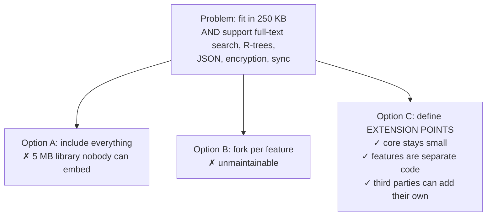

The design question that follows: **where do you cut?** SQLite's answer is five seams, each
placed at an existing internal interface so the extension costs nothing when unused.

---

## Part 2 — HLD: the five extension points

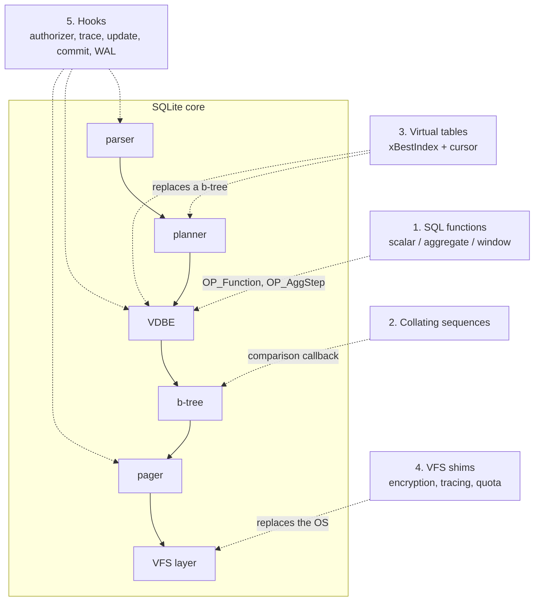

| Seam | Replaces / augments | Cost when unused |
|---|---|---|
| functions | an entry in a hash table | one hash lookup at prepare time |
| collations | a `memcmp` | nothing |
| virtual tables | the b-tree, for one table | nothing |
| VFS | `os_unix.c` | one indirect call per I/O |
| hooks | nothing | one NULL check |

**Every shipped extension — FTS5, R-Tree, JSON, session, dbstat, `bytecode()` — is built
from these five.** There is no private back door.

---

## Part 3 — LLD: virtual tables

### 3.1 The idea

A virtual table is a table whose rows are produced by **your C code** instead of a b-tree.
Everything above the storage layer — parser, planner, VDBE, joins, ORDER BY — works
unchanged.

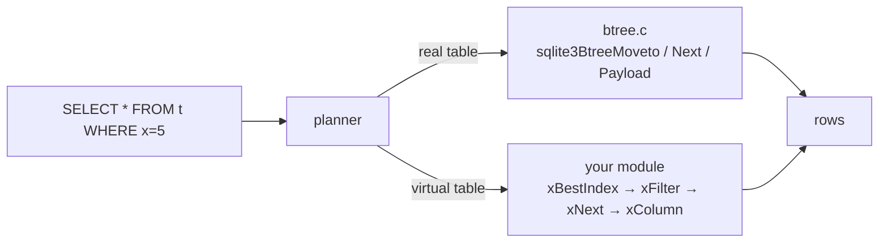

### 3.2 The lifecycle

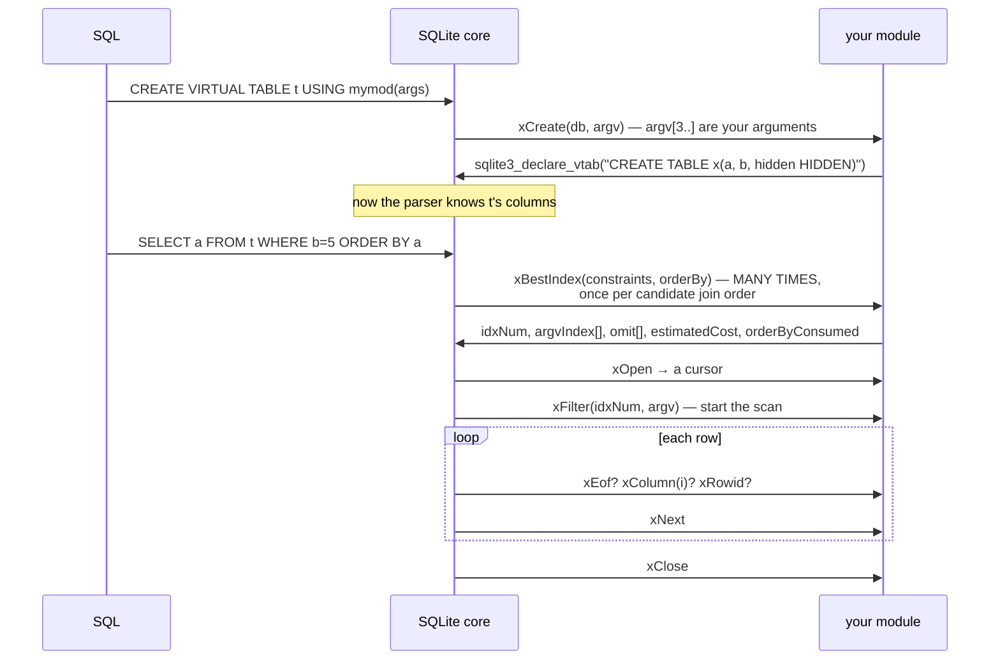

### 3.3 `xBestIndex` — the planner interface, and the whole game

```c
struct sqlite3_index_info {
  /* INPUTS */
  int nConstraint;
  struct sqlite3_index_constraint { int iColumn, op; unsigned char usable; } *aConstraint;
  int nOrderBy;
  struct sqlite3_index_orderby { int iColumn; unsigned char desc; } *aOrderBy;
  /* OUTPUTS */
  struct sqlite3_index_constraint_usage { int argvIndex; unsigned char omit; } *aConstraintUsage;
  int idxNum;                 /* your plan id, passed to xFilter */
  char *idxStr;
  int orderByConsumed;        /* 1 = I will produce rows in the requested order */
  double estimatedCost;
  sqlite3_int64 estimatedRows;
  sqlite3_uint64 colUsed;     /* which columns the query actually needs */
};
```

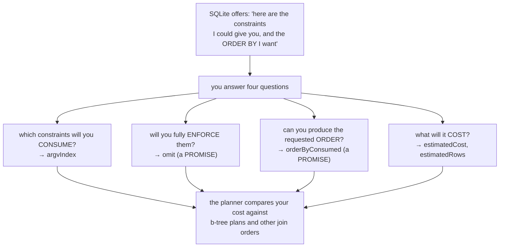

**The two promises, and why lying is catastrophic:**

| Output | If you lie | Symptom |
|---|---|---|
| `omit = 1` but `xFilter` ignores the constraint | SQLite skips re-checking it | **wrong rows returned, no error** |
| `orderByConsumed = 1` but rows are unordered | SQLite skips the sorter | **wrong order, no error** |

Both produce silent incorrect answers, which is why the conservative default is
`omit = 0` (take the value, let the VDBE re-check) and `orderByConsumed = 0`.

**A third, subtler output — refusing a plan:**

```c
if( pIdxInfo->aConstraint[i].usable==0 ){
  return SQLITE_CONSTRAINT;   /* "I cannot be the outer table of this join" */
}
```

`usable==0` means the constraint's value would come from a table *inside* your loop.
Returning `SQLITE_CONSTRAINT` tells the planner "this join order is impossible for me," and
it tries another. `dbstat` does exactly this.

### 3.4 Eponymous virtual tables and table-valued functions

```c
static sqlite3_module mod = {
  0,        /* iVersion */
  0,        /* xCreate == 0 ⇒ EPONYMOUS: usable by name, no CREATE VIRTUAL TABLE */
  myConnect, myBestIndex, myDisconnect, 0, myOpen, myClose,
  myFilter, myNext, myEof, myColumn, myRowid, ...
};
```

Declare hidden columns and they become function-style arguments:

```sql
CREATE TABLE x(value INTEGER, start HIDDEN, stop HIDDEN, step HIDDEN)
-- enables:
SELECT value FROM myseries(1, 10, 2);
-- which is exactly:
SELECT value FROM myseries WHERE start=1 AND stop=10 AND step=2;
```

Verified output from the module you build in Lab 8.1:
```
$ ./sqlite3-ext :memory: ".load ./myseries" "SELECT value FROM myseries(1,10,3);"
1
4
7
10
$ ... "EXPLAIN QUERY PLAN SELECT value FROM myseries(1,10,1);"
`--SCAN myseries VIRTUAL TABLE INDEX 7:
```

`VIRTUAL TABLE INDEX 7` is **your own `idxNum`** echoed back — bits 1|2|4, meaning start,
stop, and step were all supplied. That is the feedback loop for vtab development: `EXPLAIN
QUERY PLAN` shows you which plan `xBestIndex` chose.

### 3.5 Shadow tables — "virtual" does not mean "not stored"

```sql
CREATE VIRTUAL TABLE docs USING fts5(title, body);
SELECT name FROM sqlite_schema;
```
Verified:
```
docs           ← the virtual table
docs_data      ← real b-tree: the inverted index segments
docs_idx       ← real b-tree: segment directory
docs_content   ← real b-tree: the original rows
docs_docsize   ← real b-tree
docs_config    ← real b-tree
```

**FTS5 is a thin layer over ordinary b-trees.** Everything from Phases 1–3 still applies;
you can point your `dbparse` tool at `docs_data` and walk it.

`xShadowName` tells SQLite which names are shadows so that defensive mode can protect them
— otherwise an attacker-supplied database could put hostile bytes in `docs_data` and
exploit the FTS5 reader.

---

## Part 4 — LLD: the shipped extensions

### 4.1 FTS5 — an inverted index as a virtual table

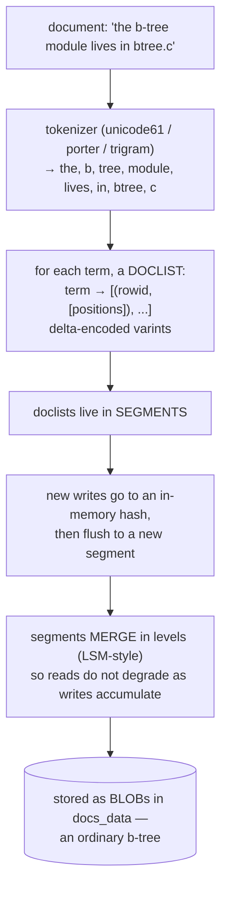

| File | Responsibility |
|---|---|
| `fts5_main.c` | the vtab interface, `MATCH`, auxiliary functions (`bm25`, `highlight`, `snippet`) |
| `fts5_expr.c` | parses the MATCH query language: `a AND b`, `"phrase"`, `col:term`, `NEAR()`, `a*` |
| `fts5_index.c` | the inverted index: segments, doclists, merging |
| `fts5_storage.c` | the content/config shadow tables |
| `fts5_tokenize.c` | tokenizers |
| `fts5_hash.c` | the in-memory pending-terms hash |

**Why LSM-style segment merging instead of updating one index in place?** Because an
inverted index update touches one doclist per *term* in the document — dozens of random
writes per insert. Buffering in memory and writing whole segments turns that into
sequential writes, at the cost of reading several segments per query. Same trade-off as
RocksDB, implemented inside a b-tree.

### 4.2 R-Tree — a different index structure, same seam

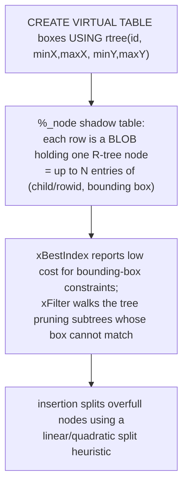

Reading R-Tree after Phase 3 is a good self-test: the same concepts (nodes, splits, parent
pointers, cursors) with a different cost function — minimize bounding-box overlap instead
of balancing bytes.

### 4.3 Extensions worth reading, in order of difficulty

| Extension | Lines | What it teaches |
|---|---|---|
| `ext/misc/series.c` | ~350 | the minimal vtab; hidden columns; `xBestIndex` |
| `ext/misc/carray.c` | ~250 | `sqlite3_bind_pointer` — passing C arrays into SQL safely |
| `ext/misc/regexp.c` | ~700 | a function with `auxdata` caching of the compiled pattern |
| `ext/misc/csv.c` | ~900 | a vtab over a file; schema inference; `xCreate` arguments |
| `src/dbstat.c` | ~800 | a vtab over SQLite's own internals |
| `ext/rtree/rtree.c` | ~4,000 | a real index structure as a vtab |
| `ext/fts5/` | ~30,000 | an LSM inverted index |

---

## Part 5 — LLD: functions, collations, hooks

### 5.1 Functions

```c
sqlite3_create_function_v2(db, "myfunc", nArg,
    SQLITE_UTF8 | SQLITE_DETERMINISTIC | SQLITE_INNOCUOUS,
    pUserData, xFunc, xStep, xFinal, xDestroy);
```

| Flag | Effect | Why it matters |
|---|---|---|
| `SQLITE_DETERMINISTIC` | same args ⇒ same result | enables `OP_PureFunc`, hoisting out of loops, and use in index expressions / partial-index WHERE clauses |
| `SQLITE_INNOCUOUS` | safe in triggers and views on untrusted schemas | |
| `SQLITE_DIRECTONLY` | **may not** be called from triggers or views | a **security boundary** — use it for anything with side effects |

**Why `DIRECTONLY` exists:** a malicious database file can contain a view or trigger. If it
can call your `exec_shell()` function, merely *opening* the file is remote code execution.
`DIRECTONLY` restricts a function to top-level SQL the application wrote itself.

Useful mechanics: `sqlite3_aggregate_context()` for aggregate state,
`sqlite3_get_auxdata()`/`set_auxdata()` to cache per-argument work (a compiled regex) across
rows of one statement.

### 5.2 Hooks

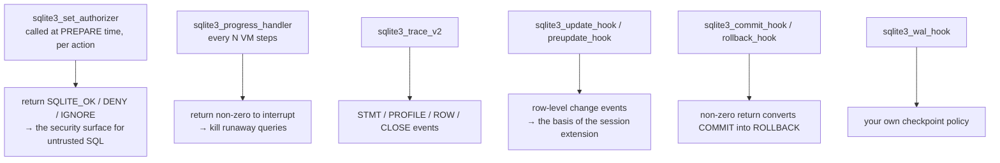

The **authorizer** is the important one. It runs during *preparation*, so a forbidden
statement never executes at all. `SQLITE_IGNORE` on a `SQLITE_READ` action makes that
column read as NULL instead of failing — a clean way to implement column-level redaction.

### 5.3 Hardening an untrusted database

```c
sqlite3_db_config(db, SQLITE_DBCONFIG_DEFENSIVE, 1, 0);        /* no writable_schema, no shadow writes */
sqlite3_db_config(db, SQLITE_DBCONFIG_TRUSTED_SCHEMA, 0, 0);   /* schema may not call non-innocuous funcs */
sqlite3_db_config(db, SQLITE_DBCONFIG_DQS_DML, 0, 0);
sqlite3_limit(db, SQLITE_LIMIT_LENGTH, 1000000);
sqlite3_progress_handler(db, 10000, xInterrupt, 0);
sqlite3_set_authorizer(db, xAuth, 0);
```

That set is the standard configuration for opening a `.db` file you did not create.

---

## Part 6 — How SQLite is tested

This is the part most engineers have never seen, and it is why the library is trusted.

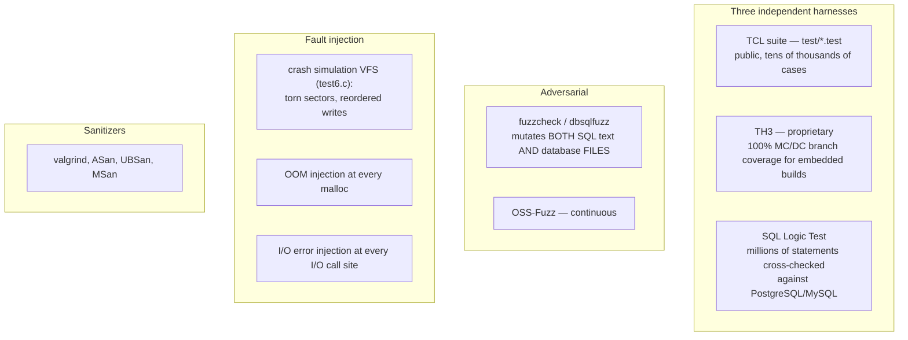

**Why three independent harnesses?** Because a single test suite shares the blind spots of
its author. TH3 exists specifically to reach 100% *branch* coverage on the configurations
used in avionics and medical devices; SLT exists to catch places where SQLite's *answers*
differ from other SQL engines.

### 6.1 The three numbers

| Metric | Value |
|---|---|
| test code : library code | ~600 : 1 |
| branch coverage (TH3) | 100%, MC/DC |
| file format compatibility breaks since 2004 | 0 |

### 6.2 What a test looks like

```tcl
do_execsql_test  1.1 { CREATE TABLE t1(a,b); INSERT INTO t1 VALUES(1,2);
                       SELECT * FROM t1; }                       {1 2}
do_catchsql_test 1.2 { SELECT * FROM nosuchtable; }
                       {1 {no such table: nosuchtable}}
ifcapable fts5 { ... }
reset_db
```

Result patterns make plan assertions possible:
```tcl
do_execsql_test 2.1 { EXPLAIN QUERY PLAN SELECT * FROM t1 WHERE a=1; } {~/SCAN/}
                                                                   ;# must NOT scan
```

That is the whole format for ~90% of tests. **Adding a regression test is genuinely easy**,
and a test that pins down a subtle behaviour is a welcome contribution.

### 6.3 Fault injection you can use yourself

```c
sqlite3_test_control(SQLITE_TESTCTRL_FAULT_INSTALL, xCallback);
sqlite3_test_control(SQLITE_TESTCTRL_OPTIMIZATIONS, db, mask);  /* 1 bit = DISABLE */
sqlite3_test_control(SQLITE_TESTCTRL_IMPOSTER, db, "main", 1, rootpage);
sqlite3_test_control(SQLITE_TESTCTRL_PRNG_SEED, seed, db);
```

`SQLITE_TESTCTRL_IMPOSTER` is the gem: it lets a test declare a **fake schema over a real
root page**, so the test can write deliberately invalid b-tree content and verify that the
library rejects it rather than crashing. That is how the corruption tests are written.

`SQLITE_TESTCTRL_OPTIMIZATIONS` is how you *measure* an optimization: disable it, re-run,
compare. It is also how the project proves each optimization is individually correct — with
every optimization disabled, results must be unchanged.

### 6.4 Coverage archaeology — the best first-contribution exercise

```sh
../configure --enable-debug CFLAGS="-g -O0 -fprofile-arcs -ftest-coverage"
make testfixture && ./testfixture ../test/select1.test
gcov sqlite3.c | tail
grep -n "#####" sqlite3.c.gcov | head -40     # lines never executed
```

Find an uncovered line in a module you understand, work out what input reaches it, and
write that test. This works in **any** project, and it is how you get from "I read the
code" to "I improved the code."

---

## Part 7 — How a change actually lands

### 7.1 The facts, stated plainly

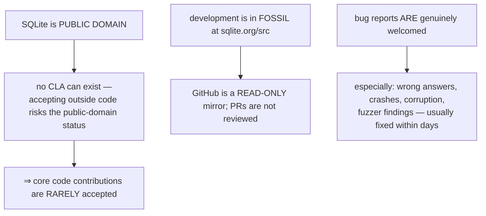

### 7.2 Where your effort actually pays

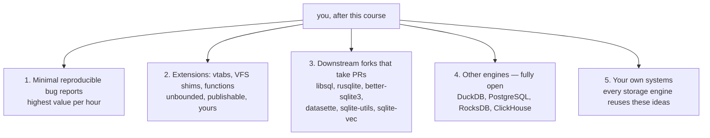

### 7.3 What a good bug report contains

```
- SQLite version + PRAGMA compile_options
- the SMALLEST SQL that reproduces it, runnable in the shell
- the database as tool/dbtotxt output, if data-dependent
- expected vs actual output
- does it reproduce on trunk?
- for crashes: the assertion text or ASan report
```

Practise producing this artifact *before* you need it — Lab 8.9.

### 7.4 A realistic ladder

| Weeks | Activity |
|---|---|
| 1–2 | run the suite; find an uncovered branch with gcov; write a test for it |
| 3–4 | build and publish a virtual table that solves a real problem |
| 5–8 | fuzz something (your vtab, your parser); file any findings |
| 9–12 | fix a real issue in a downstream project using your internals knowledge |
| 13+ | take a "good first issue" in DuckDB or PostgreSQL storage/planner code |

**The honest framing:** the goal of this course was never a commit bit on `sqlite.org`. It
was to make you one of the few engineers who can *read a storage engine*. Phases 1–3 are
the same concepts in InnoDB, LMDB, and BoltDB; Phase 7 is PostgreSQL's WAL; Phases 5–6 are
every query engine ever built.

---

## Part 8 — Design decisions, collected

| Decision | Alternative | Why |
|---|---|---|
| five extension seams at existing interfaces | a plugin framework | zero cost when unused; no new abstraction |
| vtabs participate in `xBestIndex` | vtabs always scan | a vtab can be as fast as a b-tree in a join |
| `omit` and `orderByConsumed` are promises, not hints | SQLite always re-checks | avoids duplicated work; the cost is that lying breaks correctness |
| eponymous vtabs | a separate table-function mechanism | one implementation serves both |
| shadow tables are ordinary tables | a private storage format | FTS5/R-Tree inherit ACID, backup, and VACUUM for free |
| `xShadowName` + defensive mode | trust the schema | an attacker-supplied file could otherwise corrupt an extension's internal state |
| `SQLITE_DIRECTONLY` | trust all functions | a hostile database's views/triggers must not invoke side-effecting functions |
| loadable extensions link through a function table | dynamic linking against libsqlite3 | one `.so` works with any compatible build |
| three independent test harnesses | one big suite | independent blind spots |
| fuzzers mutate database FILES, not just SQL | fuzz SQL only | the file format is an attack surface too |
| testable fault injection in the shipped library | test-only builds | crash and OOM paths are tested in the code people actually ship |
| public domain, closed to outside code | an open contribution model | keeps the licence unambiguous forever |

---

## Part 9 — Misconceptions

| Belief | Reality |
|---|---|
| "virtual tables are slow" | with a good `xBestIndex` they compete with b-trees; `dbstat` and FTS5 are vtabs |
| "virtual means nothing is stored" | FTS5 and R-Tree store everything in ordinary shadow b-trees |
| "`xBestIndex` is called once" | it is called once per candidate join order — keep it cheap and side-effect free |
| "`omit=1` is an optimization" | it is a promise; break it and you return wrong rows |
| "extensions need to link against libsqlite3" | they call back through `sqlite3_api_routines`; they link against nothing |
| "SQLite has few tests" | ~600× more test code than library code, with 100% MC/DC coverage |
| "I can send a PR to SQLite on GitHub" | GitHub is a read-only mirror; core contributions are rarely accepted |
| "contributing means core patches" | bug reports, extensions, and downstream forks are where the value is |

---

## Part 10 — Code map

| Concern | Location |
|---|---|
| extension entry point | `SQLITE_EXTENSION_INIT1/2` — `sqlite3ext.h` |
| function registration | `sqlite3_create_function_v2`, `sqlite3_create_window_function` — `main.c` |
| vtab plumbing | `vtab.c`, `sqlite3_module` in `sqlite3.h` |
| planner ↔ vtab | `whereLoopAddVirtual`, `allocateIndexInfo` — `where.c` |
| a reference vtab | `ext/misc/series.c`; a real one: `src/dbstat.c` |
| FTS5 | `ext/fts5/fts5_main.c`, `fts5_index.c`, `fts5_expr.c` |
| R-Tree | `ext/rtree/rtree.c` |
| session/changesets | `ext/session/` |
| authorizer | `sqlite3AuthCheck` — `auth.c` |
| test harness | `test/tester.tcl`, `test/*.test` |
| fault injection | `sqlite3_test_control` — `main.c`; the crash VFS — `src/test6.c` |
| format tools | `tool/showdb.c`, `tool/showwal.c`, `tool/dbtotxt.c` |

Next: `2.code_walkthrough.md` reads a complete real `xBestIndex` (`statBestIndex` from
`dbstat.c`); `3.implementation.md` has you build, load, and tune your own virtual table,
then write a test that runs under the real `testfixture`.
